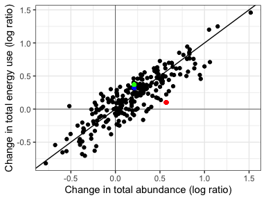
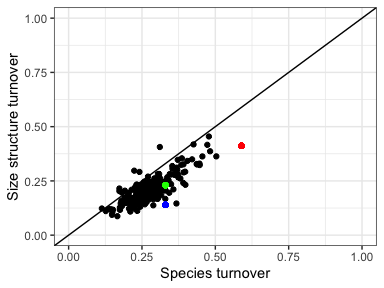

3 main plots
================
Renata Diaz
2021-08-22

  - [Change in E vs. change in N](#change-in-e-vs.-change-in-n)
  - [Change in size structure](#change-in-size-structure)
  - [Compared to null model](#compared-to-null-model)

# Change in E vs. change in N

<!-- -->

# Change in size structure

<!-- -->

# Compared to null model

    ## Joining, by = c("route.x", "region.x")

    ## `summarise()` has grouped output by 'site.x', 'route.x', 'region.x', 'location.bcr.x', 'location.longitude.x', 'location.latitude.x'. You can override using the `.groups` argument.

    ## Joining, by = c("site.x", "route.x", "region.x", "location.bcr.x", "location.longitude.x", "location.latitude.x")

<!-- -->

    ## Setting row to 1

    ## Setting column to 1

    ## Setting row to 1

    ## Setting column to 2

    ## Setting row to 1

    ## Setting column to 3

<!-- -->
