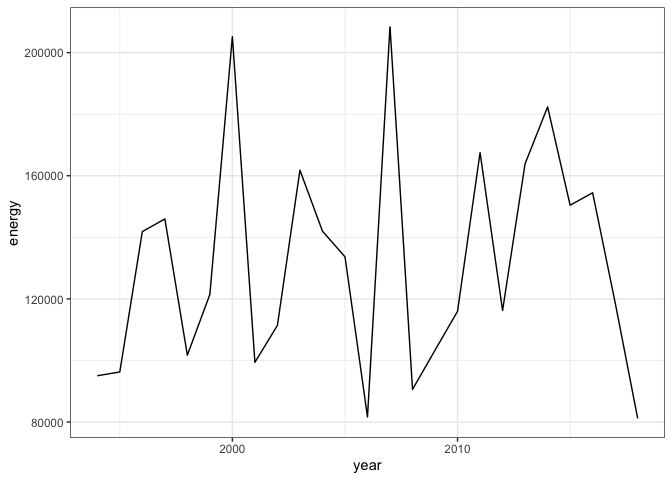
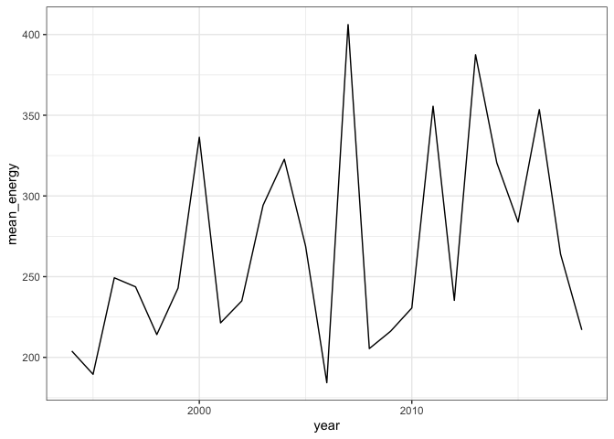
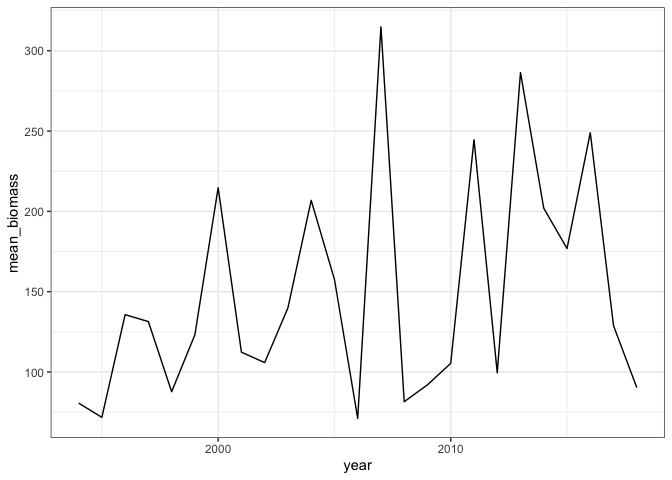

Core analysis - single
================

  - [Demo dataset](#demo-dataset)
  - [Simulate ISD](#simulate-isd)
  - [Community-level properties](#community-level-properties)
      - [Compute community-level properties over
        time](#compute-community-level-properties-over-time)
      - [Compare community-level properties over
        time](#compare-community-level-properties-over-time)
          - [Full timeseries](#full-timeseries)
          - [First and last 5 years](#first-and-last-5-years)
      - [Compare ISDs and species composition over
        time](#compare-isds-and-species-composition-over-time)
          - [ISD over time](#isd-over-time)
          - [Species composition over
            time](#species-composition-over-time)
  - [All variables](#all-variables)
  - [Variable descriptions](#variable-descriptions)

# Demo dataset

``` r
d <- BBSsize::hartland

names(d)
```

    ## [1] "abundance"  "covariates" "metadata"

``` r
begin_years <- c(1994:1998)

end_years <- c(2014:2018)
```

# Simulate ISD

``` r
d_isd <- BBSsize::simulate_isd_ts(d, isd_seed = 1977)
```

    ## Joining, by = "id"
    ## Joining, by = "id"
    ## Joining, by = "id"
    ## Joining, by = "id"
    ## Joining, by = "id"
    ## Joining, by = "id"
    ## Joining, by = "id"
    ## Joining, by = "id"
    ## Joining, by = "id"
    ## Joining, by = "id"
    ## Joining, by = "id"
    ## Joining, by = "id"
    ## Joining, by = "id"
    ## Joining, by = "id"
    ## Joining, by = "id"
    ## Joining, by = "id"
    ## Joining, by = "id"
    ## Joining, by = "id"
    ## Joining, by = "id"
    ## Joining, by = "id"
    ## Joining, by = "id"
    ## Joining, by = "id"
    ## Joining, by = "id"
    ## Joining, by = "id"
    ## Joining, by = "id"

``` r
names(d_isd)
```

    ## [1] "isd"        "covariates" "metadata"

``` r
head(d_isd$isd)
```

<div class="kable-table">

| id     |     mass | year | isd\_seed |
| :----- | -------: | ---: | --------: |
| sp3160 | 118.9851 | 1994 |      1977 |
| sp3160 | 119.8989 | 1994 |      1977 |
| sp3160 | 118.6611 | 1994 |      1977 |
| sp3160 | 118.4046 | 1994 |      1977 |
| sp3160 | 117.5766 | 1994 |      1977 |
| sp3160 | 115.5018 | 1994 |      1977 |

</div>

# Community-level properties

## Compute community-level properties over time

``` r
d_svs <- get_annual_svs(d_isd$isd)

ggplot(d_svs, aes(year, abundance)) + geom_line()
```

<!-- -->

``` r
ggplot(d_svs, aes(year, energy)) + geom_line()
```

<!-- -->

``` r
ggplot(d_svs, aes(year, biomass)) + geom_line()
```

<!-- -->

``` r
ggplot(d_svs, aes(year, mean_energy)) + geom_line()
```

<!-- -->

``` r
ggplot(d_svs, aes(year, mean_biomass)) + geom_line()
```

<!-- -->

## Compare community-level properties over time

### Full timeseries

Linear models fit to many individual timeseries may underestimate p
values, but we are interested in the route-level slopes more so than in
an overall “main” slope.

#### lm()

``` r
lm_ts_results <- fit_all_timeseries_lms(d_svs)
lm_ts_results
```

<div class="kable-table">

| p\_ts\_abundance | p\_ts\_energy | p\_ts\_biomass | p\_ts\_mean\_energy | p\_ts\_mean\_biomass | r2\_ts\_abundance | r2\_ts\_energy | r2\_ts\_biomass | r2\_ts\_mean\_energy | r2\_ts\_mean\_biomass | slope\_ts\_abundance | slope\_ts\_energy | slope\_ts\_biomass | slope\_ts\_mean\_energy | slope\_ts\_mean\_biomass | fitted\_ratio\_ts\_abundance | fitted\_ratio\_ts\_energy | fitted\_ratio\_ts\_biomass | fitted\_ratio\_ts\_mean\_energy | fitted\_ratio\_ts\_mean\_biomass |
| ---------------: | ------------: | -------------: | ------------------: | -------------------: | ----------------: | -------------: | --------------: | -------------------: | --------------------: | -------------------: | ----------------: | -----------------: | ----------------------: | -----------------------: | ---------------------------: | ------------------------: | -------------------------: | ------------------------------: | -------------------------------: |
|         0.041074 |     0.5428853 |      0.2904305 |           0.0808392 |            0.1033185 |         0.1691912 |       0.016315 |       0.0484427 |            0.1266309 |             0.1111983 |           \-3.183077 |           625.941 |           1054.337 |                3.039722 |                 3.134493 |                    0.8555109 |                  1.121618 |                   1.421832 |                        1.317734 |                         1.686828 |

</div>

### First and last 5 years

``` r
d_svs_beginend <- pull_caps(d_svs, begin_years, end_years)
```

#### lm()

``` r
lm_be_results <- fit_all_caps_lms(d_svs_beginend)
lm_be_results
```

<div class="kable-table">

| p\_caps\_abundance | p\_caps\_energy | p\_caps\_biomass | p\_caps\_mean\_energy | p\_caps\_mean\_biomass | r2\_caps\_abundance | r2\_caps\_energy | r2\_caps\_biomass | r2\_caps\_mean\_energy | r2\_caps\_mean\_biomass | slope\_caps\_abundance | slope\_caps\_energy | slope\_caps\_biomass | slope\_caps\_mean\_energy | slope\_caps\_mean\_biomass | fitted\_ratio\_caps\_abundance | fitted\_ratio\_caps\_energy | fitted\_ratio\_caps\_biomass | fitted\_ratio\_caps\_mean\_energy | fitted\_ratio\_caps\_mean\_biomass |
| -----------------: | --------------: | ---------------: | --------------------: | ---------------------: | ------------------: | ---------------: | ----------------: | ---------------------: | ----------------------: | ---------------------: | ------------------: | -------------------: | ------------------------: | -------------------------: | -----------------------------: | --------------------------: | ---------------------------: | --------------------------------: | ---------------------------------: |
|          0.2707658 |       0.3279205 |        0.1608152 |               0.03043 |              0.0533701 |           0.1488928 |        0.1194804 |         0.2299158 |              0.4626826 |               0.3905538 |                 \-51.4 |             21384.8 |             27680.51 |                  67.75899 |                   68.13277 |                      0.9017959 |                    1.185074 |                     1.517103 |                          1.309457 |                           1.681145 |

</div>

#### Raw values

``` r
raw_results <- compute_raw_sv_change(d_svs_beginend)
```

``` r
all_sv_change <- bind_cols(lm_ts_results, lm_be_results,raw_results)
```

## Compare ISDs and species composition over time

### ISD over time

Note there is some seed dependence in fitting the gmms, such that
overlap can vary.

``` r
set.seed(1977)
isd_overlap <- compare_isds(d_isd$isd, begin_years, end_years)
```

    ## Package 'mclust' version 5.4.7
    ## Type 'citation("mclust")' for citing this R package in publications.

``` r
isd_overlap
```

<div class="kable-table">

| isd\_turnover |
| ------------: |
|     0.1222413 |

</div>

### Species composition over time

``` r
begin_composition <- colSums(d$abundance[1:5,])

end_composition <- colSums(d$abundance[(nrow(d$abundance) - 4): nrow(d$abundance), ])

begin_relabund <- begin_composition / sum(begin_composition)

end_relabund <- end_composition / sum(end_composition)

relabund <- data.frame(
  begin = begin_relabund,
  end = end_relabund,
  beginsp = names(begin_relabund),
  endsp = names(end_relabund)
) 

relabund_change <- relabund %>%
  group_by(beginsp) %>%
  summarize(minRel = min(begin, end)) %>%
  ungroup() %>%
  select(minRel) %>%
  summarize(sp_turnover = 1-sum(minRel))

relabund_change
```

<div class="kable-table">

| sp\_turnover |
| -----------: |
|    0.2553022 |

</div>

``` r
be_matrix <- bind_rows(begin_composition, end_composition)

be_diss <- vegan::vegdist(be_matrix)

be_diss
```

    ##           1
    ## 2 0.2469359

``` r
compare_species_composition(d)
```

<div class="kable-table">

| sp\_turnover |       bcd |
| -----------: | --------: |
|    0.2553022 | 0.2469359 |

</div>

# All variables

``` r
community_change <- data.frame(
  isd_turnover = isd_overlap$isd_turnover[1],
  species_turnover = relabund_change$sp_turnover[1],
  bcd = be_diss[[1]])

outputs <- all_sv_change %>%
  bind_cols(community_change) %>%
  bind_cols(d$metadata$location) %>%
  mutate(beginyears = toString(begin_years),
         endyears = toString(end_years))

outputs
```

<div class="kable-table">

| p\_ts\_abundance | p\_ts\_energy | p\_ts\_biomass | p\_ts\_mean\_energy | p\_ts\_mean\_biomass | r2\_ts\_abundance | r2\_ts\_energy | r2\_ts\_biomass | r2\_ts\_mean\_energy | r2\_ts\_mean\_biomass | slope\_ts\_abundance | slope\_ts\_energy | slope\_ts\_biomass | slope\_ts\_mean\_energy | slope\_ts\_mean\_biomass | fitted\_ratio\_ts\_abundance | fitted\_ratio\_ts\_energy | fitted\_ratio\_ts\_biomass | fitted\_ratio\_ts\_mean\_energy | fitted\_ratio\_ts\_mean\_biomass | p\_caps\_abundance | p\_caps\_energy | p\_caps\_biomass | p\_caps\_mean\_energy | p\_caps\_mean\_biomass | r2\_caps\_abundance | r2\_caps\_energy | r2\_caps\_biomass | r2\_caps\_mean\_energy | r2\_caps\_mean\_biomass | slope\_caps\_abundance | slope\_caps\_energy | slope\_caps\_biomass | slope\_caps\_mean\_energy | slope\_caps\_mean\_biomass | fitted\_ratio\_caps\_abundance | fitted\_ratio\_caps\_energy | fitted\_ratio\_caps\_biomass | fitted\_ratio\_caps\_mean\_energy | fitted\_ratio\_caps\_mean\_biomass | energy\_raw\_ratio | abundance\_raw\_ratio | biomass\_raw\_ratio | mean\_energy\_raw\_ratio | mean\_biomass\_raw\_ratio | isd\_turnover | species\_turnover |       bcd | countrynum | statenum | route | routename    | active | latitude |  longitude | stratum | bcr | routetypeid | routetypedetailid | regionname  | beginyears                   | endyears                     |
| ---------------: | ------------: | -------------: | ------------------: | -------------------: | ----------------: | -------------: | --------------: | -------------------: | --------------------: | -------------------: | ----------------: | -----------------: | ----------------------: | -----------------------: | ---------------------------: | ------------------------: | -------------------------: | ------------------------------: | -------------------------------: | -----------------: | --------------: | ---------------: | --------------------: | ---------------------: | ------------------: | ---------------: | ----------------: | ---------------------: | ----------------------: | ---------------------: | ------------------: | -------------------: | ------------------------: | -------------------------: | -----------------------------: | --------------------------: | ---------------------------: | --------------------------------: | ---------------------------------: | -----------------: | --------------------: | ------------------: | -----------------------: | ------------------------: | ------------: | ----------------: | --------: | ---------: | -------: | ----: | :----------- | -----: | -------: | ---------: | ------: | --: | ----------: | ----------------: | :---------- | :--------------------------- | :--------------------------- |
|         0.041074 |     0.5428853 |      0.2904305 |           0.0808392 |            0.1033185 |         0.1691912 |       0.016315 |       0.0484427 |            0.1266309 |             0.1111983 |           \-3.183077 |           625.941 |           1054.337 |                3.039722 |                 3.134493 |                    0.8555109 |                  1.121618 |                   1.421832 |                        1.317734 |                         1.686828 |          0.2707658 |       0.3279205 |        0.1608152 |               0.03043 |              0.0533701 |           0.1488928 |        0.1194804 |         0.2299158 |              0.4626826 |               0.3905538 |                 \-51.4 |             21384.8 |             27680.51 |                  67.75899 |                   68.13277 |                      0.9017959 |                    1.185074 |                     1.517103 |                          1.309457 |                           1.681145 |           1.185074 |             0.9017959 |            1.517103 |                 1.314127 |                  1.682313 |     0.1222413 |         0.2553022 | 0.2469359 |        840 |       18 |   102 | NEW HARTFORD |      1 | 41.73788 | \-72.92704 |      12 |  14 |           1 |                 1 | CONNECTICUT | 1994, 1995, 1996, 1997, 1998 | 2014, 2015, 2016, 2017, 2018 |

</div>

``` r
all_core_analyses(d, begin_years, end_years, isd_seed = 1994)
```

    ## Joining, by = "id"
    ## Joining, by = "id"
    ## Joining, by = "id"
    ## Joining, by = "id"
    ## Joining, by = "id"
    ## Joining, by = "id"
    ## Joining, by = "id"
    ## Joining, by = "id"
    ## Joining, by = "id"
    ## Joining, by = "id"
    ## Joining, by = "id"
    ## Joining, by = "id"
    ## Joining, by = "id"
    ## Joining, by = "id"
    ## Joining, by = "id"
    ## Joining, by = "id"
    ## Joining, by = "id"
    ## Joining, by = "id"
    ## Joining, by = "id"
    ## Joining, by = "id"
    ## Joining, by = "id"
    ## Joining, by = "id"
    ## Joining, by = "id"
    ## Joining, by = "id"
    ## Joining, by = "id"

<div class="kable-table">

| p\_ts\_abundance | p\_ts\_energy | p\_ts\_biomass | p\_ts\_mean\_energy | p\_ts\_mean\_biomass | r2\_ts\_abundance | r2\_ts\_energy | r2\_ts\_biomass | r2\_ts\_mean\_energy | r2\_ts\_mean\_biomass | slope\_ts\_abundance | slope\_ts\_energy | slope\_ts\_biomass | slope\_ts\_mean\_energy | slope\_ts\_mean\_biomass | fitted\_ratio\_ts\_abundance | fitted\_ratio\_ts\_energy | fitted\_ratio\_ts\_biomass | fitted\_ratio\_ts\_mean\_energy | fitted\_ratio\_ts\_mean\_biomass | p\_caps\_abundance | p\_caps\_energy | p\_caps\_biomass | p\_caps\_mean\_energy | p\_caps\_mean\_biomass | r2\_caps\_abundance | r2\_caps\_energy | r2\_caps\_biomass | r2\_caps\_mean\_energy | r2\_caps\_mean\_biomass | slope\_caps\_abundance | slope\_caps\_energy | slope\_caps\_biomass | slope\_caps\_mean\_energy | slope\_caps\_mean\_biomass | fitted\_ratio\_caps\_abundance | fitted\_ratio\_caps\_energy | fitted\_ratio\_caps\_biomass | fitted\_ratio\_caps\_mean\_energy | fitted\_ratio\_caps\_mean\_biomass | energy\_raw\_ratio | abundance\_raw\_ratio | biomass\_raw\_ratio | mean\_energy\_raw\_ratio | mean\_biomass\_raw\_ratio | isd\_turnover | sp\_turnover |       bcd | countrynum | statenum | route | routename    | active | latitude |  longitude | stratum | bcr | routetypeid | routetypedetailid | regionname  | beginyears                   | endyears                     |
| ---------------: | ------------: | -------------: | ------------------: | -------------------: | ----------------: | -------------: | --------------: | -------------------: | --------------------: | -------------------: | ----------------: | -----------------: | ----------------------: | -----------------------: | ---------------------------: | ------------------------: | -------------------------: | ------------------------------: | -------------------------------: | -----------------: | --------------: | ---------------: | --------------------: | ---------------------: | ------------------: | ---------------: | ----------------: | ---------------------: | ----------------------: | ---------------------: | ------------------: | -------------------: | ------------------------: | -------------------------: | -----------------------------: | --------------------------: | ---------------------------: | --------------------------------: | ---------------------------------: | -----------------: | --------------------: | ------------------: | -----------------------: | ------------------------: | ------------: | -----------: | --------: | ---------: | -------: | ----: | :----------- | -----: | -------: | ---------: | ------: | --: | ----------: | ----------------: | :---------- | :--------------------------- | :--------------------------- |
|         0.041074 |      0.546669 |      0.2991988 |           0.0829999 |            0.1081131 |         0.1691912 |      0.0160134 |       0.0467561 |            0.1249696 |             0.1083527 |           \-3.183077 |          624.0843 |           1048.897 |                3.043936 |                 3.132981 |                    0.8555109 |                  1.120666 |                   1.414926 |                        1.316605 |                          1.67878 |          0.2707658 |       0.3348061 |        0.1717526 |             0.0320396 |              0.0582335 |           0.1488928 |         0.116331 |         0.2197382 |              0.4563642 |               0.3787216 |                 \-51.4 |            21272.17 |             27519.78 |                  67.63864 |                   67.94416 |                      0.9017959 |                    1.183123 |                     1.506742 |                          1.307304 |                           1.669984 |           1.185074 |             0.9017959 |            1.517103 |                 1.314127 |                  1.682313 |     0.1198125 |    0.2553022 | 0.2469359 |        840 |       18 |   102 | NEW HARTFORD |      1 | 41.73788 | \-72.92704 |      12 |  14 |           1 |                 1 | CONNECTICUT | 1994, 1995, 1996, 1997, 1998 | 2014, 2015, 2016, 2017, 2018 |

</div>

``` r
all_core_analyses(d, isd_seed = 1994)
```

    ## Joining, by = "id"
    ## Joining, by = "id"
    ## Joining, by = "id"
    ## Joining, by = "id"
    ## Joining, by = "id"
    ## Joining, by = "id"
    ## Joining, by = "id"
    ## Joining, by = "id"
    ## Joining, by = "id"
    ## Joining, by = "id"
    ## Joining, by = "id"
    ## Joining, by = "id"
    ## Joining, by = "id"
    ## Joining, by = "id"
    ## Joining, by = "id"
    ## Joining, by = "id"
    ## Joining, by = "id"
    ## Joining, by = "id"
    ## Joining, by = "id"
    ## Joining, by = "id"
    ## Joining, by = "id"
    ## Joining, by = "id"
    ## Joining, by = "id"
    ## Joining, by = "id"
    ## Joining, by = "id"

<div class="kable-table">

| p\_ts\_abundance | p\_ts\_energy | p\_ts\_biomass | p\_ts\_mean\_energy | p\_ts\_mean\_biomass | r2\_ts\_abundance | r2\_ts\_energy | r2\_ts\_biomass | r2\_ts\_mean\_energy | r2\_ts\_mean\_biomass | slope\_ts\_abundance | slope\_ts\_energy | slope\_ts\_biomass | slope\_ts\_mean\_energy | slope\_ts\_mean\_biomass | fitted\_ratio\_ts\_abundance | fitted\_ratio\_ts\_energy | fitted\_ratio\_ts\_biomass | fitted\_ratio\_ts\_mean\_energy | fitted\_ratio\_ts\_mean\_biomass | p\_caps\_abundance | p\_caps\_energy | p\_caps\_biomass | p\_caps\_mean\_energy | p\_caps\_mean\_biomass | r2\_caps\_abundance | r2\_caps\_energy | r2\_caps\_biomass | r2\_caps\_mean\_energy | r2\_caps\_mean\_biomass | slope\_caps\_abundance | slope\_caps\_energy | slope\_caps\_biomass | slope\_caps\_mean\_energy | slope\_caps\_mean\_biomass | fitted\_ratio\_caps\_abundance | fitted\_ratio\_caps\_energy | fitted\_ratio\_caps\_biomass | fitted\_ratio\_caps\_mean\_energy | fitted\_ratio\_caps\_mean\_biomass | energy\_raw\_ratio | abundance\_raw\_ratio | biomass\_raw\_ratio | mean\_energy\_raw\_ratio | mean\_biomass\_raw\_ratio | isd\_turnover | sp\_turnover |       bcd | countrynum | statenum | route | routename    | active | latitude |  longitude | stratum | bcr | routetypeid | routetypedetailid | regionname  | beginyears | endyears |
| ---------------: | ------------: | -------------: | ------------------: | -------------------: | ----------------: | -------------: | --------------: | -------------------: | --------------------: | -------------------: | ----------------: | -----------------: | ----------------------: | -----------------------: | ---------------------------: | ------------------------: | -------------------------: | ------------------------------: | -------------------------------: | -----------------: | --------------: | ---------------: | --------------------: | ---------------------: | ------------------: | ---------------: | ----------------: | ---------------------: | ----------------------: | ---------------------: | ------------------: | -------------------: | ------------------------: | -------------------------: | -----------------------------: | --------------------------: | ---------------------------: | --------------------------------: | ---------------------------------: | -----------------: | --------------------: | ------------------: | -----------------------: | ------------------------: | ------------: | -----------: | --------: | ---------: | -------: | ----: | :----------- | -----: | -------: | ---------: | ------: | --: | ----------: | ----------------: | :---------- | :--------- | :------- |
|         0.041074 |      0.546669 |      0.2991988 |           0.0829999 |            0.1081131 |         0.1691912 |      0.0160134 |       0.0467561 |            0.1249696 |             0.1083527 |           \-3.183077 |          624.0843 |           1048.897 |                3.043936 |                 3.132981 |                    0.8555109 |                  1.120666 |                   1.414926 |                        1.316605 |                          1.67878 |          0.2707658 |       0.3348061 |        0.1717526 |             0.0320396 |              0.0582335 |           0.1488928 |         0.116331 |         0.2197382 |              0.4563642 |               0.3787216 |                 \-51.4 |            21272.17 |             27519.78 |                  67.63864 |                   67.94416 |                      0.9017959 |                    1.183123 |                     1.506742 |                          1.307304 |                           1.669984 |           1.185074 |             0.9017959 |            1.517103 |                 1.314127 |                  1.682313 |     0.1198125 |    0.2553022 | 0.2469359 |        840 |       18 |   102 | NEW HARTFORD |      1 | 41.73788 | \-72.92704 |      12 |  14 |           1 |                 1 | CONNECTICUT |            |          |

</div>

# Variable descriptions

``` r
var_names <- data.frame(
  var_name = colnames(outputs),
  description = ""
)

#write.csv(var_names, "var_descriptions.csv", row.names = F)

old_var_names <- read.csv("var_descriptions.csv")

if(any(var_names$var_name != old_var_names$var_name)) {
  print("vars have changed")
}
```

    ## [1] "vars have changed"

``` r
old_var_names
```

<div class="kable-table">

| var\_name                        | description                                                                                                                             |
| :------------------------------- | :-------------------------------------------------------------------------------------------------------------------------------------- |
| p\_ts\_abundance                 | p-value of lm(abundance \~ year) for full timeseries                                                                                    |
| p\_ts\_energy                    | p-value of lm(energy \~ year) for full timeseries                                                                                       |
| p\_ts\_mean\_energy              | p-value of lm(mean\_energy \~ year) for full timeseries                                                                                 |
| p\_ts\_biomass                   | p-value of lm(biomass \~ year) for full timeseries                                                                                      |
| p\_ts\_mean\_biomass             | p-value of lm(mean\_biomass\~year) for full timeseries                                                                                  |
| r2\_ts\_abundance                | r2 of lm(abundance \~ year) for full timeseries                                                                                         |
| r2\_ts\_energy                   | r2 of lm(energy \~ year) for full timeseries                                                                                            |
| r2\_ts\_mean\_energy             | r2 of lm(mean\_energy \~ year) for full timeseries                                                                                      |
| r2\_ts\_biomass                  | r2 of lm(biomass \~ year) for full timeseries                                                                                           |
| r2\_ts\_mean\_biomass            | r2 of lm(mean\_biomass \~ year) for full timeseries                                                                                     |
| slope\_ts\_abundance             | slope of lm(abundance \~ year) for full timeseries                                                                                      |
| slope\_ts\_energy                | slope of lm(energy \~ year) for full timeseries                                                                                         |
| slope\_ts\_mean\_energy          | slope of lm(mean\_energy \~ year) for full timeseries                                                                                   |
| slope\_ts\_biomass               | slope of lm(biomass \~ year) for full timeseries                                                                                        |
| slope\_ts\_mean\_biomass         | slope of lm(mean\_biomass \~ year) for full timeseries                                                                                  |
| fitted\_ratio\_ts\_abundance     | ratio of last fitted value to first fitted value of lm(abundance \~ year) for full timeseries                                           |
| fitted\_ratio\_ts\_energy        | ratio of last fitted value to first fitted value of lm(energy \~ year) for full timeseries                                              |
| fitted\_ratio\_ts\_mean\_energy  | ratio of last fitted value to first fitted value of lm(mean\_energy \~ year) for full timeseries                                        |
| fitted\_ratio\_ts\_biomass       | ratio of last fitted value to first fitted value of lm(biomass \~ year) for full timeseries                                             |
| fitted\_ratio\_ts\_mean\_biomass | ratio of last fitted value to first fitted value of lm(mean\_biomass \~ year) for full timeseries                                       |
| p\_be\_abundance                 | p-value of lm(abundance \~ year) for first and last 5-year periods                                                                      |
| p\_be\_energy                    | p-value of lm(energy \~ year) for first and last 5-year periods                                                                         |
| p\_be\_mean\_energy              | p-value of lm(mean\_energy \~ year) for first and last 5-year periods                                                                   |
| p\_be\_biomass                   | p-value of lm(biomass \~ year) for first and last 5-year periods                                                                        |
| p\_be\_mean\_biomass             | p-value of lm(mean\_biomass\~year) for first and last 5-year periods                                                                    |
| r2\_be\_abundance                | r2 of lm(abundance \~ year) for first and last 5-year periods                                                                           |
| r2\_be\_energy                   | r2 of lm(energy \~ year) for first and last 5-year periods                                                                              |
| r2\_be\_mean\_energy             | r2 of lm(mean\_energy \~ year) for first and last 5-year periods                                                                        |
| r2\_be\_biomass                  | r2 of lm(biomass \~ year) for first and last 5-year periods                                                                             |
| r2\_be\_mean\_biomass            | r2 of lm(mean\_biomass \~ year) for first and last 5-year periods                                                                       |
| slope\_be\_abundance             | slope of lm(abundance \~ year) for first and last 5-year periods                                                                        |
| slope\_be\_energy                | slope of lm(energy \~ year) for first and last 5-year periods                                                                           |
| slope\_be\_mean\_energy          | slope of lm(mean\_energy \~ year) for first and last 5-year periods                                                                     |
| slope\_be\_biomass               | slope of lm(biomass \~ year) for first and last 5-year periods                                                                          |
| slope\_be\_mean\_biomass         | slope of lm(mean\_biomass \~ year) for first and last 5-year periods                                                                    |
| fitted\_ratio\_be\_abundance     | ratio of last fitted value to first fitted value of lm(abundance \~ year) for first and last 5-year periods                             |
| fitted\_ratio\_be\_energy        | ratio of last fitted value to first fitted value of lm(energy \~ year) for first and last 5-year periods                                |
| fitted\_ratio\_be\_mean\_energy  | ratio of last fitted value to first fitted value of lm(mean\_energy \~ year) for first and last 5-year periods                          |
| fitted\_ratio\_be\_biomass       | ratio of last fitted value to first fitted value of lm(biomass \~ year) for first and last 5-year periods                               |
| fitted\_ratio\_be\_mean\_biomass | ratio of last fitted value to first fitted value of lm(mean\_biomass \~ year) for first and last 5-year periods                         |
| raw\_ratio\_abundance            | ratio of total abundance in the last five years to the total abundance summed over the first five years                                 |
| raw\_ratio\_energy               | ratio of total energy in the last five years to the total energy summed over the first five years                                       |
| raw\_ratio\_mean\_energy         | ratio of total energy / total abundance in the last five years to the total energy / total abundance summed over the first five years   |
| raw\_ratio\_biomass              | ratio of total biomass in the last five years to the total biomass summed over the first five years                                     |
| raw\_ratio\_mean\_biomass        | ratio of total biomass / total abundance in the last five years to the total biomass / total abundance summed over the first five years |
| isd\_turnover                    | difference between ISD in the first five years and ISD in the last five years                                                           |
| species\_turnover                | difference in species composition in the first five years and last five years                                                           |
| bcd                              | bray-curtis dissimilarity (vegan::vegdist)                                                                                              |
| countrynum                       | from BBS                                                                                                                                |
| statenum                         | also the “rg” for “bbs\_rt\_rg\_X\_Y”                                                                                                   |
| route                            | also the “rt” for “bbs\_rt\_rg\_X\_Y”                                                                                                   |
| routename                        | from BBS                                                                                                                                |
| active                           | from BBS                                                                                                                                |
| latitude                         | from BBS                                                                                                                                |
| longitude                        | from BBS                                                                                                                                |
| stratum                          | from BBS                                                                                                                                |
| bcr                              | from BBS                                                                                                                                |
| routetypeid                      | from BBS                                                                                                                                |
| routetypedetailid                | from BBS                                                                                                                                |
| regionname                       | from BBS                                                                                                                                |
| beginyears                       | which five years are the “first five years”                                                                                             |
| endyears                         | which five years are the “last five years”                                                                                              |

</div>
