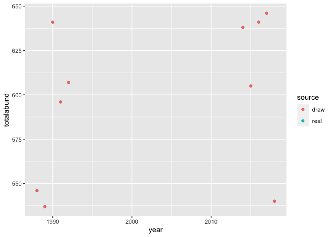
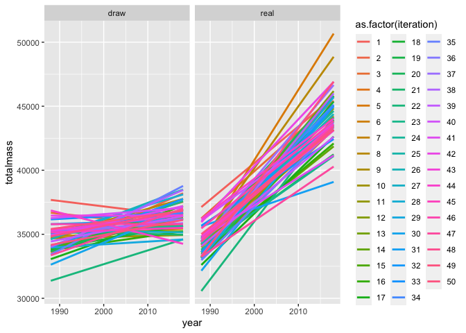
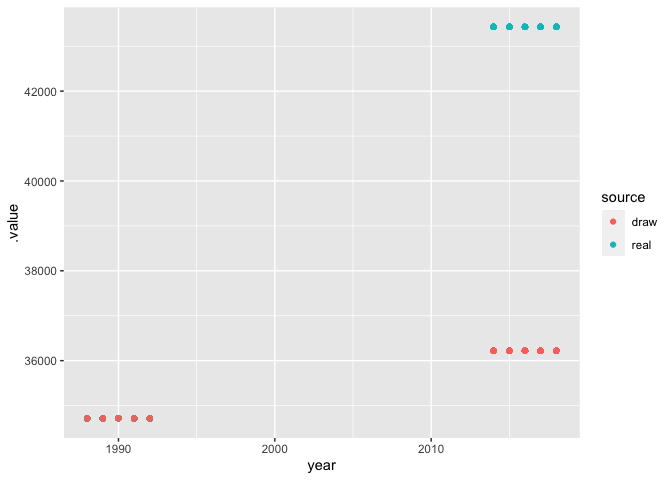

Untitled
================

``` r
g_isds <- simulate_isd_ts(g, isd_seed = isd_seed)
```

    ## Joining, by = "id"
    ## Joining, by = "id"
    ## Joining, by = "id"
    ## Joining, by = "id"
    ## Joining, by = "id"
    ## Joining, by = "id"
    ## Joining, by = "id"
    ## Joining, by = "id"
    ## Joining, by = "id"
    ## Joining, by = "id"
    ## Joining, by = "id"
    ## Joining, by = "id"
    ## Joining, by = "id"
    ## Joining, by = "id"
    ## Joining, by = "id"
    ## Joining, by = "id"
    ## Joining, by = "id"
    ## Joining, by = "id"

``` r
g_isds_df <- g_isds$isd

g_isd_begin <- dplyr::filter(g_isds_df, year %in% begin_years)

g_isd_end <- dplyr::filter(g_isds_df, year %in% end_years)
add_gmm2 <- function(isd, max_size = 15000, max_G = 15) {

  isd <- isd %>%
    dplyr::mutate(logmass = log(mass))

  gmm <- fit_gmm(isd$logmass, max_G)


  gmm_isd <- data.frame(logmass = seq(0, log(max_size), length.out = 100000))
  gmm_isd$dens <- predict(gmm, newdata = gmm_isd$logmass)


  isd_gmm <- data.frame(
    mass = gmm_isd$logmass,
    density = (gmm_isd$dens)/ sum(gmm_isd$dens)
  )

  return(isd_gmm)

}

g_gmm_begin <- add_gmm2(g_isd_begin)
```

    ## Package 'mclust' version 5.4.7
    ## Type 'citation("mclust")' for citing this R package in publications.

``` r
g_gmm_end <- add_gmm2(g_isd_end)

its <- list()

for(i in 1:50) {
  
set.seed(NULL)

g_isd_begin_sim <- g_isd_begin %>%
  dplyr::mutate(mass_sim = exp(sample(g_gmm_begin$mass, size = nrow(g_isd_begin), prob = g_gmm_begin$density, replace= T))) %>%
  dplyr::mutate(timeperiod = "begin")


g_isd_end_sim <- g_isd_end %>%
  dplyr::mutate(
    mass_sim_end = exp(sample(g_gmm_end$mass, size = nrow(g_isd_end), prob = g_gmm_end$density, replace = T)),
    mass_sim_begin = exp(sample(g_gmm_begin$mass, size = nrow(g_isd_end), prob = g_gmm_begin$density, replace = T))
  ) %>%
  dplyr::mutate(timeperiod = "end")

library(dplyr)
actual <- g_isd_end_sim %>%
  select(year, timeperiod, mass_sim_end) %>%
  rename(mass = mass_sim_end) %>%
  bind_rows(
    rename(
      select(
      g_isd_begin_sim, year, timeperiod, mass_sim
    ),
    mass = mass_sim
  )
  ) %>%
  group_by(year, timeperiod) %>%
  summarize(totalmass = sum(mass),
                        totalabund = dplyr::n()) %>%
  ungroup() %>%
  mutate(source = "real")
scaling <- g_isd_end_sim %>%
  select(year, timeperiod, mass_sim_begin) %>%
  rename(mass = mass_sim_begin) %>%
  bind_rows(
    rename(
      select(
      g_isd_begin_sim, year, timeperiod, mass_sim
    ),
    mass = mass_sim
  )
  ) %>%
  group_by(year, timeperiod) %>%
  summarize(totalmass = sum(mass),
            totalabund = dplyr::n()) %>%
  ungroup() %>%
  mutate(source = "draw")

both <- bind_rows(actual, scaling) %>%
  mutate(iteration = i)

its[[i]] <- both
}
```

    ## 
    ## Attaching package: 'dplyr'

    ## The following objects are masked from 'package:stats':
    ## 
    ##     filter, lag

    ## The following objects are masked from 'package:base':
    ## 
    ##     intersect, setdiff, setequal, union

    ## `summarise()` has grouped output by 'year'. You can override using the `.groups` argument.
    ## `summarise()` has grouped output by 'year'. You can override using the `.groups` argument.
    ## `summarise()` has grouped output by 'year'. You can override using the `.groups` argument.
    ## `summarise()` has grouped output by 'year'. You can override using the `.groups` argument.
    ## `summarise()` has grouped output by 'year'. You can override using the `.groups` argument.
    ## `summarise()` has grouped output by 'year'. You can override using the `.groups` argument.
    ## `summarise()` has grouped output by 'year'. You can override using the `.groups` argument.
    ## `summarise()` has grouped output by 'year'. You can override using the `.groups` argument.
    ## `summarise()` has grouped output by 'year'. You can override using the `.groups` argument.
    ## `summarise()` has grouped output by 'year'. You can override using the `.groups` argument.
    ## `summarise()` has grouped output by 'year'. You can override using the `.groups` argument.
    ## `summarise()` has grouped output by 'year'. You can override using the `.groups` argument.
    ## `summarise()` has grouped output by 'year'. You can override using the `.groups` argument.
    ## `summarise()` has grouped output by 'year'. You can override using the `.groups` argument.
    ## `summarise()` has grouped output by 'year'. You can override using the `.groups` argument.
    ## `summarise()` has grouped output by 'year'. You can override using the `.groups` argument.
    ## `summarise()` has grouped output by 'year'. You can override using the `.groups` argument.
    ## `summarise()` has grouped output by 'year'. You can override using the `.groups` argument.
    ## `summarise()` has grouped output by 'year'. You can override using the `.groups` argument.
    ## `summarise()` has grouped output by 'year'. You can override using the `.groups` argument.
    ## `summarise()` has grouped output by 'year'. You can override using the `.groups` argument.
    ## `summarise()` has grouped output by 'year'. You can override using the `.groups` argument.
    ## `summarise()` has grouped output by 'year'. You can override using the `.groups` argument.
    ## `summarise()` has grouped output by 'year'. You can override using the `.groups` argument.
    ## `summarise()` has grouped output by 'year'. You can override using the `.groups` argument.
    ## `summarise()` has grouped output by 'year'. You can override using the `.groups` argument.
    ## `summarise()` has grouped output by 'year'. You can override using the `.groups` argument.
    ## `summarise()` has grouped output by 'year'. You can override using the `.groups` argument.
    ## `summarise()` has grouped output by 'year'. You can override using the `.groups` argument.
    ## `summarise()` has grouped output by 'year'. You can override using the `.groups` argument.
    ## `summarise()` has grouped output by 'year'. You can override using the `.groups` argument.
    ## `summarise()` has grouped output by 'year'. You can override using the `.groups` argument.
    ## `summarise()` has grouped output by 'year'. You can override using the `.groups` argument.
    ## `summarise()` has grouped output by 'year'. You can override using the `.groups` argument.
    ## `summarise()` has grouped output by 'year'. You can override using the `.groups` argument.
    ## `summarise()` has grouped output by 'year'. You can override using the `.groups` argument.
    ## `summarise()` has grouped output by 'year'. You can override using the `.groups` argument.
    ## `summarise()` has grouped output by 'year'. You can override using the `.groups` argument.
    ## `summarise()` has grouped output by 'year'. You can override using the `.groups` argument.
    ## `summarise()` has grouped output by 'year'. You can override using the `.groups` argument.
    ## `summarise()` has grouped output by 'year'. You can override using the `.groups` argument.
    ## `summarise()` has grouped output by 'year'. You can override using the `.groups` argument.
    ## `summarise()` has grouped output by 'year'. You can override using the `.groups` argument.
    ## `summarise()` has grouped output by 'year'. You can override using the `.groups` argument.
    ## `summarise()` has grouped output by 'year'. You can override using the `.groups` argument.
    ## `summarise()` has grouped output by 'year'. You can override using the `.groups` argument.
    ## `summarise()` has grouped output by 'year'. You can override using the `.groups` argument.
    ## `summarise()` has grouped output by 'year'. You can override using the `.groups` argument.
    ## `summarise()` has grouped output by 'year'. You can override using the `.groups` argument.
    ## `summarise()` has grouped output by 'year'. You can override using the `.groups` argument.
    ## `summarise()` has grouped output by 'year'. You can override using the `.groups` argument.
    ## `summarise()` has grouped output by 'year'. You can override using the `.groups` argument.
    ## `summarise()` has grouped output by 'year'. You can override using the `.groups` argument.
    ## `summarise()` has grouped output by 'year'. You can override using the `.groups` argument.
    ## `summarise()` has grouped output by 'year'. You can override using the `.groups` argument.
    ## `summarise()` has grouped output by 'year'. You can override using the `.groups` argument.
    ## `summarise()` has grouped output by 'year'. You can override using the `.groups` argument.
    ## `summarise()` has grouped output by 'year'. You can override using the `.groups` argument.
    ## `summarise()` has grouped output by 'year'. You can override using the `.groups` argument.
    ## `summarise()` has grouped output by 'year'. You can override using the `.groups` argument.
    ## `summarise()` has grouped output by 'year'. You can override using the `.groups` argument.
    ## `summarise()` has grouped output by 'year'. You can override using the `.groups` argument.
    ## `summarise()` has grouped output by 'year'. You can override using the `.groups` argument.
    ## `summarise()` has grouped output by 'year'. You can override using the `.groups` argument.
    ## `summarise()` has grouped output by 'year'. You can override using the `.groups` argument.
    ## `summarise()` has grouped output by 'year'. You can override using the `.groups` argument.
    ## `summarise()` has grouped output by 'year'. You can override using the `.groups` argument.
    ## `summarise()` has grouped output by 'year'. You can override using the `.groups` argument.
    ## `summarise()` has grouped output by 'year'. You can override using the `.groups` argument.
    ## `summarise()` has grouped output by 'year'. You can override using the `.groups` argument.
    ## `summarise()` has grouped output by 'year'. You can override using the `.groups` argument.
    ## `summarise()` has grouped output by 'year'. You can override using the `.groups` argument.
    ## `summarise()` has grouped output by 'year'. You can override using the `.groups` argument.
    ## `summarise()` has grouped output by 'year'. You can override using the `.groups` argument.
    ## `summarise()` has grouped output by 'year'. You can override using the `.groups` argument.
    ## `summarise()` has grouped output by 'year'. You can override using the `.groups` argument.
    ## `summarise()` has grouped output by 'year'. You can override using the `.groups` argument.
    ## `summarise()` has grouped output by 'year'. You can override using the `.groups` argument.
    ## `summarise()` has grouped output by 'year'. You can override using the `.groups` argument.
    ## `summarise()` has grouped output by 'year'. You can override using the `.groups` argument.
    ## `summarise()` has grouped output by 'year'. You can override using the `.groups` argument.
    ## `summarise()` has grouped output by 'year'. You can override using the `.groups` argument.
    ## `summarise()` has grouped output by 'year'. You can override using the `.groups` argument.
    ## `summarise()` has grouped output by 'year'. You can override using the `.groups` argument.
    ## `summarise()` has grouped output by 'year'. You can override using the `.groups` argument.
    ## `summarise()` has grouped output by 'year'. You can override using the `.groups` argument.
    ## `summarise()` has grouped output by 'year'. You can override using the `.groups` argument.
    ## `summarise()` has grouped output by 'year'. You can override using the `.groups` argument.
    ## `summarise()` has grouped output by 'year'. You can override using the `.groups` argument.
    ## `summarise()` has grouped output by 'year'. You can override using the `.groups` argument.
    ## `summarise()` has grouped output by 'year'. You can override using the `.groups` argument.
    ## `summarise()` has grouped output by 'year'. You can override using the `.groups` argument.
    ## `summarise()` has grouped output by 'year'. You can override using the `.groups` argument.
    ## `summarise()` has grouped output by 'year'. You can override using the `.groups` argument.
    ## `summarise()` has grouped output by 'year'. You can override using the `.groups` argument.
    ## `summarise()` has grouped output by 'year'. You can override using the `.groups` argument.
    ## `summarise()` has grouped output by 'year'. You can override using the `.groups` argument.
    ## `summarise()` has grouped output by 'year'. You can override using the `.groups` argument.
    ## `summarise()` has grouped output by 'year'. You can override using the `.groups` argument.
    ## `summarise()` has grouped output by 'year'. You can override using the `.groups` argument.

``` r
allits <- bind_rows(its)

ggplot(both, aes(year, totalmass, color = source)) + geom_point()
```

<!-- -->

``` r
ggplot(both, aes(year, totalabund, color = source)) + geom_point()
```

<!-- -->

``` r
summary(lm(totalmass ~ timeperiod * source, data = both))
```

    ## 
    ## Call:
    ## lm(formula = totalmass ~ timeperiod * source, data = both)
    ## 
    ## Residuals:
    ##     Min      1Q  Median      3Q     Max 
    ## -8751.7  -924.9  1814.7  2765.4  4073.1 
    ## 
    ## Coefficients:
    ##                          Estimate Std. Error t value Pr(>|t|)    
    ## (Intercept)                 35372       2053  17.232 9.38e-12 ***
    ## timeperiodend                1493       2903   0.514    0.614    
    ## sourcereal                      0       2903   0.000    1.000    
    ## timeperiodend:sourcereal     5939       4105   1.447    0.167    
    ## ---
    ## Signif. codes:  0 '***' 0.001 '**' 0.01 '*' 0.05 '.' 0.1 ' ' 1
    ## 
    ## Residual standard error: 4590 on 16 degrees of freedom
    ## Multiple R-squared:  0.3578, Adjusted R-squared:  0.2373 
    ## F-statistic: 2.971 on 3 and 16 DF,  p-value: 0.06314

``` r
ggplot(allits, aes(year, totalmass, color = as.factor(iteration), group = as.factor(iteration))) + geom_smooth(method = "lm", se = F) + facet_wrap(vars(source))
```

    ## `geom_smooth()` using formula 'y ~ x'

<!-- -->

``` r
a_lm <- lm(totalmass ~ timeperiod * source, data = allits)

summary(a_lm)
```

    ## 
    ## Call:
    ## lm(formula = totalmass ~ timeperiod * source, data = allits)
    ## 
    ## Residuals:
    ##      Min       1Q   Median       3Q      Max 
    ## -13819.4  -2960.7     60.3   2669.1  16863.3 
    ## 
    ## Coefficients:
    ##                            Estimate Std. Error t value Pr(>|t|)    
    ## (Intercept)               3.482e+04  2.537e+02 137.256  < 2e-16 ***
    ## timeperiodend             1.489e+03  3.587e+02   4.151 3.59e-05 ***
    ## sourcereal               -1.979e-11  3.587e+02   0.000        1    
    ## timeperiodend:sourcereal  7.226e+03  5.073e+02  14.244  < 2e-16 ***
    ## ---
    ## Signif. codes:  0 '***' 0.001 '**' 0.01 '*' 0.05 '.' 0.1 ' ' 1
    ## 
    ## Residual standard error: 4011 on 996 degrees of freedom
    ## Multiple R-squared:  0.4486, Adjusted R-squared:  0.4469 
    ## F-statistic: 270.1 on 3 and 996 DF,  p-value: < 2.2e-16

``` r
# 
# library(brms)
# 
# a_brm <- brm(totalmass ~ timeperiod * source + (1|year), data = allits)
# 
# summary(a_brm)

library(mgcv)
```

    ## Loading required package: nlme

    ## 
    ## Attaching package: 'nlme'

    ## The following object is masked from 'package:dplyr':
    ## 
    ##     collapse

    ## This is mgcv 1.8-37. For overview type 'help("mgcv-package")'.

    ## 
    ## Attaching package: 'mgcv'

    ## The following object is masked from 'package:mclust':
    ## 
    ##     mvn

``` r
allits <- allits %>%
  mutate(fsource = as.ordered(source),
         fyear = as.factor(year))

a_glm <- gam(totalmass ~ timeperiod * source + s(fyear, bs = "re"), data = allits, family = "tw")

summary(a_glm)
```

    ## 
    ## Family: Tweedie(p=1.99) 
    ## Link function: log 
    ## 
    ## Formula:
    ## totalmass ~ timeperiod * source + s(fyear, bs = "re")
    ## 
    ## Parametric coefficients:
    ##                            Estimate Std. Error t value Pr(>|t|)    
    ## (Intercept)               1.045e+01  3.726e-02 280.621   <2e-16 ***
    ## timeperiodend             4.246e-02  5.269e-02   0.806    0.421    
    ## sourcereal               -2.745e-15  6.856e-03   0.000    1.000    
    ## timeperiodend:sourcereal  1.816e-01  9.693e-03  18.734   <2e-16 ***
    ## ---
    ## Signif. codes:  0 '***' 0.001 '**' 0.01 '*' 0.05 '.' 0.1 ' ' 1
    ## 
    ## Approximate significance of smooth terms:
    ##            edf Ref.df     F p-value    
    ## s(fyear) 7.932      8 116.1  <2e-16 ***
    ## ---
    ## Signif. codes:  0 '***' 0.001 '**' 0.01 '*' 0.05 '.' 0.1 ' ' 1
    ## 
    ## R-sq.(adj) =  0.695   Deviance explained =   71%
    ## -REML = 9404.5  Scale est. = 0.006527  n = 1000

``` r
library(gratia)

allits_fitted <- add_fitted(allits, a_glm, exclude = "s(fyear)")

ggplot(allits_fitted, aes(year, .value, color = source)) + geom_point()
```

<!-- -->

``` r
# 
# 
library(brms)
```

    ## Loading required package: Rcpp

    ## Loading 'brms' package (version 2.16.1). Useful instructions
    ## can be found by typing help('brms'). A more detailed introduction
    ## to the package is available through vignette('brms_overview').

    ## 
    ## Attaching package: 'brms'

    ## The following object is masked from 'package:gratia':
    ## 
    ##     posterior_samples

    ## The following objects are masked from 'package:mgcv':
    ## 
    ##     s, t2

    ## The following object is masked from 'package:mclust':
    ## 
    ##     me

    ## The following object is masked from 'package:stats':
    ## 
    ##     ar

``` r
a_brm <- brm(totalmass ~ timeperiod * source + (1 | fyear), data = allits)
```

    ## Compiling Stan program...

    ## Trying to compile a simple C file

    ## Running /Library/Frameworks/R.framework/Resources/bin/R CMD SHLIB foo.c
    ## clang -I"/Library/Frameworks/R.framework/Resources/include" -DNDEBUG   -I"/Library/Frameworks/R.framework/Versions/4.0/Resources/library/Rcpp/include/"  -I"/Library/Frameworks/R.framework/Versions/4.0/Resources/library/RcppEigen/include/"  -I"/Library/Frameworks/R.framework/Versions/4.0/Resources/library/RcppEigen/include/unsupported"  -I"/Library/Frameworks/R.framework/Versions/4.0/Resources/library/BH/include" -I"/Library/Frameworks/R.framework/Versions/4.0/Resources/library/StanHeaders/include/src/"  -I"/Library/Frameworks/R.framework/Versions/4.0/Resources/library/StanHeaders/include/"  -I"/Library/Frameworks/R.framework/Versions/4.0/Resources/library/RcppParallel/include/"  -I"/Library/Frameworks/R.framework/Versions/4.0/Resources/library/rstan/include" -DEIGEN_NO_DEBUG  -DBOOST_DISABLE_ASSERTS  -DBOOST_PENDING_INTEGER_LOG2_HPP  -DSTAN_THREADS  -DBOOST_NO_AUTO_PTR  -include '/Library/Frameworks/R.framework/Versions/4.0/Resources/library/StanHeaders/include/stan/math/prim/mat/fun/Eigen.hpp'  -D_REENTRANT -DRCPP_PARALLEL_USE_TBB=1   -I/usr/local/include   -fPIC  -Wall -g -O2  -c foo.c -o foo.o
    ## In file included from <built-in>:1:
    ## In file included from /Library/Frameworks/R.framework/Versions/4.0/Resources/library/StanHeaders/include/stan/math/prim/mat/fun/Eigen.hpp:13:
    ## In file included from /Library/Frameworks/R.framework/Versions/4.0/Resources/library/RcppEigen/include/Eigen/Dense:1:
    ## In file included from /Library/Frameworks/R.framework/Versions/4.0/Resources/library/RcppEigen/include/Eigen/Core:88:
    ## /Library/Frameworks/R.framework/Versions/4.0/Resources/library/RcppEigen/include/Eigen/src/Core/util/Macros.h:628:1: error: unknown type name 'namespace'
    ## namespace Eigen {
    ## ^
    ## /Library/Frameworks/R.framework/Versions/4.0/Resources/library/RcppEigen/include/Eigen/src/Core/util/Macros.h:628:16: error: expected ';' after top level declarator
    ## namespace Eigen {
    ##                ^
    ##                ;
    ## In file included from <built-in>:1:
    ## In file included from /Library/Frameworks/R.framework/Versions/4.0/Resources/library/StanHeaders/include/stan/math/prim/mat/fun/Eigen.hpp:13:
    ## In file included from /Library/Frameworks/R.framework/Versions/4.0/Resources/library/RcppEigen/include/Eigen/Dense:1:
    ## /Library/Frameworks/R.framework/Versions/4.0/Resources/library/RcppEigen/include/Eigen/Core:96:10: fatal error: 'complex' file not found
    ## #include <complex>
    ##          ^~~~~~~~~
    ## 3 errors generated.
    ## make: *** [foo.o] Error 1

    ## Start sampling

    ## 
    ## SAMPLING FOR MODEL '18b9f8a120812cf89de396a19354f1ec' NOW (CHAIN 1).
    ## Chain 1: 
    ## Chain 1: Gradient evaluation took 0.000131 seconds
    ## Chain 1: 1000 transitions using 10 leapfrog steps per transition would take 1.31 seconds.
    ## Chain 1: Adjust your expectations accordingly!
    ## Chain 1: 
    ## Chain 1: 
    ## Chain 1: Iteration:    1 / 2000 [  0%]  (Warmup)
    ## Chain 1: Iteration:  200 / 2000 [ 10%]  (Warmup)
    ## Chain 1: Iteration:  400 / 2000 [ 20%]  (Warmup)
    ## Chain 1: Iteration:  600 / 2000 [ 30%]  (Warmup)
    ## Chain 1: Iteration:  800 / 2000 [ 40%]  (Warmup)
    ## Chain 1: Iteration: 1000 / 2000 [ 50%]  (Warmup)
    ## Chain 1: Iteration: 1001 / 2000 [ 50%]  (Sampling)
    ## Chain 1: Iteration: 1200 / 2000 [ 60%]  (Sampling)
    ## Chain 1: Iteration: 1400 / 2000 [ 70%]  (Sampling)
    ## Chain 1: Iteration: 1600 / 2000 [ 80%]  (Sampling)
    ## Chain 1: Iteration: 1800 / 2000 [ 90%]  (Sampling)
    ## Chain 1: Iteration: 2000 / 2000 [100%]  (Sampling)
    ## Chain 1: 
    ## Chain 1:  Elapsed Time: 11.8271 seconds (Warm-up)
    ## Chain 1:                5.74355 seconds (Sampling)
    ## Chain 1:                17.5707 seconds (Total)
    ## Chain 1: 
    ## 
    ## SAMPLING FOR MODEL '18b9f8a120812cf89de396a19354f1ec' NOW (CHAIN 2).
    ## Chain 2: 
    ## Chain 2: Gradient evaluation took 0.000138 seconds
    ## Chain 2: 1000 transitions using 10 leapfrog steps per transition would take 1.38 seconds.
    ## Chain 2: Adjust your expectations accordingly!
    ## Chain 2: 
    ## Chain 2: 
    ## Chain 2: Iteration:    1 / 2000 [  0%]  (Warmup)
    ## Chain 2: Iteration:  200 / 2000 [ 10%]  (Warmup)
    ## Chain 2: Iteration:  400 / 2000 [ 20%]  (Warmup)
    ## Chain 2: Iteration:  600 / 2000 [ 30%]  (Warmup)
    ## Chain 2: Iteration:  800 / 2000 [ 40%]  (Warmup)
    ## Chain 2: Iteration: 1000 / 2000 [ 50%]  (Warmup)
    ## Chain 2: Iteration: 1001 / 2000 [ 50%]  (Sampling)
    ## Chain 2: Iteration: 1200 / 2000 [ 60%]  (Sampling)
    ## Chain 2: Iteration: 1400 / 2000 [ 70%]  (Sampling)
    ## Chain 2: Iteration: 1600 / 2000 [ 80%]  (Sampling)
    ## Chain 2: Iteration: 1800 / 2000 [ 90%]  (Sampling)
    ## Chain 2: Iteration: 2000 / 2000 [100%]  (Sampling)
    ## Chain 2: 
    ## Chain 2:  Elapsed Time: 22.0952 seconds (Warm-up)
    ## Chain 2:                4.08151 seconds (Sampling)
    ## Chain 2:                26.1767 seconds (Total)
    ## Chain 2: 
    ## 
    ## SAMPLING FOR MODEL '18b9f8a120812cf89de396a19354f1ec' NOW (CHAIN 3).
    ## Chain 3: 
    ## Chain 3: Gradient evaluation took 8.4e-05 seconds
    ## Chain 3: 1000 transitions using 10 leapfrog steps per transition would take 0.84 seconds.
    ## Chain 3: Adjust your expectations accordingly!
    ## Chain 3: 
    ## Chain 3: 
    ## Chain 3: Iteration:    1 / 2000 [  0%]  (Warmup)
    ## Chain 3: Iteration:  200 / 2000 [ 10%]  (Warmup)
    ## Chain 3: Iteration:  400 / 2000 [ 20%]  (Warmup)
    ## Chain 3: Iteration:  600 / 2000 [ 30%]  (Warmup)
    ## Chain 3: Iteration:  800 / 2000 [ 40%]  (Warmup)
    ## Chain 3: Iteration: 1000 / 2000 [ 50%]  (Warmup)
    ## Chain 3: Iteration: 1001 / 2000 [ 50%]  (Sampling)
    ## Chain 3: Iteration: 1200 / 2000 [ 60%]  (Sampling)
    ## Chain 3: Iteration: 1400 / 2000 [ 70%]  (Sampling)
    ## Chain 3: Iteration: 1600 / 2000 [ 80%]  (Sampling)
    ## Chain 3: Iteration: 1800 / 2000 [ 90%]  (Sampling)
    ## Chain 3: Iteration: 2000 / 2000 [100%]  (Sampling)
    ## Chain 3: 
    ## Chain 3:  Elapsed Time: 13.7165 seconds (Warm-up)
    ## Chain 3:                3.96508 seconds (Sampling)
    ## Chain 3:                17.6816 seconds (Total)
    ## Chain 3: 
    ## 
    ## SAMPLING FOR MODEL '18b9f8a120812cf89de396a19354f1ec' NOW (CHAIN 4).
    ## Chain 4: 
    ## Chain 4: Gradient evaluation took 6e-05 seconds
    ## Chain 4: 1000 transitions using 10 leapfrog steps per transition would take 0.6 seconds.
    ## Chain 4: Adjust your expectations accordingly!
    ## Chain 4: 
    ## Chain 4: 
    ## Chain 4: Iteration:    1 / 2000 [  0%]  (Warmup)
    ## Chain 4: Iteration:  200 / 2000 [ 10%]  (Warmup)
    ## Chain 4: Iteration:  400 / 2000 [ 20%]  (Warmup)
    ## Chain 4: Iteration:  600 / 2000 [ 30%]  (Warmup)
    ## Chain 4: Iteration:  800 / 2000 [ 40%]  (Warmup)
    ## Chain 4: Iteration: 1000 / 2000 [ 50%]  (Warmup)
    ## Chain 4: Iteration: 1001 / 2000 [ 50%]  (Sampling)
    ## Chain 4: Iteration: 1200 / 2000 [ 60%]  (Sampling)
    ## Chain 4: Iteration: 1400 / 2000 [ 70%]  (Sampling)
    ## Chain 4: Iteration: 1600 / 2000 [ 80%]  (Sampling)
    ## Chain 4: Iteration: 1800 / 2000 [ 90%]  (Sampling)
    ## Chain 4: Iteration: 2000 / 2000 [100%]  (Sampling)
    ## Chain 4: 
    ## Chain 4:  Elapsed Time: 14.3825 seconds (Warm-up)
    ## Chain 4:                5.03948 seconds (Sampling)
    ## Chain 4:                19.4219 seconds (Total)
    ## Chain 4:

``` r
summary(a_brm)
```

    ##  Family: gaussian 
    ##   Links: mu = identity; sigma = identity 
    ## Formula: totalmass ~ timeperiod * source + (1 | fyear) 
    ##    Data: allits (Number of observations: 1000) 
    ##   Draws: 4 chains, each with iter = 2000; warmup = 1000; thin = 1;
    ##          total post-warmup draws = 4000
    ## 
    ## Group-Level Effects: 
    ## ~fyear (Number of levels: 10) 
    ##               Estimate Est.Error l-95% CI u-95% CI Rhat Bulk_ESS Tail_ESS
    ## sd(Intercept)  3369.47    930.60  2076.75  5683.68 1.00     1236     2191
    ## 
    ## Population-Level Effects: 
    ##                          Estimate Est.Error l-95% CI u-95% CI Rhat Bulk_ESS
    ## Intercept                34829.57   1509.59 31839.03 37719.43 1.00     1530
    ## timeperiodend             1459.29   2203.13 -2894.18  6126.66 1.00     1266
    ## sourcereal                  -2.81    272.48  -537.88   519.43 1.00     2803
    ## timeperiodend:sourcereal  7223.51    387.25  6482.29  7990.22 1.00     2683
    ##                          Tail_ESS
    ## Intercept                    2017
    ## timeperiodend                1653
    ## sourcereal                   2496
    ## timeperiodend:sourcereal     2428
    ## 
    ## Family Specific Parameters: 
    ##       Estimate Est.Error l-95% CI u-95% CI Rhat Bulk_ESS Tail_ESS
    ## sigma  2985.53     66.44  2858.35  3119.19 1.00     3543     2116
    ## 
    ## Draws were sampled using sampling(NUTS). For each parameter, Bulk_ESS
    ## and Tail_ESS are effective sample size measures, and Rhat is the potential
    ## scale reduction factor on split chains (at convergence, Rhat = 1).
