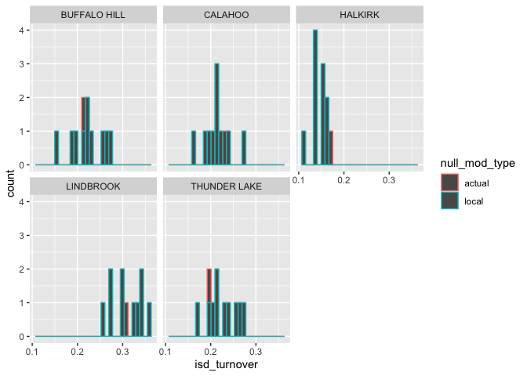
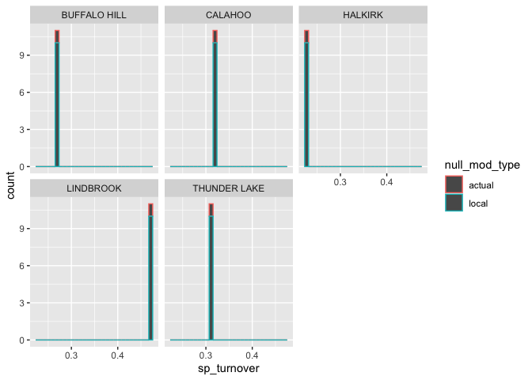

Checking local nm at scale
================

# Checking

Make sure you have unique seeds - depending on how the Rsession is
working it might get kept. (I think I put a stop to that but double
check).

``` r
length(unique(all_results$null_mod_seed))
```

    ## [1] 50

``` r
length(unique(all_results$isd_seed))
```

    ## [1] 50

# Combining

``` r
all_results <- bind_rows(mutate(all_results_actual, null_mod_type = "actual"), all_results)


ggplot(all_results, aes(isd_turnover, color = null_mod_type)) + geom_histogram() + facet_wrap(vars(routename))
```

    ## `stat_bin()` using `bins = 30`. Pick better value with `binwidth`.

<!-- -->

``` r
ggplot(all_results, aes(sp_turnover, color = null_mod_type)) + geom_histogram() + facet_wrap(vars(routename))
```

    ## `stat_bin()` using `bins = 30`. Pick better value with `binwidth`.

<!-- -->

I am not sure about using the null model to look at **trends** because
the null model is going to be **starting** from different places.
