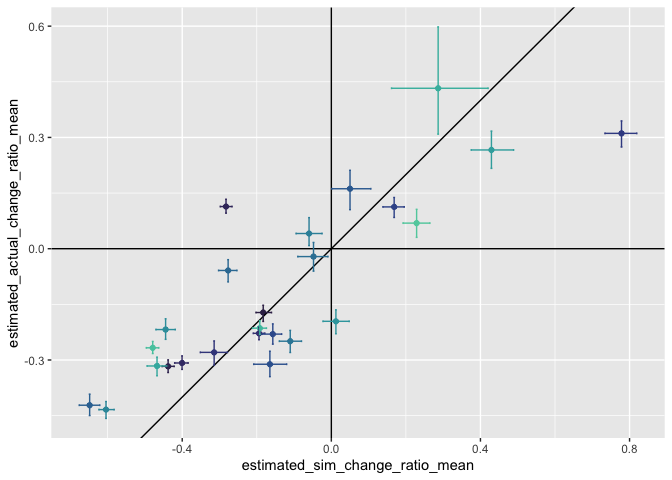
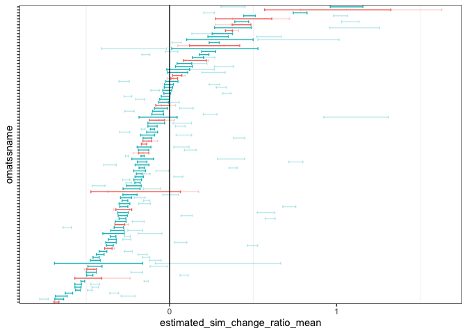
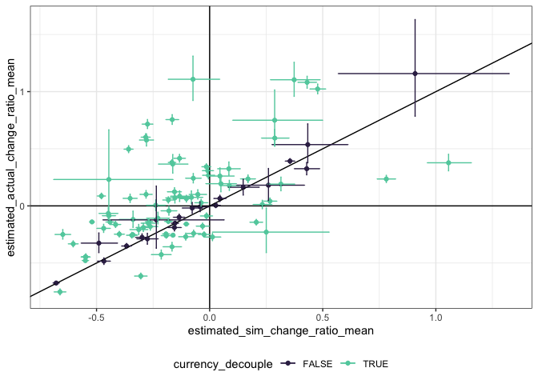

ReSims analysis
================

``` r
# routename is not unique but matssname is
someres <- someres %>%
  mutate(matssname = paste0("bbs_rtrg_", route, "_", statenum))


# k for analyses you want just sims
justsims <- filter(someres, source != "raw")


# This brm is from:
short_sims <- filter(justsims, as.numeric(sim_iteration) <  50)
# tbrm<- brm(total_energy ~ (timeperiod * source) / matssname, data = short_sims)
#load(here::here("brm_50sims.Rds"))

# Current brm is from biomass, 50 sims, 100 sites. 

load(here::here("b_brm_short.Rds"))

tbrm <- b_brm_short
```

``` r
# Get all draws from the posterior and get just the terms we want
td <- tidy_draws(tbrm) %>%
  select_at(vars(starts_with("b"))) %>%
  mutate(rowindex = row_number()) # and get a row index to keep draws together, I'm not sure if this matters but I'll do it

td_routes <- td %>%
  select_at(vars(contains("matssname"), rowindex)) %>% # get the terms involved in route-level offsets from the baseline (i.e. the values for the first route)
  tidyr::pivot_longer(-rowindex, names_to = "term", values_to = "value") %>%
  group_by_all() %>%
  mutate(timeperiod = (unlist(strsplit(term, ":")[1])[[1]]), # the first piece of the variable name tells you begin/end
         source = (unlist(strsplit(term, ":")[1])[[2]]), # second sim/actual
         matssname = (unlist(strsplit(term, ":")[1])[[3]])) %>% # third matssname
  ungroup()  %>%
  group_by_all() %>%
  mutate(si = ifelse(grepl("begin", timeperiod), "intercept", "change"), # all the "begin" terms are the intercept offsets for each route. if not "begin", is "end", or the amount of change we add (to the baseline change) for this route.
         sa = ifelse(grepl("sim", source), "sim", "actual")) %>% # sim and actual terms. at this level the bifurcate.
  mutate(varname = paste0(sa, "_", si)) %>%
  ungroup() %>%
  select(rowindex, value, matssname, varname) %>%
  tidyr::pivot_wider(id_cols = c(rowindex, matssname), names_from = varname, values_from = value) # scoot the values over to new names


# Baseline values - to get the actual estimates for each route, you have to add the route-level estimates to the baseline estimates. Renaming these to intuitive things.
td_baseline <- td %>%
  select(b_Intercept, b_timeperiodend, b_sourcesim, `b_timeperiodend:sourcesim`, rowindex) %>%
  mutate(baseline_actual_intercept = b_Intercept,
         baseline_actual_change = b_timeperiodend,
         baseline_sim_intercept = b_sourcesim,
         baseline_sim_change = `b_timeperiodend:sourcesim`) %>%
  select(rowindex, baseline_actual_intercept, baseline_actual_change, baseline_sim_intercept, baseline_sim_change)

# The first route has its route-level values estimated as the baseline values. To get estimates for it, creating a dummy dataframe with route-level parameters set to zero.

td_route1 <- data.frame (
  rowindex = td_baseline$rowindex,
  actual_intercept = 0,
  actual_change = 0,
  sim_intercept = 0,
  sim_change = 0,
  matssname = "first")

# Then binding the dummy dataframe for the baseline route to the route-level estimates for all the other routes
td_allroutes <- bind_rows(td_routes, td_route1)


# Then sticking the route level estimates to the baseline values
td_together <- left_join(td_allroutes, td_baseline)
```

    ## Joining, by = "rowindex"

``` r
# Then arithmetic to get estimates for various quantities
td_route_ests <- td_together %>%
  group_by_all() %>%
  mutate(
    estimated_actual_begin = sum(actual_intercept, baseline_actual_intercept), # estimated beginning value
    estimated_actual_end = sum(actual_change, baseline_actual_change, baseline_actual_intercept), # estimated end value
    estimated_sim_begin = sum(sim_intercept, baseline_actual_intercept, baseline_sim_intercept), # estimated beginning value from sims. we expect this to be equal to the estimated beginning value, any change is just sampling error.
    estimated_sim_end = sum(baseline_actual_intercept, baseline_actual_change, baseline_sim_change, baseline_sim_intercept, sim_change),
    estimated_actual_change_ratio = (estimated_actual_end - estimated_actual_begin) / estimated_actual_begin, # this is a measure of the magnitude of the change from beginning to end. the sign is going to be increase (positive) or decrease. the magnitude is the % increase. so .1 = added 10% of starting (biomass or energy) to get to the end. -.2 = lost 20% of starting (biomass or energy) between begin and end.
    estimated_sim_change_ratio = (estimated_sim_end - estimated_sim_begin) / estimated_sim_begin, # same measure but having drawn the end values using the beginning isd. this is the amount of change expected due only to changes in the numbers of individuals observed in each time period. by comparing estimated_actual_change_ratio to estimated_sim_change_ratio, I believe we get an estimate of both the significance and magnitude of decoupling of (biomass or energy) and numerical abundance due to changes in the size spectrum.
    estimated_actual_change = estimated_actual_end - estimated_actual_begin, # the "slope" assuming x = 0 or 1 for begin or end. aka the absolute change from end to begin.
    estimated_sim_change = estimated_sim_end - estimated_sim_begin, # absolute change from end to begin due to abundance change
    estimated_change_ratio_deviation = estimated_actual_change_ratio - estimated_sim_change_ratio, # deviation of change ratios from 1:1
    estimated_change_deviation = estimated_actual_change - estimated_sim_change # deviation of actual change from 1:1
  ) %>%
  ungroup()

# Summarize to get mean and 95% intervals for the above quantities

lower_quantile <- function(vector) {
  as.numeric(quantile(vector, probs = .025))
}
upper_quantile <- function(vector) {
  as.numeric(quantile(vector, probs = .975))
}

td_route_ests_summary <- td_route_ests %>%
  select(-rowindex) %>%
  group_by(matssname) %>%
  summarize_all(.funs = list(mean = mean,
                             lower = lower_quantile,
                             upper = upper_quantile)) %>%
  ungroup()

# this is just to check that these estimates have the same means as if you use predict()
# bpreds <- predict(tbrm)
# 
# somepreds <- short_sims %>%
#   mutate(pred =bpreds[,1])
# 
# somepreds_summary <- somepreds %>%
#   group_by(matssname, timeperiod, source) %>%
#   summarize(mean_pred = mean(pred)) %>%
#   ungroup() %>%
#   tidyr::pivot_wider(c(timeperiod, source), id_cols = matssname, values_from = mean_pred) %>%
#   mutate(matssname = paste0("matssname", matssname))
# 
# ests_v_pred <- left_join(td_route_ests_summary, somepreds_summary)
# 
# ggplot(ests_v_pred, aes(estimated_sim_end_mean, end_sim)) + geom_point() + geom_abline(slope = 1, intercept = 0)
# 
```

# working with energy use.

Estimated change due to abundance:

`estimated_sim_change_ratio` mean, upper, and lower.

``` r
ggplot(td_route_ests_summary, aes(estimated_sim_change_ratio_mean, estimated_actual_change_ratio_mean, color= matssname)) +
  geom_point() +
  geom_vline(xintercept = 0) +
  geom_hline(yintercept = 0)+
  geom_abline(intercept = 0, slope = 1) +
  geom_errorbarh(aes(xmin = estimated_sim_change_ratio_lower, xmax = estimated_sim_change_ratio_upper, y = estimated_actual_change_ratio_mean), height = .005) +
  geom_errorbar(aes(ymin = estimated_actual_change_ratio_lower, ymax = estimated_actual_change_ratio_upper, x = estimated_sim_change_ratio_mean), width = .005) +
  scale_color_viridis_d(option='mako', begin = .2, end =.8) +
  theme(legend.position = "none")
```

<!-- -->

``` r
td_route_ests_summary <- td_route_ests_summary %>%
  arrange(estimated_sim_change_ratio_mean) %>%
  mutate(sim_change_ratio_rank = row_number()) %>%
  mutate(omatssname = ordered(1:nrow(td_route_ests_summary), labels = matssname))


ggplot(td_route_ests_summary, aes(estimated_sim_change_ratio_mean, omatssname)) + 
 # geom_point() +
  geom_errorbarh(aes(xmin = estimated_sim_change_ratio_lower, xmax = estimated_sim_change_ratio_upper)) + 
 # geom_point(aes(x = estimated_actual_change_ratio_mean), color = "blue", alpha = .6) +
  geom_errorbarh(aes(xmin = estimated_actual_change_ratio_lower, xmax = estimated_actual_change_ratio_upper), color = "blue", alpha = .3) + 
  geom_vline(xintercept = 0) +
  theme_bw() +
  theme(axis.text.y = element_blank(), panel.grid.major= element_blank())
```

<!-- -->

Some interpretation points…

``` r
td_route_ests_interp <- td_route_ests_summary %>%
  group_by_all() %>%
  mutate(
    abundance_change_ratio_over_zero = (estimated_sim_change_ratio_upper * estimated_sim_change_ratio_lower) < 0,
    currency_over_abundance = ((estimated_sim_change_ratio_upper < estimated_actual_change_ratio_lower)),
    abundance_over_currency = estimated_sim_change_ratio_lower > estimated_actual_change_ratio_upper,
    currency_decouple = currency_over_abundance | abundance_over_currency
  ) %>%
  ungroup()


ggplot(td_route_ests_interp, aes(estimated_sim_change_ratio_mean, omatssname, color = currency_decouple)) + 
 # geom_point() +
  geom_errorbarh(aes(xmin = estimated_sim_change_ratio_lower, xmax = estimated_sim_change_ratio_upper)) + 
 # geom_point(aes(x = estimated_actual_change_ratio_mean), color = "blue", alpha = .6) +
  geom_errorbarh(aes(xmin = estimated_actual_change_ratio_lower, xmax = estimated_actual_change_ratio_upper), alpha = .3) + 
  geom_vline(xintercept = 0) +
  theme_bw() +
  theme(axis.text.y = element_blank(), panel.grid.major= element_blank(), legend.position = "none")
```

<!-- -->

``` r
ggplot(td_route_ests_interp, aes(estimated_sim_change_ratio_mean, estimated_actual_change_ratio_mean, color= currency_decouple)) +
  geom_point() +
  geom_vline(xintercept = 0) +
  geom_hline(yintercept = 0)+
  geom_abline(intercept = 0, slope = 1) +
  geom_errorbarh(aes(xmin = estimated_sim_change_ratio_lower, xmax = estimated_sim_change_ratio_upper, y = estimated_actual_change_ratio_mean), height = .005) +
  geom_errorbar(aes(ymin = estimated_actual_change_ratio_lower, ymax = estimated_actual_change_ratio_upper, x = estimated_sim_change_ratio_mean), width = .005) +
  scale_color_viridis_d(option='mako', begin = .2, end =.8) +
  theme_bw() +
  theme(legend.position = "bottom")
```

<!-- -->

``` r
mean(td_route_ests_interp$abundance_change_ratio_over_zero)
```

    ## [1] 0.11

``` r
mean(td_route_ests_interp$estimated_sim_change_ratio_lower > 0)
```

    ## [1] 0.23

``` r
mean(td_route_ests_interp$estimated_sim_change_ratio_upper < 0)
```

    ## [1] 0.66

``` r
mean(td_route_ests_interp$abundance_over_currency)
```

    ## [1] 0.21

``` r
mean(td_route_ests_interp$currency_over_abundance)
```

    ## [1] 0.59

``` r
mean(td_route_ests_interp$currency_decouple)
```

    ## [1] 0.8
