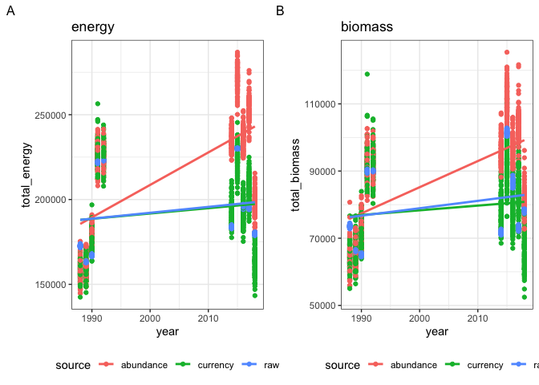

Exploring on some examples
================

  - [19\_7](#19_7)
      - [“actual” dyanmics](#actual-dyanmics)
      - [Models](#models)
          - [Diagnostics](#diagnostics)
          - [Summary plots](#summary-plots)
          - [Probabilities from draws](#probabilities-from-draws)
  - [224\_3](#224_3)
      - [“actual” dyanmics](#actual-dyanmics-1)
      - [Models](#models-1)
          - [Diagnostics](#diagnostics-1)
          - [Summary plots](#summary-plots-1)
          - [Probabilities from draws](#probabilities-from-draws-1)
  - [318\_3](#318_3)
      - [“actual” dyanmics](#actual-dyanmics-2)
      - [Models](#models-2)
          - [Diagnostics](#diagnostics-2)
          - [Summary plots](#summary-plots-2)
          - [Probabilities from draws](#probabilities-from-draws-2)

# 19\_7

## “actual” dyanmics

<!-- -->

## Models

### Diagnostics

    ##  Family: gaussian 
    ##   Links: mu = identity; sigma = identity 
    ## Formula: total_energy ~ (timeperiod * source) + (1 | year) 
    ##    Data: justsims (Number of observations: 2000) 
    ##   Draws: 4 chains, each with iter = 4000; warmup = 2000; thin = 2;
    ##          total post-warmup draws = 4000
    ## 
    ## Group-Level Effects: 
    ## ~year (Number of levels: 10) 
    ##               Estimate Est.Error l-95% CI u-95% CI Rhat Bulk_ESS Tail_ESS
    ## sd(Intercept) 33618.89   9201.14 20675.74 56128.97 1.00     3633     4885
    ## 
    ## Population-Level Effects: 
    ##                               Estimate Est.Error  l-95% CI  u-95% CI Rhat
    ## Intercept                    190249.93  15320.85 160282.69 220547.19 1.00
    ## timeperiodend                 48553.61  22542.68   3936.02  93802.25 1.00
    ## sourcecurrency                 -428.45    438.42  -1277.33    417.27 1.00
    ## timeperiodend:sourcecurrency -42435.41    628.51 -43688.97 -41197.83 1.00
    ##                              Bulk_ESS Tail_ESS
    ## Intercept                        4189     5032
    ## timeperiodend                    3561     4433
    ## sourcecurrency                   6845     6216
    ## timeperiodend:sourcecurrency     6945     6350
    ## 
    ## Family Specific Parameters: 
    ##       Estimate Est.Error l-95% CI u-95% CI Rhat Bulk_ESS Tail_ESS
    ## sigma  6877.10    107.53  6669.25  7092.21 1.00     7334     6080
    ## 
    ## Draws were sampled using sampling(NUTS). For each parameter, Bulk_ESS
    ## and Tail_ESS are effective sample size measures, and Rhat is the potential
    ## scale reduction factor on split chains (at convergence, Rhat = 1).

    ##  Family: gaussian 
    ##   Links: mu = identity; sigma = identity 
    ## Formula: total_biomass ~ (timeperiod * source) + (1 | year) 
    ##    Data: justsims (Number of observations: 2000) 
    ##   Draws: 4 chains, each with iter = 4000; warmup = 2000; thin = 2;
    ##          total post-warmup draws = 4000
    ## 
    ## Group-Level Effects: 
    ## ~year (Number of levels: 10) 
    ##               Estimate Est.Error l-95% CI u-95% CI Rhat Bulk_ESS Tail_ESS
    ## sd(Intercept) 13780.27   3786.78  8429.60 23003.85 1.00     3664     5128
    ## 
    ## Population-Level Effects: 
    ##                               Estimate Est.Error  l-95% CI  u-95% CI Rhat
    ## Intercept                     77607.18   6351.68  64956.97  90549.65 1.00
    ## timeperiodend                 19714.98   9110.26   1293.20  37573.26 1.00
    ## sourcecurrency                 -315.49    293.09   -887.19    252.63 1.00
    ## timeperiodend:sourcecurrency -16939.81    415.10 -17748.79 -16129.10 1.00
    ##                              Bulk_ESS Tail_ESS
    ## Intercept                        4441     5237
    ## timeperiodend                    3913     4295
    ## sourcecurrency                   7115     6338
    ## timeperiodend:sourcecurrency     7020     6363
    ## 
    ## Family Specific Parameters: 
    ##       Estimate Est.Error l-95% CI u-95% CI Rhat Bulk_ESS Tail_ESS
    ## sigma  4680.96     73.89  4538.05  4827.64 1.00     7404     6145
    ## 
    ## Draws were sampled using sampling(NUTS). For each parameter, Bulk_ESS
    ## and Tail_ESS are effective sample size measures, and Rhat is the potential
    ## scale reduction factor on split chains (at convergence, Rhat = 1).

### Summary plots

<!-- --><!-- -->

### Probabilities from draws

    ## # A tibble: 2 × 5
    ##   currency b_Intercept b_timeperiodend b_sourcecurrency `b_timeperiodend:source…
    ##   <chr>          <dbl>           <dbl>            <dbl>                    <dbl>
    ## 1 biomass            0          0.0208            0.859                        1
    ## 2 energy             0          0.0186            0.836                        1

# 224\_3

## “actual” dyanmics

<!-- -->

## Models

### Diagnostics

    ##  Family: gaussian 
    ##   Links: mu = identity; sigma = identity 
    ## Formula: total_energy ~ (timeperiod * source) + (1 | year) 
    ##    Data: justsims (Number of observations: 2000) 
    ##   Draws: 4 chains, each with iter = 4000; warmup = 2000; thin = 2;
    ##          total post-warmup draws = 4000
    ## 
    ## Group-Level Effects: 
    ## ~year (Number of levels: 10) 
    ##               Estimate Est.Error l-95% CI u-95% CI Rhat Bulk_ESS Tail_ESS
    ## sd(Intercept) 23996.70   7012.40 14398.44 41966.99 1.00     4020     5327
    ## 
    ## Population-Level Effects: 
    ##                               Estimate Est.Error l-95% CI  u-95% CI Rhat
    ## Intercept                    112651.89  10979.65 90660.67 134781.83 1.00
    ## timeperiodend                 45037.87  15811.34 13635.53  77219.58 1.00
    ## sourcecurrency                 1432.35    767.48   -75.04   2937.68 1.00
    ## timeperiodend:sourcecurrency  60407.46   1066.78 58286.96  62474.16 1.00
    ##                              Bulk_ESS Tail_ESS
    ## Intercept                        4365     5062
    ## timeperiodend                    4045     4889
    ## sourcecurrency                   7315     7248
    ## timeperiodend:sourcecurrency     7131     6943
    ## 
    ## Family Specific Parameters: 
    ##       Estimate Est.Error l-95% CI u-95% CI Rhat Bulk_ESS Tail_ESS
    ## sigma 11981.88    191.74 11609.21 12356.52 1.00     8062     6484
    ## 
    ## Draws were sampled using sampling(NUTS). For each parameter, Bulk_ESS
    ## and Tail_ESS are effective sample size measures, and Rhat is the potential
    ## scale reduction factor on split chains (at convergence, Rhat = 1).

    ##  Family: gaussian 
    ##   Links: mu = identity; sigma = identity 
    ## Formula: total_biomass ~ (timeperiod * source) + (1 | year) 
    ##    Data: justsims (Number of observations: 2000) 
    ##   Draws: 4 chains, each with iter = 4000; warmup = 2000; thin = 2;
    ##          total post-warmup draws = 4000
    ## 
    ## Group-Level Effects: 
    ## ~year (Number of levels: 10) 
    ##               Estimate Est.Error l-95% CI u-95% CI Rhat Bulk_ESS Tail_ESS
    ## sd(Intercept) 13664.94   4070.51  8095.47 23906.04 1.00     3720     5250
    ## 
    ## Population-Level Effects: 
    ##                              Estimate Est.Error l-95% CI u-95% CI Rhat Bulk_ESS
    ## Intercept                    62167.93   6344.94 49383.73 74684.12 1.00     3942
    ## timeperiodend                25175.08   8982.97  6901.86 43554.21 1.00     4059
    ## sourcecurrency                1094.21    705.18  -280.99  2478.14 1.00     7761
    ## timeperiodend:sourcecurrency 41807.66    991.32 39837.86 43768.07 1.00     7579
    ##                              Tail_ESS
    ## Intercept                        5336
    ## timeperiodend                    5265
    ## sourcecurrency                   6689
    ## timeperiodend:sourcecurrency     6712
    ## 
    ## Family Specific Parameters: 
    ##       Estimate Est.Error l-95% CI u-95% CI Rhat Bulk_ESS Tail_ESS
    ## sigma 11174.39    173.42 10835.08 11509.69 1.00     7718     6886
    ## 
    ## Draws were sampled using sampling(NUTS). For each parameter, Bulk_ESS
    ## and Tail_ESS are effective sample size measures, and Rhat is the potential
    ## scale reduction factor on split chains (at convergence, Rhat = 1).

### Summary plots

<!-- --><!-- -->

### Probabilities from draws

    ## # A tibble: 2 × 5
    ##   currency b_Intercept b_timeperiodend b_sourcecurrency `b_timeperiodend:source…
    ##   <chr>          <dbl>           <dbl>            <dbl>                    <dbl>
    ## 1 biomass            0         0.00538           0.0608                        0
    ## 2 energy             0         0.00625           0.0314                        0

# 318\_3

## “actual” dyanmics

<!-- -->

## Models

### Diagnostics

    ##  Family: gaussian 
    ##   Links: mu = identity; sigma = identity 
    ## Formula: total_energy ~ (timeperiod * source) + (1 | year) 
    ##    Data: justsims (Number of observations: 2000) 
    ##   Draws: 4 chains, each with iter = 4000; warmup = 2000; thin = 2;
    ##          total post-warmup draws = 4000
    ## 
    ## Group-Level Effects: 
    ## ~year (Number of levels: 10) 
    ##               Estimate Est.Error l-95% CI u-95% CI Rhat Bulk_ESS Tail_ESS
    ## sd(Intercept)  8163.70   2518.72  4847.80 14539.88 1.00     3261     4789
    ## 
    ## Population-Level Effects: 
    ##                              Estimate Est.Error l-95% CI u-95% CI Rhat Bulk_ESS
    ## Intercept                    28189.85   3788.06 20617.91 35789.50 1.00     4125
    ## timeperiodend                25799.17   5417.10 15113.03 36887.00 1.00     4130
    ## sourcecurrency                  25.05    152.12  -276.46   319.82 1.00     7158
    ## timeperiodend:sourcecurrency  3177.06    216.17  2748.41  3604.73 1.00     6824
    ##                              Tail_ESS
    ## Intercept                        4866
    ## timeperiodend                    5026
    ## sourcecurrency                   6752
    ## timeperiodend:sourcecurrency     7147
    ## 
    ## Family Specific Parameters: 
    ##       Estimate Est.Error l-95% CI u-95% CI Rhat Bulk_ESS Tail_ESS
    ## sigma  2409.23     38.71  2335.74  2487.79 1.00     7339     6343
    ## 
    ## Draws were sampled using sampling(NUTS). For each parameter, Bulk_ESS
    ## and Tail_ESS are effective sample size measures, and Rhat is the potential
    ## scale reduction factor on split chains (at convergence, Rhat = 1).

    ##  Family: gaussian 
    ##   Links: mu = identity; sigma = identity 
    ## Formula: total_biomass ~ (timeperiod * source) + (1 | year) 
    ##    Data: justsims (Number of observations: 2000) 
    ##   Draws: 4 chains, each with iter = 4000; warmup = 2000; thin = 2;
    ##          total post-warmup draws = 4000
    ## 
    ## Group-Level Effects: 
    ## ~year (Number of levels: 10) 
    ##               Estimate Est.Error l-95% CI u-95% CI Rhat Bulk_ESS Tail_ESS
    ## sd(Intercept)  2541.64    768.87  1506.00  4456.97 1.00     3690     4964
    ## 
    ## Population-Level Effects: 
    ##                              Estimate Est.Error l-95% CI u-95% CI Rhat Bulk_ESS
    ## Intercept                     8450.09   1189.87  6087.56 10809.38 1.00     4358
    ## timeperiodend                 7713.17   1675.86  4288.10 11040.80 1.00     4525
    ## sourcecurrency                  15.85    116.16  -212.80   243.29 1.00     7541
    ## timeperiodend:sourcecurrency  2012.97    165.16  1690.40  2337.99 1.00     7568
    ##                              Tail_ESS
    ## Intercept                        5033
    ## timeperiodend                    5229
    ## sourcecurrency                   6829
    ## timeperiodend:sourcecurrency     6902
    ## 
    ## Family Specific Parameters: 
    ##       Estimate Est.Error l-95% CI u-95% CI Rhat Bulk_ESS Tail_ESS
    ## sigma  1821.51     28.97  1766.16  1879.71 1.00     7885     6668
    ## 
    ## Draws were sampled using sampling(NUTS). For each parameter, Bulk_ESS
    ## and Tail_ESS are effective sample size measures, and Rhat is the potential
    ## scale reduction factor on split chains (at convergence, Rhat = 1).

### Summary plots

<!-- --><!-- -->

### Probabilities from draws

    ## # A tibble: 2 × 5
    ##   currency b_Intercept b_timeperiodend b_sourcecurrency `b_timeperiodend:source…
    ##   <chr>          <dbl>           <dbl>            <dbl>                    <dbl>
    ## 1 biomass            0         0.00025            0.451                        0
    ## 2 energy             0         0.00025            0.433                        0

    ## [1] "Completed OK"
