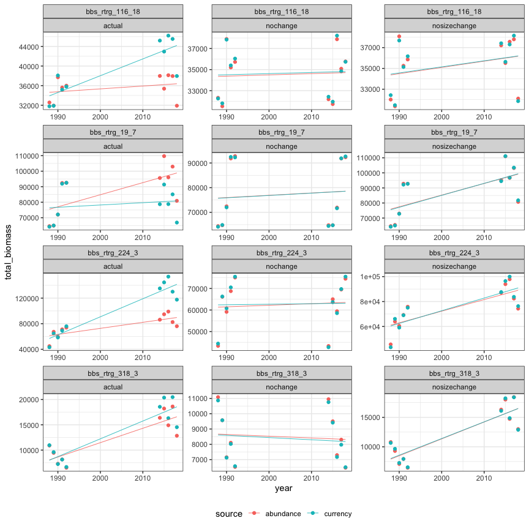

Modeling approach & validation
================
Renata Diaz
2021-10-26

  - [How we get here](#how-we-get-here)
  - [Data](#data)
  - [Models](#models)
      - [Fit models](#fit-models)
      - [Compare models](#compare-models)
      - [Select best model](#select-best-model)
  - [Demo scenarios](#demo-scenarios)

# How we get here

See 02\_01\_change\_over\_time\_sims.Rmd for an explanation of how we
generate sims describing energy use/biomass dynamics assuming a) actual
change in the size structure over time or b) no change in the size
structure (such that any change that occurs is driven solely by changes
in abundance).

From there, we would like to know:

  - how much change has occurred due to change in abundance
  - how much change in the currency deviates from the change driven by
    change in abundance (reflecting change in the size structure)

# Data

We use the sims method to get estimates of total energy or total biomass
for each year under the scenarios 1) actual size structure change 2) no
change, achieved by using the size structure for the first 5 years for
the last 5 years as well.

``` r
#dat = granby

#actual_sims <- rwar::make_actual_sims(dat) # this is a wrapper fxns that draws 100 sims

print(rwar::make_actual_sims)
```

This gives us a dataframe with columns:

``` r
#colnames(actual_sims)
```

``` r
#ggplot(actual_sims, aes(year, total_biomass, color = source)) + geom_point() + geom_smooth(method = "lm", se = F)
```

We want to know:

  - the slope for abundance
  - the slope for currency
  - i.e. whether the slope for currency is different from the slope for
    abundance

To fit models, we need to summarize across all the sims, because
including all the individual sims is going to artificially inflate the
model’s confidence.

We also want to remove “raw” because that is just for a gut check.

``` r
#ssims_actual_sims <- rwar::summarize_sims(actual_sims)

print(rwar::summarize_sims)
```

    ## function (sims) 
    ## {
    ##     sims <- sims %>% dplyr::filter(source != "raw") %>% dplyr::group_by(timeperiod, 
    ##         source, year, matssname, simtype) %>% dplyr::summarize(total_energy = mean(total_energy), 
    ##         total_biomass = mean(total_biomass), ndraws = dplyr::n()) %>% 
    ##         dplyr::ungroup()
    ##     return(sims)
    ## }
    ## <bytecode: 0x7fc920bbb2b8>
    ## <environment: namespace:rwar>

``` r
#head(ssims_actual_sims)
```

# Models

We will use bayesian linear models to estimate the slopes for abundance
and currency and the difference between them.

We will compare models of the following forms:

`response ~ timeperiod * source`: Estimates a slope for timeperiod
(“begin” or “end”) and the interaction between source (“abundance” or
“currency”)

`response ~ timeperiod`: Only a timeperiod slope, no difference between
sources

`response ~ 1`: Only an intercept, no change begin or end.

We will use the LOO criterion from `brms::loo`. Because sometimes the
best model according to LOO wins by a very small margin, we will select
the simplest model within 1 standard error of the best model for
interpretation.

## Fit models

``` r
#fits <- rwar::fit_brms(ssims_actual_sims, cores = 4, iter = 2000, thin = 1) # For running at scale, I use 8000 iterations and thin = 4. This ensures that absolutely every model definitely converges, even unsupervised.

print(rwar::fit_brms)
```

    ## function (some_sims, cores = 1, iter = 8000, thin = 2) 
    ## {
    ##     te_brm_full <- brms::brm(total_energy ~ (timeperiod * source), 
    ##         data = some_sims, cores = cores, iter = iter, thin = thin)
    ##     te_brm_nosource <- brms::brm(total_energy ~ (timeperiod), 
    ##         data = some_sims, cores = cores, iter = iter, thin = thin)
    ##     te_brm_notime <- brms::brm(total_energy ~ 1, data = some_sims, 
    ##         cores = cores, iter = iter, thin = thin)
    ##     te_brms = list(te_brm_full = te_brm_full, te_brm_nosource = te_brm_nosource, 
    ##         te_brm_notime = te_brm_notime)
    ##     tb_brm_full <- brms::brm(total_biomass ~ (timeperiod * source), 
    ##         data = some_sims, cores = cores, iter = iter, thin = thin)
    ##     tb_brm_nosource <- brms::brm(total_biomass ~ (timeperiod), 
    ##         data = some_sims, cores = cores, iter = iter, thin = thin)
    ##     tb_brm_notime <- brms::brm(total_biomass ~ 1, data = some_sims, 
    ##         cores = cores, iter = iter, thin = thin)
    ##     tb_brms = list(tb_brm_full = tb_brm_full, tb_brm_nosource = tb_brm_nosource, 
    ##         tb_brm_notime = tb_brm_notime)
    ##     return(list(te_brms = te_brms, tb_brms = tb_brms, matssname = some_sims$matssname[1], 
    ##         simtype = some_sims$simtype[1]))
    ## }
    ## <bytecode: 0x7fc91f5bd980>
    ## <environment: namespace:rwar>

## Compare models

``` r
#fits_compare <- rwar::compare_both_brms(fits)

print(rwar::compare_both_brms)
```

    ## function (some_brms_fits) 
    ## {
    ##     biomass <- compare_brms(some_brms_fits$tb_brms)
    ##     energy <- compare_brms(some_brms_fits$te_brms)
    ##     both_comparisons <- dplyr::bind_rows(biomass = biomass, energy = energy, 
    ##         .id = "currency") %>% dplyr::mutate(matssname = some_brms_fits$matssname, 
    ##         simtype = some_brms_fits$simtype[1])
    ##     return(both_comparisons)
    ## }
    ## <bytecode: 0x7fc91f7b8438>
    ## <environment: namespace:rwar>

``` r
print(rwar::compare_brms)
```

    ## function (brms_fits) 
    ## {
    ##     brms_fits <- lapply(brms_fits, brms::add_criterion, criterion = "loo")
    ##     brms_comparison <- brms::loo_compare(brms_fits[[1]], brms_fits[[2]], 
    ##         brms_fits[[3]], model_names = names(brms_fits)) %>% as.data.frame() %>% 
    ##         dplyr::mutate(model = row.names(.), rank = dplyr::row_number())
    ##     return(brms_comparison)
    ## }
    ## <bytecode: 0x7fc921015970>
    ## <environment: namespace:rwar>

## Select best model

``` r
#fits_winners <- rwar::loo_select(fits_compare)

print(rwar::loo_select)
```

    ## function (some_compares) 
    ## {
    ##     winners <- some_compares %>% dplyr::mutate(model_complexity = ifelse(grepl("full", 
    ##         model), 3, ifelse(grepl("source", model), 2, 1))) %>% 
    ##         dplyr::arrange(matssname, currency, simtype, rank) %>% 
    ##         dplyr::mutate(in_one_se = (elpd_diff + se_diff) >= 0) %>% 
    ##         dplyr::filter(in_one_se) %>% dplyr::group_by(currency) %>% 
    ##         dplyr::arrange(model_complexity) %>% dplyr::mutate(model_rank = dplyr::row_number()) %>% 
    ##         dplyr::ungroup() %>% dplyr::filter(model_rank == 1)
    ##     return(winners)
    ## }
    ## <bytecode: 0x7fc920eb8b38>
    ## <environment: namespace:rwar>

``` r
#print(fits_winners)
```

# Demo scenarios

I ran this pipeline on 4 datasets demonstrating different types of
dynamics, and compared the “actual” dynamics to additional sims
illustrating different “real” effects.

``` r
library(drake)

## Set up the cache and config
db <- DBI::dbConnect(RSQLite::SQLite(), here::here("aspirational_structure", "drake_caches", "sim_means-cache.sqlite"))
cache <- storr::storr_dbi("datatable", "keystable", db)
cache$del(key = "lock", namespace = "session")

#cached(cache = cache)
loadd(all_sims, cache=cache)
```

``` r
ggplot(all_sims, aes(year, total_biomass, color = source)) + geom_point() + geom_smooth(method = "lm", se = F, size = .3) + facet_wrap(vars(matssname, simtype), scales = "free", ncol = 3) + theme(legend.position = "bottom")
```

    ## `geom_smooth()` using formula 'y ~ x'

<!-- -->

The “sims” correspond to: no change in abunance or size strucutre (no
change), no change in size structure (nosizechange). While we expect to
get decoupling of currency and size structure in some actual dynamics,
we do not expected it in these sims. We have weaker expectations about
the slopes of the actual dynamics. Note that the lines are lm smooths
without se and not suitable for inference.

Here are the model winners for the different sims:

224 and 116 both have deviations; 19\_7 selects no change; 318\_3
selects a slope but not a deviation. None of the sims select
overly-complex models. Note that usually but not often we’re invoking
the one se rule (if `rank` isn’t 1 it means we selected a lower-ranked
model because it was simpler and within 1 se.)

``` r
loadd(all_winners, cache = cache)

all_winners %>%
  dplyr::filter(currency == "biomass")
```

<div class="kable-table">

| currency | elpd\_diff | se\_diff |  elpd\_loo | se\_elpd\_loo |   p\_loo | se\_p\_loo |    looic | se\_looic | model             | rank | matssname          | simtype      | model\_complexity | in\_one\_se | model\_rank |
| :------- | ---------: | -------: | ---------: | ------------: | -------: | ---------: | -------: | --------: | :---------------- | ---: | :----------------- | :----------- | ----------------: | :---------- | ----------: |
| biomass  |   0.000000 | 0.000000 | \-219.3430 |      2.423652 | 4.174407 |  0.8516659 | 438.6859 |  4.847305 | tb\_brm\_full     |    1 | bbs\_rtrg\_224\_3  | actual       |                 3 | TRUE        |           1 |
| biomass  |   0.000000 | 0.000000 | \-183.9161 |      2.546575 | 2.507615 |  0.6774047 | 367.8322 |  5.093149 | tb\_brm\_nosource |    1 | bbs\_rtrg\_318\_3  | actual       |                 2 | TRUE        |           1 |
| biomass  | \-1.079884 | 2.663137 | \-220.5885 |      2.189681 | 1.349278 |  0.3320061 | 441.1770 |  4.379363 | tb\_brm\_notime   |    3 | bbs\_rtrg\_19\_7   | actual       |                 1 | TRUE        |           1 |
| biomass  |   0.000000 | 0.000000 | \-190.4156 |      2.926116 | 4.407546 |  1.1785935 | 380.8313 |  5.852233 | tb\_brm\_full     |    1 | bbs\_rtrg\_116\_18 | actual       |                 3 | TRUE        |           1 |
| biomass  |   0.000000 | 0.000000 | \-216.1209 |      2.873409 | 1.583566 |  0.4127523 | 432.2419 |  5.746818 | tb\_brm\_notime   |    1 | bbs\_rtrg\_224\_3  | nochange     |                 1 | TRUE        |           1 |
| biomass  |   0.000000 | 0.000000 | \-177.5924 |      1.988801 | 1.313994 |  0.2422724 | 355.1848 |  3.977602 | tb\_brm\_notime   |    1 | bbs\_rtrg\_318\_3  | nochange     |                 1 | TRUE        |           1 |
| biomass  |   0.000000 | 0.000000 | \-218.8163 |      1.159824 | 1.044751 |  0.0892532 | 437.6326 |  2.319648 | tb\_brm\_notime   |    1 | bbs\_rtrg\_19\_7   | nochange     |                 1 | TRUE        |           1 |
| biomass  |   0.000000 | 0.000000 | \-184.9670 |      1.749679 | 1.240925 |  0.1786325 | 369.9341 |  3.499358 | tb\_brm\_notime   |    1 | bbs\_rtrg\_116\_18 | nochange     |                 1 | TRUE        |           1 |
| biomass  |   0.000000 | 0.000000 | \-214.7897 |      2.633548 | 2.540448 |  0.6567393 | 429.5793 |  5.267096 | tb\_brm\_nosource |    1 | bbs\_rtrg\_224\_3  | nosizechange |                 2 | TRUE        |           1 |
| biomass  |   0.000000 | 0.000000 | \-181.4328 |      1.991896 | 2.249785 |  0.4265028 | 362.8656 |  3.983792 | tb\_brm\_nosource |    1 | bbs\_rtrg\_318\_3  | nosizechange |                 2 | TRUE        |           1 |
| biomass  |   0.000000 | 0.000000 | \-217.9369 |      1.709044 | 2.183418 |  0.2924381 | 435.8737 |  3.418089 | tb\_brm\_nosource |    1 | bbs\_rtrg\_19\_7   | nosizechange |                 2 | TRUE        |           1 |
| biomass  |   0.000000 | 0.000000 | \-185.9821 |      1.921319 | 1.289146 |  0.2131781 | 371.9643 |  3.842638 | tb\_brm\_notime   |    1 | bbs\_rtrg\_116\_18 | nosizechange |                 1 | TRUE        |           1 |

</div>
