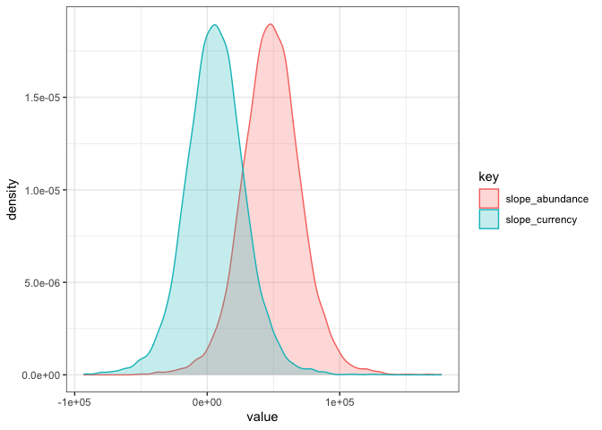
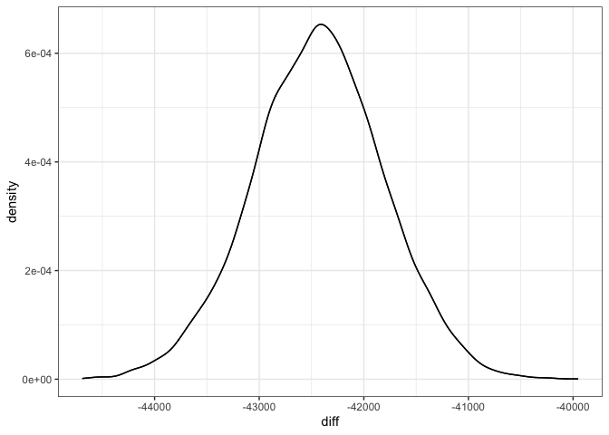

Exploring on some examples
================

  - [19\_7](#19_7)
      - [“actual” dyanmics](#actual-dyanmics)
      - [Models](#models)
          - [Diagnostics](#diagnostics)

# 19\_7

## “actual” dyanmics

<!-- -->

## Models

### Diagnostics

    ##  Family: gaussian 
    ##   Links: mu = identity; sigma = identity 
    ## Formula: total_energy ~ (timeperiod * source) + (1 | year) 
    ##    Data: justsims (Number of observations: 2000) 
    ##   Draws: 4 chains, each with iter = 4000; warmup = 2000; thin = 2;
    ##          total post-warmup draws = 4000
    ## 
    ## Group-Level Effects: 
    ## ~year (Number of levels: 10) 
    ##               Estimate Est.Error l-95% CI u-95% CI Rhat Bulk_ESS Tail_ESS
    ## sd(Intercept) 33618.89   9201.14 20675.74 56128.97 1.00     3633     4885
    ## 
    ## Population-Level Effects: 
    ##                               Estimate Est.Error  l-95% CI  u-95% CI Rhat
    ## Intercept                    190249.93  15320.85 160282.69 220547.19 1.00
    ## timeperiodend                 48553.61  22542.68   3936.02  93802.25 1.00
    ## sourcecurrency                 -428.45    438.42  -1277.33    417.27 1.00
    ## timeperiodend:sourcecurrency -42435.41    628.51 -43688.97 -41197.83 1.00
    ##                              Bulk_ESS Tail_ESS
    ## Intercept                        4189     5032
    ## timeperiodend                    3561     4433
    ## sourcecurrency                   6845     6216
    ## timeperiodend:sourcecurrency     6945     6350
    ## 
    ## Family Specific Parameters: 
    ##       Estimate Est.Error l-95% CI u-95% CI Rhat Bulk_ESS Tail_ESS
    ## sigma  6877.10    107.53  6669.25  7092.21 1.00     7334     6080
    ## 
    ## Draws were sampled using sampling(NUTS). For each parameter, Bulk_ESS
    ## and Tail_ESS are effective sample size measures, and Rhat is the potential
    ## scale reduction factor on split chains (at convergence, Rhat = 1).

    ##  Family: gaussian 
    ##   Links: mu = identity; sigma = identity 
    ## Formula: total_biomass ~ (timeperiod * source) + (1 | year) 
    ##    Data: justsims (Number of observations: 2000) 
    ##   Draws: 4 chains, each with iter = 4000; warmup = 2000; thin = 2;
    ##          total post-warmup draws = 4000
    ## 
    ## Group-Level Effects: 
    ## ~year (Number of levels: 10) 
    ##               Estimate Est.Error l-95% CI u-95% CI Rhat Bulk_ESS Tail_ESS
    ## sd(Intercept) 13780.27   3786.78  8429.60 23003.85 1.00     3664     5128
    ## 
    ## Population-Level Effects: 
    ##                               Estimate Est.Error  l-95% CI  u-95% CI Rhat
    ## Intercept                     77607.18   6351.68  64956.97  90549.65 1.00
    ## timeperiodend                 19714.98   9110.26   1293.20  37573.26 1.00
    ## sourcecurrency                 -315.49    293.09   -887.19    252.63 1.00
    ## timeperiodend:sourcecurrency -16939.81    415.10 -17748.79 -16129.10 1.00
    ##                              Bulk_ESS Tail_ESS
    ## Intercept                        4441     5237
    ## timeperiodend                    3913     4295
    ## sourcecurrency                   7115     6338
    ## timeperiodend:sourcecurrency     7020     6363
    ## 
    ## Family Specific Parameters: 
    ##       Estimate Est.Error l-95% CI u-95% CI Rhat Bulk_ESS Tail_ESS
    ## sigma  4680.96     73.89  4538.05  4827.64 1.00     7404     6145
    ## 
    ## Draws were sampled using sampling(NUTS). For each parameter, Bulk_ESS
    ## and Tail_ESS are effective sample size measures, and Rhat is the potential
    ## scale reduction factor on split chains (at convergence, Rhat = 1).

<!-- -->

    ## [1] 1

<!-- -->

    ## [1] "Completed OK"
