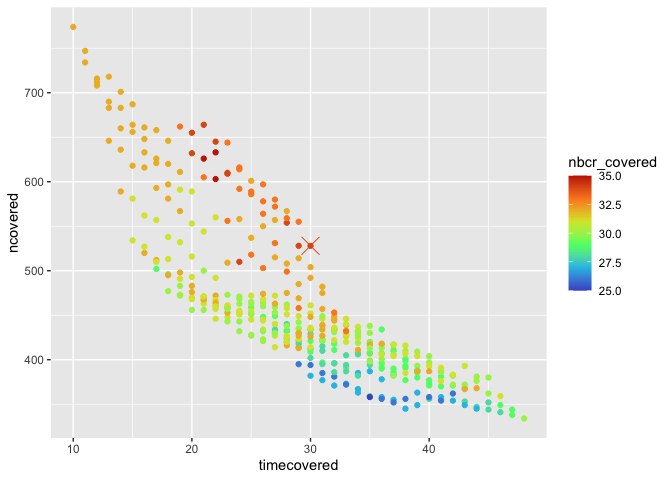

Selecting routes
================

``` r
#' RMD rerunning and commenting 10/19/21

library(drake)
library(dplyr)
## Set up the cache and config
db <- DBI::dbConnect(RSQLite::SQLite(), here::here("aspirational_structure", "drake_caches", "year_coverage_cache.sqlite"))
cache <- storr::storr_dbi("datatable", "keystable", db)
cache$del(key = "lock", namespace = "session")
loadd(year_coverage, cache = cache)

DBI::dbDisconnect(db)
rm(cache)

# We will try all possible start years from 1970 to 1990, and all possible end years from 2000 to 2020
startyears <- c(1970:1990)

endyears <- c(2000:2020) # not sure why I put 2020 here since my data stop in 2018

consec_starts <- list()

# Define how many years to have in your "begin" and "end" samples and from how wide a window.
# Playing with these lets you explore if you are willing to have 5 of 7 years in a window, etc.
# Here asking for a 5 year window with all 5 years represented.
window = 4 # Set window to 1-nyears you want
nreq = 5

# iterating over all possible combinations of begin and end years
for(i in 1:length(startyears)) {

  for(j in 1:length(endyears)) {

    # for this combination of start and end points, these are the years in the window.
    # so if we start in 1970 with a window of 4, the "begin" years are going to be 1970, 71, 72, 73, 74.
    startcover <- startyears[i]:(startyears[i] + window)
    endcover <- endyears[j]:(endyears[j] - window)

    # tally, for each route, how many of the start and end years are represented
    startcoverage <-  filter(year_coverage, year %in% startcover) %>%
      dplyr::group_by(route, region, location.bcr, location.statenum, location.routename) %>%
      dplyr::summarize(nyears_start = length(unique(year))) %>%
      dplyr::ungroup()

    endcoverage <- filter(year_coverage, year %in% endcover) %>%
      dplyr::group_by(route, region, location.bcr, location.statenum, location.routename) %>%
      dplyr::summarize(nyears_end = length(unique(year))) %>%
      dplyr::ungroup()

    fullcoverage <- left_join(startcoverage, endcoverage) %>%
      dplyr::group_by_all() %>%
      dplyr::mutate(nyears_start = ifelse(is.na(nyears_start), 0, nyears_start),
                    nyears_end = ifelse(is.na(nyears_end), 0, nyears_end)) %>% # this to get around, if a route has NO years accounted for in a window, startcoverage or endcoverage will be a 0-row df
      dplyr::mutate(complete_coverage = nyears_start >= nreq && nyears_end >= nreq) %>% # these are routes for which all nreq years are represented
      dplyr::ungroup()

    fullcoverage_true <- dplyr::filter(fullcoverage, complete_coverage)

    consec_starts[[length(consec_starts) + 1]] <- (data.frame(
      startyear = startyears[i],
      endyear = endyears[j],
      ncovered = sum(fullcoverage$complete_coverage, na.rm = T), # how many routes have complete coverage for this combination of start and end year and window and nreq?
      nbcr_covered = length(unique(fullcoverage_true$location.bcr)), # how many bcrs are represented for this combination?
      window = window,
      nreq = nreq,
      timecovered = endyears[j] - startyears[i]
    ))
  }

}

starts2 <- bind_rows(consec_starts)


library(ggplot2)

ggplot(filter(starts2, ncovered >0 ), aes(timecovered, ncovered, color = nbcr_covered)) +
  geom_point() +
  scale_color_viridis_c(option = "turbo", begin = .1, end = .9) +
  geom_point(data = filter(starts2, startyear ==1988, endyear == 2018), shape = 4, size = 6)
```

<!-- -->

``` r
# Work with 1988-2018 (marked with the X above). This appears to maximize time x nbcr x nroutes. This gives 528 sites with complete coverage. You could get a few more routes (up to around 650) if you went down to about 20 years, but that's a much shorter window - 10 years vs 20 years between "start" and "end" chunks.
# My data end in 2018.


# Get the list of routes that have complete coverage for 5 year windows beginning in 1988 and ending in 2018.
startyear = 1988
endyear = 2018
window = 4
nreq = 5

startcover <- startyear:(startyear + window)
endcover <- endyear:(endyear - window)

startcoverage <-  filter(year_coverage, year %in% startcover) %>%
  dplyr::group_by(route, region, location.bcr, location.statenum, location.routename) %>%
  dplyr::summarize(nyears_start = length(unique(year))) %>%
  dplyr::ungroup()

endcoverage <- filter(year_coverage, year %in% endcover) %>%
  dplyr::group_by(route, region, location.bcr, location.statenum, location.routename) %>%
  dplyr::summarize(nyears_end = length(unique(year))) %>%
  dplyr::ungroup()

fullcoverage <- left_join(startcoverage, endcoverage) %>%
  dplyr::group_by_all() %>%
  dplyr::mutate(nyears_start = ifelse(is.na(nyears_start), 0, nyears_start),
                nyears_end = ifelse(is.na(nyears_end), 0, nyears_end)) %>%
  dplyr::mutate(complete_coverage = nyears_start >= nreq && nyears_end >= nreq) %>%
  dplyr::ungroup()

fullcoverage_true <- filter(fullcoverage, complete_coverage) %>%
  mutate(matssname = paste0("bbs_rtrg_", route, "_", region),
         window = window,
         nreq = nreq)
```

``` r
# Save it
write.csv(fullcoverage_true, here::here("aspirational_structure", "supporting_data", "working_routes.csv"), row.names = F)
```

``` r
# Now subsample so each BCR has a maximum of 10 routes represented.

set.seed(1989) # was listening to a lot of TS this year

bcrs <- fullcoverage_true %>%
  group_by(location.bcr) %>%
  summarize(nroutes = dplyr::n()) %>%
  ungroup()

chosen_sites <- list()

# For each BCR present, if it has more than 10 sites, randomly draw 10 to use.
for(i in 1:nrow(bcrs)) {

  these_sites <- filter(fullcoverage_true, location.bcr == bcrs$location.bcr[i])

  if(bcrs$nroutes[i] > 10) {

    sites_to_use <- sample(unique(these_sites$matssname), size = 10, replace = F)

    use_sites <- filter(these_sites, matssname %in% sites_to_use)

  } else {

    use_sites <- these_sites

  }

  chosen_sites[[i]] <- use_sites

}

chosen_sites <- dplyr::bind_rows(chosen_sites)
```

``` r
# Save it.
write.csv(chosen_sites,  here::here("aspirational_structure", "supporting_data", "working_routes_max10.csv"), row.names = F)
```
