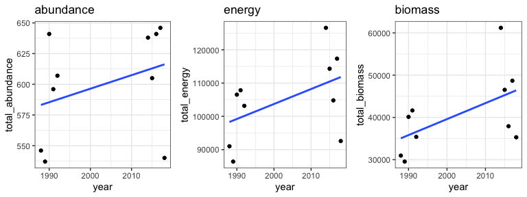

Change over time in different currencies - SIMS
================

  - [One route](#one-route)
      - [Pull and examine raw data](#pull-and-examine-raw-data)
      - [Test for size-structure-driven
        decoupling](#test-for-size-structure-driven-decoupling)
          - [Construct sampling gmms](#construct-sampling-gmms)
          - [Draw communities](#draw-communities)
          - [Get template ISD dataframes](#get-template-isd-dataframes)
          - [Draw individuals corresponding to “sim” (no size change)
            and actual
            dynamics](#draw-individuals-corresponding-to-sim-no-size-change-and-actual-dynamics)
          - [Compute time-period level state
            variables](#compute-time-period-level-state-variables)
          - [Pull multiple sims](#pull-multiple-sims)

# One route

We will work with the BBS route for Granby, CT to demonstrate the
workflow that gets applied to all the routes. (Just RMD’s usual guinea
pig route).

## Pull and examine raw data

``` r
dat <- granby

dat_isd <- just_isd(granby, isd_seed = 1989)

dat_to_plot <- dat_isd %>%
  mutate(energy = estimate_b(mass)) %>%
  filter(year %in% c(1988:1992, 2014:2018)) %>%
  group_by_all() %>%
  mutate(timeperiod = ifelse(year > 2000, "end", "begin")) %>%
  ungroup() %>%
  group_by(year) %>%
  summarize(
    total_abundance = dplyr::n(),
    total_energy = sum(energy),
    total_biomass = sum(mass)
  ) %>%
  ungroup() 
gridExtra::grid.arrange(grobs = list(ggplot(dat_to_plot, aes(year, total_abundance)) + geom_point() + ggtitle("abundance") + geom_smooth(method = "lm", se = F),
ggplot(dat_to_plot, aes(year, total_energy)) + geom_point() + ggtitle("energy")+ geom_smooth(method = "lm", se = F),
ggplot(dat_to_plot, aes(year, total_biomass)) + geom_point() + ggtitle("biomass")+ geom_smooth(method = "lm", se = F)), ncol = 3)
```

<!-- -->

Granby looks like not an appreciable change in abundance, but
potentially an increase in energy and more probably biomass.

## Test for size-structure-driven decoupling

We want to test whether the changes in energy and biomass exceed what we
would expect to see if there had been **no change** in the size
structure from the begin to the end period.

### Construct sampling gmms

“Sampling GMMS” are density functions from Gaussian mixture models that
have a probability density for every mass along the spectrum of possible
masses (and then a large buffer). Drawing from `$mass` with probability
`$density` is a random number generator for sizes.

``` r
sampling_gmms <- rwar::construct_sampling_gmm(dat, n_isd_draws = 2)
```

``` r
ggplot(sampling_gmms$begin, aes(mass, density)) + geom_line() + geom_line(data = sampling_gmms$end, color = "green") + ggtitle("Sampling GMMs", subtitle = "Black = begin, green = end") + xlab("Mass (log)")
```

<!-- -->

### Draw communities

`draw_communities(ts_comp, begin_years = 1988:1992, end_years
= 2014:2018, draw_seed = 1989, sampling_gmms = sampling_gmms)`

``` r
ts_comp = dat
begin_years = 1988:1992
end_years = 2014:2018
draw_seed = 1989
sampling_gmms = sampling_gmms
```

### Get template ISD dataframes

``` r
  # Here I am sampling ISDs to get dfs of the correct shape to then sample new body masses from different density fxns.

  raw_isd <- BBSsize::simulate_isd_ts(ts_comp, isd_seed = 1989)$isd

  begin_isd <- dplyr::filter(raw_isd, year %in% begin_years) %>%
    dplyr::mutate(timeperiod = "begin")
  end_isd <- dplyr::filter(raw_isd, year %in% end_years) %>%
    dplyr::mutate(timeperiod = "end")
```

### Draw individuals corresponding to “sim” (no size change) and actual dynamics

``` r
  # Draw individuals for each time period from the MATCHING density functions
  # This will destroy interannual, intratimeperiod variation in the size structure, which we're OK with (the point of using 5-year intervals is to smooth out species accumulation)

  # We want 4 different seeds for the different sims.
  four_seeds = c(draw_seed, draw_seed + 50000,
                 draw_seed + 100000, draw_seed + 150000) # this is just to ensure that the seed used for the second draw of begin_individuals is different from the seed used for the first draw, and you don't get weird recycling of seeds across repeated sims.


  begin_individuals <- add_drawn_individuals(begin_isd, sampling_gmms$begin, draw_seed = four_seeds[1])

  end_individuals <- add_drawn_individuals(end_isd, sampling_gmms$end, draw_seed = four_seeds[2])

  actual_individuals <- dplyr::bind_rows(begin_individuals, end_individuals) %>%
    dplyr::mutate(source = "currency",
                  isd_seed = NA) #has a column for ISD seed but because the mass values have been overwritten it's no longer informative


  # Now draw individuals for each time period with scrambled ISDs. Specifically, draw for the beginning from the beginning ISD. But then also draw the end from the beginning ISD. This gives an "end" ISD pretending that the ISD didn't change from the beginning.
  begin_individuals_sim <- add_drawn_individuals(begin_isd, sampling_gmms$begin, draw_seed = four_seeds[3])

  end_individuals_sim <- add_drawn_individuals(end_isd, sampling_gmms$begin, draw_seed = four_seeds[4])


  sim_individuals <- dplyr::bind_rows(begin_individuals_sim, end_individuals_sim) %>%
    dplyr::mutate(source = "abundance",
                  isd_seed = NA)

  all_individuals <- dplyr::bind_rows(actual_individuals, sim_individuals)
```

### Compute time-period level state variables

``` r
  # Summarize individuals to get toal abundance, biomass, and energy use per year for each sim scenario.
  # And add route-level identifying info.
  all_svs <- all_individuals %>%
    dplyr::group_by(year, timeperiod, isd_timeperiod, sampling_seed, isd_seed, source) %>%
    dplyr::summarize(total_abundance = dplyr::n(),
                     total_biomass = sum(mass),
                     total_energy = sum(energy)) %>%
    dplyr::ungroup() %>%
    dplyr::bind_cols(as.data.frame(ts_comp$metadata$location)) %>%
    dplyr::mutate(matssname = paste0("bbs_rtrg_", route, "_", statenum))
```

``` r
gridExtra::grid.arrange(grobs = list(ggplot(all_svs, aes(year, total_abundance, color = source)) + geom_point() + geom_smooth(method = "lm", se= F) + ggtitle("abundance") + theme(legend.position = "bottom"),

ggplot(all_svs, aes(year, total_energy, color = source)) + geom_point() + geom_smooth(method = "lm", se= F) + ggtitle("energy") + theme(legend.position = "bottom"),

ggplot(all_svs, aes(year, total_biomass, color = source)) + geom_point() + geom_smooth(method = "lm", se= F) + ggtitle("biomass") + theme(legend.position = "bottom")), ncol = 3)
```

<!-- -->

Some interpretation on these plots.

  - The lines are just lm smooths to help visualize the different
    groupings, not for strong inference particularly.
  - Note that the currencies are on different scales so the way the
    slopes appear to compare **between** plots is not informative.
  - We expect all of the abundance values to be the same because changes
    in total abundance are kept consistent through out all sims.
  - What we are actually interested in for understanding decoupling is
    the deviation between “currency” - blue lines - and “abundance” -
    red lines - within plots for energy and biomass.
  - The “abundance” shows the change in biomass/energy use that occurs
    if the size structure remains the same from beginning to end,
    i.e. only driven by the change in individual abundance between the
    two time periods.
  - The “currency” shows the change incorporating observed change in the
    size structure.
  - For this route, increases in energy and biomass both deviate upwards
    from what would be expected just due to changes in abundance.

We can pull multiple sims using `draw_communities_wrapper`.

### Pull multiple sims

``` r
multi_svs <- draw_communities_wrapper(granby, ndraws = 10, sampling_gmms = sampling_gmms) %>%
  mutate(group_to_plot = paste0(sim_iteration, source))
```

``` r
gridExtra::grid.arrange(grobs = list(ggplot(multi_svs, aes(year, total_abundance, color = source, group = as.factor(group_to_plot))) + geom_point() + geom_smooth(method = "lm", se= F, size = .5) + ggtitle("abundance") + theme(legend.position = "bottom"),
  ggplot(multi_svs, aes(year, total_energy, color = source, group = as.factor(group_to_plot))) + geom_point() + geom_smooth(method = "lm", se= F, size = .5) + ggtitle("energy") + theme(legend.position = "bottom"),
                                     ggplot(multi_svs, aes(year, total_biomass, color = source, group = as.factor(group_to_plot))) + geom_point() + geom_smooth(method = "lm", se= F, size = .5) + ggtitle("biomass") + theme(legend.position = "bottom")), ncol = 3)
```

<!-- -->

From here we can see that there is some heterogeneity in the slopes
derived simply from repeating sims.
