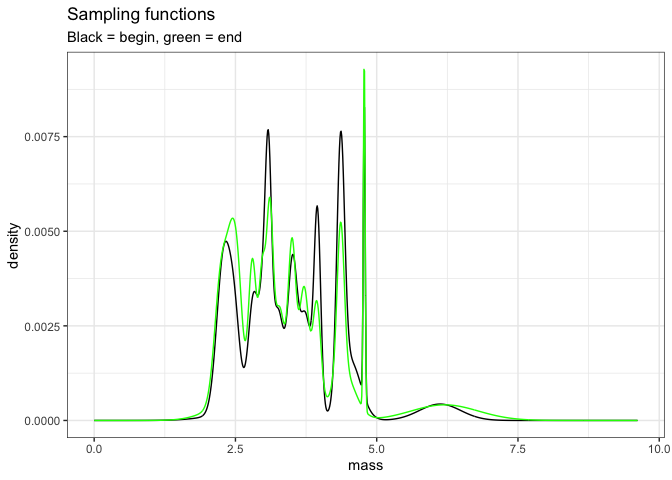

Change over time in different currencies
================

  - [One route](#one-route)
      - [Pull and examine raw data](#pull-and-examine-raw-data)
      - [Test for size-structure-driven
        decoupling](#test-for-size-structure-driven-decoupling)
          - [Generate density functions to sample
            from](#generate-density-functions-to-sample-from)

# One route

We will work with the BBS route for Granby, CT to demonstrate the
workflow that gets applied to all the routes. (Just RMD’s usual guinea
pig route).

## Pull and examine raw data

``` r
dat <- granby

dat_isd <- just_isd(granby)

dat_to_plot <- dat_isd %>%
  mutate(energy = estimate_b(mass)) %>%
  filter(year %in% c(1988:1992, 2014:2018)) %>%
  group_by_all() %>%
  mutate(timeperiod = ifelse(year > 2000, "end", "begin")) %>%
  ungroup() %>%
  group_by(year) %>%
  summarize(
    total_abundance = dplyr::n(),
    total_energy = sum(energy),
    total_biomass = sum(mass)
  ) %>%
  ungroup()

gridExtra::grid.arrange(grobs = list(ggplot(dat_to_plot, aes(year, total_abundance)) + geom_point() + ggtitle("abundance"),
ggplot(dat_to_plot, aes(year, total_energy)) + geom_point() + ggtitle("energy"),
ggplot(dat_to_plot, aes(year, total_biomass)) + geom_point() + ggtitle("biomass")), ncol = 3)
```

<!-- -->

Granby looks like not an appreciable change in abundance, but
potentially an increase in energy and more probably biomass.

## Test for size-structure-driven decoupling

We want to test whether the changes in energy and biomass exceed what we
would expect to see if there had been **no change** in the size
structure from the begin to the end period.

### Generate density functions to sample from

``` r
sampling_gmms <- construct_sampling_gmm(dat)

ggplot(sampling_gmms$begin, aes(mass, density)) + geom_line() + geom_line(data = sampling_gmms$end, color = "green") + ggtitle("Sampling functions", subtitle = "Black = begin, green = end")
```

<!-- -->
