Change over time in different currencies
================

  - [One route](#one-route)
      - [Pull and examine raw data](#pull-and-examine-raw-data)
      - [Test for size-structure-driven
        decoupling](#test-for-size-structure-driven-decoupling)
          - [Arguments and explanation](#arguments-and-explanation)
          - [Construct sampling gmms](#construct-sampling-gmms)
          - [Get template ISD dataframes](#get-template-isd-dataframes)
          - [Draw individuals corresponding to “sim” (no size change)
            and actual
            dynamics](#draw-individuals-corresponding-to-sim-no-size-change-and-actual-dynamics)
          - [Combine with “raw”](#combine-with-raw)
          - [Compute time-period level state
            variables](#compute-time-period-level-state-variables)
          - [Pull multiple sims](#pull-multiple-sims)
      - [Quantifying deviations from abundance-driven
        change](#quantifying-deviations-from-abundance-driven-change)
          - [Fit brm](#fit-brm)
          - [Extract parameter estimates](#extract-parameter-estimates)

# One route

We will work with the BBS route for Granby, CT to demonstrate the
workflow that gets applied to all the routes. (Just RMD’s usual guinea
pig route).

## Pull and examine raw data

``` r
dat <- granby

dat_isd <- just_isd(granby)

dat_to_plot <- dat_isd %>%
  mutate(energy = estimate_b(mass)) %>%
  filter(year %in% c(1988:1992, 2014:2018)) %>%
  group_by_all() %>%
  mutate(timeperiod = ifelse(year > 2000, "end", "begin")) %>%
  ungroup() %>%
  group_by(year) %>%
  summarize(
    total_abundance = dplyr::n(),
    total_energy = sum(energy),
    total_biomass = sum(mass)
  ) %>%
  ungroup() 
gridExtra::grid.arrange(grobs = list(ggplot(dat_to_plot, aes(year, total_abundance)) + geom_point() + ggtitle("abundance") + geom_smooth(method = "lm", se = F),
ggplot(dat_to_plot, aes(year, total_energy)) + geom_point() + ggtitle("energy")+ geom_smooth(method = "lm", se = F),
ggplot(dat_to_plot, aes(year, total_biomass)) + geom_point() + ggtitle("biomass")+ geom_smooth(method = "lm", se = F)), ncol = 3)
```

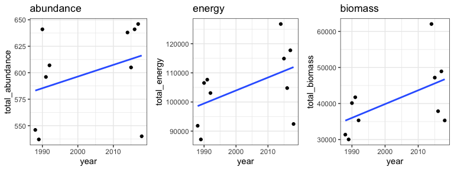<!-- -->

Granby looks like not an appreciable change in abundance, but
potentially an increase in energy and more probably biomass.

## Test for size-structure-driven decoupling

We want to test whether the changes in energy and biomass exceed what we
would expect to see if there had been **no change** in the size
structure from the begin to the end period.

From here on out, code is taken directly from
`View::rwar::draw_communities` and narrated.

### Arguments and explanation

`draw_communities(ts_comp, begin_years = 1988:1992, end_years
= 2014:2018, draw_seed = NULL, sampling_gmms = NULL, initial_isd_seed =
NULL, raw_isd_seed = NULL)`

``` r
ts_comp = dat
begin_years = 1988:1992
end_years = 2014:2018
draw_seed = NULL
sampling_gmms = NULL
inital_isd_seed = NULL
raw_isd_seed = NULL
```

### Construct sampling gmms

“Sampling GMMS” are density functions from Gaussian mixture models that
have a probability density for every mass along the spectrum of possible
masses (and then a large buffer). Drawing from `$mass` with probability
`$density` is a random number generator for sizes.

``` r
  # If GMM density smooths to sample from are not provided, get them
  # When running at scale, you want to provide them: 1) to ensure that all sims are being drawn from the same sampling GMMS, 2) for speed, it takes a long time to fit a GMM to a lot of ISD draws.

  if(is.null(sampling_gmms)) {

    sampling_gmms <- construct_sampling_gmm(ts_comp, begin_years = begin_years, end_years = end_years, initial_isd_seed = NULL)

  }
```

``` r
ggplot(sampling_gmms$begin, aes(mass, density)) + geom_line() + geom_line(data = sampling_gmms$end, color = "green") + ggtitle("Sampling GMMs", subtitle = "Black = begin, green = end") + xlab("Mass (log)")
```

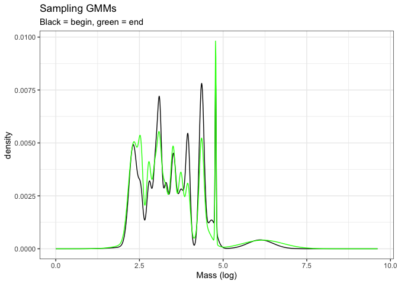<!-- -->

### Get template ISD dataframes

``` r
  # This doesn't actually matter, I am using the raw isds to get the correct shape data frame. I am keeping it this way, even though it's inefficient, because in the back of my mind I think I might want to pull out raw estimates for biomass and energy use (i.e. drawing individuals directly from normal distributions for each year, rather than drawing from the ISD combining over all years). It'll be a tiny change but I'm not 100% sure what I want to do with that info yet so holding off.

  if(is.null(raw_isd_seed)) {
    set.seed(NULL)
    raw_isd_seed <- sample(1:1000000, 1)
  }

  # Here I am sampling ISDs to get dfs of the correct shape to then sample new body masses from different density fxns.

  raw_isd <- BBSsize::simulate_isd_ts(ts_comp, isd_seed = raw_isd_seed)$isd

  begin_isd <- dplyr::filter(raw_isd, year %in% begin_years) %>%
    dplyr::mutate(timeperiod = "begin")
  end_isd <- dplyr::filter(raw_isd, year %in% end_years) %>%
    dplyr::mutate(timeperiod = "end")
```

### Draw individuals corresponding to “sim” (no size change) and actual dynamics

``` r
  # Draw individuals for each time period from the MATCHING density functions
  # This will destroy interannual, intratimeperiod variation in the size structure, which we're OK with (the point of using 5-year intervals is to smooth out species accumulation)
  # I do not think it is a good idea to provide draw_seed, that will constrain things to come out the same in weird ways at this scale.
  begin_individuals <- add_drawn_individuals(begin_isd, sampling_gmms$begin, draw_seed = draw_seed)

  end_individuals <- add_drawn_individuals(end_isd, sampling_gmms$end, draw_seed = draw_seed)

  actual_individuals <- dplyr::bind_rows(begin_individuals, end_individuals) %>%
    dplyr::mutate(source = "actual")


  # Now draw individuals for each time period with scrambled ISDs. Specifically, draw for the beginning from the beginning ISD. But then also draw the end from the beginning ISD. This gives an "end" ISD pretending that the ISD didn't change from the beginning.
  begin_individuals_sim <- add_drawn_individuals(begin_isd, sampling_gmms$begin, draw_seed = draw_seed)

  end_individuals_sim <- add_drawn_individuals(end_isd, sampling_gmms$begin, draw_seed = draw_seed)


  sim_individuals <- dplyr::bind_rows(begin_individuals_sim, end_individuals_sim) %>%
    dplyr::mutate(source = "sim")
```

### Combine with “raw”

The “raw” ISDs have not been in-and-out of the GMM smooth and then
resampling. The resampling is necessary to make the nullmodel/sims here
possible, but it masks intraannual variability in the size spectrum and
it can downweight (very slightly) the density of large individuals.

``` r
  # Go ahead and pull the raw state variable estimates too..

  raw_individuals <- dplyr::bind_rows(begin_isd, end_isd) %>%
    dplyr::mutate(energy = BBSsize::estimate_b(mass),
                  source = "raw",
                  isd_timeperiod = "raw",
                  sampling_seed = NA)

  all_individuals <- dplyr::bind_rows(actual_individuals, sim_individuals, raw_individuals)
```

### Compute time-period level state variables

``` r
  # Summarize individuals to get toal abundance, biomass, and energy use per year for each sim scenario.
  # And add route-level identifying info.
  all_svs <- all_individuals %>%
    dplyr::group_by(year, timeperiod, isd_timeperiod, sampling_seed, isd_seed, source) %>%
    dplyr::summarize(total_abundance = dplyr::n(),
                     total_biomass = sum(mass),
                     total_energy = sum(energy)) %>%
    dplyr::ungroup() %>%
    dplyr::bind_cols(as.data.frame(ts_comp$metadata$location)) %>%
    dplyr::mutate(matssname = paste0("bbs_rtrg_", route, "_", statenum))
```

``` r
gridExtra::grid.arrange(grobs = list(ggplot(all_svs, aes(year, total_abundance, color = source)) + geom_point() + geom_smooth(method = "lm", se= F) + ggtitle("abundance") + theme(legend.position = "bottom"),

ggplot(all_svs, aes(year, total_energy, color = source)) + geom_point() + geom_smooth(method = "lm", se= F) + ggtitle("energy") + theme(legend.position = "bottom"),

ggplot(all_svs, aes(year, total_biomass, color = source)) + geom_point() + geom_smooth(method = "lm", se= F) + ggtitle("biomass") + theme(legend.position = "bottom")), ncol = 3)
```

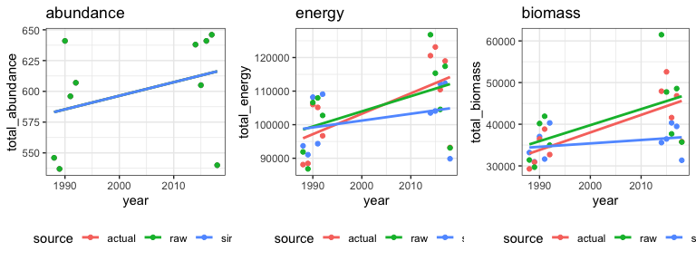<!-- -->

Some interpretation on these plots.

  - The lines are just lm smooths to help visualize the different
    groupings, not for strong inference particularly.
  - Note that the currencies are on different scales so the way the
    slopes appear to compare **between** plots is not informative.
  - We expect all of the abundance values to be the same because changes
    in total abundance are kept consistent through out all sims.
  - What we are actually interested in for understanding decoupling is
    the deviation between “actual” - red lines - and “sim” - blue lines
    - within plots for energy and biomass.
  - The “sim” shows the change in biomass/energy use that occurs if the
    size structure remains the same from beginning to end, i.e. only
    driven by the change in individual abundance between the two time
    periods.
  - The “actual” shows the change incorporating observed change in the
    size structure.
  - I include “raw” in these plots to illustrate the small bits of
    difference that come in between resampling from a GMM vs sampling
    the ISD directly.
  - For this route, increases in energy and biomass both deviate upwards
    from what would be expected just due to changes in abundance.

Note that these are one sim, and, because I haven’t fixed any of the
seeds in this document, it’s going to come out slightly differently each
time. There are sampling effects on the outcomes here.

We can pull multiple sims using `draw_communities_wrapper`.

### Pull multiple sims

``` r
multi_svs <- draw_communities_wrapper(granby, ndraws = 50, sampling_gmms = sampling_gmms) %>%
  mutate(group_to_plot = paste0(sim_iteration, source))
```

``` r
gridExtra::grid.arrange(grobs = list(ggplot(multi_svs, aes(year, total_abundance, color = source, group = as.factor(group_to_plot))) + geom_point() + geom_smooth(method = "lm", se= F, size = .5) + ggtitle("abundance") + theme(legend.position = "bottom"),
  ggplot(multi_svs, aes(year, total_energy, color = source, group = as.factor(group_to_plot))) + geom_point() + geom_smooth(method = "lm", se= F, size = .5) + ggtitle("energy") + theme(legend.position = "bottom"),
                                     ggplot(multi_svs, aes(year, total_biomass, color = source, group = as.factor(group_to_plot))) + geom_point() + geom_smooth(method = "lm", se= F, size = .5) + ggtitle("biomass") + theme(legend.position = "bottom")), ncol = 3)
```

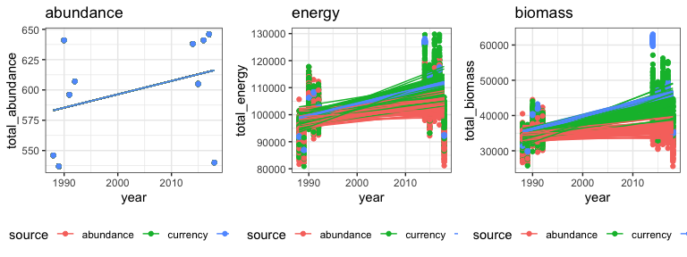<!-- -->

From here we can see that there is some heterogeneity in the slopes
derived simply from repeating sims.

## Quantifying deviations from abundance-driven change

We would like to know:

  - What the slope is for the “sim” - abundance driven change
  - What the slope is for the “actual” - abundance + size structure
    driven change
  - If the slope for “actual” is different from sim
  - If so, by how much

We would like to incorporate:

  - There is variability year to year in total abundance (and therefore
    the other currencies) within each time period
  - There is uncertainty as shown by repeated sims

I am doing this using a brm because it allows me to extract estimates
for the parameters from the posterior and construct continuous CIs
around them (rather than having to use p-values and adjustments in a
frequentist setting).

I am using a brm of the form:

`brm(response ~ timeperiod * source + (1|year), data = one_route_data,
iter = 8000, thin = 2)`

  - timeperiod: this study is looking at things in a begin-end
    comparison. Using year gets you somewhere very similar, because the
    run (as in rise/run) is the same for all routes.
  - time period must interact with source, this is the piece we really
    care about.
  - we expect measurements within years to be \~artificially similar to
    each other because measurements for each year represent the same n
    draws where n in the number of individuals for that year
  - 8000 iterations has been enough to swamp convergence issues
  - thin to keep the resulting posteriors manageable

I am fitting individual brms to each route (as opposed to a massive
model with a group effect of route). I am doing this because it is
hugely computationally intensive to fit a brm to the whole dataset with
the correct model formula (i.e. allowing the slope and intercept to vary
for each source for each route, and incorporate year as a random
factor). It’s not practical to do it for more than a couple of sims per
route. I believe it is more important to have the correct formula and a
lot of sims than to get everything in one model.

### Fit brm

The following is from `fit_brms`:

Arguments:

``` r
some_sims = multi_svs
cores = 4
iter = 4000
thin = 1
```

This section is only for drake pipelines and will hopefully be able to
go once I clean up rwar:

``` r
#fit_brms <- function(some_sims, cores = 1, iter = 8000, thin =2) {

  # something in rwar as I currently have it is locking the namespace and interfering with drake, at least locally. this is not my best work but it gets rwar out of the namespace if it's attached.
  is_rwar_attached = any(grepl("rwar", names(sessionInfo()[7]$otherPkgs)))
  if(is_rwar_attached) {
    detach("package:rwar", unload = T)
  }
```

``` r
  # sims returns estimates of the raw values, which we don't want for the model fit (we jsut want the ones that come from drawing from the densityGMMS)
  justsims <- dplyr::filter(some_sims, source %in% c("actual", "sim")) # remove raw


  # Fit a brm on total_energy
  te_brm <- brms::brm(total_energy ~ (timeperiod * source) + (1 | year), data = justsims, cores = cores, iter = iter, thin = thin)

  # Fit the brm on total_biomass
  tb_brm <- brms::brm(total_biomass ~ (timeperiod * source) + (1 | year), data = justsims, cores = cores, iter = iter, thin = thin)

  # keep track of what dataset this is
  md <- some_sims$matssname[1]

  # return(list(
  #   te_brm = te_brm,
  #   tb_brm = tb_brm,
  #   matssname =md
  # ))
some_brms <- (list(
    te_brm = te_brm,
    tb_brm = tb_brm,
    matssname =md
  ))
  
# }
```

### Extract parameter estimates

To extract the estimates for the parameters, and then calculate
quantities of interest, use `extract_ests` (one one brm) or
`extract_brm_ests` (on a list of 2 brms, one `$te_brm` and one
`$tb_brm`).

The following is from `extract_ests`. `extract_ests` is the workhorse
function called by `extract_brm_ests`.

Arguments:

``` r
a_brm = some_brms$tb_brm
brm_currency = "biomass"
matssname = some_brms$matssname
```

``` r
#extract_ests <- function(a_brm, brm_currency = NULL, matssname = NULL){


  # Get all draws from the posterior and get just the terms we want
  td <- tidybayes::tidy_draws(a_brm) %>%
    #  select_at(vars(starts_with("b"))) %>%
    dplyr::mutate(rowindex = dplyr::row_number()) #%>% # and get a row index to keep draws together, I'm not sure if this matters but I'll do it
  # dplyr::filter(rowindex > max(rowindex) / 2) # remove warmup

  td_ests <- td %>%
    dplyr::rename(timeperiodend_sourcesim = `b_timeperiodend:sourcesim`) %>%
    dplyr::select(rowindex, b_Intercept, b_timeperiodend, b_sourcesim, timeperiodend_sourcesim) %>%
    dplyr::group_by_all() %>%
    dplyr::mutate(
      estimated_actual_begin = sum(b_Intercept), # estimated beginning value
      estimated_actual_end = sum(b_Intercept, b_timeperiodend), # estimated end value
      estimated_sim_begin = sum(b_Intercept, b_sourcesim), # estimated beginning value from sims. we expect this to be equal to the estimated beginning value, any change is just sampling error.
      estimated_sim_end = sum(b_Intercept, b_timeperiodend, timeperiodend_sourcesim, b_sourcesim),
      estimated_actual_change_ratio = (estimated_actual_end - estimated_actual_begin) / estimated_actual_begin, # this is a measure of the magnitude of the change from beginning to end. the sign is going to be increase (positive) or decrease. the magnitude is the % increase. so .1 = added 10% of starting (biomass or energy) to get to the end. -.2 = lost 20% of starting (biomass or energy) between begin and end.
      estimated_sim_change_ratio = (estimated_sim_end - estimated_sim_begin) / estimated_sim_begin, # same measure but having drawn the end values using the beginning isd. this is the amount of change expected due only to changes in the numbers of individuals observed in each time period. by comparing estimated_actual_change_ratio to estimated_sim_change_ratio, I believe we get an estimate of both the significance and magnitude of decoupling of (biomass or energy) and numerical abundance due to changes in the size spectrum.
      estimated_actual_change = estimated_actual_end - estimated_actual_begin, # the "slope" assuming x = 0 or 1 for begin or end. aka the absolute change from end to begin.
      estimated_sim_change = estimated_sim_end - estimated_sim_begin, # absolute change from end to begin due to abundance change
      estimated_change_ratio_deviation = estimated_actual_change_ratio - estimated_sim_change_ratio, # deviation of change ratios from 1:1
      estimated_change_deviation = estimated_actual_change - estimated_sim_change # deviation of actual change from 1:1

    ) %>%
    dplyr::ungroup() %>%
    dplyr::mutate(currency = brm_currency,
                  matssname = matssname)


 # return(td_ests)
#}
```

#### Visualize posterior results

We can examine quantities derived from the posterior.

For all plots, black is the actual (ISD change) value and pink is the
sim (only abundance-driven change) value.

These are just the beginning/end values:

``` r
ggplot(td_ests, aes(estimated_actual_begin)) + geom_density() + geom_density(aes(estimated_sim_begin), color = "pink") +
  ggtitle("Begin value", subtitle = "These should be equal.")
```

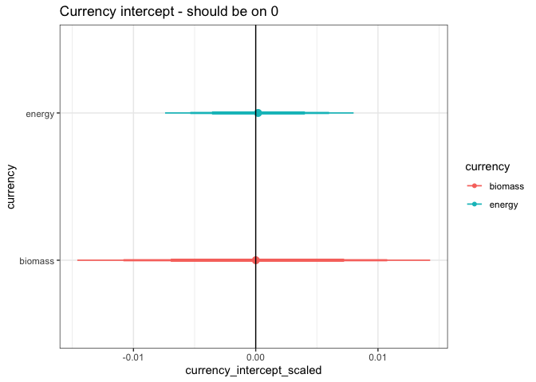<!-- -->

``` r
ggplot(td_ests, aes(estimated_actual_end)) + geom_density() + geom_density(aes(estimated_sim_end), color = "pink") +
  ggtitle("End value", subtitle = "Offset = decoupled")
```

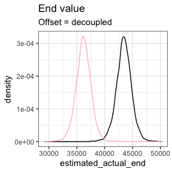<!-- -->

Here is the slope:

``` r
ggplot(td_ests, aes(estimated_actual_change)) + geom_density() + geom_density(aes(estimated_sim_change), color = "pink") +
  ggtitle("Change value", subtitle = "Offset = decoupled")
```

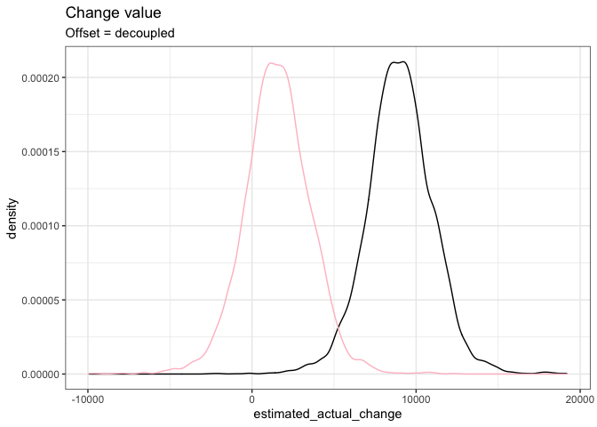<!-- -->

``` r
ggplot(td_ests, aes(estimated_change_deviation)) + geom_density() +
  ggtitle("Difference in change value", subtitle = "Over zero - not decoupled")
```

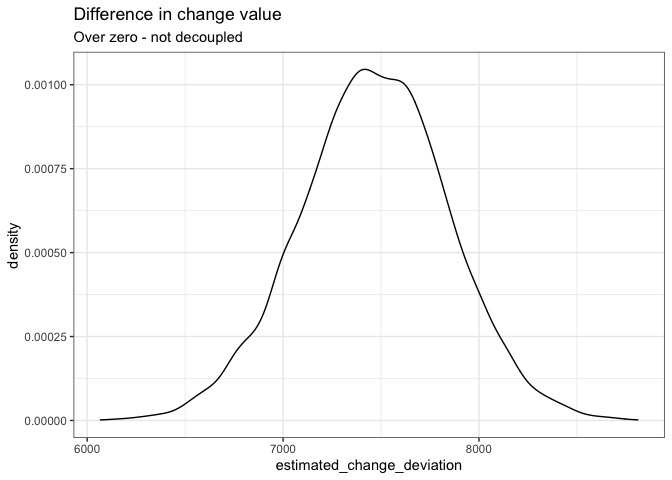<!-- -->

These are the “change ratio” estimates. The change ratio is:

`(end_value - begin_value) / begin_value`.

You can think of it as the slope scaled relative to the beginning value.
It has a relatively intuitive interpretation. .1 means the end value
gained 10% of the begin value. -.1 means the begin value lost 10% of
itself over time. It is comparable across things that started at
different begin values, and I think it’s a pretty good measure of the
magnitude of the slope.

This plot has a lot of information in it:

  - each density curve separately shows the change over time for the
    actual (black) and abundance-only (pink). So if either curve
    overlaps 0, that currency “didn’t change”. If either curve is
    below/above 0, that’s a decrease/increase.
  - if the two curves overlap, the currencies are “not decoupled”, if
    the two curves are distinct, the currencies “are decoupled”

<!-- end list -->

``` r
ggplot(td_ests, aes(estimated_actual_change_ratio)) + geom_density() + geom_density(aes(estimated_sim_change_ratio), color = "pink") +
  ggtitle("End value", subtitle = "Offset = decoupled; sign = direction")
```

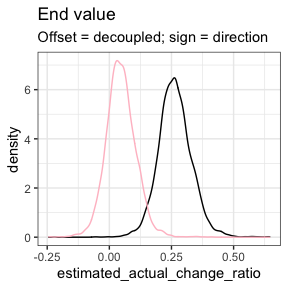<!-- -->

Here is the difference between actual and sim ratios:

``` r
ggplot(td_ests, aes(estimated_change_ratio_deviation)) + geom_density()+
  ggtitle("Change value", subtitle = "Over zero - not decoupled")
```

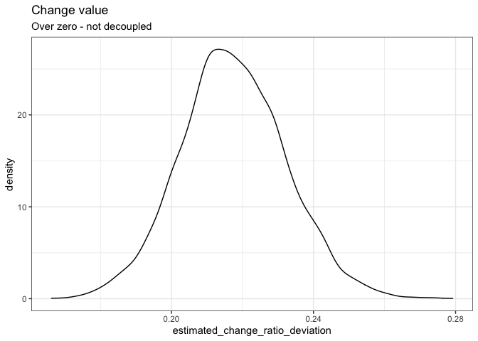<!-- -->
\#\#\# Summarize posterior draws

Extracting summary statistics from the posterior estimates.

The following is from `summarize_brm_ests`:

Argument:

``` r
some_ests <- extract_brm_ests(some_brms)
```

``` r
  td_route_ests_summary <- some_ests %>%
    dplyr::select(-rowindex) %>%
    dplyr::group_by(matssname, currency) %>%
    dplyr::summarize_all(.funs = list(mean = mean,
                                      lower = lower_quantile,
                                      upper = upper_quantile,
                                      median = median)) %>%
    dplyr::ungroup()
```

This gives us a dataframe with the mean, lower, upper, and median
estimates for all the parameters + all the quantities of interest we
looked at above.

What I really care about is the `actual_change_ratio` and
`sim_change_ratio`.

``` r
ggplot(td_route_ests_summary, aes(estimated_sim_change_ratio_median, estimated_actual_change_ratio_median, color = currency)) + geom_point() + geom_errorbar(aes(ymin = estimated_actual_change_ratio_lower, ymax = estimated_actual_change_ratio_upper), width = .05) + geom_errorbarh(aes(xmin = estimated_sim_change_ratio_lower, xmax = estimated_sim_change_ratio_upper), height = .05) + geom_abline(slope =1, intercept = 0)
```

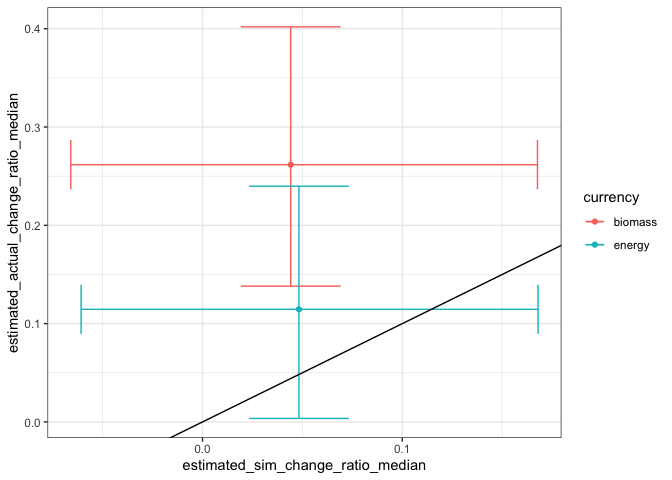<!-- -->
