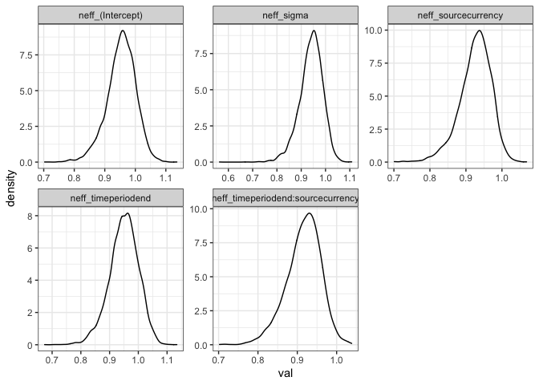

Diagnostic checks
================

Run this before you interpret results of new models.

Guided in part by
<https://mc-stan.org/bayesplot/articles/visual-mcmc-diagnostics.html>.

``` r
long_diagnostics <- all_diagnostics %>%
  tidyr::pivot_longer(-c(model, currency, matssname, simtype), names_to = "par", values_to = "val") %>%
  mutate(is_neff = grepl("neff", par),
         is_rhat = grepl("rhat", par),
         is_div = grepl("div", par))
```

## neff

Really problematic is \<.1

``` r
ggplot(filter(long_diagnostics, is_neff), aes(val)) + geom_density() + facet_wrap(vars(par), scales = "free")
```

    ## Warning: Removed 15840 rows containing non-finite values (stat_density).

<!-- -->

Here is how many \< .5:

``` r
nrow(long_diagnostics %>%
  filter(is_neff) %>%
  filter(val < .5))
```

    ## [1] 0

## Rhat

Convergence is close to 1, higher is bad.

``` r
ggplot(filter(long_diagnostics, is_rhat), aes(val)) + geom_density() + facet_wrap(vars(par), scales = "free")
```

    ## Warning: Removed 15840 rows containing non-finite values (stat_density).

<!-- -->

Here is how many rhats (of any parameter) are greater than…(The ref I
found flags things \> 1.05 at minimum.)

1.05:

``` r
nrow(long_diagnostics %>%
  filter(is_rhat) %>%
  filter(val > 1.05))
```

    ## [1] 0

1.01:

``` r
nrow(long_diagnostics %>%
  filter(is_rhat) %>%
  filter(val > 1.01))
```

    ## [1] 0

1.005:

``` r
nrow(long_diagnostics %>%
  filter(is_rhat) %>%
  filter(val > 1.005))
```

    ## [1] 0

1.001:

``` r
nrow(long_diagnostics %>%
  filter(is_rhat) %>%
  filter(val > 1.001))
```

    ## [1] 1916

## divergent transitions

Here is how many models with any divergent transitions post warmup:

``` r
nrow(long_diagnostics %>%
       filter(is_div) %>%
       filter(val > 0)) 
```

    ## [1] 0
