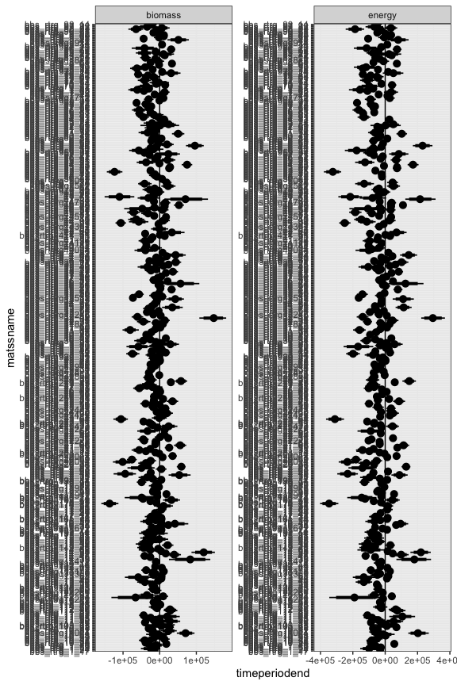

How many models come out which way
================

``` r
all_winners %>%
  group_by(simtype, currency, model) %>%
  summarize(count = dplyr::n())
```

    ## `summarise()` has grouped output by 'simtype', 'currency'. You can override using the `.groups` argument.

<div class="kable-table">

| simtype      | currency | model             | count |
| :----------- | :------- | :---------------- | ----: |
| actual       | biomass  | tb\_brm\_full     |    31 |
| actual       | biomass  | tb\_brm\_nosource |    31 |
| actual       | biomass  | tb\_brm\_notime   |    38 |
| actual       | energy   | te\_brm\_full     |    17 |
| actual       | energy   | te\_brm\_nosource |    45 |
| actual       | energy   | te\_brm\_notime   |    38 |
| nochange     | biomass  | tb\_brm\_notime   |   100 |
| nochange     | energy   | te\_brm\_notime   |   100 |
| nosizechange | biomass  | tb\_brm\_nosource |    58 |
| nosizechange | biomass  | tb\_brm\_notime   |    42 |
| nosizechange | energy   | te\_brm\_nosource |    60 |
| nosizechange | energy   | te\_brm\_notime   |    40 |

</div>

``` r
actual_qis <- all_qis %>% 
  filter(simtype == "actual") 
actual_qis_95 <- filter(actual_qis, .width == .95)

ggplot(actual_qis, aes(b_timeperiodend, matssname)) + geom_pointinterval(aes(xmin = b_timeperiodend.lower, xmax = b_timeperiodend.upper, width = .width)) + geom_vline(xintercept = 0) + facet_wrap(vars(currency), scales = "free")
```

    ## Warning: Removed 76 rows containing missing values (geom_segment).
    
    ## Warning: Removed 76 rows containing missing values (geom_segment).

<!-- -->

Of models of actual,

``` r
actual_qis_95 %>%
  group_by(currency) %>%
  summarize(percent_with_slope = mean(!is.na(b_timeperiodend)))
```

<div class="kable-table">

| currency | percent\_with\_slope |
| :------- | -------------------: |
| biomass  |                 0.62 |
| energy   |                 0.62 |

</div>

Of models with a slope…

``` r
actual_qis_95 %>%
  group_by(currency) %>%
  summarize(percent_decreasing = mean(b_timeperiodend.upper < 0, na.rm = T),
            percent_increasing = mean(b_timeperiodend.lower > 0, na.rm = T),
            n_with_slope = sum(!is.na(b_timeperiodend)))
```

<div class="kable-table">

| currency | percent\_decreasing | percent\_increasing | n\_with\_slope |
| :------- | ------------------: | ------------------: | -------------: |
| biomass  |           0.6290323 |           0.2258065 |             62 |
| energy   |           0.7096774 |           0.2258065 |             62 |

</div>

using a 95% CI above or below 0. This can sum to less than 1 if there is
a model with an interaction in which the abundance-slope is over 0, but
the currency offset is nonzero.

Of all models, here’s the proportion with an interaction:

``` r
actual_qis_95 %>%
  group_by(currency) %>%
  summarize(percent_interaction = mean(!is.na(`b_timeperiodend:sourcecurrency`), na.rm = T))
```

<div class="kable-table">

| currency | percent\_interaction |
| :------- | -------------------: |
| biomass  |                 0.31 |
| energy   |                 0.17 |

</div>

Of models with an interaction…

``` r
actual_qis_95 %>%
  group_by(currency) %>%
  summarize(percent_currency_above_abund = mean((`b_timeperiodend:sourcecurrency.lower` >0), na.rm = T),
            percent_currency_below_abund = mean((`b_timeperiodend:sourcecurrency.upper` <0), na.rm = T),
            n_with_interaction = sum(!is.na(`b_timeperiodend:sourcecurrency`)))
```

<div class="kable-table">

| currency | percent\_currency\_above\_abund | percent\_currency\_below\_abund | n\_with\_interaction |
| :------- | ------------------------------: | ------------------------------: | -------------------: |
| biomass  |                       0.8064516 |                       0.1935484 |                   31 |
| energy   |                       0.7058824 |                       0.2941176 |                   17 |

</div>

``` r
raw_changes <- all_sims %>%
  filter(simtype == "actual") %>%
  group_by(matssname, source, timeperiod) %>%
  summarize(total_energy = mean(total_energy),
            total_biomass = mean(total_biomass)) %>%
  ungroup() %>%
  tidyr::pivot_wider(id_cols = c(matssname, source), names_from = timeperiod, values_from = c(total_energy, total_biomass)) %>%
  mutate(energy_ratio = total_energy_end / total_energy_begin,
         biomass_ratio = total_biomass_end / total_biomass_begin) %>%
  select(matssname, source, energy_ratio, biomass_ratio) %>%
  tidyr::pivot_wider(id_cols = matssname, names_from = source, values_from = c(energy_ratio, biomass_ratio))
```

    ## `summarise()` has grouped output by 'matssname', 'source'. You can override using the `.groups` argument.

``` r
sig_changes <- raw_changes %>%
  left_join(actual_qis_95) %>%
  mutate(abund_slope_nonzero = (b_timeperiodend.upper < 0 | b_timeperiodend.lower > 0) & !is.na(b_timeperiodend),
         currency_offset_nonzero =(`b_timeperiodend:sourcecurrency.upper` < 0 | `b_timeperiodend:sourcecurrency.lower` > 0) & !is.na(`b_timeperiodend:sourcecurrency`))
```

    ## Joining, by = "matssname"

``` r
ggplot(sig_changes, aes(energy_ratio_abundance, energy_ratio_currency)) + geom_point(alpha = .1) + geom_point(data =filter(sig_changes, abund_slope_nonzero), aes(color = currency_offset_nonzero), alpha = 1) + geom_abline(slope= 1, intercept = 0) + geom_vline(xintercept = 1) + geom_hline(yintercept = 1) + theme(legend.position = "bottom") + ggtitle("Energy")
```

<!-- -->

``` r
ggplot(sig_changes, aes(biomass_ratio_abundance, biomass_ratio_currency)) + geom_point(alpha = .1) + geom_point(data =filter(sig_changes, !is.na(b_timeperiodend)), aes(color = currency_offset_nonzero), alpha = 1) + geom_abline(slope= 1, intercept = 0) + geom_vline(xintercept = 1) + geom_hline(yintercept = 1) + theme(legend.position = "bottom") + ggtitle("Biomass")
```

<!-- -->
