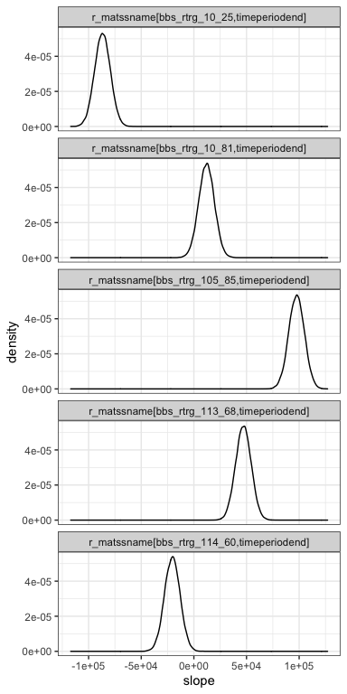
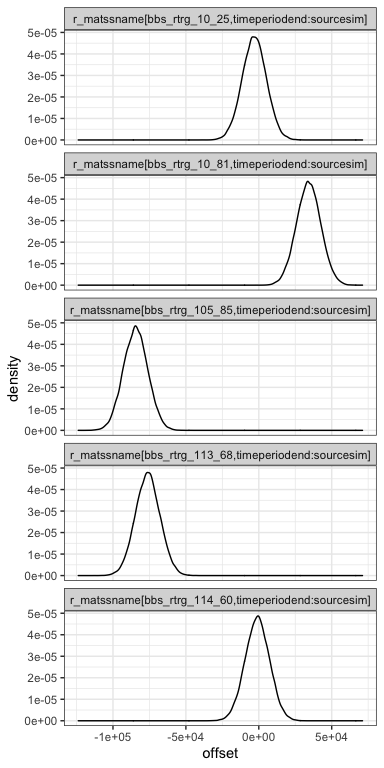
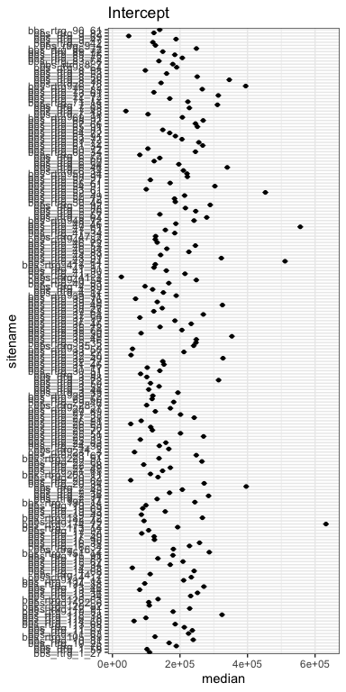
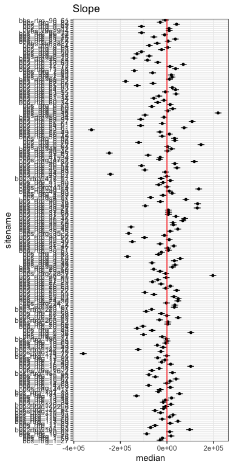
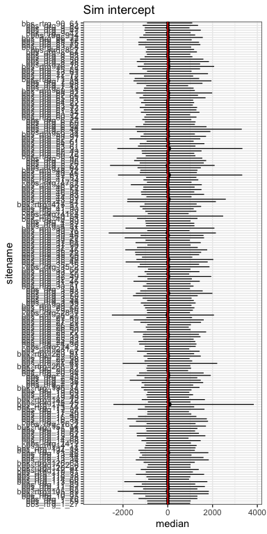
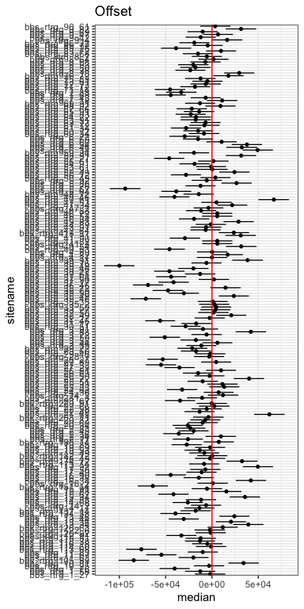
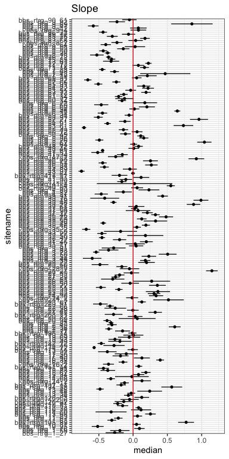
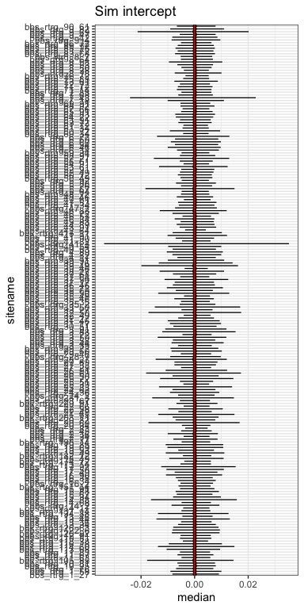
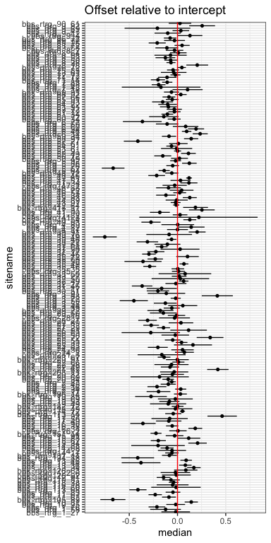
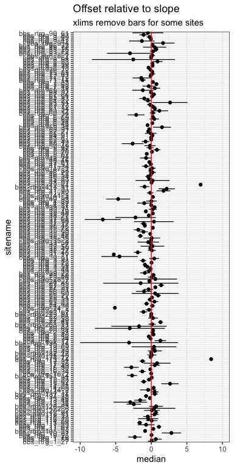

Exploring on some examples
================

<!-- --><!-- --><!-- --><!-- -->

<!-- --><!-- --><!-- --><!-- -->

For visualization, interested in rescaling to \~comparable to the
intercept for each route.

NOT FOR INFERENCE. NOT INCORPORATING VARIATION AROUND ESTIMATE FOR
INTERCEPT. just ballparking it…

<!-- --><!-- --><!-- --><!-- -->
