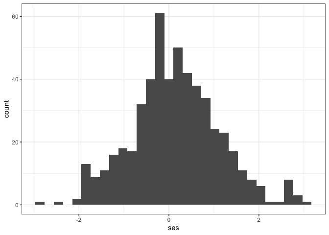
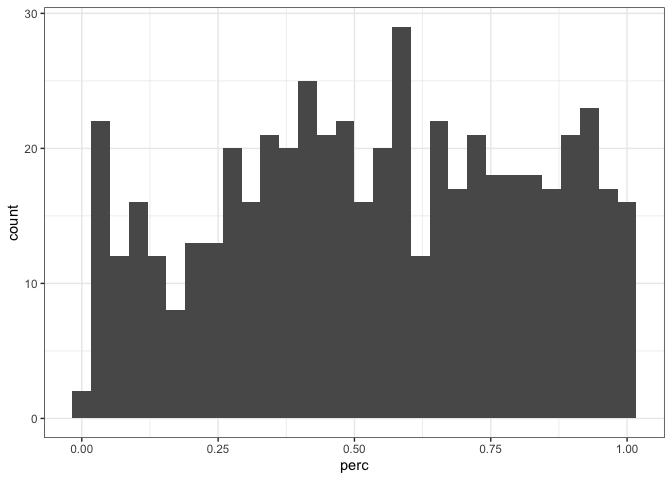

Checking local nm at scale
================

# Checking

Make sure you have unique seeds - depending on how the Rsession is
working it might get kept. (I think I put a stop to that but double
check).

``` r
length(unique(all_results$null_mod_seed))
```

    ## [1] 52797

``` r
length(unique(all_results$isd_seed))
```

    ## [1] 52782

# Summarizing

``` r
# 
# ses <- function(actual_value, null_distribution) {
#   
#   null_mean <- mean(null_distribution)
#   null_sd <- sd(null_distribution)
#   
#   (actual_value - null_mean) / null_sd
#   
# }
# 
# percentile_score <- function(actual_value, null_distribution) {
#   
#   sum(null_distribution < actual_value) / length(null_distribution)
#   
# }
# 
# summarize_null_results <- function(null_results, actual_results) {
#   
#   null_use <- null_results %>%
#     dplyr::select(statenum, route, routename, isd_turnover) %>%
#     dplyr::rename(null_isd_turnover = isd_turnover) %>%
#     dplyr::left_join(
#       dplyr::select(actual_results, statenum, route, routename, isd_turnover))
#   
#   null_summarized <- null_use %>%
#     dplyr::group_by(statenum, route, routename) %>%
#     dplyr::summarize(
#       ses = ses(unique(isd_turnover), null_isd_turnover),
#       perc = percentile_score(unique(isd_turnover), null_isd_turnover),
#       nsims = dplyr::n()
#     ) %>%
#     dplyr::ungroup()
#   
#   null_summarized
# }
```

``` r
results_summarized <- rwar::summarize_null_results(all_results, all_results_actual)
```

    ## Joining, by = c("statenum", "route", "routename")

# Results

``` r
ggplot(results_summarized, aes(ses)) + geom_histogram() 
```

    ## `stat_bin()` using `bins = 30`. Pick better value with `binwidth`.

<!-- -->

``` r
ggplot(results_summarized, aes(perc)) + geom_histogram() 
```

    ## `stat_bin()` using `bins = 30`. Pick better value with `binwidth`.

<!-- -->
