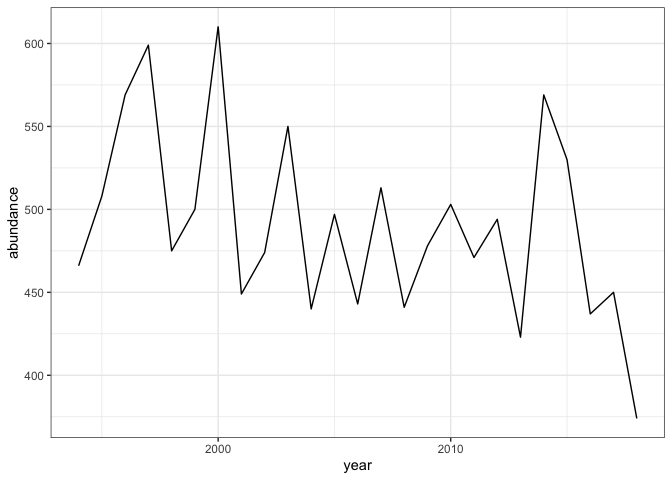
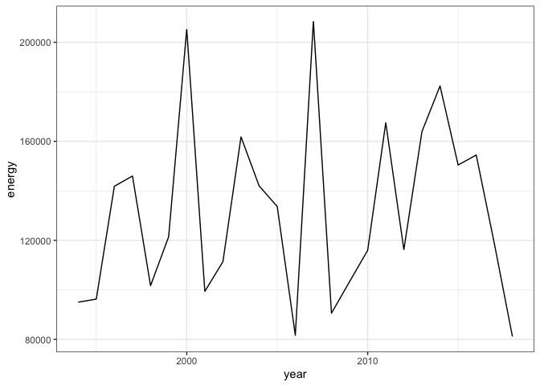
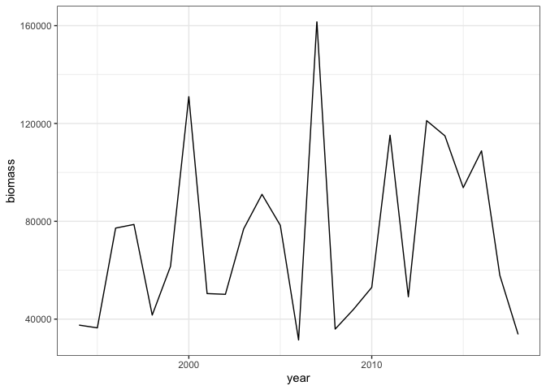
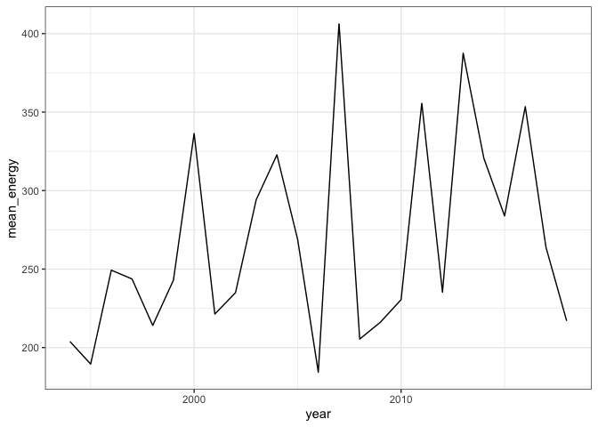
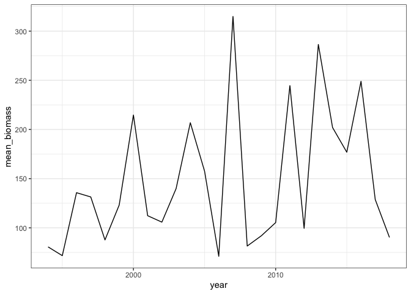
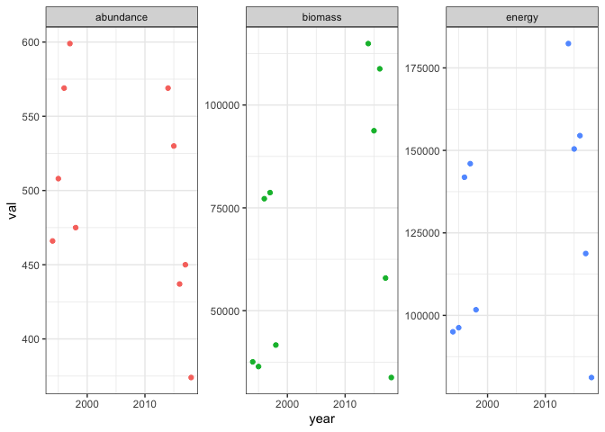
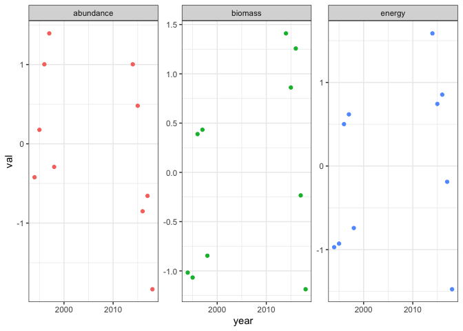
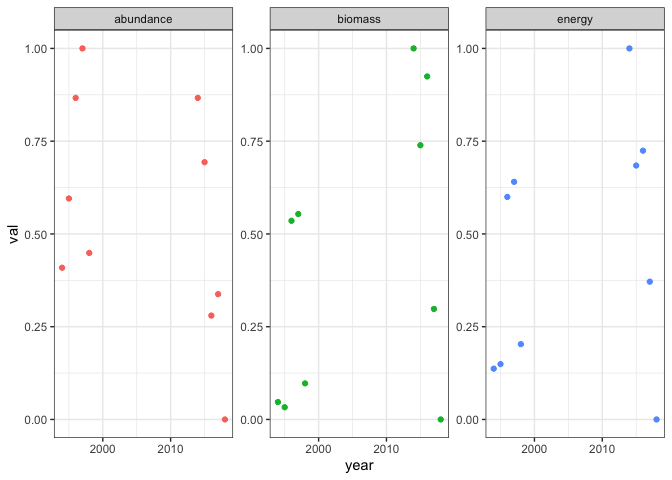

Interaction lm thinking
================

  - [Demo dataset](#demo-dataset)
  - [Simulate ISD](#simulate-isd)
  - [Community-level properties](#community-level-properties)
      - [Compute community-level properties over
        time](#compute-community-level-properties-over-time)
      - [Compare how different currencies have changed over
        time](#compare-how-different-currencies-have-changed-over-time)
          - [First and last 5 years](#first-and-last-5-years)
          - [Interaction lm on scale(sqrt)
            scaling](#interaction-lm-on-scalesqrt-scaling)
          - [Interaction lm on rangescale
            scaling](#interaction-lm-on-rangescale-scaling)
      - [Compare ISDs and species composition over
        time](#compare-isds-and-species-composition-over-time)
          - [ISD over time](#isd-over-time)
          - [Species composition over
            time](#species-composition-over-time)
  - [All variables](#all-variables)
  - [Variable descriptions](#variable-descriptions)

# Demo dataset

``` r
d <- BBSsize::hartland

names(d)
```

    ## [1] "abundance"  "covariates" "metadata"

``` r
begin_years <- c(1994:1998)

end_years <- c(2014:2018)
```

# Simulate ISD

``` r
d_isd <- BBSsize::simulate_isd_ts(d, isd_seed = 1994)
```

    ## Joining, by = "id"
    ## Joining, by = "id"
    ## Joining, by = "id"
    ## Joining, by = "id"
    ## Joining, by = "id"
    ## Joining, by = "id"
    ## Joining, by = "id"
    ## Joining, by = "id"
    ## Joining, by = "id"
    ## Joining, by = "id"
    ## Joining, by = "id"
    ## Joining, by = "id"
    ## Joining, by = "id"
    ## Joining, by = "id"
    ## Joining, by = "id"
    ## Joining, by = "id"
    ## Joining, by = "id"
    ## Joining, by = "id"
    ## Joining, by = "id"
    ## Joining, by = "id"
    ## Joining, by = "id"
    ## Joining, by = "id"
    ## Joining, by = "id"
    ## Joining, by = "id"
    ## Joining, by = "id"

``` r
names(d_isd)
```

    ## [1] "isd"        "covariates" "metadata"

``` r
head(d_isd$isd)
```

<div class="kable-table">

| id     |     mass | year | isd\_seed |
| :----- | -------: | ---: | --------: |
| sp3160 | 116.6828 | 1994 |      1994 |
| sp3160 | 119.5199 | 1994 |      1994 |
| sp3160 | 122.0607 | 1994 |      1994 |
| sp3160 | 121.5175 | 1994 |      1994 |
| sp3160 | 119.1784 | 1994 |      1994 |
| sp3160 | 116.5885 | 1994 |      1994 |

</div>

# Community-level properties

## Compute community-level properties over time

``` r
d_svs <- get_annual_svs(d_isd$isd)

ggplot(d_svs, aes(year, abundance)) + geom_line()
```

<!-- -->

``` r
ggplot(d_svs, aes(year, energy)) + geom_line()
```

<!-- -->

``` r
ggplot(d_svs, aes(year, biomass)) + geom_line()
```

<!-- -->

``` r
ggplot(d_svs, aes(year, mean_energy)) + geom_line()
```

<!-- -->

``` r
ggplot(d_svs, aes(year, mean_biomass)) + geom_line()
```

<!-- -->

## Compare how different currencies have changed over time

  - Focus on first and last 5 years, because this is the temporal window
    handled by ISDs and with no gaps

### First and last 5 years

``` r
d_svs_beginend <- pull_caps(d_svs, begin_years, end_years)
```

#### Raw values and scaling

``` r
d_svs_raw_long <- d_svs_beginend %>%
  select(-isd_seed) %>%
  tidyr::pivot_longer(-c(timeperiod, year), names_to = "currency", values_to = "val") %>%
  filter(currency %in% c("abundance", "energy", "biomass"))

ggplot(d_svs_raw_long, aes(year, val, color = currency)) + geom_point() + facet_wrap(vars(currency), scales = "free_y") + theme(legend.position = "none")
```

<!-- -->

Note the vastly different scales/units of measure for the different
currencies.

Rescale within each currency - there are 2 ways to do this (well, many
ways).

`scale(sqrt(value))`: This is what Dornelas 2019 used. It bothers me
because you end up with weirdly symmetric statistical properties.

`(val - min(val)) / range(val)`: Rangescaling, results in a number 0-1
inclusive.

### Interaction lm on scale(sqrt) scaling

``` r
d_svs_ss <- d_svs_beginend %>%
  dplyr::mutate(
    abundance = scale(sqrt(abundance)),
    biomass = scale(sqrt(biomass)),
    energy = scale(sqrt(energy))
  )

d_svs_ss_long <- d_svs_ss %>%
  select(timeperiod, year, abundance, energy, biomass) %>%
  tidyr::pivot_longer(-c(timeperiod, year), names_to = "currency", values_to = "val")

ggplot(d_svs_ss_long, aes(year, val, color = currency)) + geom_point() + facet_wrap(vars(currency), scales = "free_y") + theme(legend.position = "none")
```

<!-- -->

``` r
d_svs_ss_ilm <- lm(val ~ timeperiod * currency, data = d_svs_ss_long)

summary(d_svs_ss_ilm)
```

    ## 
    ## Call:
    ## lm(formula = val ~ timeperiod * currency, data = d_svs_ss_long)
    ## 
    ## Residuals:
    ##     Min      1Q  Median      3Q     Max 
    ## -1.7788 -0.6398 -0.2402  0.8290  1.3749 
    ## 
    ## Coefficients:
    ##                               Estimate Std. Error t value Pr(>|t|)  
    ## (Intercept)                     0.3719     0.4370   0.851   0.4031  
    ## timeperiodend                  -0.7438     0.6179  -1.204   0.2405  
    ## currencybiomass                -0.7937     0.6179  -1.284   0.2112  
    ## currencyenergy                 -0.6762     0.6179  -1.094   0.2847  
    ## timeperiodend:currencybiomass   1.5875     0.8739   1.816   0.0818 .
    ## timeperiodend:currencyenergy    1.3524     0.8739   1.548   0.1348  
    ## ---
    ## Signif. codes:  0 '***' 0.001 '**' 0.01 '*' 0.05 '.' 0.1 ' ' 1
    ## 
    ## Residual standard error: 0.9771 on 24 degrees of freedom
    ## Multiple R-squared:  0.1514, Adjusted R-squared:  -0.02537 
    ## F-statistic: 0.8565 on 5 and 24 DF,  p-value: 0.5241

### Interaction lm on rangescale scaling

``` r
d_svs_rs <- d_svs_beginend %>%
  dplyr::mutate(
    abundance = rangescale(abundance),
    biomass = rangescale(biomass),
    energy = rangescale(energy)
  )

d_svs_rs_long <- d_svs_rs %>%
  select(timeperiod, year, abundance, energy, biomass) %>%
  tidyr::pivot_longer(-c(timeperiod, year), names_to = "currency", values_to = "val")

ggplot(d_svs_rs_long, aes(year, val, color = currency)) + geom_point() + facet_wrap(vars(currency), scales = "free_y") + theme(legend.position = "none")
```

<!-- -->

``` r
d_svs_rs_ilm <- lm(val ~ timeperiod * currency, data = d_svs_rs_long)

summary(d_svs_rs_ilm)
```

    ## 
    ## Call:
    ## lm(formula = val ~ timeperiod * currency, data = d_svs_rs_long)
    ## 
    ## Residuals:
    ##      Min       1Q   Median       3Q      Max 
    ## -0.59226 -0.20825 -0.08311  0.27611  0.44398 
    ## 
    ## Coefficients:
    ##                               Estimate Std. Error t value Pr(>|t|)    
    ## (Intercept)                     0.6640     0.1474   4.506 0.000146 ***
    ## timeperiodend                  -0.2284     0.2084  -1.096 0.283885    
    ## currencybiomass                -0.4107     0.2084  -1.971 0.060372 .  
    ## currencyenergy                 -0.3182     0.2084  -1.527 0.139903    
    ## timeperiodend:currencybiomass   0.5675     0.2947   1.925 0.066116 .  
    ## timeperiodend:currencyenergy    0.4386     0.2947   1.488 0.149701    
    ## ---
    ## Signif. codes:  0 '***' 0.001 '**' 0.01 '*' 0.05 '.' 0.1 ' ' 1
    ## 
    ## Residual standard error: 0.3295 on 24 degrees of freedom
    ## Multiple R-squared:  0.1915, Adjusted R-squared:  0.02306 
    ## F-statistic: 1.137 on 5 and 24 DF,  p-value: 0.3682

## Compare ISDs and species composition over time

### ISD over time

Note there is some seed dependence in fitting the gmms, such that
overlap can vary.

``` r
set.seed(1977)
isd_overlap <- compare_isds(d_isd$isd, begin_years, end_years)
```

    ## Package 'mclust' version 5.4.7
    ## Type 'citation("mclust")' for citing this R package in publications.

``` r
isd_overlap
```

<div class="kable-table">

| isd\_turnover |
| ------------: |
|     0.1175799 |

</div>

### Species composition over time

``` r
begin_composition <- colSums(d$abundance[1:5,])

end_composition <- colSums(d$abundance[(nrow(d$abundance) - 4): nrow(d$abundance), ])

begin_relabund <- begin_composition / sum(begin_composition)

end_relabund <- end_composition / sum(end_composition)

relabund <- data.frame(
  begin = begin_relabund,
  end = end_relabund,
  beginsp = names(begin_relabund),
  endsp = names(end_relabund)
) 

relabund_change <- relabund %>%
  group_by(beginsp) %>%
  summarize(minRel = min(begin, end)) %>%
  ungroup() %>%
  select(minRel) %>%
  summarize(sp_turnover = 1-sum(minRel))

relabund_change
```

<div class="kable-table">

| sp\_turnover |
| -----------: |
|    0.2553022 |

</div>

``` r
be_matrix <- bind_rows(begin_composition, end_composition)

be_diss <- vegan::vegdist(be_matrix)

be_diss
```

    ##           1
    ## 2 0.2469359

``` r
compare_species_composition(d)
```

<div class="kable-table">

| sp\_turnover |       bcd |
| -----------: | --------: |
|    0.2553022 | 0.2469359 |

</div>

# All variables

``` r
# 
# community_change <- data.frame(
#   isd_turnover = isd_overlap$isd_turnover[1],
#   species_turnover = relabund_change$sp_turnover[1],
#   bcd = be_diss[[1]])
# 
# outputs <- all_sv_change %>%
#   bind_cols(community_change) %>%
#   bind_cols(d$metadata$location) %>%
#   mutate(beginyears = toString(begin_years),
#          endyears = toString(end_years))
# 
# outputs
# 
# all_core_analyses(d, begin_years, end_years, isd_seed = 1994)
# all_core_analyses(d, isd_seed = 1994)
```

# Variable descriptions

``` r
# 
# var_names <- data.frame(
#   var_name = colnames(outputs),
#   description = ""
# )
# 
# #write.csv(var_names, "var_descriptions.csv", row.names = F)
# 
# old_var_names <- read.csv("var_descriptions.csv")
# 
# if(any(var_names$var_name != old_var_names$var_name)) {
#   print("vars have changed")
# }
# 
# old_var_names
```
