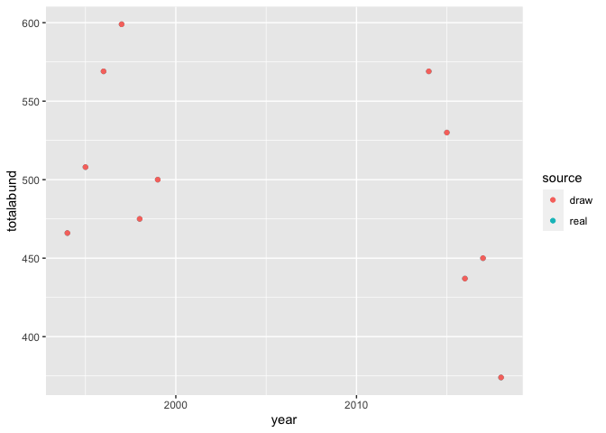

Untitled
================

``` r
g_isds <- simulate_isd_ts(g, isd_seed = isd_seed)
```

    ## Joining, by = "id"
    ## Joining, by = "id"
    ## Joining, by = "id"
    ## Joining, by = "id"
    ## Joining, by = "id"
    ## Joining, by = "id"
    ## Joining, by = "id"
    ## Joining, by = "id"
    ## Joining, by = "id"
    ## Joining, by = "id"
    ## Joining, by = "id"
    ## Joining, by = "id"
    ## Joining, by = "id"
    ## Joining, by = "id"
    ## Joining, by = "id"
    ## Joining, by = "id"
    ## Joining, by = "id"
    ## Joining, by = "id"
    ## Joining, by = "id"
    ## Joining, by = "id"
    ## Joining, by = "id"
    ## Joining, by = "id"
    ## Joining, by = "id"
    ## Joining, by = "id"
    ## Joining, by = "id"

``` r
g_isds_df <- g_isds$isd

g_isd_begin <- dplyr::filter(g_isds_df, year %in% begin_years)

g_isd_end <- dplyr::filter(g_isds_df, year %in% end_years)
add_gmm2 <- function(isd, max_size = 15000, max_G = 15) {

  isd <- isd %>%
    dplyr::mutate(logmass = log(mass))

  gmm <- fit_gmm(isd$logmass, max_G)


  gmm_isd <- data.frame(logmass = seq(0, log(max_size), length.out = 100000))
  gmm_isd$dens <- predict(gmm, newdata = gmm_isd$logmass)


  isd_gmm <- data.frame(
    mass = gmm_isd$logmass,
    density = (gmm_isd$dens)/ sum(gmm_isd$dens)
  )

  return(isd_gmm)

}

g_gmm_begin <- add_gmm2(g_isd_begin)
```

    ## Package 'mclust' version 5.4.7
    ## Type 'citation("mclust")' for citing this R package in publications.

``` r
g_gmm_end <- add_gmm2(g_isd_end)

its <- list()

for(i in 1:50) {
  
set.seed(NULL)

g_isd_begin_sim <- g_isd_begin %>%
  dplyr::mutate(mass_sim = exp(sample(g_gmm_begin$mass, size = nrow(g_isd_begin), prob = g_gmm_begin$density, replace= T))) %>%
  dplyr::mutate(timeperiod = "begin")


g_isd_end_sim <- g_isd_end %>%
  dplyr::mutate(
    mass_sim_end = exp(sample(g_gmm_end$mass, size = nrow(g_isd_end), prob = g_gmm_end$density, replace = T)),
    mass_sim_begin = exp(sample(g_gmm_begin$mass, size = nrow(g_isd_end), prob = g_gmm_begin$density, replace = T))
  ) %>%
  dplyr::mutate(timeperiod = "end")

library(dplyr)
actual <- g_isd_end_sim %>%
  select(year, timeperiod, mass_sim_end) %>%
  rename(mass = mass_sim_end) %>%
  bind_rows(
    rename(
      select(
      g_isd_begin_sim, year, timeperiod, mass_sim
    ),
    mass = mass_sim
  )
  ) %>%
  group_by(year, timeperiod) %>%
  summarize(totalmass = sum(mass),
                        totalabund = dplyr::n()) %>%
  ungroup() %>%
  mutate(source = "real")
scaling <- g_isd_end_sim %>%
  select(year, timeperiod, mass_sim_begin) %>%
  rename(mass = mass_sim_begin) %>%
  bind_rows(
    rename(
      select(
      g_isd_begin_sim, year, timeperiod, mass_sim
    ),
    mass = mass_sim
  )
  ) %>%
  group_by(year, timeperiod) %>%
  summarize(totalmass = sum(mass),
            totalabund = dplyr::n()) %>%
  ungroup() %>%
  mutate(source = "draw")

both <- bind_rows(actual, scaling) %>%
  mutate(iteration = i)

its[[i]] <- both
}
```

    ## 
    ## Attaching package: 'dplyr'

    ## The following objects are masked from 'package:stats':
    ## 
    ##     filter, lag

    ## The following objects are masked from 'package:base':
    ## 
    ##     intersect, setdiff, setequal, union

    ## `summarise()` has grouped output by 'year'. You can override using the `.groups` argument.
    ## `summarise()` has grouped output by 'year'. You can override using the `.groups` argument.
    ## `summarise()` has grouped output by 'year'. You can override using the `.groups` argument.
    ## `summarise()` has grouped output by 'year'. You can override using the `.groups` argument.
    ## `summarise()` has grouped output by 'year'. You can override using the `.groups` argument.
    ## `summarise()` has grouped output by 'year'. You can override using the `.groups` argument.
    ## `summarise()` has grouped output by 'year'. You can override using the `.groups` argument.
    ## `summarise()` has grouped output by 'year'. You can override using the `.groups` argument.
    ## `summarise()` has grouped output by 'year'. You can override using the `.groups` argument.
    ## `summarise()` has grouped output by 'year'. You can override using the `.groups` argument.
    ## `summarise()` has grouped output by 'year'. You can override using the `.groups` argument.
    ## `summarise()` has grouped output by 'year'. You can override using the `.groups` argument.
    ## `summarise()` has grouped output by 'year'. You can override using the `.groups` argument.
    ## `summarise()` has grouped output by 'year'. You can override using the `.groups` argument.
    ## `summarise()` has grouped output by 'year'. You can override using the `.groups` argument.
    ## `summarise()` has grouped output by 'year'. You can override using the `.groups` argument.
    ## `summarise()` has grouped output by 'year'. You can override using the `.groups` argument.
    ## `summarise()` has grouped output by 'year'. You can override using the `.groups` argument.
    ## `summarise()` has grouped output by 'year'. You can override using the `.groups` argument.
    ## `summarise()` has grouped output by 'year'. You can override using the `.groups` argument.
    ## `summarise()` has grouped output by 'year'. You can override using the `.groups` argument.
    ## `summarise()` has grouped output by 'year'. You can override using the `.groups` argument.
    ## `summarise()` has grouped output by 'year'. You can override using the `.groups` argument.
    ## `summarise()` has grouped output by 'year'. You can override using the `.groups` argument.
    ## `summarise()` has grouped output by 'year'. You can override using the `.groups` argument.
    ## `summarise()` has grouped output by 'year'. You can override using the `.groups` argument.
    ## `summarise()` has grouped output by 'year'. You can override using the `.groups` argument.
    ## `summarise()` has grouped output by 'year'. You can override using the `.groups` argument.
    ## `summarise()` has grouped output by 'year'. You can override using the `.groups` argument.
    ## `summarise()` has grouped output by 'year'. You can override using the `.groups` argument.
    ## `summarise()` has grouped output by 'year'. You can override using the `.groups` argument.
    ## `summarise()` has grouped output by 'year'. You can override using the `.groups` argument.
    ## `summarise()` has grouped output by 'year'. You can override using the `.groups` argument.
    ## `summarise()` has grouped output by 'year'. You can override using the `.groups` argument.
    ## `summarise()` has grouped output by 'year'. You can override using the `.groups` argument.
    ## `summarise()` has grouped output by 'year'. You can override using the `.groups` argument.
    ## `summarise()` has grouped output by 'year'. You can override using the `.groups` argument.
    ## `summarise()` has grouped output by 'year'. You can override using the `.groups` argument.
    ## `summarise()` has grouped output by 'year'. You can override using the `.groups` argument.
    ## `summarise()` has grouped output by 'year'. You can override using the `.groups` argument.
    ## `summarise()` has grouped output by 'year'. You can override using the `.groups` argument.
    ## `summarise()` has grouped output by 'year'. You can override using the `.groups` argument.
    ## `summarise()` has grouped output by 'year'. You can override using the `.groups` argument.
    ## `summarise()` has grouped output by 'year'. You can override using the `.groups` argument.
    ## `summarise()` has grouped output by 'year'. You can override using the `.groups` argument.
    ## `summarise()` has grouped output by 'year'. You can override using the `.groups` argument.
    ## `summarise()` has grouped output by 'year'. You can override using the `.groups` argument.
    ## `summarise()` has grouped output by 'year'. You can override using the `.groups` argument.
    ## `summarise()` has grouped output by 'year'. You can override using the `.groups` argument.
    ## `summarise()` has grouped output by 'year'. You can override using the `.groups` argument.
    ## `summarise()` has grouped output by 'year'. You can override using the `.groups` argument.
    ## `summarise()` has grouped output by 'year'. You can override using the `.groups` argument.
    ## `summarise()` has grouped output by 'year'. You can override using the `.groups` argument.
    ## `summarise()` has grouped output by 'year'. You can override using the `.groups` argument.
    ## `summarise()` has grouped output by 'year'. You can override using the `.groups` argument.
    ## `summarise()` has grouped output by 'year'. You can override using the `.groups` argument.
    ## `summarise()` has grouped output by 'year'. You can override using the `.groups` argument.
    ## `summarise()` has grouped output by 'year'. You can override using the `.groups` argument.
    ## `summarise()` has grouped output by 'year'. You can override using the `.groups` argument.
    ## `summarise()` has grouped output by 'year'. You can override using the `.groups` argument.
    ## `summarise()` has grouped output by 'year'. You can override using the `.groups` argument.
    ## `summarise()` has grouped output by 'year'. You can override using the `.groups` argument.
    ## `summarise()` has grouped output by 'year'. You can override using the `.groups` argument.
    ## `summarise()` has grouped output by 'year'. You can override using the `.groups` argument.
    ## `summarise()` has grouped output by 'year'. You can override using the `.groups` argument.
    ## `summarise()` has grouped output by 'year'. You can override using the `.groups` argument.
    ## `summarise()` has grouped output by 'year'. You can override using the `.groups` argument.
    ## `summarise()` has grouped output by 'year'. You can override using the `.groups` argument.
    ## `summarise()` has grouped output by 'year'. You can override using the `.groups` argument.
    ## `summarise()` has grouped output by 'year'. You can override using the `.groups` argument.
    ## `summarise()` has grouped output by 'year'. You can override using the `.groups` argument.
    ## `summarise()` has grouped output by 'year'. You can override using the `.groups` argument.
    ## `summarise()` has grouped output by 'year'. You can override using the `.groups` argument.
    ## `summarise()` has grouped output by 'year'. You can override using the `.groups` argument.
    ## `summarise()` has grouped output by 'year'. You can override using the `.groups` argument.
    ## `summarise()` has grouped output by 'year'. You can override using the `.groups` argument.
    ## `summarise()` has grouped output by 'year'. You can override using the `.groups` argument.
    ## `summarise()` has grouped output by 'year'. You can override using the `.groups` argument.
    ## `summarise()` has grouped output by 'year'. You can override using the `.groups` argument.
    ## `summarise()` has grouped output by 'year'. You can override using the `.groups` argument.
    ## `summarise()` has grouped output by 'year'. You can override using the `.groups` argument.
    ## `summarise()` has grouped output by 'year'. You can override using the `.groups` argument.
    ## `summarise()` has grouped output by 'year'. You can override using the `.groups` argument.
    ## `summarise()` has grouped output by 'year'. You can override using the `.groups` argument.
    ## `summarise()` has grouped output by 'year'. You can override using the `.groups` argument.
    ## `summarise()` has grouped output by 'year'. You can override using the `.groups` argument.
    ## `summarise()` has grouped output by 'year'. You can override using the `.groups` argument.
    ## `summarise()` has grouped output by 'year'. You can override using the `.groups` argument.
    ## `summarise()` has grouped output by 'year'. You can override using the `.groups` argument.
    ## `summarise()` has grouped output by 'year'. You can override using the `.groups` argument.
    ## `summarise()` has grouped output by 'year'. You can override using the `.groups` argument.
    ## `summarise()` has grouped output by 'year'. You can override using the `.groups` argument.
    ## `summarise()` has grouped output by 'year'. You can override using the `.groups` argument.
    ## `summarise()` has grouped output by 'year'. You can override using the `.groups` argument.
    ## `summarise()` has grouped output by 'year'. You can override using the `.groups` argument.
    ## `summarise()` has grouped output by 'year'. You can override using the `.groups` argument.
    ## `summarise()` has grouped output by 'year'. You can override using the `.groups` argument.
    ## `summarise()` has grouped output by 'year'. You can override using the `.groups` argument.
    ## `summarise()` has grouped output by 'year'. You can override using the `.groups` argument.
    ## `summarise()` has grouped output by 'year'. You can override using the `.groups` argument.

``` r
allits <- bind_rows(its)

ggplot(both, aes(year, totalmass, color = source)) + geom_point()
```

<!-- -->

``` r
ggplot(both, aes(year, totalabund, color = source)) + geom_point()
```

<!-- -->

``` r
summary(lm(totalmass ~ timeperiod * source, data = both))
```

    ## 
    ## Call:
    ## lm(formula = totalmass ~ timeperiod * source, data = both)
    ## 
    ## Residuals:
    ##    Min     1Q Median     3Q    Max 
    ## -18307  -6241  -1295   3666  34110 
    ## 
    ## Coefficients:
    ##                            Estimate Std. Error t value Pr(>|t|)    
    ## (Intercept)               4.926e+04  4.932e+03   9.989 9.08e-09 ***
    ## timeperiodend            -6.093e+03  7.315e+03  -0.833  0.41576    
    ## sourcereal               -1.551e-11  6.974e+03   0.000  1.00000    
    ## timeperiodend:sourcereal  3.905e+04  1.034e+04   3.775  0.00139 ** 
    ## ---
    ## Signif. codes:  0 '***' 0.001 '**' 0.01 '*' 0.05 '.' 0.1 ' ' 1
    ## 
    ## Residual standard error: 12080 on 18 degrees of freedom
    ## Multiple R-squared:  0.6462, Adjusted R-squared:  0.5872 
    ## F-statistic: 10.96 on 3 and 18 DF,  p-value: 0.0002526

``` r
ggplot(allits, aes(year, totalmass, color = as.factor(iteration), group = as.factor(iteration))) + geom_smooth(method = "lm", se = F) + facet_wrap(vars(source))
```

    ## `geom_smooth()` using formula 'y ~ x'

<!-- -->

``` r
a_lm <- lm(totalmass ~ timeperiod * source, data = allits)

summary(a_lm)
```

    ## 
    ## Call:
    ## lm(formula = totalmass ~ timeperiod * source, data = allits)
    ## 
    ## Residuals:
    ##    Min     1Q Median     3Q    Max 
    ## -31482  -7414  -1117   5883  52822 
    ## 
    ## Coefficients:
    ##                            Estimate Std. Error t value Pr(>|t|)    
    ## (Intercept)               4.971e+04  6.370e+02  78.031  < 2e-16 ***
    ## timeperiodend            -4.768e+03  9.448e+02  -5.047 5.26e-07 ***
    ## sourcereal                1.580e-11  9.009e+02   0.000        1    
    ## timeperiodend:sourcereal  1.923e+04  1.336e+03  14.395  < 2e-16 ***
    ## ---
    ## Signif. codes:  0 '***' 0.001 '**' 0.01 '*' 0.05 '.' 0.1 ' ' 1
    ## 
    ## Residual standard error: 11030 on 1096 degrees of freedom
    ## Multiple R-squared:  0.283,  Adjusted R-squared:  0.281 
    ## F-statistic: 144.2 on 3 and 1096 DF,  p-value: < 2.2e-16

``` r
# 
# library(brms)
# 
# a_brm <- brm(totalmass ~ timeperiod * source + (1|year), data = allits)
# 
# summary(a_brm)

library(mgcv)
```

    ## Loading required package: nlme

    ## 
    ## Attaching package: 'nlme'

    ## The following object is masked from 'package:dplyr':
    ## 
    ##     collapse

    ## This is mgcv 1.8-37. For overview type 'help("mgcv-package")'.

    ## 
    ## Attaching package: 'mgcv'

    ## The following object is masked from 'package:mclust':
    ## 
    ##     mvn

``` r
allits <- allits %>%
  mutate(fsource = as.ordered(source),
         fyear = as.factor(year))

a_glm <- gam(totalmass ~ timeperiod * source + s(fyear, bs = "re"), data = allits, family = "tw")

summary(a_glm)
```

    ## 
    ## Family: Tweedie(p=1.99) 
    ## Link function: log 
    ## 
    ## Formula:
    ## totalmass ~ timeperiod * source + s(fyear, bs = "re")
    ## 
    ## Parametric coefficients:
    ##                          Estimate Std. Error t value Pr(>|t|)    
    ## (Intercept)              10.80973    0.05641 191.629   <2e-16 ***
    ## timeperiodend            -0.10818    0.08367  -1.293    0.196    
    ## sourcereal                0.00000    0.01285   0.000    1.000    
    ## timeperiodend:sourcereal  0.35534    0.01905  18.651   <2e-16 ***
    ## ---
    ## Signif. codes:  0 '***' 0.001 '**' 0.01 '*' 0.05 '.' 0.1 ' ' 1
    ## 
    ## Approximate significance of smooth terms:
    ##            edf Ref.df     F p-value    
    ## s(fyear) 8.882      9 75.16  <2e-16 ***
    ## ---
    ## Signif. codes:  0 '***' 0.001 '**' 0.01 '*' 0.05 '.' 0.1 ' ' 1
    ## 
    ## R-sq.(adj) =  0.543   Deviance explained = 56.5%
    ## -REML =  11475  Scale est. = 0.027594  n = 1100

``` r
library(gratia)

allits_fitted <- add_fitted(allits, a_glm, exclude = "s(fyear)")

ggplot(allits_fitted, aes(year, .value, color = source)) + geom_point()
```

<!-- -->

``` r
# 
# 
library(brms)
```

    ## Loading required package: Rcpp

    ## Loading 'brms' package (version 2.16.1). Useful instructions
    ## can be found by typing help('brms'). A more detailed introduction
    ## to the package is available through vignette('brms_overview').

    ## 
    ## Attaching package: 'brms'

    ## The following object is masked from 'package:gratia':
    ## 
    ##     posterior_samples

    ## The following objects are masked from 'package:mgcv':
    ## 
    ##     s, t2

    ## The following object is masked from 'package:mclust':
    ## 
    ##     me

    ## The following object is masked from 'package:stats':
    ## 
    ##     ar

``` r
a_brm <- brm(totalmass ~ timeperiod * source + (1 | fyear), data = allits)
```

    ## Compiling Stan program...

    ## Start sampling

    ## 
    ## SAMPLING FOR MODEL 'efe850f6aa7ef7a5f2abdd49dfe0af17' NOW (CHAIN 1).
    ## Chain 1: 
    ## Chain 1: Gradient evaluation took 0.000255 seconds
    ## Chain 1: 1000 transitions using 10 leapfrog steps per transition would take 2.55 seconds.
    ## Chain 1: Adjust your expectations accordingly!
    ## Chain 1: 
    ## Chain 1: 
    ## Chain 1: Iteration:    1 / 2000 [  0%]  (Warmup)
    ## Chain 1: Iteration:  200 / 2000 [ 10%]  (Warmup)
    ## Chain 1: Iteration:  400 / 2000 [ 20%]  (Warmup)
    ## Chain 1: Iteration:  600 / 2000 [ 30%]  (Warmup)
    ## Chain 1: Iteration:  800 / 2000 [ 40%]  (Warmup)
    ## Chain 1: Iteration: 1000 / 2000 [ 50%]  (Warmup)
    ## Chain 1: Iteration: 1001 / 2000 [ 50%]  (Sampling)
    ## Chain 1: Iteration: 1200 / 2000 [ 60%]  (Sampling)
    ## Chain 1: Iteration: 1400 / 2000 [ 70%]  (Sampling)
    ## Chain 1: Iteration: 1600 / 2000 [ 80%]  (Sampling)
    ## Chain 1: Iteration: 1800 / 2000 [ 90%]  (Sampling)
    ## Chain 1: Iteration: 2000 / 2000 [100%]  (Sampling)
    ## Chain 1: 
    ## Chain 1:  Elapsed Time: 6.27136 seconds (Warm-up)
    ## Chain 1:                2.11882 seconds (Sampling)
    ## Chain 1:                8.39017 seconds (Total)
    ## Chain 1: 
    ## 
    ## SAMPLING FOR MODEL 'efe850f6aa7ef7a5f2abdd49dfe0af17' NOW (CHAIN 2).
    ## Chain 2: 
    ## Chain 2: Gradient evaluation took 5.7e-05 seconds
    ## Chain 2: 1000 transitions using 10 leapfrog steps per transition would take 0.57 seconds.
    ## Chain 2: Adjust your expectations accordingly!
    ## Chain 2: 
    ## Chain 2: 
    ## Chain 2: Iteration:    1 / 2000 [  0%]  (Warmup)
    ## Chain 2: Iteration:  200 / 2000 [ 10%]  (Warmup)
    ## Chain 2: Iteration:  400 / 2000 [ 20%]  (Warmup)
    ## Chain 2: Iteration:  600 / 2000 [ 30%]  (Warmup)
    ## Chain 2: Iteration:  800 / 2000 [ 40%]  (Warmup)
    ## Chain 2: Iteration: 1000 / 2000 [ 50%]  (Warmup)
    ## Chain 2: Iteration: 1001 / 2000 [ 50%]  (Sampling)
    ## Chain 2: Iteration: 1200 / 2000 [ 60%]  (Sampling)
    ## Chain 2: Iteration: 1400 / 2000 [ 70%]  (Sampling)
    ## Chain 2: Iteration: 1600 / 2000 [ 80%]  (Sampling)
    ## Chain 2: Iteration: 1800 / 2000 [ 90%]  (Sampling)
    ## Chain 2: Iteration: 2000 / 2000 [100%]  (Sampling)
    ## Chain 2: 
    ## Chain 2:  Elapsed Time: 5.86531 seconds (Warm-up)
    ## Chain 2:                2.17685 seconds (Sampling)
    ## Chain 2:                8.04216 seconds (Total)
    ## Chain 2: 
    ## 
    ## SAMPLING FOR MODEL 'efe850f6aa7ef7a5f2abdd49dfe0af17' NOW (CHAIN 3).
    ## Chain 3: 
    ## Chain 3: Gradient evaluation took 7.2e-05 seconds
    ## Chain 3: 1000 transitions using 10 leapfrog steps per transition would take 0.72 seconds.
    ## Chain 3: Adjust your expectations accordingly!
    ## Chain 3: 
    ## Chain 3: 
    ## Chain 3: Iteration:    1 / 2000 [  0%]  (Warmup)
    ## Chain 3: Iteration:  200 / 2000 [ 10%]  (Warmup)
    ## Chain 3: Iteration:  400 / 2000 [ 20%]  (Warmup)
    ## Chain 3: Iteration:  600 / 2000 [ 30%]  (Warmup)
    ## Chain 3: Iteration:  800 / 2000 [ 40%]  (Warmup)
    ## Chain 3: Iteration: 1000 / 2000 [ 50%]  (Warmup)
    ## Chain 3: Iteration: 1001 / 2000 [ 50%]  (Sampling)
    ## Chain 3: Iteration: 1200 / 2000 [ 60%]  (Sampling)
    ## Chain 3: Iteration: 1400 / 2000 [ 70%]  (Sampling)
    ## Chain 3: Iteration: 1600 / 2000 [ 80%]  (Sampling)
    ## Chain 3: Iteration: 1800 / 2000 [ 90%]  (Sampling)
    ## Chain 3: Iteration: 2000 / 2000 [100%]  (Sampling)
    ## Chain 3: 
    ## Chain 3:  Elapsed Time: 4.63553 seconds (Warm-up)
    ## Chain 3:                1.98301 seconds (Sampling)
    ## Chain 3:                6.61854 seconds (Total)
    ## Chain 3: 
    ## 
    ## SAMPLING FOR MODEL 'efe850f6aa7ef7a5f2abdd49dfe0af17' NOW (CHAIN 4).
    ## Chain 4: 
    ## Chain 4: Gradient evaluation took 7.1e-05 seconds
    ## Chain 4: 1000 transitions using 10 leapfrog steps per transition would take 0.71 seconds.
    ## Chain 4: Adjust your expectations accordingly!
    ## Chain 4: 
    ## Chain 4: 
    ## Chain 4: Iteration:    1 / 2000 [  0%]  (Warmup)
    ## Chain 4: Iteration:  200 / 2000 [ 10%]  (Warmup)
    ## Chain 4: Iteration:  400 / 2000 [ 20%]  (Warmup)
    ## Chain 4: Iteration:  600 / 2000 [ 30%]  (Warmup)
    ## Chain 4: Iteration:  800 / 2000 [ 40%]  (Warmup)
    ## Chain 4: Iteration: 1000 / 2000 [ 50%]  (Warmup)
    ## Chain 4: Iteration: 1001 / 2000 [ 50%]  (Sampling)
    ## Chain 4: Iteration: 1200 / 2000 [ 60%]  (Sampling)
    ## Chain 4: Iteration: 1400 / 2000 [ 70%]  (Sampling)
    ## Chain 4: Iteration: 1600 / 2000 [ 80%]  (Sampling)
    ## Chain 4: Iteration: 1800 / 2000 [ 90%]  (Sampling)
    ## Chain 4: Iteration: 2000 / 2000 [100%]  (Sampling)
    ## Chain 4: 
    ## Chain 4:  Elapsed Time: 6.58613 seconds (Warm-up)
    ## Chain 4:                2.27036 seconds (Sampling)
    ## Chain 4:                8.85648 seconds (Total)
    ## Chain 4:

``` r
summary(a_brm)
```

    ##  Family: gaussian 
    ##   Links: mu = identity; sigma = identity 
    ## Formula: totalmass ~ timeperiod * source + (1 | fyear) 
    ##    Data: allits (Number of observations: 1100) 
    ##   Draws: 4 chains, each with iter = 2000; warmup = 1000; thin = 1;
    ##          total post-warmup draws = 4000
    ## 
    ## Group-Level Effects: 
    ## ~fyear (Number of levels: 11) 
    ##               Estimate Est.Error l-95% CI u-95% CI Rhat Bulk_ESS Tail_ESS
    ## sd(Intercept)  8037.03   2126.54  5060.91 13110.77 1.00     1183     1758
    ## 
    ## Population-Level Effects: 
    ##                          Estimate Est.Error  l-95% CI u-95% CI Rhat Bulk_ESS
    ## Intercept                49479.87   3331.80  42968.60 56289.04 1.00     1136
    ## timeperiodend            -4421.48   5125.08 -14316.24  5790.91 1.00     1266
    ## sourcereal                   7.36    718.24  -1406.03  1432.41 1.00     2651
    ## timeperiodend:sourcereal 19239.55   1069.84  17154.39 21293.97 1.00     2782
    ##                          Tail_ESS
    ## Intercept                    1597
    ## timeperiodend                1583
    ## sourcereal                   2536
    ## timeperiodend:sourcereal     2442
    ## 
    ## Family Specific Parameters: 
    ##       Estimate Est.Error l-95% CI u-95% CI Rhat Bulk_ESS Tail_ESS
    ## sigma  8872.24    196.13  8502.02  9274.94 1.00     2978     1998
    ## 
    ## Draws were sampled using sampling(NUTS). For each parameter, Bulk_ESS
    ## and Tail_ESS are effective sample size measures, and Rhat is the potential
    ## scale reduction factor on split chains (at convergence, Rhat = 1).

``` r
library(lme4)
```

    ## Loading required package: Matrix

    ## 
    ## Attaching package: 'lme4'

    ## The following object is masked from 'package:brms':
    ## 
    ##     ngrps

    ## The following object is masked from 'package:nlme':
    ## 
    ##     lmList

``` r
a_lmer <- lmer(totalmass ~ timeperiod * source + (1 | fyear), data = allits)

summary(a_lmer)
```

    ## Linear mixed model fit by REML ['lmerMod']
    ## Formula: totalmass ~ timeperiod * source + (1 | fyear)
    ##    Data: allits
    ## 
    ## REML criterion at convergence: 23095.1
    ## 
    ## Scaled residuals: 
    ##     Min      1Q  Median      3Q     Max 
    ## -2.4526 -0.6330 -0.1543  0.4682  4.9797 
    ## 
    ## Random effects:
    ##  Groups   Name        Variance Std.Dev.
    ##  fyear    (Intercept) 52597020 7252    
    ##  Residual             78540394 8862    
    ## Number of obs: 1100, groups:  fyear, 11
    ## 
    ## Fixed effects:
    ##                            Estimate Std. Error t value
    ## (Intercept)               4.971e+04  3.005e+03   16.54
    ## timeperiodend            -4.768e+03  4.457e+03   -1.07
    ## sourcereal                5.265e-12  7.236e+02    0.00
    ## timeperiodend:sourcereal  1.923e+04  1.073e+03   17.92
    ## 
    ## Correlation of Fixed Effects:
    ##             (Intr) tmprdn sorcrl
    ## timeperidnd -0.674              
    ## sourcereal  -0.120  0.081       
    ## tmprdnd:src  0.081 -0.120 -0.674
