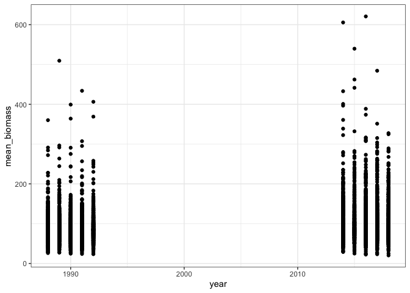
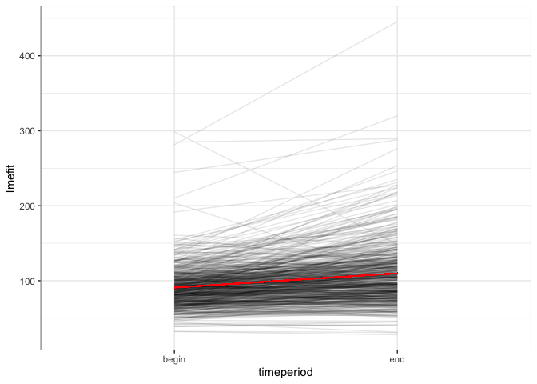
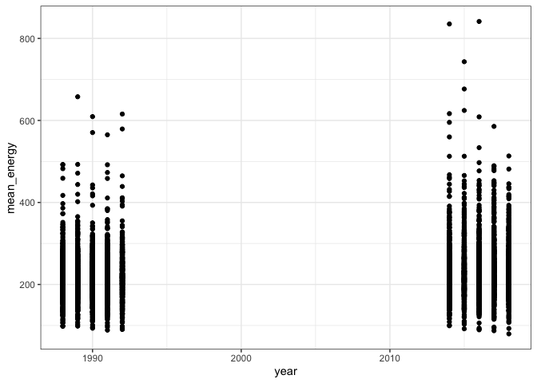
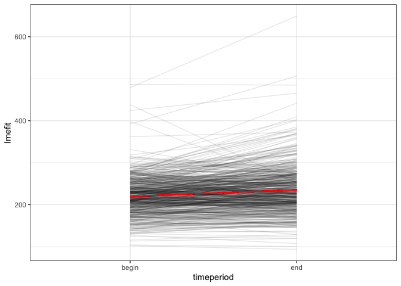
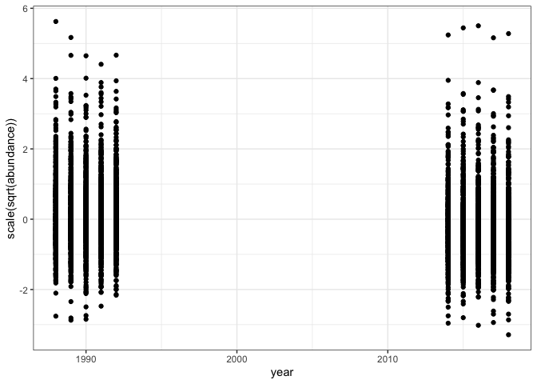
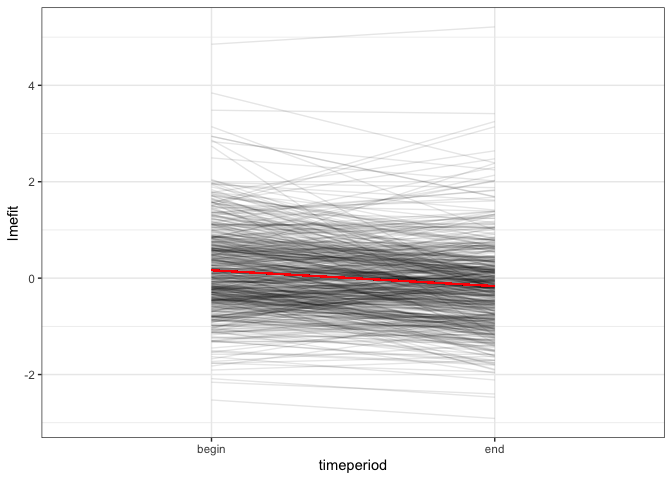

all one
================

``` r
ar <- all_results %>%
  mutate(matssname = paste0("rtrg_", route, "_", statenum))

# 
# lms <- list()
# 
# p.vals <- list()
# 
# for(i in 1:length(unique(ar$matssname))) {
# 
#   thisdat <- filter(ar, matssname == unique(ar$matssname)[i])
# 
#   lms[[i]] <- lm(data = thisdat, mean_biomass ~ timeperiod)
# 
#   thisres <- summary(lms[[i]])
#   p.vals[[i]] <- pf(thisres$fstatistic[1], thisres$fstatistic[2], thisres$fstatistic[3], lower.tail = F)
# 
# }
# 
# ps <- unlist(p.vals)


library(lme4)
```

    ## Loading required package: Matrix

    ## 
    ## Attaching package: 'Matrix'

    ## The following object is masked from 'package:drake':
    ## 
    ##     expand

``` r
wholelme <- lmer(mean_biomass ~ timeperiod + (timeperiod | matssname) , data = ar)
wholelme2 <- lmer(mean_biomass ~ (timeperiod | matssname) , data = ar)
 anova(wholelme, wholelme2)
```

    ## refitting model(s) with ML (instead of REML)

    ## Data: ar
    ## Models:
    ## wholelme2: mean_biomass ~ (timeperiod | matssname)
    ## wholelme: mean_biomass ~ timeperiod + (timeperiod | matssname)
    ##           npar   AIC   BIC logLik deviance  Chisq Df Pr(>Chisq)    
    ## wholelme2    5 51689 51722 -25840    51679                         
    ## wholelme     6 51570 51610 -25779    51558 120.55  1  < 2.2e-16 ***
    ## ---
    ## Signif. codes:  0 '***' 0.001 '**' 0.01 '*' 0.05 '.' 0.1 ' ' 1

``` r
summary(wholelme)
```

    ## Linear mixed model fit by REML ['lmerMod']
    ## Formula: mean_biomass ~ timeperiod + (timeperiod | matssname)
    ##    Data: ar
    ## 
    ## REML criterion at convergence: 51553.1
    ## 
    ## Scaled residuals: 
    ##     Min      1Q  Median      3Q     Max 
    ## -7.8054 -0.4203 -0.0926  0.2997  9.2968 
    ## 
    ## Random effects:
    ##  Groups    Name          Variance Std.Dev. Corr 
    ##  matssname (Intercept)    980.7   31.32         
    ##            timeperiodend 1156.6   34.01    -0.06
    ##  Residual                 649.5   25.48         
    ## Number of obs: 5280, groups:  matssname, 528
    ## 
    ## Fixed effects:
    ##               Estimate Std. Error t value
    ## (Intercept)     90.888      1.450   62.67
    ## timeperiodend   19.042      1.638   11.63
    ## 
    ## Correlation of Fixed Effects:
    ##             (Intr)
    ## timeperidnd -0.151

``` r
#summary(lm(mean_biomass ~ timeperiod * matssname, data = ar))

ggplot(ar, aes(year, mean_biomass)) + geom_point()
```

<!-- -->

``` r
wholelmefitted <- ar %>% mutate(lmefit = predict(wholelme),
                                lmefitnorand = predict(wholelme, re.form = NA))

ggplot(wholelmefitted, aes(timeperiod, lmefit, group = matssname)) + geom_line(alpha = .1)  + geom_line(aes(y = lmefitnorand), alpha = 1, color = "red")
```

<!-- -->

``` r
rsq::rsq(wholelme)
```

    ## $model
    ## [1] 0.7149137
    ## 
    ## $fixed
    ## [1] 0.04053205
    ## 
    ## $random
    ## [1] 0.6743817

There’s a weak but \~significant increase in mean body size across the
whole dataset.

``` r
wholelme <- lmer(mean_energy ~ timeperiod + (timeperiod | matssname) , data = ar)
wholelme2 <- lmer(mean_energy ~ (timeperiod | matssname) , data = ar)
 anova(wholelme, wholelme2)
```

    ## refitting model(s) with ML (instead of REML)

    ## Data: ar
    ## Models:
    ## wholelme2: mean_energy ~ (timeperiod | matssname)
    ## wholelme: mean_energy ~ timeperiod + (timeperiod | matssname)
    ##           npar   AIC   BIC logLik deviance  Chisq Df Pr(>Chisq)    
    ## wholelme2    5 53631 53664 -26811    53621                         
    ## wholelme     6 53576 53615 -26782    53564 57.549  1  3.297e-14 ***
    ## ---
    ## Signif. codes:  0 '***' 0.001 '**' 0.01 '*' 0.05 '.' 0.1 ' ' 1

``` r
summary(wholelme)
```

    ## Linear mixed model fit by REML ['lmerMod']
    ## Formula: mean_energy ~ timeperiod + (timeperiod | matssname)
    ##    Data: ar
    ## 
    ## REML criterion at convergence: 53557.1
    ## 
    ## Scaled residuals: 
    ##     Min      1Q  Median      3Q     Max 
    ## -7.3239 -0.4722 -0.0728  0.3729  8.4211 
    ## 
    ## Random effects:
    ##  Groups    Name          Variance Std.Dev. Corr 
    ##  matssname (Intercept)   2359.0   48.57         
    ##            timeperiodend 1833.0   42.81    -0.13
    ##  Residual                 893.3   29.89         
    ## Number of obs: 5280, groups:  matssname, 528
    ## 
    ## Fixed effects:
    ##               Estimate Std. Error t value
    ## (Intercept)    219.721      2.192  100.22
    ## timeperiodend   15.867      2.037    7.79
    ## 
    ## Correlation of Fixed Effects:
    ##             (Intr)
    ## timeperidnd -0.192

``` r
#summary(lm(mean_energy ~ timeperiod * matssname, data = ar))

ggplot(ar, aes(year, mean_energy)) + geom_point()
```

<!-- -->

``` r
wholelmefitted <- ar %>% mutate(lmefit = predict(wholelme),
                                lmefitnorand = predict(wholelme, re.form = NA))

ggplot(wholelmefitted, aes(timeperiod, lmefit, group = matssname)) + geom_line(alpha = .1)  + geom_line(aes(y = lmefitnorand), alpha = 1, color = "red")
```

<!-- -->

``` r
rsq::rsq(wholelme)
```

    ## $model
    ## [1] 0.7751443
    ## 
    ## $fixed
    ## [1] 0.01592373
    ## 
    ## $random
    ## [1] 0.7592205

And by weak I mean 1. Microscopic 2. Explains ….4% of variation

``` r
wholelme <- lmer(scale(sqrt(abundance)) ~ timeperiod + (timeperiod | matssname) , data = ar)
wholelme2 <- lmer(scale(sqrt(abundance))  ~ (timeperiod | matssname) , data = ar)
 anova(wholelme, wholelme2)
```

    ## refitting model(s) with ML (instead of REML)

    ## Data: ar
    ## Models:
    ## wholelme2: scale(sqrt(abundance)) ~ (timeperiod | matssname)
    ## wholelme: scale(sqrt(abundance)) ~ timeperiod + (timeperiod | matssname)
    ##           npar    AIC    BIC  logLik deviance  Chisq Df Pr(>Chisq)    
    ## wholelme2    5 7241.3 7274.2 -3615.7   7231.3                         
    ## wholelme     6 7160.1 7199.6 -3574.1   7148.1 83.193  1  < 2.2e-16 ***
    ## ---
    ## Signif. codes:  0 '***' 0.001 '**' 0.01 '*' 0.05 '.' 0.1 ' ' 1

``` r
summary(wholelme)
```

    ## Linear mixed model fit by REML ['lmerMod']
    ## Formula: scale(sqrt(abundance)) ~ timeperiod + (timeperiod | matssname)
    ##    Data: ar
    ## 
    ## REML criterion at convergence: 7157.8
    ## 
    ## Scaled residuals: 
    ##     Min      1Q  Median      3Q     Max 
    ## -6.2038 -0.4726 -0.0128  0.4489  7.5913 
    ## 
    ## Random effects:
    ##  Groups    Name          Variance Std.Dev. Corr 
    ##  matssname (Intercept)   0.8736   0.9346        
    ##            timeperiodend 0.5930   0.7701   -0.43
    ##  Residual                0.1153   0.3395        
    ## Number of obs: 5280, groups:  matssname, 528
    ## 
    ## Fixed effects:
    ##               Estimate Std. Error t value
    ## (Intercept)    0.16497    0.04121   4.003
    ## timeperiodend -0.32995    0.03479  -9.483
    ## 
    ## Correlation of Fixed Effects:
    ##             (Intr)
    ## timeperidnd -0.441

``` r
#summary(lm(mean_energy ~ timeperiod * matssname, data = ar))

ggplot(ar, aes(year, scale(sqrt(abundance)) )) + geom_point()
```

<!-- -->

``` r
wholelmefitted <- ar %>% mutate(lmefit = predict(wholelme),
                                lmefitnorand = predict(wholelme, re.form = NA))

ggplot(wholelmefitted, aes(timeperiod, lmefit, group = matssname)) + geom_line(alpha = .1)  + geom_line(aes(y = lmefitnorand), alpha = 1, color = "red")
```

<!-- -->

``` r
rsq::rsq(wholelme)
```

    ## $model
    ## [1] 0.8847175
    ## 
    ## $fixed
    ## [1] 0.02722165
    ## 
    ## $random
    ## [1] 0.8574959
