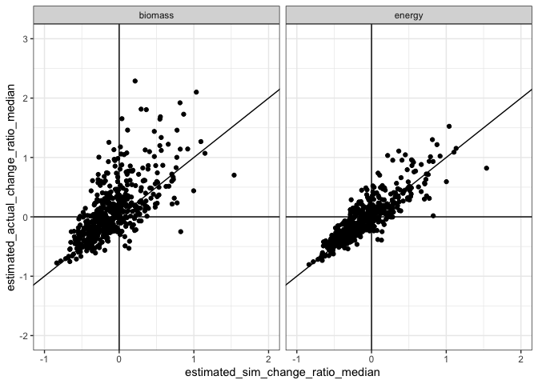
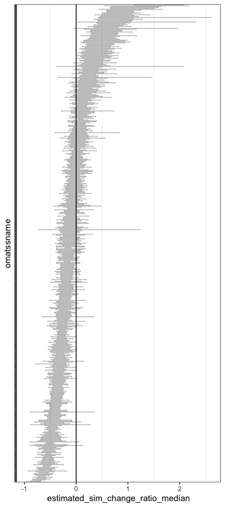
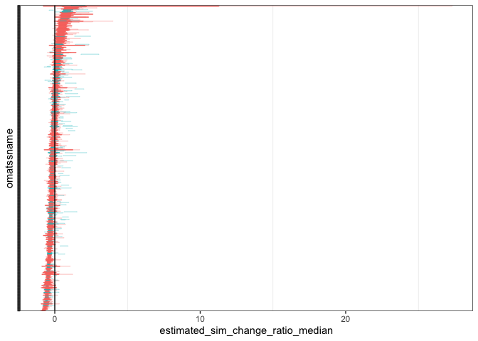
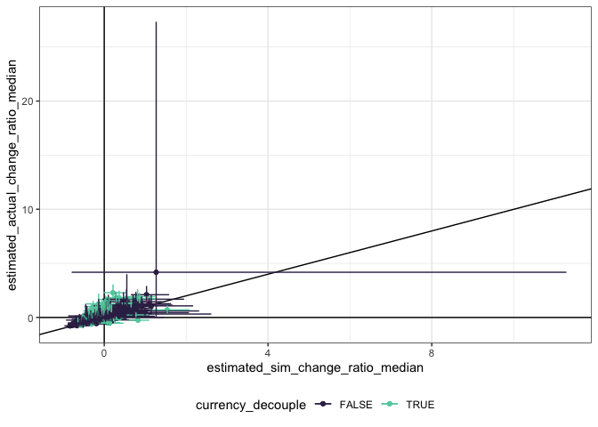
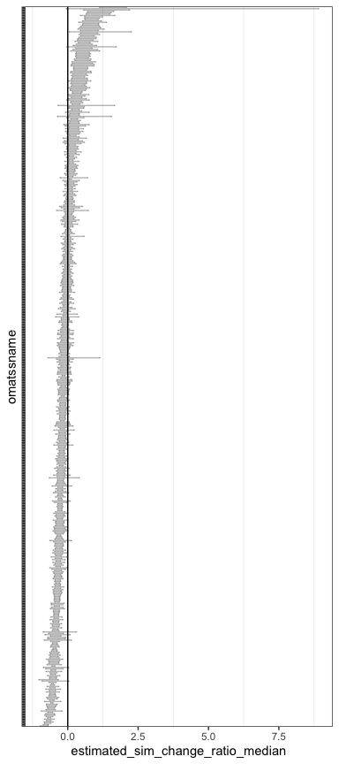
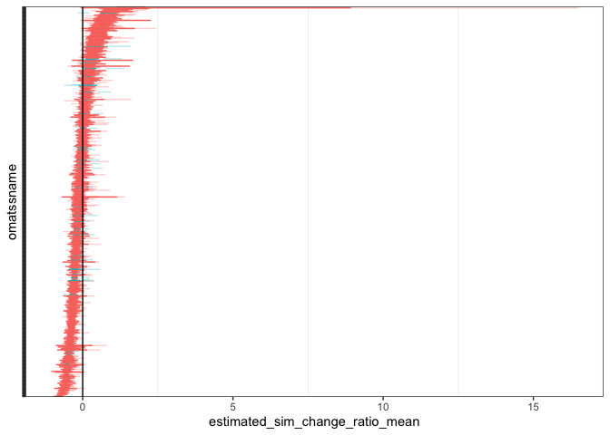
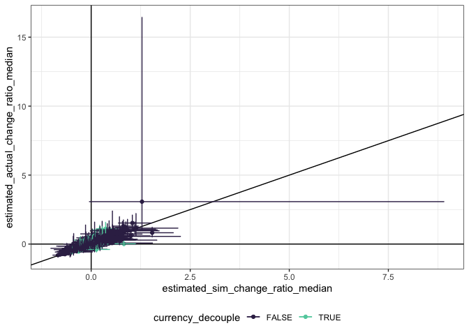

ReSims analysis
================

Estimated change due to abundance:

`estimated_sim_change_ratio` mean, upper, and lower.

``` r
ggplot(all_estimates, aes(estimated_sim_change_ratio_median, estimated_actual_change_ratio_median)) +
  geom_point() +
  geom_vline(xintercept = 0) +
  geom_hline(yintercept = 0)+
  geom_abline(intercept = 0, slope = 1) +
## geom_errorbarh(aes(xmin = estimated_sim_change_ratio_lower, xmax = estimated_sim_change_ratio_upper, y = estimated_actual_change_ratio_median), height = .005) +
  #geom_errorbar(aes(ymin = estimated_actual_change_ratio_lower, ymax = estimated_actual_change_ratio_upper, x = estimated_sim_change_ratio_median), width = .005) +
  #scale_color_viridis_d(option='mako', begin = .2, end =.8) +
  theme(legend.position = "none") +
  facet_wrap(vars(currency)) +
xlim(-1, 2) +
ylim(-2, 3)
```

    ## Warning: Removed 2 rows containing missing values (geom_point).

<!-- -->
\#\# biomass

``` r
biomass <- filter(all_estimates, currency == "biomass")

biomass_summary <- biomass %>%
  arrange(estimated_sim_change_ratio_median) %>%
  mutate(sim_change_ratio_rank = row_number()) %>%
  mutate(omatssname = ordered(1:nrow(biomass), labels = matssname))


ggplot(filter(biomass_summary, matssname != "bbs_rtrg_14_33"), aes(estimated_sim_change_ratio_median, omatssname)) + 
 # geom_point() +
  geom_errorbarh(aes(xmin = estimated_sim_change_ratio_lower, xmax = estimated_sim_change_ratio_upper), alpha = .3) + 
 # geom_point(aes(x = estimated_actual_change_ratio_mean), color = "blue", alpha = .6) +
# geom_errorbarh(aes(xmin = estimated_actual_change_ratio_lower, xmax = estimated_actual_change_ratio_upper), color = "blue", alpha = .3) + 
  geom_vline(xintercept = 0) +
  theme_bw() +
  theme(axis.text.y = element_blank(), panel.grid.major= element_blank()) 
```

<!-- -->

``` r
#loadd(all_sims, cache = cache)

#ggplot(all_sims, aes(year, total_biomass, color = source)) + geom_point() + facet_wrap(vars(matssname,source), scales = "free_y")
```

Some interpretation points…

``` r
biomass_interp <- biomass_summary %>%
  group_by_all() %>%
  mutate(
    abundance_change_ratio_over_zero = (estimated_sim_change_ratio_upper * estimated_sim_change_ratio_lower) < 0,
    currency_over_abundance = ((estimated_sim_change_ratio_upper < estimated_actual_change_ratio_lower)),
    abundance_over_currency = estimated_sim_change_ratio_lower > estimated_actual_change_ratio_upper,
    currency_decouple = currency_over_abundance | abundance_over_currency
  ) %>%
  ungroup()


ggplot(biomass_interp, aes(estimated_sim_change_ratio_median, omatssname, color = currency_decouple)) + 
 # geom_point() +
  geom_errorbarh(aes(xmin = estimated_sim_change_ratio_lower, xmax = estimated_sim_change_ratio_upper)) + 
 # geom_point(aes(x = estimated_actual_change_ratio_median), color = "blue", alpha = .6) +
  geom_errorbarh(aes(xmin = estimated_actual_change_ratio_lower, xmax = estimated_actual_change_ratio_upper), alpha = .3) + 
  geom_vline(xintercept = 0) +
  theme_bw() +
  theme(axis.text.y = element_blank(), panel.grid.major= element_blank(), legend.position = "none")
```

<!-- -->

``` r
ggplot(biomass_interp, aes(estimated_sim_change_ratio_median, estimated_actual_change_ratio_median, color= currency_decouple)) +
  geom_point() +
  geom_vline(xintercept = 0) +
  geom_hline(yintercept = 0)+
  geom_abline(intercept = 0, slope = 1) +
  geom_errorbarh(aes(xmin = estimated_sim_change_ratio_lower, xmax = estimated_sim_change_ratio_upper, y = estimated_actual_change_ratio_median), height = .005) +
  geom_errorbar(aes(ymin = estimated_actual_change_ratio_lower, ymax = estimated_actual_change_ratio_upper, x = estimated_sim_change_ratio_median), width = .005) +
  scale_color_viridis_d(option='mako', begin = .2, end =.8) +
  theme_bw() +
  theme(legend.position = "bottom")
```

<!-- -->

``` r
mean(biomass_interp$abundance_change_ratio_over_zero)
```

    ## [1] 0.4166667

``` r
mean(biomass_interp$estimated_sim_change_ratio_lower > 0)
```

    ## [1] 0.1609848

``` r
mean(biomass_interp$estimated_sim_change_ratio_upper < 0)
```

    ## [1] 0.4223485

``` r
mean(biomass_interp$abundance_over_currency)
```

    ## [1] 0.03977273

``` r
mean(biomass_interp$currency_over_abundance)
```

    ## [1] 0.2007576

``` r
mean(biomass_interp$currency_decouple)
```

    ## [1] 0.2405303

# energy

``` r
energy <- filter(all_estimates, currency == "energy")

energy_summary <- energy %>%
  arrange(estimated_sim_change_ratio_median) %>%
  mutate(sim_change_ratio_rank = row_number()) %>%
  mutate(omatssname = ordered(1:nrow(energy), labels = matssname))


ggplot(energy_summary, aes(estimated_sim_change_ratio_median, omatssname)) + 
 # geom_point() +
  geom_errorbarh(aes(xmin = estimated_sim_change_ratio_lower, xmax = estimated_sim_change_ratio_upper), alpha = .3) + 
 # geom_point(aes(x = estimated_actual_change_ratio_mean), color = "blue", alpha = .6) +
# geom_errorbarh(aes(xmin = estimated_actual_change_ratio_lower, xmax = estimated_actual_change_ratio_upper), color = "blue", alpha = .3) + 
  geom_vline(xintercept = 0) +
  theme_bw() +
  theme(axis.text.y = element_blank(), panel.grid.major= element_blank()) 
```

<!-- -->

``` r
#loadd(all_sims, cache = cache)

#ggplot(all_sims, aes(year, total_energy, color = source)) + geom_point() + facet_wrap(vars(matssname,source), scales = "free_y")
```

Some interpretation points…

``` r
energy_interp <- energy_summary %>%
  group_by_all() %>%
  mutate(
    abundance_change_ratio_over_zero = (estimated_sim_change_ratio_upper * estimated_sim_change_ratio_lower) < 0,
    currency_over_abundance = ((estimated_sim_change_ratio_upper < estimated_actual_change_ratio_lower)),
    abundance_over_currency = estimated_sim_change_ratio_lower > estimated_actual_change_ratio_upper,
    currency_decouple = currency_over_abundance | abundance_over_currency
  ) %>%
  ungroup()


ggplot(energy_interp, aes(estimated_sim_change_ratio_mean, omatssname, color = currency_decouple)) + 
 # geom_point() +
  geom_errorbarh(aes(xmin = estimated_sim_change_ratio_lower, xmax = estimated_sim_change_ratio_upper)) + 
 # geom_point(aes(x = estimated_actual_change_ratio_mean), color = "blue", alpha = .6) +
  geom_errorbarh(aes(xmin = estimated_actual_change_ratio_lower, xmax = estimated_actual_change_ratio_upper), alpha = .3) + 
  geom_vline(xintercept = 0) +
  theme_bw() +
  theme(axis.text.y = element_blank(), panel.grid.major= element_blank(), legend.position = "none")
```

<!-- -->

``` r
ggplot(energy_interp, aes(estimated_sim_change_ratio_median, estimated_actual_change_ratio_median, color= currency_decouple)) +
  geom_point() +
  geom_vline(xintercept = 0) +
  geom_hline(yintercept = 0)+
  geom_abline(intercept = 0, slope = 1) +
  geom_errorbarh(aes(xmin = estimated_sim_change_ratio_lower, xmax = estimated_sim_change_ratio_upper, y = estimated_actual_change_ratio_median), height = .005) +
  geom_errorbar(aes(ymin = estimated_actual_change_ratio_lower, ymax = estimated_actual_change_ratio_upper, x = estimated_sim_change_ratio_median), width = .005) +
  scale_color_viridis_d(option='mako', begin = .2, end =.8) +
  theme_bw() +
  theme(legend.position = "bottom")
```

<!-- -->

``` r
mean(energy_interp$abundance_change_ratio_over_zero)
```

    ## [1] 0.4034091

``` r
mean(energy_interp$estimated_sim_change_ratio_lower > 0)
```

    ## [1] 0.1647727

``` r
mean(energy_interp$estimated_sim_change_ratio_upper < 0)
```

    ## [1] 0.4318182

``` r
mean(energy_interp$abundance_over_currency)
```

    ## [1] 0.02083333

``` r
mean(energy_interp$currency_over_abundance)
```

    ## [1] 0.0530303

``` r
mean(energy_interp$currency_decouple)
```

    ## [1] 0.07386364

bbs\_rtrg\_14\_33 is super weird - really huge estimates and error bars.

bbs\_rtrg\_23\_64 has a change estimate of -1.4 which shouldn’t be
possible. The median does not have this problem.

<!-- ```{r} -->

<!-- loadd(sims_sgmms_bbs_rtrg_23_64, cache = cache) -->

<!-- loadd(ests_fits_sims_sgmms_bbs_rtrg_23_64, cache = cache) -->

<!-- ggplot(sims_sgmms_bbs_rtrg_23_64, aes(year, total_energy, color = source)) + geom_point() + facet_wrap(vars(source)) -->

<!-- ggplot(ests_fits_sims_sgmms_bbs_rtrg_23_64, aes(estimated_actual_begin)) + geom_density() + facet_wrap(vars(currency)) + geom_density(aes(estimated_actual_end)) -->

<!-- ggplot(ests_fits_sims_sgmms_bbs_rtrg_23_64, aes(estimated_actual_change_ratio)) + geom_density() + facet_wrap(vars(currency)) + xlim(-5, 5) -->

<!-- loadd(sims_sgmms_bbs_rtrg_14_33, cache = cache) -->

<!-- ggplot(sims_sgmms_bbs_rtrg_14_33, aes(year, total_energy, color = source)) + geom_point() + facet_wrap(vars(source)) -->

<!-- ``` -->
