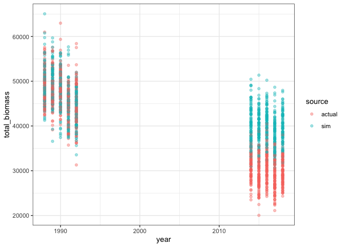
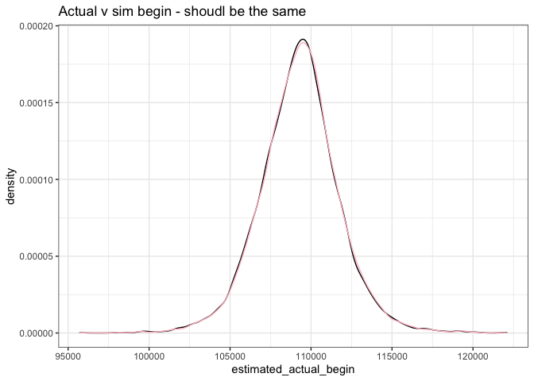
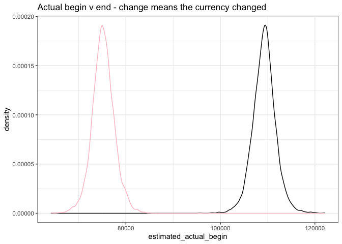
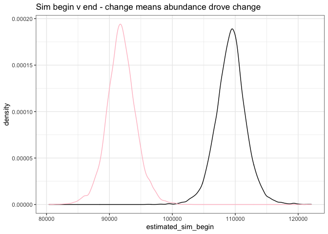
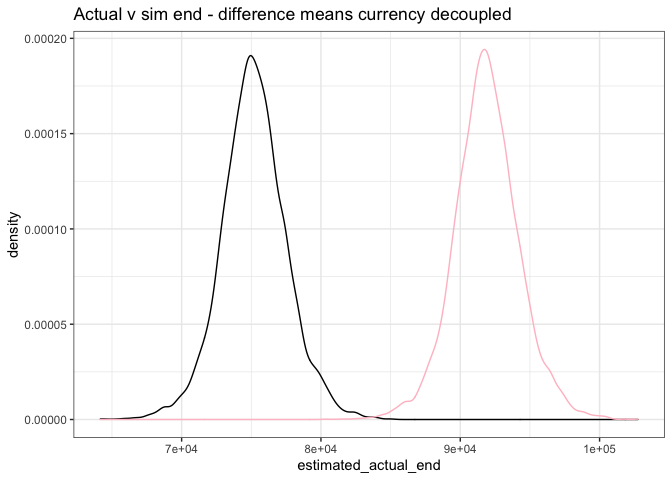
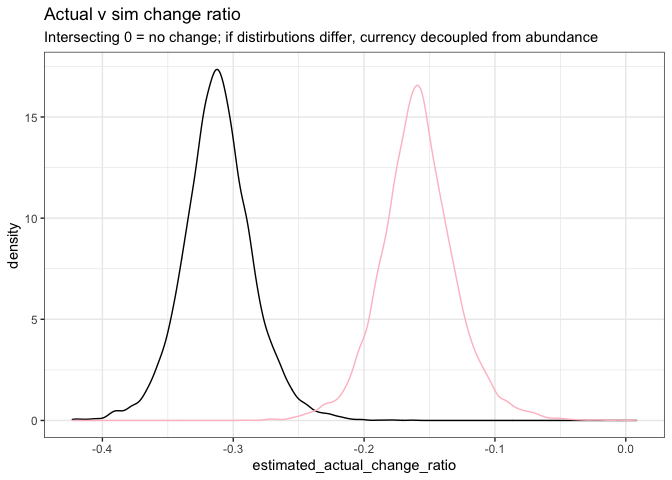

ReSims analysis
================

``` r
# routename is not unique but matssname is
someres <- someres %>%
  mutate(matssname = paste0("bbs_rtrg_", route, "_", statenum))


# k for analyses you want just sims
justsims <- filter(someres, source != "raw")

# and just one route

a_route <- filter(justsims, matssname == unique(justsims$matssname)[13])
```

``` r
ggplot(a_route, aes(year, total_biomass, color = source, group = as.factor(sim_iteration))) + geom_point(alpha = .4) 
```

<!-- -->

``` r
# Fit BRM

one_brm <- brm(total_energy ~ (timeperiod * source) + (1 | year), data = a_route, cores = 4, iter = 4000) # To run on the hipergator, you will want to use just 1 core and sacrifice the little bit of efficiency to keep it working within your current config. But, I'm impatient when working interactively. Also, interestingly, I don't know how `cores` will play with Rmarkdown.
```

    ## Compiling Stan program...

    ## Trying to compile a simple C file

    ## Running /Library/Frameworks/R.framework/Resources/bin/R CMD SHLIB foo.c
    ## clang -I"/Library/Frameworks/R.framework/Resources/include" -DNDEBUG   -I"/Library/Frameworks/R.framework/Versions/4.0/Resources/library/Rcpp/include/"  -I"/Library/Frameworks/R.framework/Versions/4.0/Resources/library/RcppEigen/include/"  -I"/Library/Frameworks/R.framework/Versions/4.0/Resources/library/RcppEigen/include/unsupported"  -I"/Library/Frameworks/R.framework/Versions/4.0/Resources/library/BH/include" -I"/Library/Frameworks/R.framework/Versions/4.0/Resources/library/StanHeaders/include/src/"  -I"/Library/Frameworks/R.framework/Versions/4.0/Resources/library/StanHeaders/include/"  -I"/Library/Frameworks/R.framework/Versions/4.0/Resources/library/RcppParallel/include/"  -I"/Library/Frameworks/R.framework/Versions/4.0/Resources/library/rstan/include" -DEIGEN_NO_DEBUG  -DBOOST_DISABLE_ASSERTS  -DBOOST_PENDING_INTEGER_LOG2_HPP  -DSTAN_THREADS  -DBOOST_NO_AUTO_PTR  -include '/Library/Frameworks/R.framework/Versions/4.0/Resources/library/StanHeaders/include/stan/math/prim/mat/fun/Eigen.hpp'  -D_REENTRANT -DRCPP_PARALLEL_USE_TBB=1   -I/usr/local/include   -fPIC  -Wall -g -O2  -c foo.c -o foo.o
    ## In file included from <built-in>:1:
    ## In file included from /Library/Frameworks/R.framework/Versions/4.0/Resources/library/StanHeaders/include/stan/math/prim/mat/fun/Eigen.hpp:13:
    ## In file included from /Library/Frameworks/R.framework/Versions/4.0/Resources/library/RcppEigen/include/Eigen/Dense:1:
    ## In file included from /Library/Frameworks/R.framework/Versions/4.0/Resources/library/RcppEigen/include/Eigen/Core:88:
    ## /Library/Frameworks/R.framework/Versions/4.0/Resources/library/RcppEigen/include/Eigen/src/Core/util/Macros.h:628:1: error: unknown type name 'namespace'
    ## namespace Eigen {
    ## ^
    ## /Library/Frameworks/R.framework/Versions/4.0/Resources/library/RcppEigen/include/Eigen/src/Core/util/Macros.h:628:16: error: expected ';' after top level declarator
    ## namespace Eigen {
    ##                ^
    ##                ;
    ## In file included from <built-in>:1:
    ## In file included from /Library/Frameworks/R.framework/Versions/4.0/Resources/library/StanHeaders/include/stan/math/prim/mat/fun/Eigen.hpp:13:
    ## In file included from /Library/Frameworks/R.framework/Versions/4.0/Resources/library/RcppEigen/include/Eigen/Dense:1:
    ## /Library/Frameworks/R.framework/Versions/4.0/Resources/library/RcppEigen/include/Eigen/Core:96:10: fatal error: 'complex' file not found
    ## #include <complex>
    ##          ^~~~~~~~~
    ## 3 errors generated.
    ## make: *** [foo.o] Error 1

    ## Start sampling

``` r
# Running with twice as many it as I think I need just to provide padding aginst convergence issues at scale.
```

``` r
# Obtain posterior draws from brm

# Get all draws from the posterior and get just the terms we want
td <- tidy_draws(one_brm) %>%
#  select_at(vars(starts_with("b"))) %>%
  mutate(rowindex = row_number()) # and get a row index to keep draws together, I'm not sure if this matters but I'll do it

td_ests <- td %>%
  rename(timeperiodend_sourcesim = `b_timeperiodend:sourcesim`) %>%
  group_by_all() %>%
  mutate(
        estimated_actual_begin = sum(b_Intercept), # estimated beginning value
    estimated_actual_end = sum(b_Intercept, b_timeperiodend), # estimated end value
    estimated_sim_begin = sum(b_Intercept, b_sourcesim), # estimated beginning value from sims. we expect this to be equal to the estimated beginning value, any change is just sampling error.
    estimated_sim_end = sum(b_Intercept, b_timeperiodend, timeperiodend_sourcesim, b_sourcesim),
    estimated_actual_change_ratio = (estimated_actual_end - estimated_actual_begin) / estimated_actual_begin, # this is a measure of the magnitude of the change from beginning to end. the sign is going to be increase (positive) or decrease. the magnitude is the % increase. so .1 = added 10% of starting (biomass or energy) to get to the end. -.2 = lost 20% of starting (biomass or energy) between begin and end.
    estimated_sim_change_ratio = (estimated_sim_end - estimated_sim_begin) / estimated_sim_begin, # same measure but having drawn the end values using the beginning isd. this is the amount of change expected due only to changes in the numbers of individuals observed in each time period. by comparing estimated_actual_change_ratio to estimated_sim_change_ratio, I believe we get an estimate of both the significance and magnitude of decoupling of (biomass or energy) and numerical abundance due to changes in the size spectrum.
    estimated_actual_change = estimated_actual_end - estimated_actual_begin, # the "slope" assuming x = 0 or 1 for begin or end. aka the absolute change from end to begin.
    estimated_sim_change = estimated_sim_end - estimated_sim_begin, # absolute change from end to begin due to abundance change
    estimated_change_ratio_deviation = estimated_actual_change_ratio - estimated_sim_change_ratio, # deviation of change ratios from 1:1
    estimated_change_deviation = estimated_actual_change - estimated_sim_change # deviation of actual change from 1:1
  
  ) %>%
  ungroup()


# checking arithmetic
# 
# a_lm <- lm(total_energy ~ (timeperiod * source), data = a_route)
# summary(a_lm)
# a_lm_emmeans <- emmeans::emmeans(a_lm, ~ timeperiod | source)
# a_lm_emmeans
# 
# 
# brm_ests <- as.data.frame(predict(one_brm, re_formula = NA))%>%
#   cbind(a_route)
# 
# ggplot(brm_ests, aes(year, Estimate, color = source, group = as.factor(sim_iteration))) + geom_point(alpha = .4) 
# 
# brm_mean_ests <- brm_ests %>%
#   group_by(timeperiod, source) %>%
#   summarize(meanest = mean(Estimate)) %>%
#   ungroup()
# 
# ggplot(brm_mean_ests, aes(timeperiod, meanest, color = source)) + geom_point() 

ggplot(td_ests, aes(estimated_actual_begin)) + geom_density() + geom_density(aes(x = estimated_sim_begin), color = "pink") + ggtitle("Actual v sim begin - shoudl be the same")
```

<!-- -->

``` r
ggplot(td_ests, aes(estimated_actual_begin)) + geom_density() + geom_density(aes(x = estimated_actual_end), color = "pink") + ggtitle("Actual begin v end - change means the currency changed")
```

<!-- -->

``` r
ggplot(td_ests, aes(estimated_sim_begin)) + geom_density() + geom_density(aes(x = estimated_sim_end), color = "pink") + ggtitle("Sim begin v end - change means abundance drove change")
```

<!-- -->

``` r
ggplot(td_ests, aes(estimated_actual_end)) + geom_density() + geom_density(aes(x = estimated_sim_end), color = "pink") + ggtitle("Actual v sim end - difference means currency decoupled")
```

<!-- -->

``` r
ggplot(td_ests, aes(estimated_actual_change_ratio)) + geom_density() + geom_density(aes(x = estimated_sim_change_ratio), color = "pink") + ggtitle("Actual v sim change ratio", subtitle = "Intersecting 0 = no change; if distirbutions differ, currency decoupled from abundance")
```

<!-- -->

``` r
ggplot(td_ests, aes(estimated_change_ratio_deviation)) + geom_density() + ggtitle("Actual v sim change deviation", subtitle = "Actual change ratio - sim change ratio. If overlaps 0, same. If < 0, currency slope less positive than abundance slope")
```

<!-- -->
