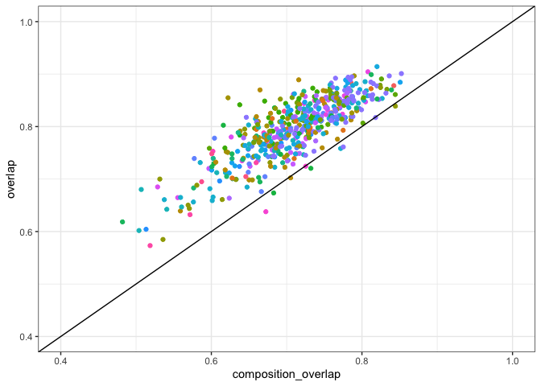
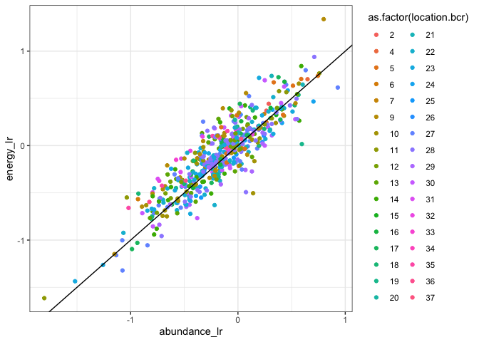
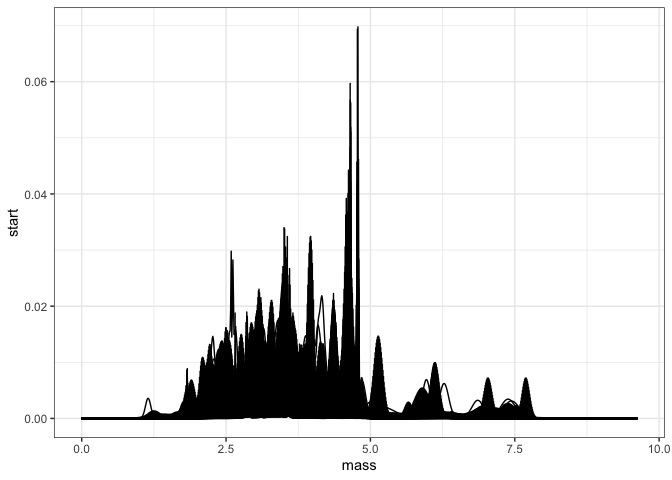
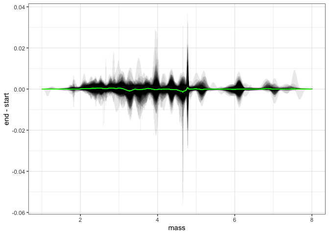
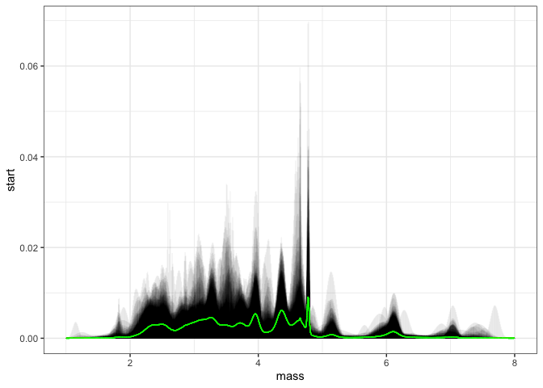
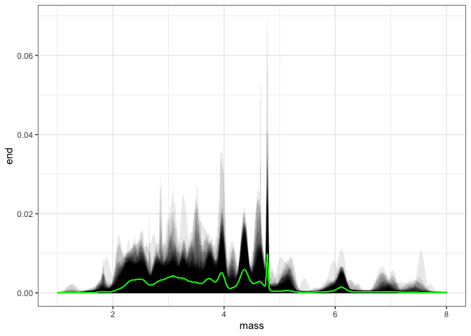

all
================

  - [Time periods](#time-periods)
  - [Overlap in ISD and species
    composition](#overlap-in-isd-and-species-composition)
  - [State variables](#state-variables)

``` r
working_routes <- read.csv(here::here("working_routes.csv"))

all_overlaps <- right_join(all_overlaps, working_routes)
```

    ## Joining, by = c("route", "region", "location.bcr", "location.statenum", "location.routename")

``` r
all_smooths <- right_join(all_smooths, working_routes)
```

    ## Joining, by = c("route", "region", "location.bcr", "location.statenum", "location.routename")

``` r
all_svs <- right_join(all_svs, working_routes)
```

    ## Joining, by = c("route", "region")

``` r
all_composition <- right_join(all_composition, working_routes)
```

    ## Joining, by = c("route", "region", "location.bcr")

``` r
isd_r2 <- function(focal, compare) {
  
  focal_mean <- mean(focal)

  numer <- sum((focal - compare) ^ 2)
  denom <- sum((focal - focal_mean) ^ 2)
  1 - (numer/denom)
}
```

## Time periods

``` r
# 
route_years <- select(all_overlaps, route, region, location.bcr, location.routename, startyears, endyears) %>%
  distinct() %>%
  mutate(start = as.integer(substr(startyears, 0, 4)),
         end = as.integer(substr(endyears, 25,28)),
         startend = as.integer(substr(startyears, 25, 28)),
         endbegin = as.integer(substr(endyears, 0, 4))) %>%
  mutate(nyears = end - start) %>%
  mutate(startlate = start > 1975,
         endearly = end < 2010,
         startconsec = startend == start + 4,
         endconsec = endbegin == end - 4) %>%
  group_by_all() %>%
  mutate(weirdtime = startlate | endearly) %>%
  ungroup() %>%
  mutate(start_1988 = start == 1988)

#
# 
# ggplot(route_years, aes(x = start, y = as.factor(route), color = start_1988)) + 
#   geom_errorbar(aes(xmin = start, xmax = end)) + xlab("Time coverage") + ylab("Route")
# 
```

## Overlap in ISD and species composition

``` r
all_overlaps <- left_join(all_overlaps, all_composition) %>% left_join(select(route_years, route, region, location.bcr, nyears, start_1988)) %>%
  filter(start_1988)
```

    ## Joining, by = c("route", "region", "location.bcr", "location.statenum", "location.routename", "sim_seed", "nyears_start", "nyears_end", "complete_coverage", "matssname", "window", "nreq")

    ## Joining, by = c("route", "region", "location.bcr")

``` r
ggplot(all_overlaps, aes(composition_overlap, overlap, color = as.factor(location.bcr))) + geom_point() + geom_abline(intercept = 0, slope = 1) + xlim(.4, 1) + ylim(.4,1) + theme(legend.position = "none")
```

<!-- -->

## State variables

``` r
all_sv_wide <- all_svs %>%
    left_join(select(route_years, route, region, location.bcr, nyears, start_1988)) %>%
  filter(start_1988) %>%
  select(timechunk, energy, biomass, abundance,route, region,location.bcr, sim_seed) %>%
  tidyr::pivot_wider(id_cols = c("route", "region", "sim_seed", "location.bcr"), names_from = timechunk, values_from = c("energy", "biomass", "abundance"))
```

    ## Joining, by = c("route", "region", "location.bcr")

``` r
all_sv_change <- all_sv_wide %>%
  mutate(energy_lr = log(energy_end / energy_start),
         biomass_lr = log(biomass_end / biomass_start),
         abundance_lr = log(abundance_end/ abundance_start)) 

ggplot(all_sv_change, aes(abundance_lr, energy_lr, color = as.factor(location.bcr))) + geom_point() + geom_abline(intercept = 0, slope = 1) 
```

<!-- -->

``` r
all_long_smooths <- all_smooths %>%  left_join(select(route_years, route, region, location.bcr, nyears, start_1988)) %>%
  filter(start_1988)
```

    ## Joining, by = c("route", "region", "location.bcr")

``` r
ggplot(all_long_smooths, aes(mass, start, group= route)) + geom_line()
```

<!-- -->

``` r
all_long_smooths <- all_long_smooths %>%
  group_by(mass) %>%
  mutate(mean_diff = mean(end - start),
         mean_start = mean(start),
         mean_end = mean(end)) %>%
  ungroup()

ggplot(all_long_smooths, aes(mass, end - start, group = route)) + geom_segment(aes(x = mass, y = 0, xend = mass, yend = end - start), alpha = .05) + xlim(1, 8) + geom_line(aes(mass, mean_diff), color = "green", alpha = .05)
```

    ## Warning: Removed 143616 rows containing missing values (geom_segment).

    ## Warning: Removed 143616 row(s) containing missing values (geom_path).

<!-- -->

``` r
all_long_smooths %>% summarize(diff_r2 = isd_r2(density_diff, mean_diff))
```

    ## # A tibble: 1 x 1
    ##   diff_r2
    ##     <dbl>
    ## 1  0.0461

``` r
ggplot(all_long_smooths, aes(mass, start, group = route)) + geom_segment(aes(x = mass, y = 0, xend = mass, yend =  start), alpha = .05) + xlim(1, 8) + geom_line(aes(mass, mean_start), color = "green", alpha = .05)
```

    ## Warning: Removed 143616 rows containing missing values (geom_segment).
    
    ## Warning: Removed 143616 row(s) containing missing values (geom_path).

<!-- -->

``` r
all_long_smooths %>% summarize(start_r2 = isd_r2(start, mean_start))
```

    ## # A tibble: 1 x 1
    ##   start_r2
    ##      <dbl>
    ## 1    0.532

``` r
ggplot(all_long_smooths, aes(mass, end, group = route)) + geom_segment(aes(x = mass, y = 0, xend = mass, yend = end), alpha = .05) + xlim(1, 8) + geom_line(aes(mass, mean_end), color = "green", alpha = .05)
```

    ## Warning: Removed 143616 rows containing missing values (geom_segment).
    
    ## Warning: Removed 143616 row(s) containing missing values (geom_path).

<!-- -->

``` r
all_long_smooths %>% summarize(end_r2 = isd_r2(end, mean_end))
```

    ## # A tibble: 1 x 1
    ##   end_r2
    ##    <dbl>
    ## 1  0.542

``` r
meanshift <- select(all_long_smooths, mass, mean_diff) %>%
  distinct()


sum(abs(meanshift$mean_diff)) / 2
```

    ## [1] 0.057895

``` r
filter(all_overlaps) %>%
  select(route, overlap) %>%
  mutate(change = 1-overlap)
```

    ##     route   overlap     change
    ## 1       9 0.7913195 0.20868047
    ## 2      20 0.8168480 0.18315199
    ## 3      28 0.6999724 0.30002759
    ## 4      29 0.7640674 0.23593256
    ## 5      40 0.7762667 0.22373329
    ## 6      45 0.7396452 0.26035477
    ## 7     208 0.8891056 0.11089436
    ## 8     255 0.7520911 0.24790891
    ## 9     413 0.7949456 0.20505436
    ## 10      7 0.8097475 0.19025254
    ## 11      2 0.7796469 0.22035305
    ## 12      7 0.5849150 0.41508500
    ## 13     26 0.8415562 0.15844385
    ## 14     34 0.8440923 0.15590765
    ## 15     41 0.8129625 0.18703746
    ## 16     21 0.7592182 0.24078182
    ## 17     29 0.8485722 0.15142779
    ## 18      7 0.8508102 0.14918979
    ## 19     11 0.7637628 0.23623721
    ## 20     14 0.8198003 0.18019969
    ## 21     15 0.8622336 0.13776642
    ## 22     22 0.8065280 0.19347204
    ## 23     26 0.8072423 0.19275766
    ## 24     37 0.8223175 0.17768248
    ## 25     66 0.8526364 0.14736364
    ## 26     83 0.8274487 0.17255134
    ## 27    113 0.8369081 0.16309190
    ## 28    119 0.8651168 0.13488322
    ## 29      1 0.8116862 0.18831381
    ## 30      5 0.7586012 0.24139877
    ## 31     19 0.7968139 0.20318613
    ## 32     22 0.7914664 0.20853364
    ## 33     39 0.8112861 0.18871388
    ## 34     60 0.7664701 0.23352993
    ## 35     61 0.8173773 0.18262269
    ## 36     33 0.8388761 0.16112390
    ## 37      7 0.7249310 0.27506898
    ## 38     12 0.8286048 0.17139515
    ## 39     14 0.8319232 0.16807682
    ## 40     16 0.8024080 0.19759205
    ## 41     19 0.8119522 0.18804784
    ## 42     22 0.7779007 0.22209932
    ## 43     24 0.6760918 0.32390822
    ## 44     35 0.8331241 0.16687594
    ## 45     43 0.8252365 0.17476352
    ## 46     45 0.7594435 0.24055651
    ## 47     47 0.8400266 0.15997340
    ## 48     50 0.8490607 0.15093933
    ## 49     41 0.8261460 0.17385397
    ## 50    131 0.8837134 0.11628658
    ## 51    224 0.8083508 0.19164918
    ## 52    231 0.8779894 0.12201063
    ## 53    318 0.8282738 0.17172621
    ## 54     28 0.7879460 0.21205404
    ## 55     32 0.8497848 0.15021523
    ## 56    122 0.7529489 0.24705111
    ## 57      5 0.8332701 0.16672992
    ## 58      8 0.7239481 0.27605191
    ## 59     10 0.6042946 0.39570538
    ## 60     13 0.8572487 0.14275132
    ## 61     19 0.7421344 0.25786563
    ## 62     20 0.8412324 0.15876760
    ## 63     22 0.8311390 0.16886104
    ## 64     24 0.7552105 0.24478947
    ## 65     28 0.8887214 0.11127857
    ## 66      3 0.7799784 0.22002157
    ## 67      7 0.7953018 0.20469822
    ## 68     21 0.8236500 0.17634997
    ## 69     71 0.8586481 0.14135187
    ## 70     78 0.8065656 0.19343439
    ## 71     79 0.8192915 0.18070853
    ## 72     88 0.7244383 0.27556175
    ## 73     98 0.9043856 0.09561438
    ## 74    137 0.8227997 0.17720025
    ## 75    139 0.6378161 0.36218391
    ## 76    151 0.7952836 0.20471642
    ## 77    153 0.8614669 0.13853313
    ## 78    155 0.8455833 0.15441675
    ## 79    161 0.8317367 0.16826327
    ## 80    173 0.8439125 0.15608749
    ## 81    186 0.7348543 0.26514568
    ## 82    198 0.7954260 0.20457398
    ## 83    199 0.8419764 0.15802363
    ## 84    201 0.7838265 0.21617347
    ## 85      1 0.7507404 0.24925957
    ## 86      2 0.7647756 0.23522438
    ## 87      4 0.8357408 0.16425918
    ## 88      6 0.7006125 0.29938752
    ## 89     11 0.8356404 0.16435961
    ## 90     14 0.8103329 0.18966710
    ## 91     31 0.7427968 0.25720317
    ## 92     35 0.8574013 0.14259871
    ## 93     37 0.7373382 0.26266183
    ## 94     41 0.8025446 0.19745542
    ## 95      7 0.8526062 0.14739380
    ## 96      8 0.7567047 0.24329531
    ## 97      9 0.8573800 0.14262002
    ## 98     14 0.7243569 0.27564309
    ## 99    116 0.8628556 0.13714440
    ## 100    10 0.8290446 0.17095543
    ## 101    15 0.8012323 0.19876772
    ## 102    22 0.6646392 0.33536085
    ## 103    27 0.7801129 0.21988715
    ## 104    53 0.7391686 0.26083139
    ## 105    54 0.7046283 0.29537174
    ## 106    55 0.8322319 0.16776812
    ## 107    56 0.8525900 0.14740997
    ## 108    57 0.8165403 0.18345973
    ## 109    61 0.8135677 0.18643229
    ## 110    62 0.8116679 0.18833213
    ## 111    67 0.7667697 0.23323032
    ## 112    81 0.8470856 0.15291441
    ## 113    85 0.6849861 0.31501387
    ## 114    87 0.7769809 0.22301907
    ## 115     1 0.8075472 0.19245276
    ## 116    28 0.7412298 0.25877020
    ## 117    32 0.7891562 0.21084384
    ## 118    33 0.7970494 0.20295062
    ## 119    36 0.8154240 0.18457596
    ## 120    38 0.8172330 0.18276704
    ## 121    46 0.8127413 0.18725871
    ## 122    50 0.8352757 0.16472427
    ## 123    52 0.7535685 0.24643152
    ## 124    53 0.8255271 0.17447288
    ## 125    57 0.7894679 0.21053210
    ## 126   155 0.8348308 0.16516921
    ## 127    14 0.6391689 0.36083109
    ## 128    20 0.8301132 0.16988685
    ## 129    21 0.7884305 0.21156951
    ## 130    25 0.8433179 0.15668210
    ## 131    27 0.7023492 0.29765080
    ## 132   128 0.8331895 0.16681054
    ## 133   226 0.8126858 0.18731418
    ## 134   227 0.7594688 0.24053118
    ## 135     1 0.7941286 0.20587142
    ## 136     2 0.7590385 0.24096146
    ## 137     3 0.7225399 0.27746008
    ## 138     6 0.8137384 0.18626162
    ## 139     9 0.8233611 0.17663892
    ## 140    10 0.8856204 0.11437963
    ## 141    13 0.7120599 0.28794010
    ## 142    15 0.6846559 0.31534413
    ## 143    16 0.7856434 0.21435656
    ## 144    17 0.7582245 0.24177555
    ## 145    20 0.7577312 0.24226882
    ## 146    23 0.8030507 0.19694935
    ## 147    25 0.7464327 0.25356732
    ## 148    29 0.6607484 0.33925163
    ## 149    30 0.6656756 0.33432443
    ## 150    31 0.6649479 0.33505205
    ## 151    32 0.6589953 0.34100472
    ## 152    40 0.8155352 0.18446482
    ## 153    41 0.7574586 0.24254142
    ## 154    42 0.6815993 0.31840066
    ## 155    44 0.6563117 0.34368828
    ## 156    46 0.8383202 0.16167979
    ## 157    47 0.7881781 0.21182187
    ## 158    59 0.7445837 0.25541626
    ## 159    60 0.7310024 0.26899764
    ## 160    61 0.7115078 0.28849222
    ## 161    63 0.7527998 0.24720020
    ## 162     2 0.8418645 0.15813552
    ## 163     5 0.8512525 0.14874753
    ## 164    10 0.8192067 0.18079333
    ## 165    11 0.8148536 0.18514638
    ## 166    13 0.8535632 0.14643681
    ## 167    14 0.8209526 0.17904736
    ## 168    16 0.8559364 0.14406357
    ## 169    21 0.7810213 0.21897871
    ## 170    22 0.8124991 0.18750091
    ## 171    27 0.7357043 0.26429574
    ## 172    28 0.8446296 0.15537044
    ## 173    32 0.7489768 0.25102323
    ## 174    35 0.8165514 0.18344856
    ## 175    39 0.8468247 0.15317531
    ## 176     2 0.8608256 0.13917436
    ## 177     6 0.7816843 0.21831565
    ## 178    13 0.7456308 0.25436918
    ## 179    22 0.8345187 0.16548126
    ## 180    24 0.8090918 0.19090819
    ## 181    28 0.8393673 0.16063275
    ## 182    32 0.8523541 0.14764588
    ## 183     8 0.8671641 0.13283594
    ## 184    12 0.7535058 0.24649425
    ## 185    13 0.7314170 0.26858303
    ## 186    14 0.8176968 0.18230321
    ## 187    15 0.7845832 0.21541679
    ## 188    16 0.7710369 0.22896311
    ## 189    17 0.8133766 0.18662337
    ## 190    20 0.7788142 0.22118579
    ## 191    26 0.8148762 0.18512380
    ## 192    28 0.7788069 0.22119314
    ## 193    29 0.8321727 0.16782727
    ## 194    30 0.8435831 0.15641688
    ## 195    32 0.6996044 0.30039557
    ## 196   118 0.8681073 0.13189270
    ## 197     2 0.7781849 0.22181515
    ## 198     3 0.7842123 0.21578768
    ## 199     4 0.7854258 0.21457425
    ## 200    21 0.8164754 0.18352460
    ## 201    25 0.8844836 0.11551645
    ## 202    44 0.8831920 0.11680803
    ## 203     9 0.7847839 0.21521610
    ## 204    10 0.8571771 0.14282290
    ## 205     3 0.7675949 0.23240511
    ## 206     6 0.8273831 0.17261687
    ## 207     7 0.8222291 0.17777092
    ## 208    13 0.8210418 0.17895823
    ## 209     3 0.8470586 0.15294143
    ## 210     4 0.7612325 0.23876754
    ## 211     5 0.8847243 0.11527566
    ## 212     6 0.8216506 0.17834941
    ## 213     9 0.8237642 0.17623582
    ## 214    11 0.7438303 0.25616966
    ## 215    13 0.6635338 0.33646623
    ## 216    14 0.7963255 0.20367454
    ## 217    15 0.8191287 0.18087135
    ## 218    29 0.8506807 0.14931935
    ## 219    30 0.7783290 0.22167099
    ## 220    31 0.7894769 0.21052308
    ## 221    35 0.8384964 0.16150357
    ## 222    36 0.8494761 0.15052392
    ## 223    37 0.8542121 0.14578795
    ## 224    39 0.8188286 0.18117135
    ## 225    42 0.7675827 0.23241730
    ## 226    44 0.7506515 0.24934854
    ## 227    47 0.7285186 0.27148140
    ## 228    48 0.8135996 0.18640037
    ## 229   112 0.7925673 0.20743273
    ## 230   123 0.7803783 0.21962166
    ## 231   149 0.7200991 0.27990092
    ## 232     9 0.7910991 0.20890085
    ## 233    14 0.7953895 0.20461047
    ## 234    16 0.7848846 0.21511544
    ## 235    17 0.8480627 0.15193734
    ## 236    19 0.8738142 0.12618575
    ## 237   112 0.7788440 0.22115597
    ## 238    17 0.8593065 0.14069354
    ## 239    18 0.8154447 0.18455526
    ## 240    19 0.8500780 0.14992200
    ## 241    22 0.8183449 0.18165513
    ## 242    32 0.8781929 0.12180708
    ## 243    35 0.8705445 0.12945549
    ## 244    38 0.8753280 0.12467198
    ## 245    39 0.8059155 0.19408448
    ## 246    50 0.8587210 0.14127895
    ## 247    52 0.7915783 0.20842168
    ## 248     8 0.7720793 0.22792071
    ## 249    15 0.7807313 0.21926869
    ## 250    16 0.7564738 0.24352619
    ## 251    25 0.7749660 0.22503404
    ## 252    26 0.7706444 0.22935558
    ## 253    28 0.8729072 0.12709281
    ## 254    31 0.8102019 0.18979805
    ## 255    32 0.8787604 0.12123959
    ## 256    33 0.8709824 0.12901761
    ## 257    35 0.8599159 0.14008412
    ## 258    37 0.8453014 0.15469862
    ## 259    25 0.7129866 0.28701342
    ## 260    30 0.7892829 0.21071712
    ## 261   119 0.8500207 0.14997929
    ## 262   229 0.7635476 0.23645239
    ## 263     7 0.6962878 0.30371216
    ## 264    10 0.8443784 0.15562161
    ## 265    11 0.7618026 0.23819735
    ## 266    14 0.7170748 0.28292523
    ## 267    34 0.8336786 0.16632143
    ## 268   131 0.8537047 0.14629535
    ## 269     2 0.7913615 0.20863850
    ## 270     8 0.7628787 0.23712130
    ## 271     9 0.6609803 0.33901974
    ## 272    10 0.7314058 0.26859416
    ## 273    13 0.8152233 0.18477669
    ## 274    19 0.8699586 0.13004139
    ## 275    26 0.8966339 0.10336614
    ## 276    28 0.8029547 0.19704532
    ## 277    36 0.8675317 0.13246827
    ## 278    39 0.8421217 0.15787825
    ## 279    40 0.8500766 0.14992337
    ## 280    46 0.8012631 0.19873690
    ## 281    47 0.8548525 0.14514755
    ## 282     6 0.7394288 0.26057115
    ## 283    12 0.7539836 0.24601641
    ## 284    13 0.7843856 0.21561439
    ## 285    14 0.7311763 0.26882369
    ## 286    17 0.7885289 0.21147108
    ## 287    22 0.8092503 0.19074972
    ## 288    40 0.7049658 0.29503416
    ## 289    15 0.6983381 0.30166188
    ## 290    45 0.7414583 0.25854173
    ## 291     1 0.8157810 0.18421897
    ## 292     3 0.7911278 0.20887218
    ## 293     4 0.7896152 0.21038481
    ## 294     6 0.8148931 0.18510686
    ## 295     8 0.8618172 0.13818281
    ## 296    10 0.8078149 0.19218513
    ## 297    11 0.8536453 0.14635465
    ## 298    13 0.8569052 0.14309485
    ## 299    14 0.8504245 0.14957553
    ## 300    17 0.7923456 0.20765439
    ## 301    18 0.8169568 0.18304322
    ## 302    22 0.7989854 0.20101457
    ## 303     1 0.8072532 0.19274678
    ## 304     3 0.7554779 0.24452206
    ## 305    19 0.8176626 0.18233744
    ## 306    20 0.7358399 0.26416014
    ## 307    21 0.8829320 0.11706801
    ## 308     2 0.8205427 0.17945726
    ## 309     4 0.7870881 0.21291193
    ## 310     6 0.8353099 0.16469008
    ## 311     9 0.6734831 0.32651691
    ## 312    17 0.7390874 0.26091261
    ## 313    20 0.7470559 0.25294407
    ## 314    22 0.7730966 0.22690337
    ## 315    23 0.7481210 0.25187899
    ## 316    24 0.7622819 0.23771806
    ## 317    29 0.5732027 0.42679734
    ## 318    31 0.6321846 0.36781540
    ## 319   114 0.7204474 0.27955260
    ## 320   126 0.7312401 0.26875985
    ## 321   130 0.6830274 0.31697255
    ## 322     8 0.8528942 0.14710581
    ## 323    47 0.8907354 0.10926456
    ## 324    53 0.8545683 0.14543169
    ## 325    56 0.8184356 0.18156442
    ## 326    65 0.8012723 0.19872766
    ## 327    70 0.8404770 0.15952303
    ## 328    72 0.8041250 0.19587504
    ## 329    73 0.8273601 0.17263990
    ## 330    85 0.8661527 0.13384731
    ## 331    90 0.7678377 0.23216225
    ## 332   121 0.8520324 0.14796762
    ## 333     2 0.8170228 0.18297721
    ## 334    10 0.8370691 0.16293091
    ## 335    11 0.7950520 0.20494799
    ## 336    20 0.8575449 0.14245509
    ## 337    24 0.8559313 0.14406866
    ## 338   109 0.8137221 0.18627788
    ## 339   126 0.7726961 0.22730393
    ## 340     4 0.7951769 0.20482308
    ## 341     5 0.7666218 0.23337816
    ## 342     8 0.7643832 0.23561683
    ## 343    10 0.6502930 0.34970701
    ## 344    11 0.7432626 0.25673742
    ## 345    23 0.6438874 0.35611264
    ## 346    33 0.7848169 0.21518311
    ## 347    36 0.6183911 0.38160895
    ## 348    37 0.7236088 0.27639121
    ## 349    42 0.6991074 0.30089263
    ## 350    43 0.6882535 0.31174653
    ## 351    21 0.8188219 0.18117814
    ## 352    22 0.8551559 0.14484412
    ## 353    25 0.8450453 0.15495468
    ## 354    35 0.8683013 0.13169866
    ## 355    42 0.8817794 0.11822063
    ## 356    49 0.8191283 0.18087171
    ## 357    67 0.7863314 0.21366857
    ## 358    74 0.8939877 0.10601226
    ## 359    86 0.8298848 0.17011521
    ## 360     5 0.7464550 0.25354500
    ## 361    11 0.8185838 0.18141617
    ## 362    15 0.7735042 0.22649582
    ## 363    23 0.8794600 0.12053997
    ## 364     6 0.7851931 0.21480688
    ## 365     8 0.7173630 0.28263696
    ## 366     9 0.7390833 0.26091672
    ## 367    13 0.7790454 0.22095457
    ## 368    18 0.8103091 0.18969086
    ## 369    19 0.7946685 0.20533154
    ## 370    21 0.7760167 0.22398331
    ## 371    26 0.7979415 0.20205855
    ## 372    29 0.7747096 0.22529039
    ## 373    35 0.7829404 0.21705963
    ## 374    46 0.7871360 0.21286401
    ## 375    62 0.8058383 0.19416168
    ## 376   136 0.8433549 0.15664506
    ## 377     3 0.8611366 0.13886342
    ## 378     6 0.7978951 0.20210495
    ## 379     8 0.8538126 0.14618742
    ## 380    25 0.7904727 0.20952732
    ## 381    29 0.8506077 0.14939228
    ## 382    33 0.8948440 0.10515595
    ## 383    34 0.8685931 0.13140692
    ## 384    35 0.7936374 0.20636258
    ## 385    36 0.8588289 0.14117107
    ## 386    37 0.8921341 0.10786587
    ## 387    38 0.8965546 0.10344545
    ## 388    46 0.8438552 0.15614478
    ## 389    48 0.8637050 0.13629500
    ## 390    49 0.8607048 0.13929517
    ## 391    50 0.8320326 0.16796738
    ## 392    52 0.7453236 0.25467641
    ## 393    54 0.8172140 0.18278605
    ## 394    56 0.8516073 0.14839272
    ## 395    60 0.8468886 0.15311141
    ## 396    61 0.8641573 0.13584270
    ## 397    63 0.8648549 0.13514511
    ## 398    64 0.9009935 0.09900647
    ## 399    67 0.8181941 0.18180591
    ## 400    68 0.8115958 0.18840418
    ## 401    69 0.8576750 0.14232504
    ## 402    70 0.8691649 0.13083512
    ## 403    71 0.8819702 0.11802982
    ## 404    72 0.7530032 0.24699676
    ## 405    76 0.8170101 0.18298993
    ## 406    83 0.8775600 0.12244005
    ## 407    84 0.7793906 0.22060940
    ## 408    85 0.8486826 0.15131743
    ## 409    86 0.8551290 0.14487105
    ## 410    90 0.8354957 0.16450427
    ## 411    97 0.7488309 0.25116912
    ## 412   132 0.8889930 0.11100704
    ## 413   155 0.8676745 0.13232550
    ## 414   165 0.8749457 0.12505434
    ## 415   174 0.7344270 0.26557296
    ## 416   182 0.7785214 0.22147858
    ## 417   189 0.8517655 0.14823455
    ## 418     3 0.7626322 0.23736776
    ## 419     3 0.8389721 0.16102793
    ## 420    10 0.8744074 0.12559261
    ## 421    29 0.7478905 0.25210950
    ## 422    35 0.7865859 0.21341411
    ## 423     4 0.7289017 0.27109825
    ## 424     6 0.7901867 0.20981331
    ## 425     9 0.7426432 0.25735685
    ## 426    10 0.7807191 0.21928087
    ## 427    20 0.7662261 0.23377389
    ## 428    27 0.8090693 0.19093073
    ## 429    29 0.8287357 0.17126433
    ## 430    31 0.8345116 0.16548837
    ## 431    32 0.8013179 0.19868207
    ## 432    33 0.8383874 0.16161256
    ## 433    34 0.8534288 0.14657118
    ## 434    40 0.7964525 0.20354751
    ## 435    41 0.8080364 0.19196365
    ## 436     2 0.6949165 0.30508352
    ## 437     7 0.7482350 0.25176504
    ## 438    11 0.7047344 0.29526560
    ## 439    30 0.8292813 0.17071869
    ## 440    42 0.7791702 0.22082984
    ## 441    45 0.7684109 0.23158909
    ## 442    46 0.7985207 0.20147930
    ## 443    61 0.6467820 0.35321799
    ## 444    62 0.7664377 0.23356233
    ## 445    64 0.6423860 0.35761401
    ## 446    65 0.6018942 0.39810584
    ## 447    66 0.6801312 0.31986881
    ## 448    67 0.7416309 0.25836907
    ## 449    75 0.7842326 0.21576739
    ## 450    76 0.7547578 0.24524224
    ## 451    92 0.7820168 0.21798319
    ## 452   273 0.7122402 0.28775977
    ## 453    11 0.7242730 0.27572705
    ## 454    15 0.7294870 0.27051304
    ## 455    19 0.7224362 0.27756380
    ## 456   105 0.7593815 0.24061847
    ## 457   119 0.7888426 0.21115738
    ## 458     7 0.8044317 0.19556831
    ## 459    10 0.8731720 0.12682799
    ## 460     3 0.7434137 0.25658631
    ## 461     5 0.7936136 0.20638642
    ## 462     7 0.7629213 0.23707873
    ## 463    10 0.8363059 0.16369410
    ## 464    14 0.8188868 0.18111318
    ## 465    15 0.8085770 0.19142297
    ## 466    21 0.8588156 0.14118436
    ## 467    23 0.8261263 0.17387366
    ## 468    40 0.8652742 0.13472584
    ## 469   134 0.7926693 0.20733070
    ## 470     1 0.8722518 0.12774823
    ## 471     2 0.7939892 0.20601084
    ## 472     4 0.8548654 0.14513458
    ## 473    17 0.7930022 0.20699782
    ## 474    19 0.8686368 0.13136318
    ## 475    25 0.7321918 0.26780823
    ## 476    27 0.8523113 0.14768865
    ## 477    29 0.8698471 0.13015294
    ## 478    30 0.7793699 0.22063013
    ## 479    34 0.7018134 0.29818663
    ## 480    36 0.8189833 0.18101672
    ## 481    43 0.8496335 0.15036649
    ## 482    44 0.8253007 0.17469926
    ## 483   111 0.8153188 0.18468124
    ## 484    16 0.8326520 0.16734800
    ## 485    19 0.8645208 0.13547919
    ## 486    30 0.7860803 0.21391968
    ## 487    41 0.8488160 0.15118404
    ## 488    46 0.7617079 0.23829214
    ## 489    48 0.8728060 0.12719396
    ## 490    53 0.7639074 0.23609256
    ## 491     2 0.8632497 0.13675027
    ## 492     3 0.8039928 0.19600724
    ## 493     4 0.8553268 0.14467322
    ## 494    12 0.9143073 0.08569267
    ## 495    15 0.8140457 0.18595428
    ## 496    17 0.8130663 0.18693373
    ## 497    19 0.7696130 0.23038701
    ## 498    25 0.7787004 0.22129964
    ## 499    26 0.7911136 0.20888640
    ## 500    28 0.8695859 0.13041408
    ## 501    29 0.8473125 0.15268747
    ## 502    39 0.7479630 0.25203700
    ## 503    41 0.7645999 0.23540010
    ## 504    42 0.7441071 0.25589294
    ## 505    43 0.8379452 0.16205481
    ## 506    45 0.8285767 0.17142333
    ## 507    52 0.7596732 0.24032676
    ## 508    54 0.8098028 0.19019722
    ## 509    55 0.8351998 0.16480019
    ## 510    58 0.7998722 0.20012775
    ## 511    61 0.7693164 0.23068361
    ## 512    63 0.7664679 0.23353209
    ## 513    64 0.8205893 0.17941073
    ## 514    65 0.8624560 0.13754403
    ## 515    66 0.7637875 0.23621248
    ## 516    69 0.8362976 0.16370239
    ## 517    70 0.8184884 0.18151159
    ## 518     5 0.8990942 0.10090579
    ## 519     9 0.7835025 0.21649748
    ## 520    17 0.6983316 0.30166844
    ## 521    30 0.8606692 0.13933075
    ## 522    36 0.7696459 0.23035407
    ## 523    46 0.7980246 0.20197542
    ## 524    53 0.8260600 0.17393998
    ## 525    68 0.7030372 0.29696284
    ## 526    90 0.6946055 0.30539450
    ## 527    97 0.7627992 0.23720080
    ## 528   120 0.8525772 0.14742284
