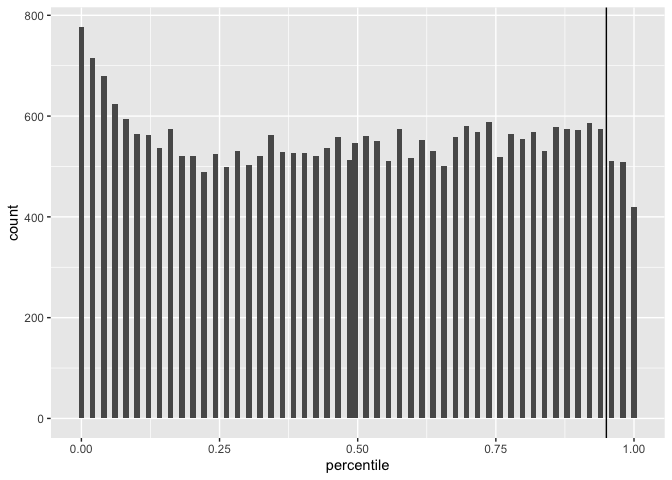
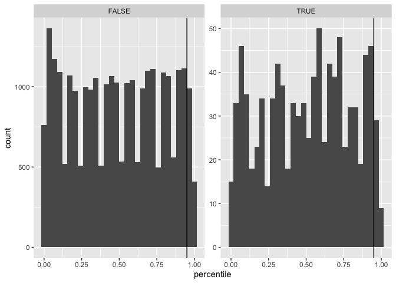
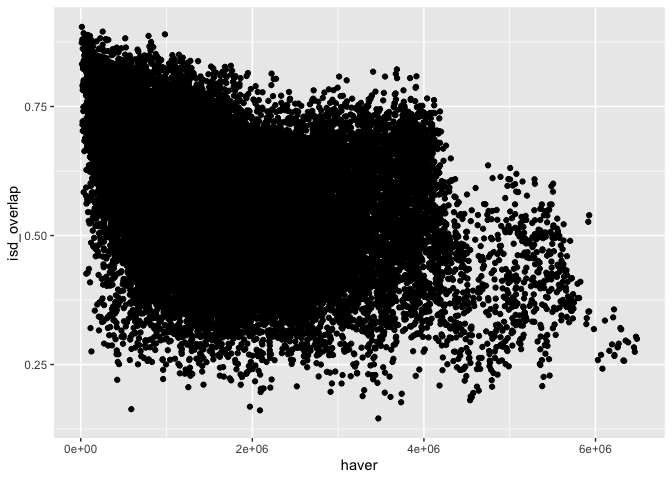

Comparisons
================

``` r
allCompsObs <- filter(allComps, sim  < 0)

allCompsNull <- filter(allComps, sim > 0)

allCompsCompare <- allCompsNull %>%
  left_join(
    select(
    rename(
      allCompsObs, obs_isd_overlap = isd_overlap
    ),
    -sim, -shuffle_seed
    )
  )
```

    ## Joining, by = c("species_overlap", "bcd", "haver", "timeperiod", "years", "route.x", "region.x", "location.bcr.x", "location.longitude.x", "location.latitude.x", "timeperiod.x", "years.x", "route.y", "region.y", "location.bcr.y", "location.longitude.y", "location.latitude.y", "timeperiod.y", "years.y", "site.x", "site.y", "location.routename.x", "location.routename.y", "same_state", "same_bcr")

``` r
allCompsPerc <- allCompsCompare %>%
  group_by(
    site.x, site.y
  ) %>%
  mutate(nlower = sum(isd_overlap < obs_isd_overlap),
         nlowerinc = sum(isd_overlap <= obs_isd_overlap), # there are no ties so far
         nsims = length(unique(sim))) %>%
  mutate(percentile = nlower / nsims) %>%
  ungroup() %>%
  select(-isd_overlap, -sim, -shuffle_seed) %>%
  distinct()

ggplot(allCompsPerc, aes(percentile)) +
  geom_histogram() +
  geom_vline(xintercept = c(.95)) 
```

    ## `stat_bin()` using `bins = 30`. Pick better value with `binwidth`.

<!-- -->

``` r
ggplot(allCompsPerc, aes(percentile)) +
  geom_histogram() +
  geom_vline(xintercept = c(.95)) +
  facet_wrap(vars(same_bcr), scales = "free_y")
```

    ## `stat_bin()` using `bins = 30`. Pick better value with `binwidth`.

<!-- -->

``` r
ggplot(allCompsPerc, aes(haver, percentile, color = same_bcr)) +
  geom_point() 
```

<!-- -->

``` r
ggplot(allCompsObs, aes(species_overlap, isd_overlap)) +
  geom_point() +
  geom_abline(intercept = 0, slope = 1) +
  ylim(0,1) +
  xlim(0,1)
```

<!-- -->

``` r
ggplot(allCompsPerc, aes(species_overlap, obs_isd_overlap, color = percentile > .95)) +
  geom_point() +
  geom_abline(intercept = 0, slope = 1) +
  ylim(0,1) +
  xlim(0,1)
```

<!-- -->

``` r
ggplot(allCompsObs, aes(haver, isd_overlap)) +
  geom_point() 
```

<!-- -->

``` r
ggplot(allCompsObs, aes(haver, species_overlap)) +
  geom_point()
```

<!-- -->

``` r
ggplot(allCompsObs, aes(haver, bcd)) +
  geom_point()
```

<!-- -->

``` r
allCompsConserved <- filter(allCompsPerc, percentile > .95)
```

Birds are bang-on random.
