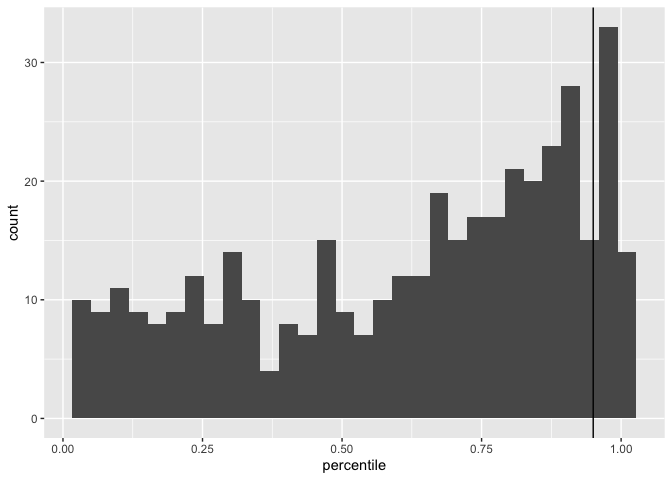
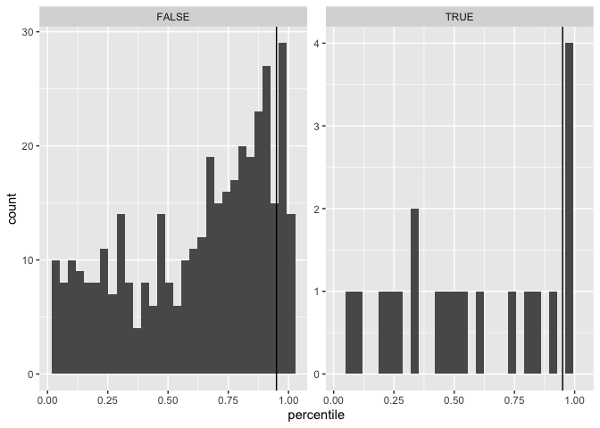
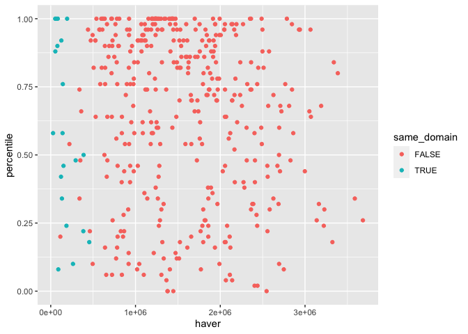
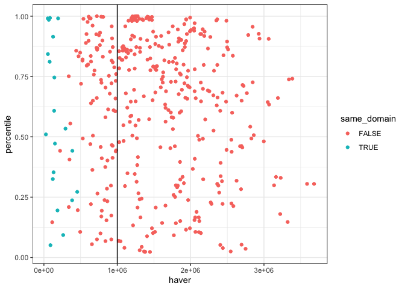
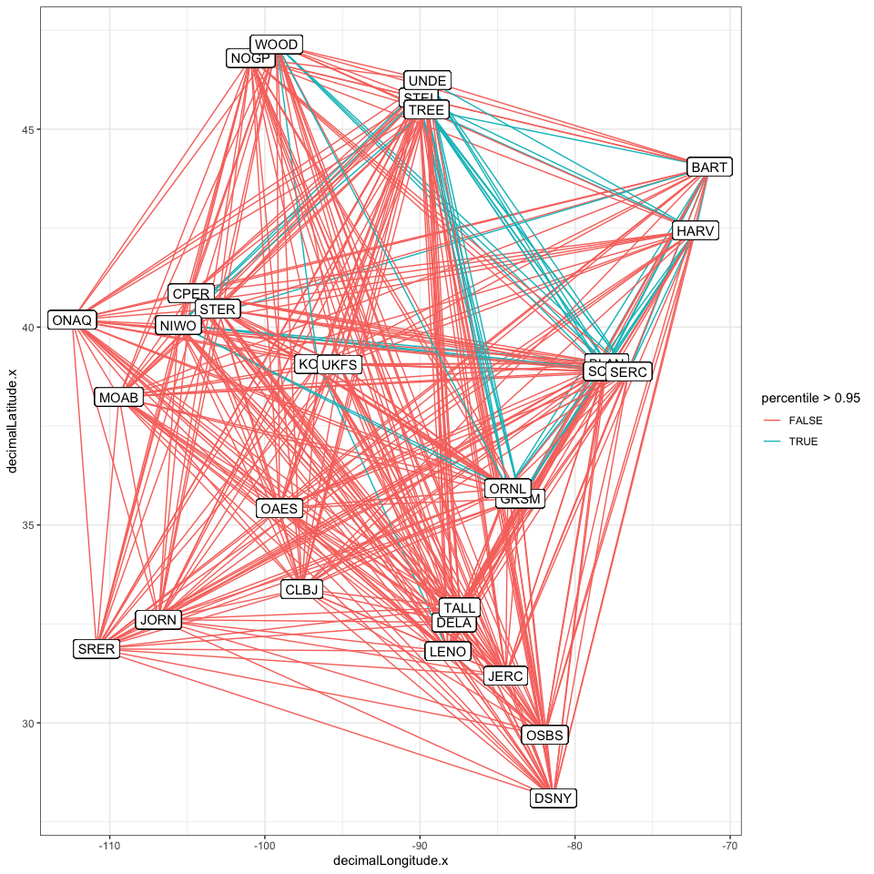

Comparisons
================

``` r
allCompsObs <- filter(allComps, sim  < 0)

allCompsNull <- filter(allComps, sim > 0)

allCompsCompare <- allCompsNull %>%
  left_join(
    select(
      rename(
        allCompsObs, obs_isd_overlap = isd_overlap
      ),
      -sim, -shuffle_seed
    )
  )
```

    ## Joining, by = c("site.x", "site.y", "species_overlap", "bcd", "decimalLatitude.x", "decimalLongitude.x", "decimalLatitude.y", "decimalLongitude.y", "haver", "domainID.x", "domainID.y", "same_domain")

``` r
allCompsPerc <- allCompsCompare %>%
  group_by(
    site.x, site.y
  ) %>%
  mutate(nlower = sum(isd_overlap < obs_isd_overlap),
         nlowerinc = sum(isd_overlap <= obs_isd_overlap), # there are no ties so far
         nsims = length(unique(sim)),
         mean_isd_overlap = mean(isd_overlap),
         sd_isd_overlap = sd(isd_overlap))%>%
  mutate(percentile = nlower / nsims,
         ses = (obs_isd_overlap - mean_isd_overlap) / sd_isd_overlap) %>%
  ungroup() %>%
  select(-isd_overlap, -sim, -shuffle_seed) %>%
  distinct()

ggplot(allCompsPerc, aes(percentile)) +
  geom_histogram() +
  geom_vline(xintercept = c(.95)) 
```

    ## `stat_bin()` using `bins = 30`. Pick better value with `binwidth`.

<!-- -->

``` r
ggplot(allCompsPerc, aes(ses)) +
  geom_histogram() +
  geom_vline(xintercept = c(-1.96, 1.96)) 
```

    ## `stat_bin()` using `bins = 30`. Pick better value with `binwidth`.

<!-- -->

``` r
ggplot(allCompsPerc, aes(percentile)) +
  geom_histogram(bins =20) +
  geom_vline(xintercept = c(.95)) +
  facet_wrap(vars(haver < 1000*1000), scales = "free_y")
```

<!-- -->

``` r
ggplot(allCompsPerc, aes(haver, percentile, color = same_domain)) +
  geom_point() +
  geom_vline(xintercept = 1000* 1000)
```

<!-- -->

``` r
allCompsConserved <- filter(allCompsPerc, percentile > .95)
```

``` r
bySite <- list()
sites <- unique(c(allComps$site.x, allComps$site.y))

for(i in 1:length(sites)) {
  
  site = sites[i]
  this_site_involved <- filter(allCompsPerc, site.x == site | site.y == site )
  
  this_site_info <- data.frame(
    site = site,
    ncomps = nrow(this_site_involved),
    prop_high_perc = mean(this_site_involved$percentile > .95),
    prop_high_ses = mean(this_site_involved$ses > 1.96)
    
  ) 
  
  bySite[[i]] <- this_site_info
  
  
}


bysites <- bind_rows(bySite)


ggplot(filter(allCompsPerc)) +
  geom_segment(aes(y = decimalLatitude.x, x =decimalLongitude.x, yend = decimalLatitude.y, xend = decimalLongitude.y, color = percentile >.95)) +  geom_label(aes(y = decimalLatitude.x, x = decimalLongitude.x, label = site.x)) + geom_label(aes(y = decimalLatitude.y, x=decimalLongitude.y, label = site.y))
```

<!-- -->

``` r
site.md <- read.csv(here::here("neon_mammals", "NEON_Field_Site_Metadata_20210226_0.csv"))


bysites <- left_join(bysites, site.md, by = c("site" = "field_site_id"))

filter(bysites, prop_high_ses > .15)
```

    ##    site ncomps prop_high_perc prop_high_ses field_domain_id
    ## 1  BART     28      0.2857143     0.2500000             D01
    ## 2  BLAN     28      0.3214286     0.2857143             D02
    ## 3  HARV     28      0.3214286     0.3214286             D01
    ## 4  GRSM     28      0.2857143     0.2857143             D07
    ## 5  SCBI     28      0.2857143     0.2857143             D02
    ## 6  ORNL     28      0.2857143     0.2142857             D07
    ## 7  NIWO     28      0.3214286     0.2857143             D13
    ## 8  SERC     28      0.2500000     0.2500000             D02
    ## 9  STEI     28      0.3214286     0.3214286             D05
    ## 10 TREE     28      0.3571429     0.3571429             D05
    ## 11 UNDE     28      0.3214286     0.3214286             D05
    ##                                                field_site_name
    ## 1                            Bartlett Experimental Forest NEON
    ## 2                                Blandy Experimental Farm NEON
    ## 3                      Harvard Forest & Quabbin Watershed NEON
    ## 4                     Great Smoky Mountains National Park NEON
    ## 5              Smithsonian Conservation Biology Institute NEON
    ## 6                                               Oak Ridge NEON
    ## 7                                             Niwot Ridge NEON
    ## 8               Smithsonian Environmental Research Center NEON
    ## 9                                Steigerwaldt-Chequamegon NEON
    ## 10                                              Treehaven NEON
    ## 11 University of Notre Dame Environmental Research Center NEON
    ##            field_site_type field_site_subtype field_colocated_site
    ## 1  Relocatable Terrestrial                                        
    ## 2  Relocatable Terrestrial                                    LEWI
    ## 3         Core Terrestrial                                    HOPB
    ## 4  Relocatable Terrestrial                                    LECO
    ## 5         Core Terrestrial                                    POSE
    ## 6         Core Terrestrial                                    WALK
    ## 7         Core Terrestrial                                    COMO
    ## 8  Relocatable Terrestrial                                        
    ## 9  Relocatable Terrestrial                                        
    ## 10 Relocatable Terrestrial                                        
    ## 11        Core Terrestrial                                        
    ##                                                             field_site_host
    ## 1                              Northern Research Station, US Forest Service
    ## 2                                       University of Virginia|Private Land
    ## 3  Harvard University|Massachusetts DCR Division of Water Supply Protection
    ## 4                                                     National Park Service
    ## 5                                                   Smithsonian Institution
    ## 6                                                      Department of Energy
    ## 7                         US Forest Service, University of Colorado-Boulder
    ## 8                                                   Smithsonian Institution
    ## 9                               Private|Chequamegon Nicolet National Forest
    ## 10                                    University of Wisconsin-Stevens Point
    ## 11                                                 University of Notre Dame
    ##                                                                                                      field_site_url
    ## 1                                                               https://www.nrs.fs.fed.us/ef/locations/nh/bartlett/
    ## 2                                                                              http://blandy.virginia.edu/research|
    ## 3  https://harvardforest.fas.harvard.edu/conducting-research|https://www.mass.gov/service-details/watershed-permits
    ## 4                                                                                        https://irma.nps.gov/rprs/
    ## 5                                                            https://www.si.edu/unit/conservation-biology-institute
    ## 6                                                                                 https://www.ornl.gov/division/esd
    ## 7                                                                                                                  
    ## 8                                                                                              https://serc.si.edu/
    ## 9                                                                                    |https://www.fs.usda.gov/cnnf/
    ## 10                                                   https://www.uwsp.edu/cnr-ap/treehaven/Pages/Research-Form.aspx
    ## 11                                                        https://underc.nd.edu/underc-west/research-opportunities/
    ##        field_nonneon_research_allowed
    ## 1                                 Yes
    ## 2  Yes (Tower and TIS) / Very Limited
    ## 3                       Yes / Limited
    ## 4                                 Yes
    ## 5                                 Yes
    ## 6                        Very Limited
    ## 7                                 Yes
    ## 8                                 Yes
    ## 9                  Very Limited / Yes
    ## 10                                Yes
    ## 11                                Yes
    ##                                                                                                                                                                                                                                                                                                                                                                                                                                                       field_access_details
    ## 1                                                                                                                                                                                                                                  Bartlett Experimental Forest has very limited staff and the USFS personnel are NOT available to support external researchers. Permitting requests for research activities should be submitted at least 6 months prior to planned start.
    ## 2                                                                                                                                                                                                                                                                                                                                                    Research activity at the NEON tower area via University of Virginia. / Very limited available via private land owner.
    ## 3                                                                 Field site managed by Harvard University - open to additional research via the Harvard Experimental Forest website. Many other colocated research projects within NEON area. / Field site located in the Quabbin Resevoir - Massachusetts DCR Division of Water Supply Protection . This property is very limited to additional research - researchers should take necessary coordinations with the DCR.
    ## 4                                                                                                                                                                                                                                                                                                                                         The National Park Service is open to additional research activities taking place in this area. Apply via IRMA Permitting portal.
    ## 5            Significant portions of the site are off-limits or have restricted access due to captive animal activities. Annual hunting activities may render this area completely inaccessible for short periods of time (1 or 2 days) over the course of the season. Most research activities require approval from a land-use committee; and stays longer than a month may require the researcher to apply for contractor credentials and submit to a background check.
    ## 6                                                                                                                                                                                                                                                                                                       There is currently no system in place to authorize access for additional research activities to this federally secure area. Coordinate directly with site manager.
    ## 7                                                                                                                                                                                                                                                                                                                                                                                    Reseachers should coordinate with the site manager and submit a site research permit.
    ## 8  Some areas of the site have pre-existing experiments and a high density of markers, equipment, sensors etc. Care should be taken to coordinate and avoid impacting on-going work at the site. All researchers must be accompanied while on-site by at least one individual with an approved Visiting Scientist Agreement. Annual hunting activities may render this area completely inaccessible for short periods of time (1 or 2 days) over the course of the season.
    ## 9                                                                                                                                                                                                                                                     Very limited available via private land owner. / NEON sampling area of this field site is located in Chequamegon Nicolet National Forest. Additional research may take place in this area with site host permission.
    ## 10                                                                                                                                                                                                                                                                                                                                  Treehaven encourages research projects. Research activities may be limited based on other uses of this property and on-going projects.
    ## 11                                                                                                                                                                                                                                                       UNDERC encourages research; subject to evaluation based on potential for scientific advancement, impact on the site, and consistency and compatibility with other designated, non-research, uses of the property.
    ##    field_neon_field_operations_office field_latitude field_longitude
    ## 1          Domain 01 Support Facility       44.06389       -71.28737
    ## 2          Domain 02 Support Facility       39.03370       -78.04179
    ## 3          Domain 01 Support Facility       42.53691       -72.17265
    ## 4          Domain 07 Support Facility       35.68896       -83.50195
    ## 5          Domain 02 Support Facility       38.89292       -78.13949
    ## 6          Domain 07 Support Facility       35.96413       -84.28259
    ## 7       Domain 10/13 Support Facility       40.05425      -105.58237
    ## 8          Domain 02 Support Facility       38.89013       -76.56001
    ## 9          Domain 05 Support Facility       45.50894       -89.58637
    ## 10         Domain 05 Support Facility       45.49369       -89.58571
    ## 11         Domain 05 Support Facility       46.23391       -89.53725
    ##    field_geodetic_datum field_utm_northing field_utm_easting field_utm_zone
    ## 1                 WGS84            4881512          316812.2            19N
    ## 2                 WGS84            4327546          753379.5            17N
    ## 3                 WGS84            4713265          732183.2            18N
    ## 4                 WGS84            3952335          273599.9            17N
    ## 5                 WGS84            4308784          748090.6            17N
    ## 6                 WGS84            3983383          745052.4            16N
    ## 7                 WGS84            4433941          450328.3            13N
    ## 8                 WGS84            4305735          364703.7            18N
    ## 9                 WGS84            5042744          297968.7            16N
    ## 10                WGS84            5041048          297965.3            16N
    ## 11                WGS84            5123163          304367.0            16N
    ##    field_site_county field_site_state field_site_country field_mean_elevation_m
    ## 1            Carroll               NH                USA                    274
    ## 2             Clarke               VA                USA                    183
    ## 3          Worcester               MA                USA                    348
    ## 4             Sevier               TN                USA                    575
    ## 5             Warren               VA                USA                    352
    ## 6           Anderson               TN                USA                    344
    ## 7            Boulder               CO                USA                   3490
    ## 8       Anne Arundel               MD                USA                     33
    ## 9            Lincoln               WI                USA                    476
    ## 10           Lincoln               WI                USA                    467
    ## 11           Gogebic               MI                USA                    521
    ##    field_minimum_elevation_m field_maximum_elevation_m
    ## 1                        230                       655
    ## 2                        119                       193
    ## 3                        160                       415
    ## 4                        426                      1978
    ## 5                        251                       571
    ## 6                        230                       356
    ## 7                       2975                      3583
    ## 8                          0                        43
    ## 9                        466                       536
    ## 10                       447                       482
    ## 11                       501                       538
    ##    field_mean_annual_temperature_C field_mean_annual_precipitation_mm
    ## 1                              6.2                               1325
    ## 2                             12.1                                983
    ## 3                              7.4                               1199
    ## 4                             13.1                               1375
    ## 5                             11.6                               1126
    ## 6                             14.4                               1340
    ## 7                              0.3                               1005
    ## 8                             13.6                               1075
    ## 9                              4.8                                797
    ## 10                             4.8                                797
    ## 11                             4.3                                802
    ##    field_dominant_wind_direction           field_mean_canopy_height_m
    ## 1                              S                                   23
    ## 2                             NW                                    1
    ## 3                             NW                                   26
    ## 4                             NW                                   30
    ## 5                            SSE                                   35
    ## 6                            WNW                                   28
    ## 7                            WNW                                  0.2
    ## 8                            NNW                                   38
    ## 9                            WSW 20m (in surounding non-logged area) 
    ## 10                           WSW                                   23
    ## 11                           SSW                                   24
    ##                                      field_dominant_nlcd_classes
    ## 1                 Deciduous Forest|Evergreen Forest|Mixed Forest
    ## 2                                   Deciduous Forest|Pasture/Hay
    ## 3  Deciduous Forest|Evergreen Forest|Mixed Forest|Woody Wetlands
    ## 4                              Deciduous Forest|Evergreen Forest
    ## 5                  Deciduous Forest|Evergreen Forest|Pasture/Hay
    ## 6                  Deciduous Forest|Evergreen Forest|Pasture/Hay
    ## 7                          Evergreen Forest|Grassland/Herbaceous
    ## 8                              Cultivated Crops|Deciduous Forest
    ## 9                   Deciduous Forest|Mixed Forest|Woody Wetlands
    ## 10 Deciduous Forest|Evergreen Forest|Mixed Forest|Woody Wetlands
    ## 11                  Deciduous Forest|Mixed Forest|Woody Wetlands
    ##                                                                                               field_domint_plant_species
    ## 1                            Fagus grandifolia (American beech)|Tsuga cadensis (Eastern hemlock)|Acer rubrum (Red maple)
    ## 2         Rhamnus davurica (dahurian buckthorn)|Lonicera maackii (amur honeysuckle)|Juglans nigra (eastern black walnut)
    ## 3                       Osmunda cinmomea (Cinmon fern)|Quercus rubra (Northern red oak)|Tsuga cadensis (Eastern hemlock)
    ## 4                  Liriodendron tulipfera (tulip tree/yellow poplar)|Lindera benzoin (spicebush)|Acer rubrum (red maple)
    ## 5          Liriodendron tulipifera (tulip tree)|Microstegium vimineum (Japanese stiltgrass)|Fraxinus america (white ash)
    ## 6                                        Acer rubrum (red maple)|Nyssa sylvatica (sour gum)|Quercus monta (chestnut oak)
    ## 7                    Abies lasiocarpa (subapline fir)|Picea engelmannii (Engelmann spruce)|Vaccinium sp. (blueberry sp.)
    ## 8  Liriodendron tulipifera (tulip poplar)|Fagus grandifolia (American Beech)|Liquidambar styraciflua (American sweetgum)
    ## 9                                Populus tremuloides (quaking aspen)|Abies balsamea (balsam fir)|Acer rubrum (red maple)
    ## 10                                          Acer saccharum (sugar maple)|Acer rubrum (red maple)|Alnus inca (grey alder)
    ## 11                                      Acer saccharum (sugar maple)|Abies balsamea (balsam fir)|Acer rubrum (red maple)
    ##    field_usgs_huc field_watershed_name field_watershed_size_km2
    ## 1                                                            NA
    ## 2                                                            NA
    ## 3                                                            NA
    ## 4                                                            NA
    ## 5                                                            NA
    ## 6                                                            NA
    ## 7                                                            NA
    ## 8                                                            NA
    ## 9                                                            NA
    ## 10                                                           NA
    ## 11                                                           NA
    ##    field_lake_depth_mean_m field_lake_depth_max_m field_tower_height_m
    ## 1                       NA                     NA                   35
    ## 2                       NA                     NA                    8
    ## 3                       NA                     NA                   39
    ## 4                       NA                     NA                   45
    ## 5                       NA                     NA                   52
    ## 6                       NA                     NA                   39
    ## 7                       NA                     NA                    8
    ## 8                       NA                     NA                   62
    ## 9                       NA                     NA                   22
    ## 10                      NA                     NA                   36
    ## 11                      NA                     NA                   39
    ##    field_usgs_geology_unit
    ## 1                 NHJc1b;0
    ## 2                VAOCAco;0
    ## 3          MADht;0|MAOps;0
    ## 4                TNpCAs;15
    ## 5                 VACAZc;0
    ## 6       TNOnc;10|TNCAcr;10
    ## 7                   COXb;0
    ## 8                   MDTn;5
    ## 9          WIXmi;0|WIXmv;0
    ## 10                 WIXmv;0
    ## 11                 MIAgn;0
    ##                                                                         field_megapit_soil_family
    ## 1                                               Coarse-loamy, isotic, frigid.  Aquic Haplorthods.
    ## 2                                                Fine, mixed, subactive, mesic. Ultic Hapludalfs.
    ## 3  Coarse, loamy over sandy or sandy, skeletal, mixed, semiactive, frigid.  Oxyaquic Dystrudepts.
    ## 4                                               Loamy, skeletal, isotic, mesic.  Typic Humudepts.
    ## 5                                        Loamy, skeletal, mixed, active, mesic. Ultic Hapludalfs.
    ## 6                                                    Fine, kaolinitic, thermic. Typic Paleudults.
    ## 7                                          Coarse, loamy, mixed, superactive. Typic Haplocryolls.
    ## 8                                            Fine, loamy, mixed, active, mesic. Aquic Hapludults.
    ## 9                                     Coarse, loamy, mixed, superactive, frigid. Alfic Epiaquods.
    ## 10                                  Coarse, loamy, mixed, superactive, frigid. Alfic Haplorthods.
    ## 11                                  Coarse, loamy, mixed, superactive, frigid. Argic Fragiaquods.
    ##     field_soil_subgroup field_avg_number_of_green_days
    ## 1     Aquic Haplorthods                            180
    ## 2      Ultic Hapludalfs                            235
    ## 3  Oxyaquic Dystrudepts                            210
    ## 4       Typic Humudepts                            220
    ## 5      Ultic Hapludalfs                            245
    ## 6      Typic Paleudults                            225
    ## 7    Typic Haplocryolls                            130
    ## 8      Aquic Hapludults                            245
    ## 9       Alfic Epiaquods                            170
    ## 10    Alfic Haplorthods                            170
    ## 11    Argic Fragiaquods                            165
    ##    field_avg_grean_increase_doy field_avg_green_max_doy
    ## 1                           120                     170
    ## 2                            75                     150
    ## 3                           110                     160
    ## 4                            90                     155
    ## 5                            85                     150
    ## 6                            90                     140
    ## 7                           140                     190
    ## 8                            80                     155
    ## 9                           120                     165
    ## 10                          120                     165
    ## 11                          120                     170
    ##    field_avg_green_decrease_doy field_avg_green_min_doy
    ## 1                           220                     300
    ## 2                           210                     310
    ## 3                           220                     300
    ## 4                           215                     310
    ## 5                           220                     320
    ## 6                           210                     315
    ## 7                           220                     270
    ## 8                           220                     325
    ## 9                           215                     290
    ## 10                          215                     290
    ## 11                          215                     285
    ##                                                                                                                                                   field_phenocams
    ## 1  [Tower top](https://phenocam.sr.unh.edu/webcam/sites/NEON.D01.BART.DP1.00033)|[Tower bottom](https://phenocam.sr.unh.edu/webcam/sites/NEON.D01.BART.DP1.00042)
    ## 2  [Tower top](https://phenocam.sr.unh.edu/webcam/sites/NEON.D02.BLAN.DP1.00033)|[Tower bottom](https://phenocam.sr.unh.edu/webcam/sites/NEON.D02.BLAN.DP1.00042)
    ## 3  [Tower top](https://phenocam.sr.unh.edu/webcam/sites/NEON.D01.HARV.DP1.00033)|[Tower bottom](https://phenocam.sr.unh.edu/webcam/sites/NEON.D01.HARV.DP1.00042)
    ## 4  [Tower top](https://phenocam.sr.unh.edu/webcam/sites/NEON.D07.GRSM.DP1.00033)|[Tower bottom](https://phenocam.sr.unh.edu/webcam/sites/NEON.D07.GRSM.DP1.00042)
    ## 5  [Tower top](https://phenocam.sr.unh.edu/webcam/sites/NEON.D02.SCBI.DP1.00033)|[Tower bottom](https://phenocam.sr.unh.edu/webcam/sites/NEON.D02.SCBI.DP1.00042)
    ## 6  [Tower top](https://phenocam.sr.unh.edu/webcam/sites/NEON.D07.ORNL.DP1.00033)|[Tower bottom](https://phenocam.sr.unh.edu/webcam/sites/NEON.D07.ORNL.DP1.00042)
    ## 7  [Tower top](https://phenocam.sr.unh.edu/webcam/sites/NEON.D13.NIWO.DP1.00033)|[Tower bottom](https://phenocam.sr.unh.edu/webcam/sites/NEON.D13.NIWO.DP1.00042)
    ## 8  [Tower top](https://phenocam.sr.unh.edu/webcam/sites/NEON.D02.SERC.DP1.00033)|[Tower bottom](https://phenocam.sr.unh.edu/webcam/sites/NEON.D02.SERC.DP1.00042)
    ## 9  [Tower top](https://phenocam.sr.unh.edu/webcam/sites/NEON.D05.STEI.DP1.00033)|[Tower bottom](https://phenocam.sr.unh.edu/webcam/sites/NEON.D05.STEI.DP1.00042)
    ## 10 [Tower top](https://phenocam.sr.unh.edu/webcam/sites/NEON.D05.TREE.DP1.00033)|[Tower bottom](https://phenocam.sr.unh.edu/webcam/sites/NEON.D05.TREE.DP1.00042)
    ## 11 [Tower top](https://phenocam.sr.unh.edu/webcam/sites/NEON.D05.UNDE.DP1.00033)|[Tower bottom](https://phenocam.sr.unh.edu/webcam/sites/NEON.D05.UNDE.DP1.00042)
    ##    field_number_tower_levels
    ## 1                          6
    ## 2                          4
    ## 3                          6
    ## 4                          6
    ## 5                          6
    ## 6                          6
    ## 7                          4
    ## 8                          6
    ## 9                          6
    ## 10                         6
    ## 11                         6

``` r
filter(bysites, prop_high_ses < .15)
```

    ##    site ncomps prop_high_perc prop_high_ses field_domain_id
    ## 1  DSNY     28     0.00000000     0.0000000             D03
    ## 2  DELA     28     0.00000000     0.0000000             D08
    ## 3  CPER     28     0.00000000     0.0000000             D10
    ## 4  CLBJ     28     0.00000000     0.0000000             D11
    ## 5  JERC     28     0.00000000     0.0000000             D03
    ## 6  OSBS     28     0.00000000     0.0000000             D03
    ## 7  KONZ     28     0.07142857     0.0000000             D06
    ## 8  LENO     28     0.03571429     0.0000000             D08
    ## 9  NOGP     28     0.00000000     0.0000000             D09
    ## 10 OAES     28     0.00000000     0.0000000             D11
    ## 11 MOAB     28     0.00000000     0.0000000             D13
    ## 12 JORN     28     0.00000000     0.0000000             D14
    ## 13 ONAQ     28     0.00000000     0.0000000             D15
    ## 14 SRER     28     0.00000000     0.0000000             D14
    ## 15 TALL     28     0.00000000     0.0000000             D08
    ## 16 STER     28     0.00000000     0.0000000             D10
    ## 17 UKFS     28     0.00000000     0.0000000             D06
    ## 18 WOOD     28     0.17857143     0.1071429             D09
    ##                                   field_site_name         field_site_type
    ## 1                 Disney Wilderness Preserve NEON Relocatable Terrestrial
    ## 2                                  Dead Lake NEON Relocatable Terrestrial
    ## 3          Central Plains Experimental Range NEON        Core Terrestrial
    ## 4       Lyndon B. Johnson National Grassland NEON        Core Terrestrial
    ## 5               The Jones Center At Ichauway NEON Relocatable Terrestrial
    ## 6          Ordway-Swisher Biological Station NEON        Core Terrestrial
    ## 7           Konza Prairie Biological Station NEON        Core Terrestrial
    ## 8                             Lenoir Landing NEON Relocatable Terrestrial
    ## 9  Northern Great Plains Research Laboratory NEON Relocatable Terrestrial
    ## 10      Marvin Klemme Range Research Station NEON Relocatable Terrestrial
    ## 11                                      Moab NEON Relocatable Terrestrial
    ## 12                Jornada Experimental Range NEON Relocatable Terrestrial
    ## 13                                    Onaqui NEON        Core Terrestrial
    ## 14             Santa Rita Experimental Range NEON        Core Terrestrial
    ## 15                 Talladega National Forest NEON        Core Terrestrial
    ## 16                            North Sterling NEON Relocatable Terrestrial
    ## 17        University of Kansas Field Station NEON Relocatable Terrestrial
    ## 18       Chase Lake National Wildlife Refuge NEON        Core Terrestrial
    ##    field_site_subtype field_colocated_site
    ## 1                                         
    ## 2                                     BLWA
    ## 3                                         
    ## 4                                     PRIN
    ## 5                                     FLNT
    ## 6                                BARC|SUGG
    ## 7                                         
    ## 8                                     TOMB
    ## 9                                         
    ## 10                                        
    ## 11                                        
    ## 12                                        
    ## 13                                        
    ## 14                                        
    ## 15                                    MAYF
    ## 16                                        
    ## 17                                        
    ## 18                                    PRPO
    ##                                            field_site_host
    ## 1                                   The Nature Conservancy
    ## 2                               US Army Corps of Engineers
    ## 3                       USDA-Agricultural Research Service
    ## 4                                        US Forest Service
    ## 5                         Robert Woodruff Foundation, Inc.
    ## 6                         University of Florida Foundation
    ## 7          The Nature Conservancy, Kansas State University
    ## 8  US Army Corps of Engineers|US Fish and Wildlife Service
    ## 9                       USDA Agricultural Research Service
    ## 10                               Oklahoma State University
    ## 11                               Bureau of Land Management
    ## 12                      USDA-Agricultural Research Service
    ## 13                               Bureau of Land Management
    ## 14                                   University of Arizona
    ## 15                               Talladega National Forest
    ## 16                                                 Private
    ## 17                                    University of Kansas
    ## 18                            US Fish and Wildlife Service
    ##                                                                                                                                                                                   field_site_url
    ## 1                                                                                        https://www.nature.org/en-us/get-involved/how-to-help/places-we-protect/the-disney-wilderness-preserve/
    ## 2                                                                                                                                                                https://www.sam.usace.army.mil/
    ## 3  https://www.ars.usda.gov/plains-area/fort-collins-co/center-for-agricultural-resources-research/rangeland-resources-systems-research/docs/rrsr/central-plains-experimental-research-location/
    ## 4                                                                                                                https://www.fs.usda.gov/detail/texas/about-forest/districts/?cid=fswdev3_008440
    ## 5                                                                                                                                                              http://www.jonesctr.org/research/
    ## 6                                                                                                                                                https://ordway-swisher.ufl.edu/ResearchUse.aspx
    ## 7                                                                                                                              https://kpbs.konza.k-state.edu/scientist-information/permits.html
    ## 8                                                                                                                            https://www.sam.usace.army.mil/|https://www.fws.gov/refuge/choctaw/
    ## 9                                                                                                                                          https://www.ars.usda.gov/plains-area/mandan-nd/ngprl/
    ## 10                                                                                                                                                                      http://oaes.okstate.edu/
    ## 11                                                                                                                                                  https://www.blm.gov/office/moab-field-office
    ## 12                                                                                                                                                                     https://jornada.nmsu.edu/
    ## 13                                                                                                                                             https://www.blm.gov/office/salt-lake-field-office
    ## 14                                                                              https://taac.arizona.edu/sites/taac.arizona.edu/files/SRER%20Range%20Use%20Agreement%202014%20revised%5B1%5D.pdf
    ## 15                                                                                                             https://www.fs.usda.gov/detail/alabama/about-forest/districts/?cid=fsbdev3_002555
    ## 16                                                                                                                                                                                              
    ## 17                                                                                                                                                             https://biosurvey.ku.edu/research
    ## 18                                                                                                                                                        https://www.fws.gov/refuge/chase_lake/
    ##    field_nonneon_research_allowed
    ## 1                             Yes
    ## 2                         Limited
    ## 3                             Yes
    ## 4                    Very Limited
    ## 5                             Yes
    ## 6                             Yes
    ## 7                             Yes
    ## 8                    Limited /Yes
    ## 9                             Yes
    ## 10                        Limited
    ## 11                            Yes
    ## 12                            Yes
    ## 13                        Limited
    ## 14                            Yes
    ## 15                            Yes
    ## 16                   Very Limited
    ## 17                            Yes
    ## 18                            Yes
    ##                                                                                                                                                                                                                                                                                                                                                    field_access_details
    ## 1                                                                                                                                                                                                                                         New research requests may be restricted to limited portions of the preserve - coordination required with preserve management.
    ## 2                                                                                                                                                                                             This area is primarily intended to provide recreational opportunities and is also classified as a hunting area. As such, access is very limited but potentially possible.
    ## 3                                                                                                                                                                                                                                                                                                                   Reseachers should coordinate with the site manager.
    ## 4                                                                                                                                                                                                               Researchers should coordinate directly with the US Forest Service for permitting and approval. Site host is very limited to external research requests.
    ## 5                                                                                                                                                                                                                                                                               This area is a very active research community and will required a site research permit.
    ## 6                                                                                                                                                                                                                                                                               This area is a very active research community and will required a site research permit.
    ## 7                                                                                                The Nature Conservancy and Konza Prairie Biological Station (KSU) welcomes and encourages research use that fits their mission and is compatible with their abilities as a host. Please plan on at more than two weeks advance notice to request and plan site access.
    ## 8  This area is primarily intended to provide recreational opportunities and is also classified as a hunting area. As such, access is very limited but potentially possible. / The primary purpose of the refuge is to provide wood duck brood habitat and serve as a protected wintering area for waterfowl. Researchers should coordinate directly with site manager.
    ## 9                                                                                                                                                                                                                                      This site host welcomes and encourages additional research activities related to the USDA Agricultural Research Service mission.
    ## 10                                                                                                                                                                                                                                                                                                                  Reseachers should coordinate with the site manager.
    ## 11                                                                                                                                                                                                                                                                                                                  Reseachers should coordinate with the site manager.
    ## 12                                                                                         JORN encourages research activities that do not conflict with on-going activities. Please apply directly with site host and USDA for a site research permit.  All requests are reviewed for impacts to cultural resources, endangered species and other research activities.
    ## 13                                                                                                                                                                                                                                                                                Reseachers should coordinate with the site manager and submit a site research permit.
    ## 14                                                                                  SRER encourages research activities that do not conflict with on-going research. Researchers should apply directly for a site research permit. All proposed actions will be reviewed for potential impacts to cultural resources, endangered species and other research activities.
    ## 15                                                                                                                                                                                                                                                                       Researchers should coordinate directly with the US Forest Service for permitting and approval.
    ## 16                                                                                                                                                                                                                                                                                                                       Very limited available via private land owner.
    ## 17                                                                                                                                                  This site host welcomes and encourages research use that fits their mission and is compatible with their abilities as a host. Please plan on at more than two weeks advance notice to request and plan site access.
    ## 18                                                                                                                                                                                                                                                   This site host welcomes and encourages additional research activities related to the US Fish And Wildlife mission.
    ##    field_neon_field_operations_office field_latitude field_longitude
    ## 1          Domain 03 Support Facility       28.12505       -81.43619
    ## 2          Domain 08 Support Facility       32.54173       -87.80388
    ## 3       Domain 10/13 Support Facility       40.81554      -104.74559
    ## 4          Domain 11 Support Facility       33.40123       -97.57000
    ## 5          Domain 03 Support Facility       31.19484       -84.46862
    ## 6          Domain 03 Support Facility       29.68928       -81.99343
    ## 7          Domain 06 Support Facility       39.10077       -96.56307
    ## 8          Domain 08 Support Facility       31.85386       -88.16118
    ## 9          Domain 09 Support Facility       46.76972      -100.91535
    ## 10         Domain 11 Support Facility       35.41060       -99.05878
    ## 11      Domain 10/13 Support Facility       38.24828      -109.38827
    ## 12         Domain 14 Support Facility       32.59069      -106.84254
    ## 13         Domain 15 Support Facility       40.17760      -112.45245
    ## 14         Domain 14 Support Facility       31.91068      -110.83549
    ## 15         Domain 08 Support Facility       32.95047       -87.39326
    ## 16      Domain 10/13 Support Facility       40.46189      -103.02929
    ## 17         Domain 06 Support Facility       39.04043       -95.19215
    ## 18         Domain 09 Support Facility       47.12820       -99.24133
    ##    field_geodetic_datum field_utm_northing field_utm_easting field_utm_zone
    ## 1                 WGS84            3111131          457161.1            17N
    ## 2                 WGS84            3524155          389259.0            16N
    ## 3                 WGS84            4518311          521454.8            13N
    ## 4                 WGS84            3696682          632982.2            14N
    ## 5                 WGS84            3453956          741205.7            16N
    ## 6                 WGS84            3284767          403886.4            17N
    ## 7                 WGS84            4330787          710729.8            14N
    ## 8                 WGS84            3524827          390139.6            16N
    ## 9                 WGS84            5181356          353761.6            14N
    ## 10                WGS84            3918579          494662.3            14N
    ## 11                WGS84            4234597          641031.5            12N
    ## 12                WGS84            3607409          327074.6            13N
    ## 13                WGS84            4448480          376339.7            12N
    ## 14                WGS84            3530547          515553.9            12N
    ## 15                WGS84            3645864          463241.7            16N
    ## 16                WGS84            4480891          667085.0            13N
    ## 17                WGS84            4323550          310276.3            15N
    ## 18                WGS84            5219442          481694.7            14N
    ##    field_site_county field_site_state field_site_country field_mean_elevation_m
    ## 1            Osceola               FL                USA                     20
    ## 2             Greene               AL                USA                     25
    ## 3               Weld               CO                USA                   1654
    ## 4               Wise               TX                USA                    272
    ## 5              Baker               GA                USA                     47
    ## 6             Putnam               FL                USA                     46
    ## 7              Riley               KS                USA                    414
    ## 8            Choctaw               AL                USA                     13
    ## 9             Morton               ND                USA                    589
    ## 10           Washita               OK                USA                    519
    ## 11          San Juan               UT                USA                   1799
    ## 12          Dona Ana               NM                USA                   1324
    ## 13            Tooele               UT                USA                   1662
    ## 14              Pima               AZ                USA                    997
    ## 15              Bibb               AL                USA                    166
    ## 16             Logan               CO                USA                   1365
    ## 17         Jefferson               KS                USA                    322
    ## 18          Stutsman               ND                USA                    591
    ##    field_minimum_elevation_m field_maximum_elevation_m
    ## 1                         15                        22
    ## 2                         21                        41
    ## 3                       1601                      1686
    ## 4                        258                       343
    ## 5                         29                        55
    ## 6                         22                        49
    ## 7                        333                       443
    ## 8                         NA                        NA
    ## 9                        517                       592
    ## 10                       487                       531
    ## 11                      1722                      2039
    ## 12                      1316                      1333
    ## 13                      1599                      2061
    ## 14                       897                      1461
    ## 15                        63                       179
    ## 16                      1352                      1371
    ## 17                       272                       332
    ## 18                       569                       606
    ##    field_mean_annual_temperature_C field_mean_annual_precipitation_mm
    ## 1                             22.5                               1216
    ## 2                             17.6                               1372
    ## 3                              8.6                                344
    ## 4                             17.5                                926
    ## 5                             19.2                               1308
    ## 6                             20.9                               1302
    ## 7                             12.4                                870
    ## 8                             18.1                               1386
    ## 9                              5.9                                457
    ## 10                            15.5                                779
    ## 11                            10.1                                319
    ## 12                            15.7                                271
    ## 13                             9.0                                288
    ## 14                            19.3                                346
    ## 15                            17.2                               1383
    ## 16                             9.7                                433
    ## 17                            12.7                                990
    ## 18                             4.9                                494
    ##    field_dominant_wind_direction    field_mean_canopy_height_m
    ## 1                              E                           1.5
    ## 2                             SW                            30
    ## 3                             NW                           0.4
    ## 4                              S                            13
    ## 5                             NE                            27
    ## 6                             NE                            23
    ## 7                            SSW                           1.5
    ## 8                              N                            35
    ## 9                            NNE                           0.4
    ## 10                            SE                             1
    ## 11                           SSW                           0.2
    ## 12                            SW                           0.4
    ## 13                            SW                           1.2
    ## 14                           ESE                             2
    ## 15                             N                            25
    ## 16                            NW varies based on crops planted
    ## 17                            SE                            19
    ## 18                            NW                             1
    ##                                        field_dominant_nlcd_classes
    ## 1                                       Pasture/Hay|Woody Wetlands
    ## 2                                  Evergreen Forest|Woody Wetlands
    ## 3                                             Grassland/Herbaceous
    ## 4                            Deciduous Forest|Grassland/Herbaceous
    ## 5  Cultivated Crops|Deciduous Forest|Evergreen Forest|Mixed Forest
    ## 6     Emergent Herbaceous Wetlands|Evergreen Forest|Woody Wetlands
    ## 7                            Deciduous Forest|Grassland/Herbaceous
    ## 8                                  Deciduous Forest|Woody Wetlands
    ## 9                                             Grassland/Herbaceous
    ## 10                                Grassland/Herbaceous|Shrub/Scrub
    ## 11                                    Evergreen Forest|Shrub/Scrub
    ## 12                                                     Shrub/Scrub
    ## 13                                    Evergreen Forest|Shrub/Scrub
    ## 14                                                     Shrub/Scrub
    ## 15                  Deciduous Forest|Evergreen Forest|Mixed Forest
    ## 16                                                Cultivated Crops
    ## 17                                    Deciduous Forest|Pasture/Hay
    ## 18               Emergent Herbaceous Wetlands|Grassland/Herbaceous
    ##                                                                                                   field_domint_plant_species
    ## 1             Andropogon virginicus (broomsedge bluestem)|Aristida beyrichia (wiregrass)|Axonopus furcatus (big carpetgrass)
    ## 2                                            Quercus nigra (Water oak)|Celtis laevigata (Sugarberry)|Acer rubrum (Red maple)
    ## 3   Bouteloua gracilis (Blue grama)|Hesperostipa comata (Needle-and-thread grass)|Thelesperma filifolium (Stiff greenthread)
    ## 4                                                            Quercus stellata (post oak)|Quercus marilandica (blackjack oak)
    ## 5                          Aristida beyrichia (wiregrass)|Quercus falcata (southern red oak)|Pinus palustris (longleaf pine)
    ## 6                          Quercus laevis (turkey oak)|Pinus palustris (longleaf pine)|Aristida beyrichia (Beyrich threeawn)
    ## 7         Cornus drummondii (Roughleaf Dogwood)|Schizachyrium scoparium (Little Bluestem)|Andropogon gerardii (Big Bluestem)
    ## 8                         Liquidambar styraciflua (sweetgum)|Carpinus carolinia (American hornbeam)|Ilex decidua (possumhaw)
    ## 9  Elaeagnus angustifolia (Russian olive)|Poa pratensis (Kentucky bluegrass)|Symphoricarpos occidentalis (Western snowberry)
    ## 10           Bouteloua dactyloides (buffalo grass)|Bouteloua gracilis (blue gramma)|Bouteloua curtipendula (sideoats gramma)
    ## 11                    Atriplex canescens (fourwing saltbush)|Ephedra viridis (Mormon tea)|Bouteloua gracilis (blue grama)  .
    ## 12                 Prosopis glandulosa (honey mesquite)|Yucca elata (soaptree yucca)|Bouteloua eriopada (black gramma grass)
    ## 13        Artemisia tridentata (big sagebrush)|Ceratocephala testiculata (curveseed butterwort)|Bromus tectorum (cheatgrass)
    ## 14                 Larrea tridentata (creosote bush)|Prosopis veluti (velvet mesquite)|Parkinsonia florida (blue palo verde)
    ## 15                    Quercus montana (Chestnut oak)|Liriodendron tulipifera (tulip tree)|Cornus florida (flowering dogwood)
    ## 16                                                                                Agriculture field, crops vary year to year
    ## 17               Fraxinus america (white ash)|Symphoricarpos orbiculatus (coralberry)|Celtis occidentalis (common hackberry)
    ## 18                              Poa pratensis (Kentucky bluegrass)|Elymus repens (couch grass)|Bromus inermis (smooth brome)
    ##    field_usgs_huc field_watershed_name field_watershed_size_km2
    ## 1                                                            NA
    ## 2                                                            NA
    ## 3                                                            NA
    ## 4                                                            NA
    ## 5                                                            NA
    ## 6                                                            NA
    ## 7                                                            NA
    ## 8                                                            NA
    ## 9                                                            NA
    ## 10                                                           NA
    ## 11                                                           NA
    ## 12                                                           NA
    ## 13                                                           NA
    ## 14                                                           NA
    ## 15                                                           NA
    ## 16                                                           NA
    ## 17                                                           NA
    ## 18                                                           NA
    ##    field_lake_depth_mean_m field_lake_depth_max_m field_tower_height_m
    ## 1                       NA                     NA                    8
    ## 2                       NA                     NA                   42
    ## 3                       NA                     NA                    9
    ## 4                       NA                     NA                   22
    ## 5                       NA                     NA                   42
    ## 6                       NA                     NA                   35
    ## 7                       NA                     NA                    8
    ## 8                       NA                     NA                   47
    ## 9                       NA                     NA                    8
    ## 10                      NA                     NA                    8
    ## 11                      NA                     NA                    8
    ## 12                      NA                     NA                    8
    ## 13                      NA                     NA                    8
    ## 14                      NA                     NA                    8
    ## 15                      NA                     NA                   35
    ## 16                      NA                     NA                    8
    ## 17                      NA                     NA                   35
    ## 18                      NA                     NA                    8
    ##    field_usgs_geology_unit
    ## 1                 FLPSHu;0
    ## 2                 ALHalt;0
    ## 3                   COKl;0
    ## 4                   TXKa;0
    ## 5                  GAEOo;1
    ## 6                  FLPOc;0
    ## 7                   KSPc;0
    ## 8                 ALHalt;0
    ## 9                  NDQol;0
    ## 10                 OKPdy;0
    ## 11                  UTQe;0
    ## 12                 NMQTs;0
    ## 13                  UTQa;0
    ## 14                   AZQ;0
    ## 15          ALKg;1|ALKck;1
    ## 16                  COTo;0
    ## 17                 KSQgd;0
    ## 18                NDQcrh;0
    ##                                                                       field_megapit_soil_family
    ## 1                                              Sandy, siliceous, hyperthermic.  Aeric Alaquods.
    ## 2                                           Fine, mixed, semiactive, thermic. Aquic Paleudults.
    ## 3                                  Fine, loamy, mixed, superactive, mesic.  Aridic Argiustolls.
    ## 4                                                                                              
    ## 5                                              Loamy, kaolinitic, thermic.  Arenic Kandiudults.
    ## 6                                                                                              
    ## 7                                           Fine, smectitic, mesic. Pachic Udertic Argiustolls.
    ## 8                                       Fine, mixed, active, acid, thermic.  Vertic Epiaquepts.
    ## 9                                   Fine, loamy, mixed, superactive, frigid. Typic Argiustolls.
    ## 10                                                                                             
    ## 11                                Coarse, loamy, mixed, superactive, mesic. Ustic Haplocalcids.
    ## 12                             Coarse, loamy, mixed, superactive, thermicc. Typic Petrocalcids.
    ## 13                                  Fine, loamy, mixed, superactive, mesic. Xeric Haplocalcids.
    ## 14                                                                                             
    ## 15                                Fine, loamy, siliceous, subactive, thermic. Typic Hapludults.
    ## 16                                  Fine, silty, mixed, superactive, mesic. Pachic Argiustolls.
    ## 17                                                   Fine, smectitic, mesic. Pachic Argiudolls.
    ## 18 Coarse, loamy, over-sandy or sandy, skeletal, mixed, superactive, frigid. Typic Haplustolls.
    ##           field_soil_subgroup field_avg_number_of_green_days
    ## 1              Aeric Alaquods                            260
    ## 2            Aquic Paleudults                            270
    ## 3          Aridic Argiustolls                            260
    ## 4            Udic Paleustalfs                            260
    ## 5          Arenic Kandiudults                            220
    ## 6     Typic Quartzipsam-ments                            245
    ## 7  Pachic Udertic Argiustolls                            210
    ## 8           Vertic Epiaquepts                            265
    ## 9           Typic Argiustolls                            175
    ## 10         Lithic Haplustepts                            240
    ## 11         Ustic Haplocalcids                            215
    ## 12         Typic Petrocalcids                            260
    ## 13         Xeric Haplocalcids                            205
    ## 14        Typic Torrifluvents                            247
    ## 15           Typic Hapludults                            255
    ## 16         Pachic Argiustolls                            180
    ## 17          Pachic Argiudolls                            255
    ## 18          Typic Haplustolls                            170
    ##    field_avg_grean_increase_doy field_avg_green_max_doy
    ## 1                            60                     140
    ## 2                            60                     135
    ## 3                            90                     165
    ## 4                        60|215                 135|230
    ## 5                            90                     175
    ## 6                            70                     150
    ## 7                            90                     160
    ## 8                            70                     145
    ## 9                           115                     170
    ## 10                       70|233                 135|270
    ## 11                           85                     165
    ## 12                           80                     185
    ## 13                           75                     130
    ## 14                       87|186                 139|215
    ## 15                           75                     135
    ## 16                           90                     150
    ## 17                           75                     160
    ## 18                          120                     180
    ##    field_avg_green_decrease_doy field_avg_green_min_doy
    ## 1                           190                     320
    ## 2                           205                     330
    ## 3                           210                     350
    ## 4                       175|265                 295|320
    ## 5                           220                     310
    ## 6                           190                     315
    ## 7                           210                     300
    ## 8                           200                     335
    ## 9                           200                     290
    ## 10                      165|290                 225|310
    ## 11                          225                     300
    ## 12                          245                     340
    ## 13                          170                     280
    ## 14                      189|259                 219|334
    ## 15                          195                     330
    ## 16                          190                     270
    ## 17                          210                     330
    ## 18                          210                     290
    ##                                                                                                                                                   field_phenocams
    ## 1  [Tower top](https://phenocam.sr.unh.edu/webcam/sites/NEON.D03.DSNY.DP1.00033)|[Tower bottom](https://phenocam.sr.unh.edu/webcam/sites/NEON.D03.DSNY.DP1.00042)
    ## 2  [Tower top](https://phenocam.sr.unh.edu/webcam/sites/NEON.D08.DELA.DP1.00033)|[Tower bottom](https://phenocam.sr.unh.edu/webcam/sites/NEON.D08.DELA.DP1.00042)
    ## 3  [Tower top](https://phenocam.sr.unh.edu/webcam/sites/NEON.D10.CPER.DP1.00033)|[Tower bottom](https://phenocam.sr.unh.edu/webcam/sites/NEON.D10.CPER.DP1.00042)
    ## 4  [Tower top](https://phenocam.sr.unh.edu/webcam/sites/NEON.D11.CLBJ.DP1.00033)|[Tower bottom](https://phenocam.sr.unh.edu/webcam/sites/NEON.D11.CLBJ.DP1.00042)
    ## 5  [Tower top](https://phenocam.sr.unh.edu/webcam/sites/NEON.D03.JERC.DP1.00033)|[Tower bottom](https://phenocam.sr.unh.edu/webcam/sites/NEON.D03.JERC.DP1.00042)
    ## 6  [Tower top](https://phenocam.sr.unh.edu/webcam/sites/NEON.D03.OSBS.DP1.00033)|[Tower bottom](https://phenocam.sr.unh.edu/webcam/sites/NEON.D03.OSBS.DP1.00042)
    ## 7  [Tower top](https://phenocam.sr.unh.edu/webcam/sites/NEON.D06.KONZ.DP1.00033)|[Tower bottom](https://phenocam.sr.unh.edu/webcam/sites/NEON.D06.KONZ.DP1.00042)
    ## 8  [Tower top](https://phenocam.sr.unh.edu/webcam/sites/NEON.D08.LENO.DP1.00033)|[Tower bottom](https://phenocam.sr.unh.edu/webcam/sites/NEON.D08.LENO.DP1.00042)
    ## 9  [Tower top](https://phenocam.sr.unh.edu/webcam/sites/NEON.D09.NOGP.DP1.00033)|[Tower bottom](https://phenocam.sr.unh.edu/webcam/sites/NEON.D09.NOGP.DP1.00042)
    ## 10 [Tower top](https://phenocam.sr.unh.edu/webcam/sites/NEON.D11.OAES.DP1.00033)|[Tower bottom](https://phenocam.sr.unh.edu/webcam/sites/NEON.D11.OAES.DP1.00042)
    ## 11 [Tower top](https://phenocam.sr.unh.edu/webcam/sites/NEON.D13.MOAB.DP1.00033)|[Tower bottom](https://phenocam.sr.unh.edu/webcam/sites/NEON.D13.MOAB.DP1.00042)
    ## 12 [Tower top](https://phenocam.sr.unh.edu/webcam/sites/NEON.D14.JORN.DP1.00033)|[Tower bottom](https://phenocam.sr.unh.edu/webcam/sites/NEON.D14.JORN.DP1.00042)
    ## 13 [Tower top](https://phenocam.sr.unh.edu/webcam/sites/NEON.D15.ONAQ.DP1.00033)|[Tower bottom](https://phenocam.sr.unh.edu/webcam/sites/NEON.D15.ONAQ.DP1.00042)
    ## 14 [Tower top](https://phenocam.sr.unh.edu/webcam/sites/NEON.D14.SRER.DP1.00033)|[Tower bottom](https://phenocam.sr.unh.edu/webcam/sites/NEON.D14.SRER.DP1.00042)
    ## 15 [Tower top](https://phenocam.sr.unh.edu/webcam/sites/NEON.D08.TALL.DP1.00033)|[Tower bottom](https://phenocam.sr.unh.edu/webcam/sites/NEON.D08.TALL.DP1.00042)
    ## 16 [Tower top](https://phenocam.sr.unh.edu/webcam/sites/NEON.D10.STER.DP1.00033)|[Tower bottom](https://phenocam.sr.unh.edu/webcam/sites/NEON.D10.STER.DP1.00042)
    ## 17 [Tower top](https://phenocam.sr.unh.edu/webcam/sites/NEON.D06.UKFS.DP1.00033)|[Tower bottom](https://phenocam.sr.unh.edu/webcam/sites/NEON.D06.UKFS.DP1.00042)
    ## 18 [Tower top](https://phenocam.sr.unh.edu/webcam/sites/NEON.D09.WOOD.DP1.00033)|[Tower bottom](https://phenocam.sr.unh.edu/webcam/sites/NEON.D09.WOOD.DP1.00042)
    ##    field_number_tower_levels
    ## 1                          4
    ## 2                          6
    ## 3                          4
    ## 4                          5
    ## 5                          6
    ## 6                          6
    ## 7                          4
    ## 8                          6
    ## 9                          4
    ## 10                         4
    ## 11                         4
    ## 12                         4
    ## 13                         4
    ## 14                         4
    ## 15                         5
    ## 16                         4
    ## 17                         6
    ## 18                         4
