Temporal change
================
Renata Diaz
2021-08-20

  - [1. Observed dynamics](#observed-dynamics)
      - [State variables (E and N)](#state-variables-e-and-n)
      - [ISD and species compositonal
        overlap](#isd-and-species-compositonal-overlap)
  - [2. Relative to a continental-scale null
    model](#relative-to-a-continental-scale-null-model)

# 1\. Observed dynamics

## State variables (E and N)

    ##       2.5%        50%      97.5% 
    ## -0.5837863  0.2068578  0.8515408

    ## Setting row to 1

    ## Setting column to 1

    ## `stat_bin()` using `bins = 30`. Pick better value with `binwidth`.

    ## Setting row to 2

    ## Setting column to 1

    ## `stat_bin()` using `bins = 30`. Pick better value with `binwidth`.

    ## Setting row to 3

    ## Setting column to 1

    ## `stat_bin()` using `bins = 30`. Pick better value with `binwidth`.

    ## Setting row to 4

    ## Setting column to 1

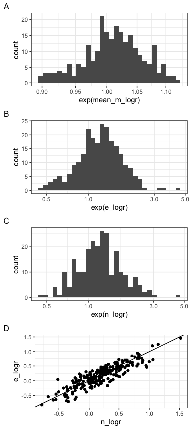<!-- -->

    ## 
    ## Call:
    ## lm(formula = e_logr ~ n_logr, data = obs)
    ## 
    ## Residuals:
    ##      Min       1Q   Median       3Q      Max 
    ## -0.44704 -0.11102  0.00834  0.13139  0.49301 
    ## 
    ## Coefficients:
    ##             Estimate Std. Error t value Pr(>|t|)    
    ## (Intercept) 0.008793   0.012788   0.688    0.492    
    ## n_logr      0.883058   0.030477  28.975   <2e-16 ***
    ## ---
    ## Signif. codes:  0 '***' 0.001 '**' 0.01 '*' 0.05 '.' 0.1 ' ' 1
    ## 
    ## Residual standard error: 0.1724 on 236 degrees of freedom
    ## Multiple R-squared:  0.7806, Adjusted R-squared:  0.7796 
    ## F-statistic: 839.5 on 1 and 236 DF,  p-value: < 2.2e-16

  - Total E skews weakly towards increasing (median = `1.2214028`, 95%
    interval `0.5598984, 2.3396469`; `0.7142857` increase.
  - Most changes are not dramatic (only 10% of **increases** are more
    than a doubling; only 3% of **decreases** are less than halving)
  - These figures represent just raw values. You could repeat with a
    t-test comparing first 5 and last 5 years, or a linear model across
    the whole timeseries. I lean **against** a hierarchical model,
    because I am more interested in the heterogeneity of slopes than in
    an “overall” slope. But hey, you could do it.
  - Change in E is strongly predicted by change in N; r2 = .78

## ISD and species compositonal overlap

    ## `stat_bin()` using `bins = 30`. Pick better value with `binwidth`.

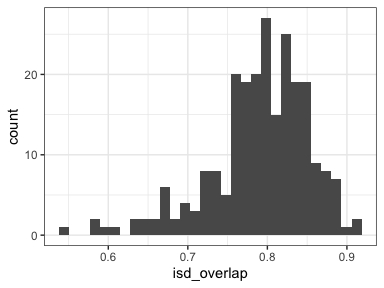<!-- -->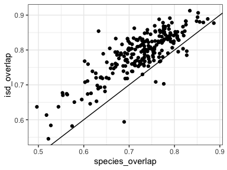<!-- -->

    ##    Min. 1st Qu.  Median    Mean 3rd Qu.    Max. 
    ##  0.5452  0.7604  0.7992  0.7903  0.8324  0.9126

    ##      2.5%       50%     97.5% 
    ## 0.6371093 0.7991639 0.8833262

    ## 
    ## Call:
    ## lm(formula = isd_overlap ~ species_overlap, data = obs)
    ## 
    ## Residuals:
    ##      Min       1Q   Median       3Q      Max 
    ## -0.16986 -0.02124  0.00176  0.02415  0.13205 
    ## 
    ## Coefficients:
    ##                 Estimate Std. Error t value Pr(>|t|)    
    ## (Intercept)      0.25545    0.02496   10.24   <2e-16 ***
    ## species_overlap  0.73749    0.03425   21.53   <2e-16 ***
    ## ---
    ## Signif. codes:  0 '***' 0.001 '**' 0.01 '*' 0.05 '.' 0.1 ' ' 1
    ## 
    ## Residual standard error: 0.03679 on 236 degrees of freedom
    ## Multiple R-squared:  0.6627, Adjusted R-squared:  0.6613 
    ## F-statistic: 463.6 on 1 and 236 DF,  p-value: < 2.2e-16

  - ISDs are highly conserved (median .8, 95% interval .63 - .88)

  - Change in the ISD is strongly related to change in species
    composition (linear model r2 = .66, p \<\< 0.01)

  - ISDs are almost always more conserved than species overlap. This is
    to some extent expected; the ISD can’t be (much) less conserved than
    species overlap. (I’m 99% sure exceptions occur because of
    intraspecific variation, in this case introduced via sampling).

  - I think the increasing E means that there is probably a weak
    overrepresentation of sites where the mean body size increases over
    time, but I’m not sure how strong that will be because
    
      - The slopes are heterogeneous
      - Mass and energy don’t scale 1:1, and averaging can be tricky on
        the intuition

# 2\. Relative to a continental-scale null model

Here we have shuffled species’ identities across all species ever
observed across all the routes in this analysis.

    ## Joining, by = c("route.x", "region.x")

    ## `summarise()` has grouped output by 'site.x', 'route.x', 'region.x', 'location.bcr.x', 'location.longitude.x', 'location.latitude.x'. You can override using the `.groups` argument.

    ## `stat_bin()` using `bins = 30`. Pick better value with `binwidth`.

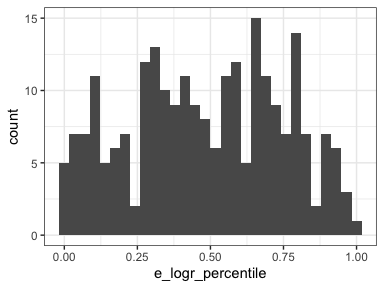<!-- -->

    ## `stat_bin()` using `bins = 30`. Pick better value with `binwidth`.

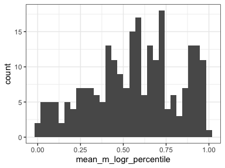<!-- -->

    ## `stat_bin()` using `bins = 30`. Pick better value with `binwidth`.

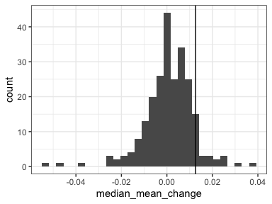<!-- -->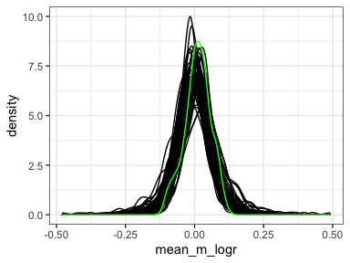<!-- -->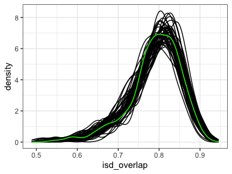<!-- -->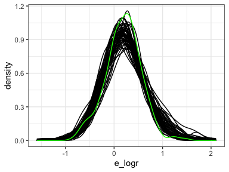<!-- -->

    ## `stat_bin()` using `bins = 30`. Pick better value with `binwidth`.

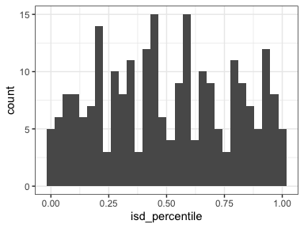<!-- -->

    ## [1] 0.01680672

    ## [1] 0.05042017

    ## [1] 0.05462185

    ## [1] 0.04621849

    ## [1] 0.9495798

    ## [1] 0.9201681

    ## `stat_bin()` using `bins = 30`. Pick better value with `binwidth`.

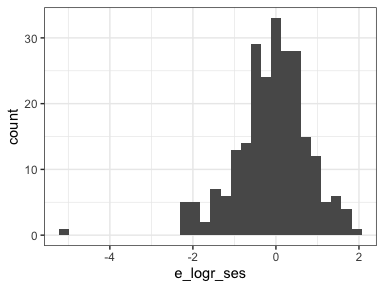<!-- -->

    ## `stat_bin()` using `bins = 30`. Pick better value with `binwidth`.

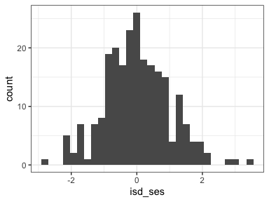<!-- -->

These don’t deviate at all from a null model shuffling species at a
continental scale.
