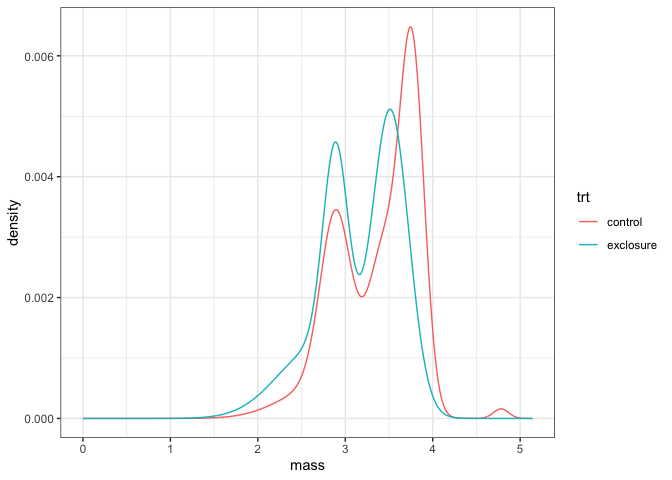
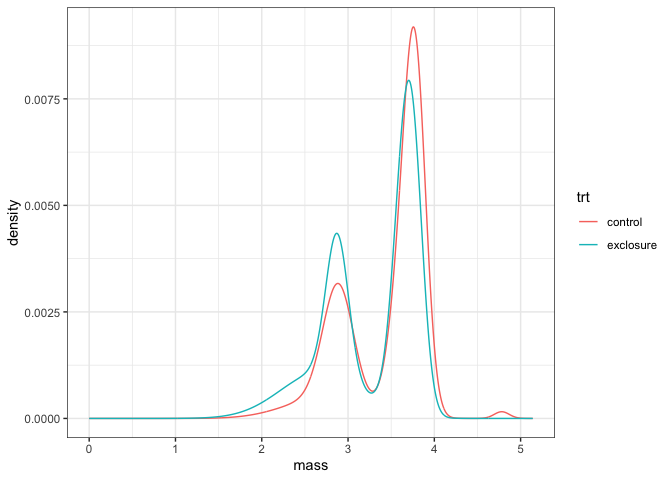
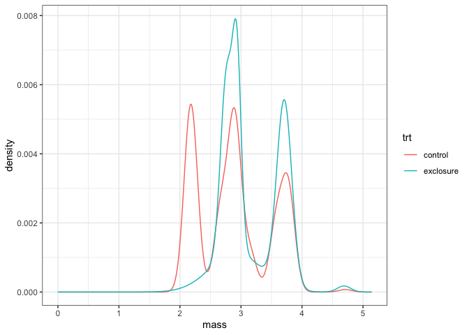
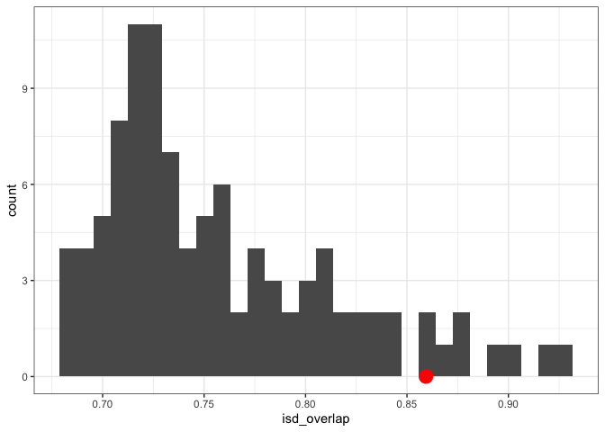
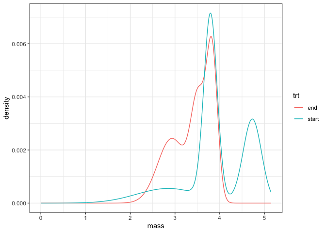
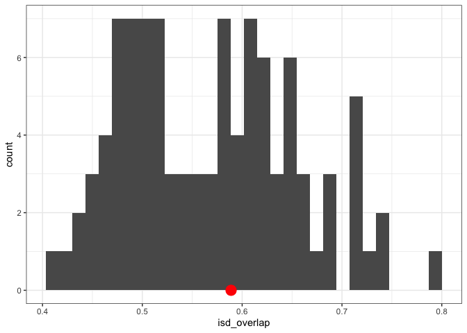

Portal EE v CC
================

  - [Thinking](#thinking)
  - [Early 1980s](#early-1980s)
  - [Early 2000s](#early-2000s)
  - [Early 2000s - manipulated](#early-2000s---manipulated)
  - [Over time](#over-time)

# Thinking

Trying to use Portal exclosure v. controls to develop intuition for how
this null model works.

The thinking is that:

  - EE v CC in the early 1980s should constitute a pretty pronounced
    size shift, and so ISD similarity should be on the low end of what
    is expected given species turnover. This is because the primary
    difference between the exclosures and controls is the removal of the
    3 largest species.

  - Contrasting with EE v CC in the early 2000s, when PB was dominant on
    EE plots. At that time, the biggest difference - from our
    perspective - is that DM/DO are in that size class on CC, but PB is
    dominating that size class on EE plots. Which I would think
    constitutes pretty good size-structured replacement (although note
    that PB is slightly smaller than the krats). So the thinking is that
    that comparison would be on the **high** end of ISD similarity |
    species turnover.

  - However, either of these could be not-what-happens because of
    
      - other changes along the size spectrum (idk, reithros or
        something)
      - the ISD being inherently kind of….squishy and conserved.
      - species pool effects - haven’t thought these through completely
      - this null model seems to give prety broad 95% intervals/it seems
        pretty hard to deviate from this null. Part of the purpose of
        this is to gauge if - even in scenarios that **I** think are
        Definitely Size Structured - deviations don’t show up.

# Early 1980s

``` r
## Set up the cache and config
db <- DBI::dbConnect(RSQLite::SQLite(), here::here("drake-cache-pn.sqlite"), synchronous = NULL)
cache <- storr::storr_dbi("datatable", "keystable", db)

cache$del(key = "lock", namespace = "session")

loadd(siteDescs_exclosure_real_counts, cache = cache)
loadd(siteDescs_control_real_counts, cache = cache)
loadd(siteDescs_control_shuffled_counts_sim_splist_2L, cache = cache)
loadd(siteDescs_exclosure_shuffled_counts_sim_splist_2L, cache = cache)
loadd(allComps, cache = cache)
```

``` r
eighties_isd_gmms <- list(control = siteDescs_control_real_counts$gmm, exclosure = siteDescs_exclosure_real_counts$gmm) %>%
  bind_rows(.id = "trt")
ggplot(eighties_isd_gmms, aes(mass, density, color = trt)) + 
  geom_line()
```

<!-- -->

``` r
# 
# eighties_isd_sim_gmms <- list(control = siteDescs_control_shuffled_counts_sim_splist_2L$gmm, exclosure = siteDescs_exclosure_shuffled_counts_sim_splist_2L$gmm) %>%
#   bind_rows(.id = "trt")
# ggplot(eighties_isd_sim_gmms, aes(mass, density, color = trt)) + 
#   geom_line() 
```

``` r
ggplot(filter(allComps, sim > 0), aes(isd_overlap)) +
  geom_histogram() +
  geom_point(data = filter(allComps, sim < 0), aes(isd_overlap, 0), color = "red", size = 5)
```

    ## `stat_bin()` using `bins = 30`. Pick better value with `binwidth`.

<!-- -->

``` r
simComps <- filter(allComps, sim > 0)
realComp <- filter(allComps, sim < 0)

# percentile

sum(simComps$isd_overlap > realComp$isd_overlap[1]) / nrow(simComps)
```

    ## [1] 0.99

``` r
# ses 

(realComp$isd_overlap[1] - mean(simComps$isd_overlap)) / sd(simComps$isd_overlap)
```

    ## [1] -1.823809

``` r
#filter(simComps, isd_overlap < realComp$isd_overlap[1])

realComp
```

    ##    site.x    site.y isd_overlap species_overlap      bcd    n_logr   e_logr sim
    ## 1 control exclosure   0.2030657       0.1667444 0.803003 0.8602013 1.944166 -99
    ##   shuffle_seed
    ## 1           NA

``` r
DBI::dbDisconnect(db)
rm(cache)
rm(list =ls())
```

# Early 2000s

``` r
## Set up the cache and config
db <- DBI::dbConnect(RSQLite::SQLite(), here::here("drake-cache-pn-t.sqlite"), synchronous = NULL)
cache <- storr::storr_dbi("datatable", "keystable", db)

cache$del(key = "lock", namespace = "session")

loadd(siteDescs_exclosure_real_counts, cache = cache)
loadd(siteDescs_control_real_counts, cache = cache)
loadd(siteDescs_control_shuffled_counts_sim_splist_2L, cache = cache)
loadd(siteDescs_exclosure_shuffled_counts_sim_splist_2L, cache = cache)
loadd(allComps, cache = cache)
```

``` r
thous_isd_gmms <- list(control = siteDescs_control_real_counts$gmm, exclosure = siteDescs_exclosure_real_counts$gmm) %>%
  bind_rows(.id = "trt")
ggplot(thous_isd_gmms, aes(mass, density, color = trt)) + 
  geom_line()
```

<!-- -->

``` r
# 
# thous_isd_sim_gmms <- list(control = siteDescs_control_shuffled_counts_sim_splist_2L$gmm, exclosure = siteDescs_exclosure_shuffled_counts_sim_splist_2L$gmm) %>%
#   bind_rows(.id = "trt")
# ggplot(thous_isd_sim_gmms, aes(mass, density, color = trt)) + 
#   geom_line() 
```

``` r
ggplot(filter(allComps, sim > 0), aes(isd_overlap)) +
  geom_histogram() +
  geom_point(data = filter(allComps, sim < 0), aes(isd_overlap, 0), color = "red", size = 5)
```

    ## `stat_bin()` using `bins = 30`. Pick better value with `binwidth`.

<!-- -->

``` r
simComps <- filter(allComps, sim > 0)
realComp <- filter(allComps, sim < 0)

# percentile

sum(simComps$isd_overlap < realComp$isd_overlap[1]) / nrow(simComps)
```

    ## [1] 0.69

``` r
# ses 

(realComp$isd_overlap[1] - mean(simComps$isd_overlap)) / sd(simComps$isd_overlap)
```

    ## [1] 0.2552872

``` r
realComp
```

    ##    site.x    site.y isd_overlap species_overlap       bcd    n_logr    e_logr
    ## 1 control exclosure   0.7763365        0.668771 0.2710923 0.2171947 0.3758821
    ##   sim shuffle_seed
    ## 1 -99           NA

``` r
DBI::dbDisconnect(db)
rm(cache)
rm(list =ls())
```

# Early 2000s - manipulated

``` r
## Set up the cache and config
db <- DBI::dbConnect(RSQLite::SQLite(), here::here("drake-cache-pn-t-M.sqlite"), synchronous = NULL)
cache <- storr::storr_dbi("datatable", "keystable", db)

cache$del(key = "lock", namespace = "session")

loadd(siteDescs_exclosure_real_counts, cache = cache)
loadd(siteDescs_control_real_counts, cache = cache)
loadd(siteDescs_control_shuffled_counts_sim_splist_2L, cache = cache)
loadd(siteDescs_exclosure_shuffled_counts_sim_splist_2L, cache = cache)
loadd(allComps, cache = cache)
```

``` r
thous_isd_gmms <- list(control = siteDescs_control_real_counts$gmm, exclosure = siteDescs_exclosure_real_counts$gmm) %>%
  bind_rows(.id = "trt")
ggplot(thous_isd_gmms, aes(mass, density, color = trt)) + 
  geom_line()
```

<!-- -->

``` r
thous_isd_sim_gmms <- list(control = siteDescs_control_shuffled_counts_sim_splist_2L$gmm, exclosure = siteDescs_exclosure_shuffled_counts_sim_splist_2L$gmm) %>%
  bind_rows(.id = "trt")
ggplot(thous_isd_sim_gmms, aes(mass, density, color = trt)) + 
  geom_line() 
```

<!-- -->

``` r
ggplot(filter(allComps, sim > 0), aes(isd_overlap)) +
  geom_histogram() +
  geom_point(data = filter(allComps, sim < 0), aes(isd_overlap, 0), color = "red", size = 5)
```

    ## `stat_bin()` using `bins = 30`. Pick better value with `binwidth`.

<!-- -->

``` r
simComps <- filter(allComps, sim > 0)
realComp <- filter(allComps, sim < 0)

# percentile

sum(simComps$isd_overlap < realComp$isd_overlap[1]) / nrow(simComps)
```

    ## [1] 0.93

``` r
# ses 

(realComp$isd_overlap[1] - mean(simComps$isd_overlap)) / sd(simComps$isd_overlap)
```

    ## [1] 1.758949

``` r
realComp
```

    ##    site.x    site.y isd_overlap species_overlap       bcd    n_logr   e_logr
    ## 1 control exclosure   0.8593339        0.668771 0.2710923 0.2171947 0.327632
    ##   sim shuffle_seed
    ## 1 -99           NA

# Over time

``` r
DBI::dbDisconnect(db)
rm(cache)
rm(list =ls())
## Set up the cache and config
db <- DBI::dbConnect(RSQLite::SQLite(), here::here("drake-cache-pn-w.sqlite"), synchronous = NULL)
cache <- storr::storr_dbi("datatable", "keystable", db)

cache$del(key = "lock", namespace = "session")

loadd(siteDescs_start_real_counts, cache = cache)
loadd(siteDescs_end_real_counts, cache = cache)
loadd(siteDescs_end_shuffled_counts_sim_splist_2L, cache = cache)
loadd(siteDescs_start_shuffled_counts_sim_splist_2L, cache = cache)
loadd(allComps, cache = cache)
```

``` r
thous_isd_gmms <- list(end = siteDescs_end_real_counts$gmm, start = siteDescs_start_real_counts$gmm) %>%
  bind_rows(.id = "trt")
ggplot(thous_isd_gmms, aes(mass, density, color = trt)) + 
  geom_line()
```

<!-- -->

``` r
# 
# thous_isd_sim_gmms <- list(control = siteDescs_control_shuffled_counts_sim_splist_2L$gmm, exclosure = siteDescs_exclosure_shuffled_counts_sim_splist_2L$gmm) %>%
#   bind_rows(.id = "trt")
# ggplot(thous_isd_sim_gmms, aes(mass, density, color = trt)) + 
#   geom_line() 
```

``` r
ggplot(filter(allComps, sim > 0), aes(isd_overlap)) +
  geom_histogram() +
  geom_point(data = filter(allComps, sim < 0), aes(isd_overlap, 0), color = "red", size = 5)
```

    ## `stat_bin()` using `bins = 30`. Pick better value with `binwidth`.

<!-- -->

``` r
simComps <- filter(allComps, sim > 0)
realComp <- filter(allComps, sim < 0)

# percentile

sum(simComps$isd_overlap < realComp$isd_overlap[1]) / nrow(simComps)
```

    ## [1] 0.58

``` r
# ses 

(realComp$isd_overlap[1] - mean(simComps$isd_overlap)) / sd(simComps$isd_overlap)
```

    ## [1] 0.2412757

``` r
realComp
```

    ##   site.x site.y isd_overlap species_overlap       bcd    n_logr    e_logr sim
    ## 1  start    end   0.5889142       0.4116399 0.5511965 0.5696475 0.1040612 -99
    ##   shuffle_seed
    ## 1           NA

``` r
DBI::dbDisconnect(db)
rm(cache)
rm(list =ls())
```
