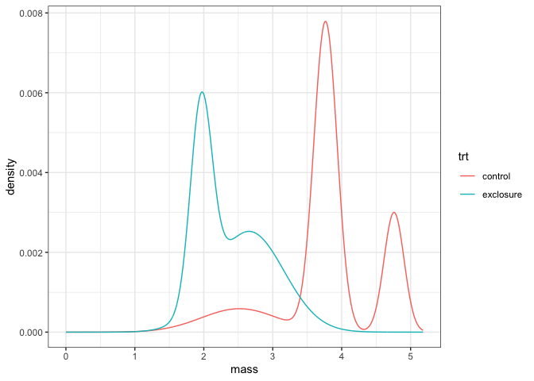
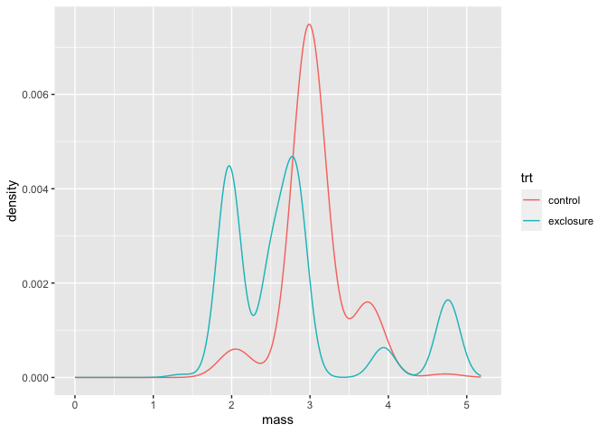
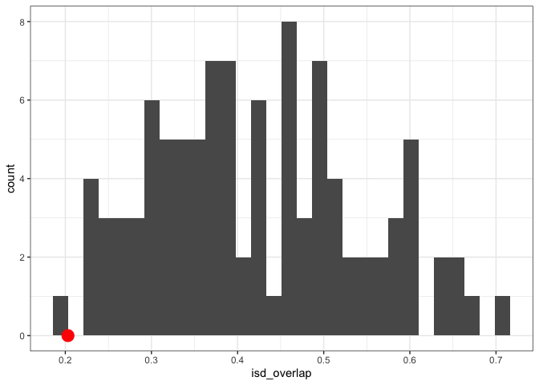

Portal EE v CC
================

  - [Thinking](#thinking)
  - [Early 1980s](#early-1980s)
  - [Early 2000s](#early-2000s)

# Thinking

Trying to use Portal exclosure v. controls to develop intuition for how
this null model works.

The thinking is that:

  - EE v CC in the early 1980s should constitute a pretty pronounced
    size shift, and so ISD similarity should be on the low end of what
    is expected given species turnover. This is because the primary
    difference between the exclosures and controls is the removal of the
    3 largest species.

  - Contrasting with EE v CC in the early 2000s, when PB was dominant on
    EE plots. At that time, the biggest difference - from our
    perspective - is that DM/DO are in that size class on CC, but PB is
    dominating that size class on EE plots. Which I would think
    constitutes pretty good size-structured replacement (although note
    that PB is slightly smaller than the krats). So the thinking is that
    that comparison would be on the **high** end of ISD similarity |
    species turnover.

  - However, either of these could be not-what-happens because of
    
      - other changes along the size spectrum (idk, reithros or
        something)
      - the ISD being inherently kind of….squishy and conserved.
      - species pool effects - haven’t thought these through completely
      - this null model seems to give prety broad 95% intervals/it seems
        pretty hard to deviate from this null. Part of the purpose of
        this is to gauge if - even in scenarios that **I** think are
        Definitely Size Structured - deviations don’t show up.

# Early 1980s

``` r
## Set up the cache and config
db <- DBI::dbConnect(RSQLite::SQLite(), here::here("drake-cache-pn.sqlite"), synchronous = NULL)
cache <- storr::storr_dbi("datatable", "keystable", db)

cache$del(key = "lock", namespace = "session")

loadd(siteDescs_exclosure_real_counts, cache = cache)
loadd(siteDescs_control_real_counts, cache = cache)
loadd(siteDescs_control_shuffled_counts_sim_splist_2L, cache = cache)
loadd(siteDescs_exclosure_shuffled_counts_sim_splist_2L, cache = cache)
loadd(allComps, cache = cache)
```

``` r
eighties_isd_gmms <- list(control = siteDescs_control_real_counts$gmm, exclosure = siteDescs_exclosure_real_counts$gmm) %>%
  bind_rows(.id = "trt")
ggplot(eighties_isd_gmms, aes(mass, density, color = trt)) + 
  geom_line()
```

<!-- -->

``` r
eighties_isd_sim_gmms <- list(control = siteDescs_control_shuffled_counts_sim_splist_2L$gmm, exclosure = siteDescs_exclosure_shuffled_counts_sim_splist_2L$gmm) %>%
  bind_rows(.id = "trt")
ggplot(eighties_isd_sim_gmms, aes(mass, density, color = trt)) + 
  geom_line() 
```

<!-- -->

``` r
ggplot(filter(allComps, sim > 0), aes(isd_overlap)) +
  geom_histogram() +
  geom_point(data = filter(allComps, sim < 0), aes(isd_overlap, 0), color = "red", size = 5)
```

    ## `stat_bin()` using `bins = 30`. Pick better value with `binwidth`.

<!-- -->

``` r
simComps <- filter(allComps, sim > 0)
realComp <- filter(allComps, sim < 0)

# percentile

sum(simComps$isd_overlap > realComp$isd_overlap[1]) / nrow(simComps)
```

    ## [1] 0.99

``` r
# ses 

(realComp$isd_overlap[1] - mean(simComps$isd_overlap)) / sd(simComps$isd_overlap)
```

    ## [1] -1.823809

``` r
filter(simComps, isd_overlap < realComp$isd_overlap[1])
```

    ##    site.x    site.y isd_overlap species_overlap      bcd    n_logr   e_logr sim
    ## 1 control exclosure   0.2012215       0.1667444 0.803003 0.8602013 1.009521  93
    ##   shuffle_seed
    ## 1    654633838

``` r
DBI::dbDisconnect(db)
rm(cache)
rm(list =ls())
```

# Early 2000s

``` r
## Set up the cache and config
db <- DBI::dbConnect(RSQLite::SQLite(), here::here("drake-cache-pn-t.sqlite"), synchronous = NULL)
cache <- storr::storr_dbi("datatable", "keystable", db)

cache$del(key = "lock", namespace = "session")

loadd(siteDescs_exclosure_real_counts, cache = cache)
loadd(siteDescs_control_real_counts, cache = cache)
loadd(siteDescs_control_shuffled_counts_sim_splist_2L, cache = cache)
loadd(siteDescs_exclosure_shuffled_counts_sim_splist_2L, cache = cache)
loadd(allComps, cache = cache)
```

``` r
thous_isd_gmms <- list(control = siteDescs_control_real_counts$gmm, exclosure = siteDescs_exclosure_real_counts$gmm) %>%
  bind_rows(.id = "trt")
ggplot(thous_isd_gmms, aes(mass, density, color = trt)) + 
  geom_line()
```

<!-- -->

``` r
thous_isd_sim_gmms <- list(control = siteDescs_control_shuffled_counts_sim_splist_2L$gmm, exclosure = siteDescs_exclosure_shuffled_counts_sim_splist_2L$gmm) %>%
  bind_rows(.id = "trt")
ggplot(thous_isd_sim_gmms, aes(mass, density, color = trt)) + 
  geom_line() 
```

<!-- -->

``` r
ggplot(filter(allComps, sim > 0), aes(isd_overlap)) +
  geom_histogram() +
  geom_point(data = filter(allComps, sim < 0), aes(isd_overlap, 0), color = "red", size = 5)
```

    ## `stat_bin()` using `bins = 30`. Pick better value with `binwidth`.

<!-- -->

``` r
simComps <- filter(allComps, sim > 0)
realComp <- filter(allComps, sim < 0)

# percentile

sum(simComps$isd_overlap < realComp$isd_overlap[1]) / nrow(simComps)
```

    ## [1] 0.69

``` r
# ses 

(realComp$isd_overlap[1] - mean(simComps$isd_overlap)) / sd(simComps$isd_overlap)
```

    ## [1] 0.2552872

``` r
filter(simComps, isd_overlap < realComp$isd_overlap[1])
```

    ##     site.x    site.y isd_overlap species_overlap       bcd    n_logr
    ## 1  control exclosure   0.7565078        0.668771 0.2710923 0.2171947
    ## 2  control exclosure   0.6903816        0.668771 0.2710923 0.2171947
    ## 3  control exclosure   0.7561934        0.668771 0.2710923 0.2171947
    ## 4  control exclosure   0.7381829        0.668771 0.2710923 0.2171947
    ## 5  control exclosure   0.7139318        0.668771 0.2710923 0.2171947
    ## 6  control exclosure   0.7469209        0.668771 0.2710923 0.2171947
    ## 7  control exclosure   0.7154069        0.668771 0.2710923 0.2171947
    ## 8  control exclosure   0.7289397        0.668771 0.2710923 0.2171947
    ## 9  control exclosure   0.6904392        0.668771 0.2710923 0.2171947
    ## 10 control exclosure   0.7046231        0.668771 0.2710923 0.2171947
    ## 11 control exclosure   0.7562283        0.668771 0.2710923 0.2171947
    ## 12 control exclosure   0.7088607        0.668771 0.2710923 0.2171947
    ## 13 control exclosure   0.7343060        0.668771 0.2710923 0.2171947
    ## 14 control exclosure   0.7619114        0.668771 0.2710923 0.2171947
    ## 15 control exclosure   0.7161112        0.668771 0.2710923 0.2171947
    ## 16 control exclosure   0.7209360        0.668771 0.2710923 0.2171947
    ## 17 control exclosure   0.7597578        0.668771 0.2710923 0.2171947
    ## 18 control exclosure   0.7351004        0.668771 0.2710923 0.2171947
    ## 19 control exclosure   0.7460290        0.668771 0.2710923 0.2171947
    ## 20 control exclosure   0.7292146        0.668771 0.2710923 0.2171947
    ## 21 control exclosure   0.7019049        0.668771 0.2710923 0.2171947
    ## 22 control exclosure   0.6849178        0.668771 0.2710923 0.2171947
    ## 23 control exclosure   0.6886673        0.668771 0.2710923 0.2171947
    ## 24 control exclosure   0.7547611        0.668771 0.2710923 0.2171947
    ## 25 control exclosure   0.7557980        0.668771 0.2710923 0.2171947
    ## 26 control exclosure   0.7143793        0.668771 0.2710923 0.2171947
    ## 27 control exclosure   0.7119103        0.668771 0.2710923 0.2171947
    ## 28 control exclosure   0.7165396        0.668771 0.2710923 0.2171947
    ## 29 control exclosure   0.7493539        0.668771 0.2710923 0.2171947
    ## 30 control exclosure   0.7131451        0.668771 0.2710923 0.2171947
    ## 31 control exclosure   0.7734467        0.668771 0.2710923 0.2171947
    ## 32 control exclosure   0.7335887        0.668771 0.2710923 0.2171947
    ## 33 control exclosure   0.7321530        0.668771 0.2710923 0.2171947
    ## 34 control exclosure   0.7274310        0.668771 0.2710923 0.2171947
    ## 35 control exclosure   0.7316185        0.668771 0.2710923 0.2171947
    ## 36 control exclosure   0.7641190        0.668771 0.2710923 0.2171947
    ## 37 control exclosure   0.7122349        0.668771 0.2710923 0.2171947
    ## 38 control exclosure   0.6923450        0.668771 0.2710923 0.2171947
    ## 39 control exclosure   0.7699583        0.668771 0.2710923 0.2171947
    ## 40 control exclosure   0.7393119        0.668771 0.2710923 0.2171947
    ## 41 control exclosure   0.7725362        0.668771 0.2710923 0.2171947
    ## 42 control exclosure   0.7360322        0.668771 0.2710923 0.2171947
    ## 43 control exclosure   0.7518602        0.668771 0.2710923 0.2171947
    ## 44 control exclosure   0.7483707        0.668771 0.2710923 0.2171947
    ## 45 control exclosure   0.7583615        0.668771 0.2710923 0.2171947
    ## 46 control exclosure   0.7364537        0.668771 0.2710923 0.2171947
    ## 47 control exclosure   0.7047644        0.668771 0.2710923 0.2171947
    ## 48 control exclosure   0.7426781        0.668771 0.2710923 0.2171947
    ## 49 control exclosure   0.7173025        0.668771 0.2710923 0.2171947
    ## 50 control exclosure   0.7139567        0.668771 0.2710923 0.2171947
    ## 51 control exclosure   0.7627396        0.668771 0.2710923 0.2171947
    ## 52 control exclosure   0.7451373        0.668771 0.2710923 0.2171947
    ## 53 control exclosure   0.6786871        0.668771 0.2710923 0.2171947
    ## 54 control exclosure   0.6992217        0.668771 0.2710923 0.2171947
    ## 55 control exclosure   0.7626220        0.668771 0.2710923 0.2171947
    ## 56 control exclosure   0.7609755        0.668771 0.2710923 0.2171947
    ## 57 control exclosure   0.7288637        0.668771 0.2710923 0.2171947
    ## 58 control exclosure   0.7060137        0.668771 0.2710923 0.2171947
    ## 59 control exclosure   0.7213544        0.668771 0.2710923 0.2171947
    ## 60 control exclosure   0.7751063        0.668771 0.2710923 0.2171947
    ## 61 control exclosure   0.7297213        0.668771 0.2710923 0.2171947
    ## 62 control exclosure   0.7010347        0.668771 0.2710923 0.2171947
    ## 63 control exclosure   0.7264812        0.668771 0.2710923 0.2171947
    ## 64 control exclosure   0.6901858        0.668771 0.2710923 0.2171947
    ## 65 control exclosure   0.7215469        0.668771 0.2710923 0.2171947
    ## 66 control exclosure   0.7002109        0.668771 0.2710923 0.2171947
    ## 67 control exclosure   0.7571459        0.668771 0.2710923 0.2171947
    ## 68 control exclosure   0.7359505        0.668771 0.2710923 0.2171947
    ## 69 control exclosure   0.7200654        0.668771 0.2710923 0.2171947
    ##         e_logr sim shuffle_seed
    ## 1  0.132143987 100    742288911
    ## 2  0.036322845  11    967383329
    ## 3  0.032555746  12    923353120
    ## 4  0.160776652  13    424762155
    ## 5  0.494998244  14    704624944
    ## 6  0.096305231  15    599572707
    ## 7  0.301866285  16    233002542
    ## 8  0.245803049  18    170515299
    ## 9  0.003739314  19    328441727
    ## 10 0.054421929   1    516095158
    ## 11 0.007761420  20    935414196
    ## 12 0.055062240  21     47908415
    ## 13 0.268636713  24    449058826
    ## 14 0.033164302  25    197151466
    ## 15 0.135881561  26    519874537
    ## 16 0.070527479  28     97735385
    ## 17 0.110873728  29    153687265
    ## 18 0.056772570   2    226715738
    ## 19 0.004234502  31    978460135
    ## 20 0.112877869  32    521724118
    ## 21 0.553267957  35    961030666
    ## 22 0.264107522  36    319615405
    ## 23 0.405489758  37    440926578
    ## 24 0.376196442  38     60531514
    ## 25 0.382409300  39    789250140
    ## 26 0.119837716  40    993786552
    ## 27 1.013974590  43    404287958
    ## 28 0.110428309  45    718165601
    ## 29 0.095345503  46    117519588
    ## 30 0.079404493  47    674855477
    ## 31 0.371607122  48    127623012
    ## 32 0.077016607  49    546558981
    ## 33 0.421623519   4    197602005
    ## 34 0.392825876  50    175267738
    ## 35 0.199526813  51    953077745
    ## 36 0.420657102  52    547489863
    ## 37 0.674415711  53    441035588
    ## 38 0.381455213  54    449617635
    ## 39 0.300381966  56    755755185
    ## 40 0.443492082  57    209619630
    ## 41 0.387182957  59     98442573
    ## 42 0.245443069   5    707792442
    ## 43 0.107973442  61    843863170
    ## 44 0.108091411  62     17332796
    ## 45 0.365854544  63    730395028
    ## 46 0.095536758  64    347440777
    ## 47 0.081106891  65    237487768
    ## 48 0.087181318  67    945738354
    ## 49 0.221183095  69    730150306
    ## 50 0.748684411   6    382276444
    ## 51 0.545769119  72    238487881
    ## 52 0.481535961  73    977014116
    ## 53 0.101690060  76    571057757
    ## 54 0.082379231  79     52032656
    ## 55 0.031237726   7    548007867
    ## 56 0.324579704  80    279719444
    ## 57 0.739718871  81    371333252
    ## 58 0.598181147  84    129524201
    ## 59 0.127569861  85    506446307
    ## 60 0.065237413  86    995202837
    ## 61 0.749771022  87    268020673
    ## 62 0.615356658  88    288312215
    ## 63 0.468864590   8    510894539
    ## 64 0.080824178  90    590998869
    ## 65 0.571112576  91    886016349
    ## 66 0.021606981  92     47168429
    ## 67 0.359408361  93    654633838
    ## 68 0.020869739  98    433659054
    ## 69 0.671328188  99    161378688
