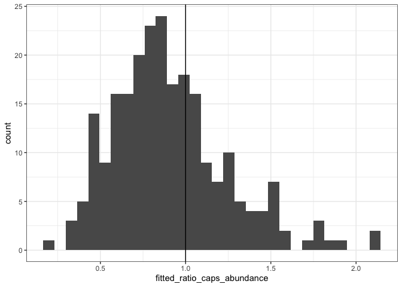
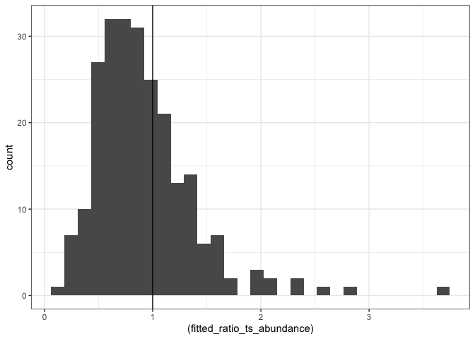
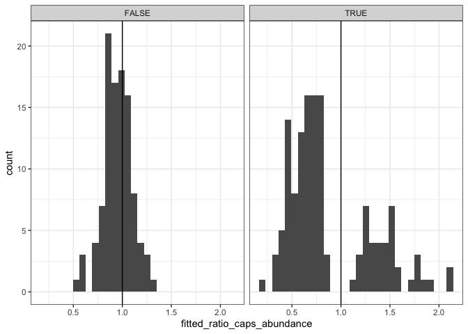
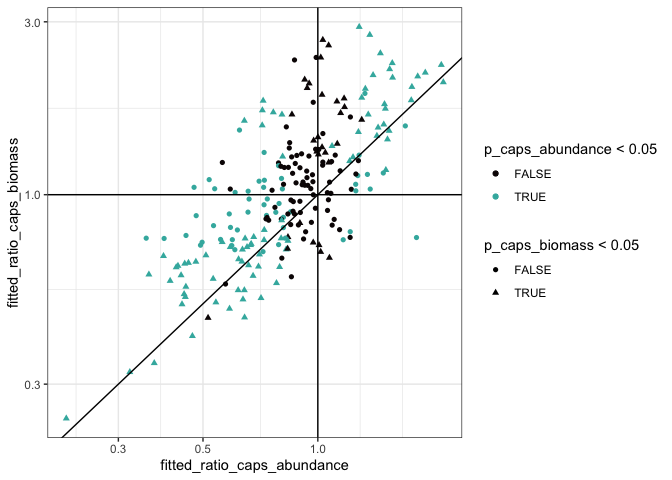
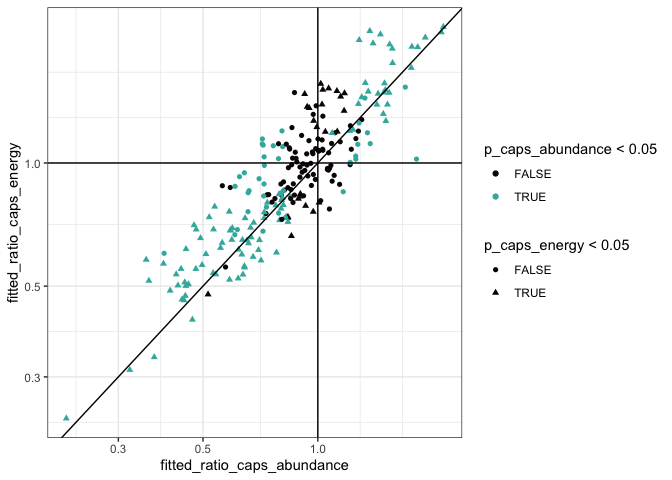
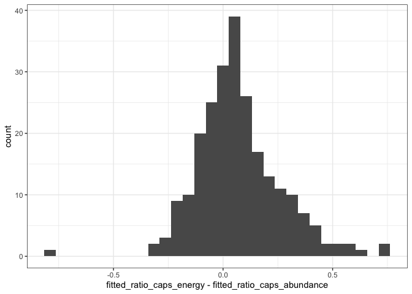
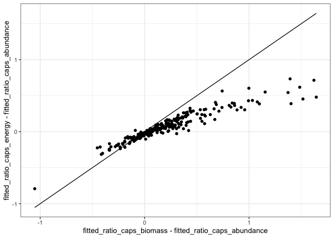
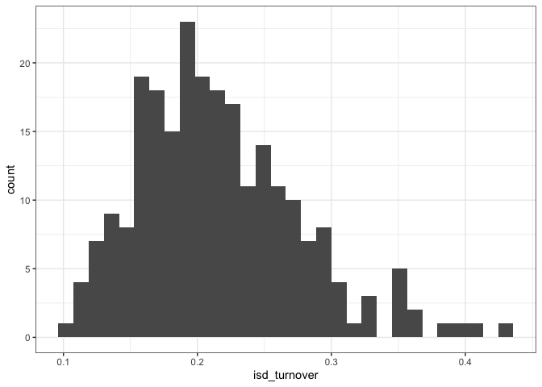
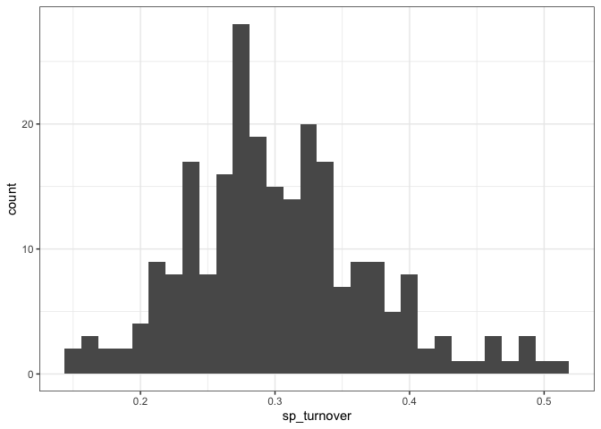
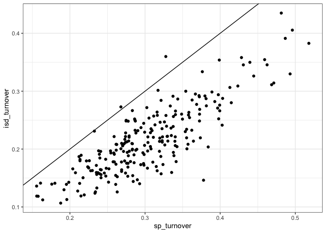

Actual results
================
Renata Diaz
2021-09-03

  - [State variable change](#state-variable-change)

# State variable change

``` r
# 
# ggplot(all_results, aes(fitted_ratio_caps_abundance, r2_caps_abundance, color = p_caps_abundance > .05, size = r2_caps_abundance)) + geom_point(alpha = .3)

ggplot(all_results, aes(fitted_ratio_caps_abundance)) + geom_histogram() + geom_vline(xintercept = 1)
```

    ## `stat_bin()` using `bins = 30`. Pick better value with `binwidth`.

<!-- -->

``` r
ggplot(all_results, aes((fitted_ratio_ts_abundance))) + geom_histogram() + geom_vline(xintercept = 1)
```

    ## `stat_bin()` using `bins = 30`. Pick better value with `binwidth`.

<!-- -->

``` r
ggplot(all_results, aes(fitted_ratio_caps_abundance)) + geom_histogram() + geom_vline(xintercept = 1) + facet_wrap(vars(p_caps_abundance < .05))
```

    ## `stat_bin()` using `bins = 30`. Pick better value with `binwidth`.

<!-- -->

``` r
all_results %>% 
  mutate(abundance_sig = p_caps_abundance < .05,
         abundance_inc = fitted_ratio_caps_abundance > 1) %>%
  group_by(abundance_sig, abundance_inc) %>%
  summarize(nroutes = dplyr::n()) %>%
  ungroup()
```

    ## `summarise()` has grouped output by 'abundance_sig'. You can override using the `.groups` argument.

<div class="kable-table">

| abundance\_sig | abundance\_inc | nroutes |
| :------------- | :------------- | ------: |
| FALSE          | FALSE          |      65 |
| FALSE          | TRUE           |      38 |
| TRUE           | FALSE          |      95 |
| TRUE           | TRUE           |      40 |

</div>

``` r
all_results %>% 
  mutate(abundance_sig = p_ts_abundance < .05,
         abundance_inc = fitted_ratio_ts_abundance > 1) %>%
  group_by(abundance_sig, abundance_inc) %>%
  summarize(nroutes = dplyr::n()) %>%
  ungroup()
```

    ## `summarise()` has grouped output by 'abundance_sig'. You can override using the `.groups` argument.

<div class="kable-table">

| abundance\_sig | abundance\_inc | nroutes |
| :------------- | :------------- | ------: |
| FALSE          | FALSE          |      54 |
| FALSE          | TRUE           |      34 |
| TRUE           | FALSE          |     106 |
| TRUE           | TRUE           |      44 |

</div>

``` r
all_results %>% 
  mutate(energy_sig = p_caps_energy < .05,
         energy_inc = fitted_ratio_caps_energy > 1) %>%
  group_by(energy_sig, energy_inc) %>%
  summarize(nroutes = dplyr::n()) %>%
  ungroup()
```

    ## `summarise()` has grouped output by 'energy_sig'. You can override using the `.groups` argument.

<div class="kable-table">

| energy\_sig | energy\_inc | nroutes |
| :---------- | :---------- | ------: |
| FALSE       | FALSE       |      65 |
| FALSE       | TRUE        |      52 |
| TRUE        | FALSE       |      77 |
| TRUE        | TRUE        |      44 |

</div>

``` r
all_results %>% 
  mutate(biomass_sig = p_caps_biomass < .05,
         biomass_inc = fitted_ratio_caps_biomass > 1) %>%
  group_by(biomass_sig, biomass_inc) %>%
  summarize(nroutes = dplyr::n()) %>%
  ungroup()
```

    ## `summarise()` has grouped output by 'biomass_sig'. You can override using the `.groups` argument.

<div class="kable-table">

| biomass\_sig | biomass\_inc | nroutes |
| :----------- | :----------- | ------: |
| FALSE        | FALSE        |      58 |
| FALSE        | TRUE         |      68 |
| TRUE         | FALSE        |      56 |
| TRUE         | TRUE         |      56 |

</div>

``` r
ggplot(all_results, aes(fitted_ratio_caps_abundance, fitted_ratio_caps_biomass, color = p_caps_abundance < .05, shape = p_caps_biomass < .05)) + geom_point() + geom_abline(intercept = 0, slope = 1) + scale_x_log10() + scale_y_log10() + geom_hline(yintercept = 1) + geom_vline(xintercept = 1) + scale_color_viridis_d(option = 'mako', end = .7)
```

<!-- -->

``` r
ggplot(all_results, aes(fitted_ratio_caps_abundance, fitted_ratio_caps_energy, color = p_caps_abundance < .05, shape = p_caps_energy < .05)) + geom_point() + geom_abline(intercept = 0, slope = 1) + scale_x_log10() + scale_y_log10() + geom_hline(yintercept = 1) + geom_vline(xintercept = 1) + scale_color_viridis_d(option = 'mako', end = .7)
```

<!-- -->

``` r
ggplot(all_results, aes(fitted_ratio_caps_energy - fitted_ratio_caps_abundance)) + geom_histogram() 
```

    ## `stat_bin()` using `bins = 30`. Pick better value with `binwidth`.

<!-- -->

``` r
summary(all_results$fitted_ratio_caps_energy - all_results$fitted_ratio_caps_abundance)
```

    ##     Min.  1st Qu.   Median     Mean  3rd Qu.     Max. 
    ## -0.79187 -0.03725  0.04718  0.07280  0.16563  0.73371

``` r
all_results %>% 
  mutate(mean_energy_sig = p_caps_mean_energy < .05,
         mean_energy_inc = fitted_ratio_caps_mean_energy > 1) %>%
  group_by(mean_energy_sig, mean_energy_inc) %>%
  summarize(nroutes = dplyr::n()) %>%
  ungroup()
```

    ## `summarise()` has grouped output by 'mean_energy_sig'. You can override using the `.groups` argument.

<div class="kable-table">

| mean\_energy\_sig | mean\_energy\_inc | nroutes |
| :---------------- | :---------------- | ------: |
| FALSE             | FALSE             |      52 |
| FALSE             | TRUE              |      88 |
| TRUE              | FALSE             |      32 |
| TRUE              | TRUE              |      66 |

</div>

``` r
summary(lm(fitted_ratio_caps_energy ~ fitted_ratio_caps_abundance, data = all_results))
```

    ## 
    ## Call:
    ## lm(formula = fitted_ratio_caps_energy ~ fitted_ratio_caps_abundance, 
    ##     data = all_results)
    ## 
    ## Residuals:
    ##      Min       1Q   Median       3Q      Max 
    ## -0.80890 -0.11738 -0.03212  0.09355  0.68930 
    ## 
    ## Coefficients:
    ##                             Estimate Std. Error t value Pr(>|t|)    
    ## (Intercept)                  0.12847    0.03542   3.627 0.000352 ***
    ## fitted_ratio_caps_abundance  0.93857    0.03661  25.634  < 2e-16 ***
    ## ---
    ## Signif. codes:  0 '***' 0.001 '**' 0.01 '*' 0.05 '.' 0.1 ' ' 1
    ## 
    ## Residual standard error: 0.1914 on 236 degrees of freedom
    ## Multiple R-squared:  0.7357, Adjusted R-squared:  0.7346 
    ## F-statistic: 657.1 on 1 and 236 DF,  p-value: < 2.2e-16

``` r
ggplot(all_results,aes(fitted_ratio_caps_biomass - fitted_ratio_caps_abundance, fitted_ratio_caps_energy - fitted_ratio_caps_abundance)) + geom_point() + geom_line(aes(y = fitted_ratio_caps_biomass - fitted_ratio_caps_abundance))
```

<!-- -->

``` r
ggplot(all_results, aes(isd_turnover)) + geom_histogram()
```

    ## `stat_bin()` using `bins = 30`. Pick better value with `binwidth`.

<!-- -->

``` r
ggplot(all_results, aes(sp_turnover)) + geom_histogram()
```

    ## `stat_bin()` using `bins = 30`. Pick better value with `binwidth`.

<!-- -->

``` r
ggplot(all_results, aes(sp_turnover, isd_turnover)) + geom_point() + onetoone
```

<!-- -->
