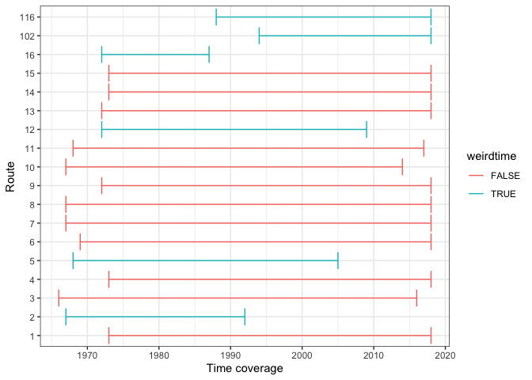
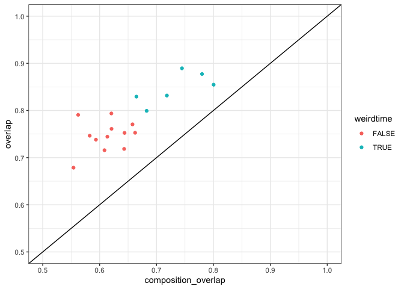
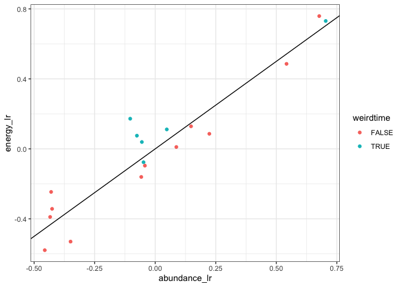
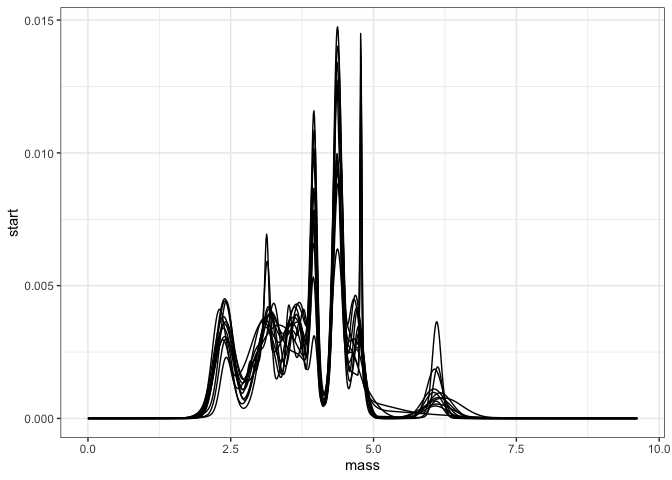
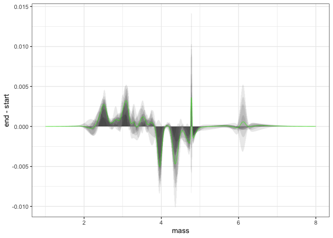
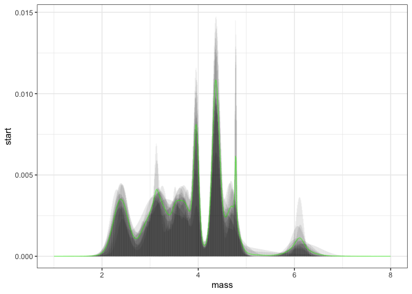
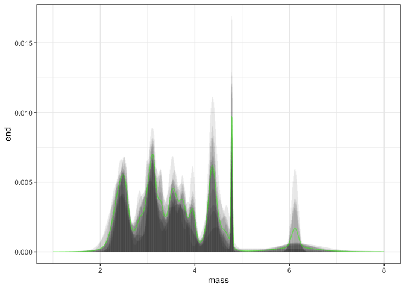

Connecticut
================

  - [Time periods](#time-periods)
  - [Overlap in ISD and species
    composition](#overlap-in-isd-and-species-composition)
  - [State variables](#state-variables)

## Time periods

``` r
route_years <- select(all_overlaps, route, region, location.bcr, location.routename, startyears, endyears) %>%
  distinct() %>%
  mutate(start = as.integer(substr(startyears, 0, 4)),
         end = as.integer(substr(endyears, 25,28)),
         startend = as.integer(substr(startyears, 25, 28)),
         endbegin = as.integer(substr(endyears, 0, 4))) %>%
  mutate(nyears = end - start) %>%
  mutate(startlate = start > 1975,
         endearly = end < 2010,
         startconsec = startend == start + 4,
         endconsec = endbegin == end - 4) %>%
  group_by_all() %>%
  mutate(weirdtime = startlate | endearly) %>%
  ungroup()


ggplot(route_years, aes(x = start, y = as.factor(route), color = weirdtime)) + 
  geom_errorbar(aes(xmin = start, xmax = end)) + xlab("Time coverage") + ylab("Route")
```

<!-- -->

## Overlap in ISD and species composition

``` r
all_overlaps <- left_join(all_overlaps, all_composition) %>% left_join(select(route_years, route, nyears, weirdtime))
```

    ## Joining, by = c("route", "region", "location.bcr", "sim_seed")

    ## Joining, by = "route"

``` r
ggplot(all_overlaps, aes(composition_overlap, overlap, color = weirdtime)) + geom_point() + geom_abline(intercept = 0, slope = 1) + xlim(.5, 1) + ylim(0.5,1)
```

<!-- -->

## State variables

``` r
all_sv_wide <- all_svs %>%
  select(timechunk, energy, biomass, abundance,route, region, sim_seed) %>%
  tidyr::pivot_wider(id_cols = c("route", "region", "sim_seed"), names_from = timechunk, values_from = c("energy", "biomass", "abundance"))

all_sv_change <- all_sv_wide %>%
  mutate(energy_lr = log(energy_end / energy_start),
         biomass_lr = log(biomass_end / biomass_start),
         abundance_lr = log(abundance_end/ abundance_start)) %>%
  left_join(select(route_years, route, nyears, weirdtime))
```

    ## Joining, by = "route"

``` r
ggplot(all_sv_change, aes(abundance_lr, energy_lr, color= weirdtime)) + geom_point() + geom_abline(intercept = 0, slope = 1) 
```

<!-- -->

``` r
all_long_smooths <- all_smooths %>% left_join(select(route_years, route, weirdtime)) %>% filter(!weirdtime)
```

    ## Joining, by = "route"

``` r
ggplot(all_long_smooths, aes(mass, start, group= route)) + geom_line()
```

<!-- -->

``` r
all_long_smooths <- all_long_smooths %>%
  group_by(mass) %>%
  mutate(mean_diff = mean(end - start),
         mean_start = mean(start),
         mean_end = mean(end)) %>%
  ungroup()

ggplot(all_long_smooths, aes(mass, end - start, group = route)) + geom_segment(aes(x = mass, y = 0, xend = mass, yend = end - start), alpha = .05) + xlim(1, 8) + geom_line(aes(mass, mean_diff), color = "green", alpha = .05)
```

    ## Warning: Removed 3264 rows containing missing values (geom_segment).

    ## Warning: Removed 3264 row(s) containing missing values (geom_path).

<!-- -->

``` r
all_long_smooths %>% summarize(diff_r2 = isd_r2(density_diff, mean_diff))
```

    ## # A tibble: 1 x 1
    ##   diff_r2
    ##     <dbl>
    ## 1   0.643

``` r
ggplot(all_long_smooths, aes(mass, start, group = route)) + geom_segment(aes(x = mass, y = 0, xend = mass, yend =  start), alpha = .05) + xlim(1, 8) + geom_line(aes(mass, mean_start), color = "green", alpha = .05)
```

    ## Warning: Removed 3264 rows containing missing values (geom_segment).
    
    ## Warning: Removed 3264 row(s) containing missing values (geom_path).

<!-- -->

``` r
all_long_smooths %>% summarize(start_r2 = isd_r2(start, mean_start))
```

    ## # A tibble: 1 x 1
    ##   start_r2
    ##      <dbl>
    ## 1    0.916

``` r
ggplot(all_long_smooths, aes(mass, end, group = route)) + geom_segment(aes(x = mass, y = 0, xend = mass, yend = end), alpha = .05) + xlim(1, 8) + geom_line(aes(mass, mean_end), color = "green", alpha = .05)
```

    ## Warning: Removed 3264 rows containing missing values (geom_segment).
    
    ## Warning: Removed 3264 row(s) containing missing values (geom_path).

<!-- -->

``` r
all_long_smooths %>% summarize(end_r2 = isd_r2(end, mean_end))
```

    ## # A tibble: 1 x 1
    ##   end_r2
    ##    <dbl>
    ## 1  0.890

``` r
meanshift <- select(all_long_smooths, mass, mean_diff) %>%
  distinct()


sum(abs(meanshift$mean_diff)) / 2
```

    ## [1] 0.2018915

``` r
filter(all_overlaps, !weirdtime) %>%
  select(route, overlap) %>%
  mutate(change = 1-overlap)
```

    ##    route   overlap    change
    ## 1      1 0.7936932 0.2063068
    ## 2      3 0.7464598 0.2535402
    ## 3      4 0.7706216 0.2293784
    ## 4      6 0.7157300 0.2842700
    ## 5      7 0.6786691 0.3213309
    ## 6      8 0.7610836 0.2389164
    ## 7      9 0.7185126 0.2814874
    ## 8     10 0.7444544 0.2555456
    ## 9     11 0.7381455 0.2618545
    ## 10    13 0.7527466 0.2472534
    ## 11    14 0.7524419 0.2475581
    ## 12    15 0.7907799 0.2092201
