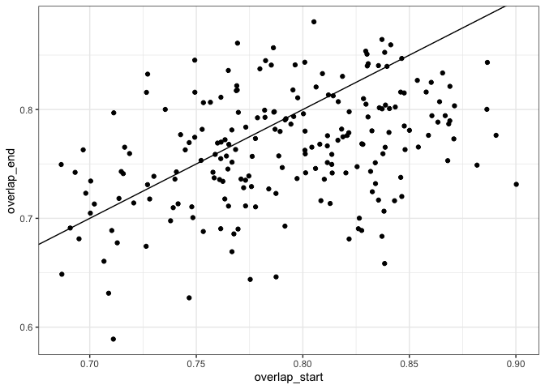
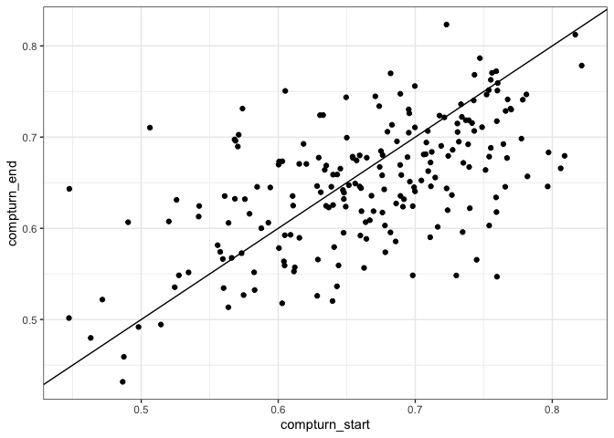
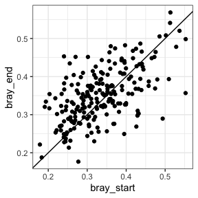
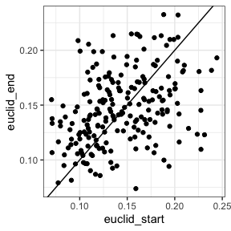
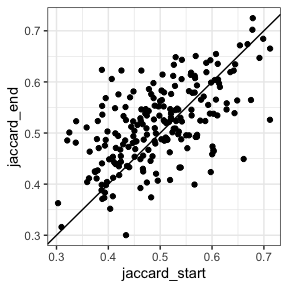
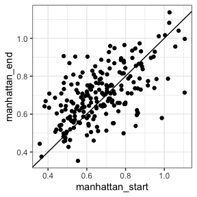
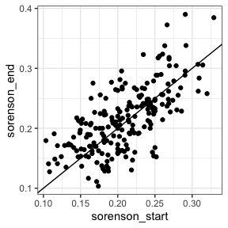
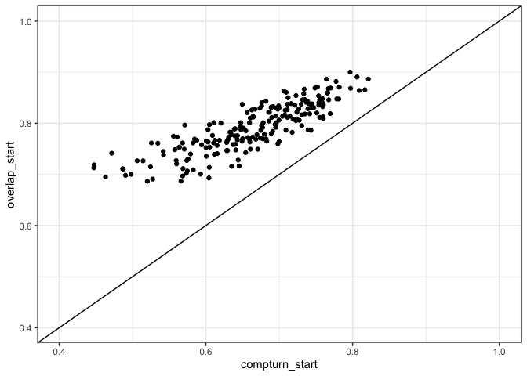
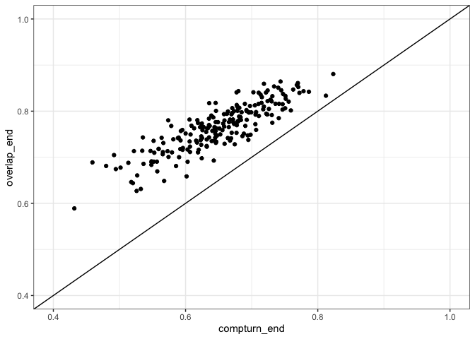
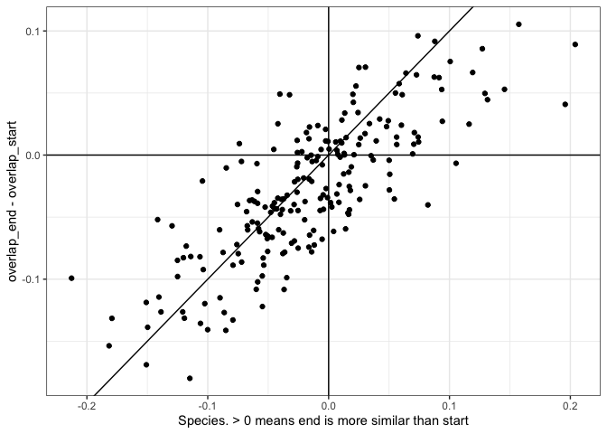

5 sites
================

This is gonna be hacky af, but calculating

  - species overlap
  - ISD overlap
  - **within** each time chunk
  - for all possible pairs

<!-- end list -->

``` r
pull_species_comp <- function(all_spcomp, rt, rg, bcr, chunk) {
  
  return(all_spcomp %>%
           filter(route == rt,
                  region == rg,
                  location.bcr == bcr,
                  timechunk == chunk))
  
}

pull_smooths <- function(all_smooths, rt, rg, bcr, chunk) {
  
  if(chunk == "start") {
    out <- all_smooths %>%
      filter(route == rt,
             region == rg,
             location.bcr == bcr) %>%
      select(route, region, location.bcr, location.statenum, location.routename, mass, start) %>%
      mutate(timechunk = chunk) %>%
      rename(density = start)
  } else {
    out <- all_smooths %>%
      filter(route == rt,
             region == rg,
             location.bcr == bcr) %>%
      select(route, region, location.bcr, location.statenum, location.routename, mass, end) %>%
      mutate(timechunk = chunk) %>%
      rename(density = end)
  }
  
}
compare_species <- function(spcomp1, spcomp2) {
  
  rn <- function(nm) {
    return(paste0(nm, "_2"))
  }
  
  na0 <- function(val) {
    if(is.na(val)) {
      return(0)
    } else {
      return(val)
    }
  }
  
  spcomp2 <- rename_with(spcomp2, rn)
  
  spec1 <- spcomp1 %>%
    select(timechunk, route, region, location.bcr) %>%
    distinct()
  spec2 <- spcomp2 %>%
    select(timechunk_2, route_2, region_2, location.bcr_2) %>%
    distinct()
  
  widecomp <- full_join(spcomp1, spcomp2, by = c("species" = "species_2")) %>%
    group_by_all() %>%
    mutate(relative = na0(relative),
           relative_2 = na0(relative_2)) %>% 
    filter(sum(relative, relative_2) > 0) %>%
    ungroup() 
    
  
  matrixcomp <- matrix(data = c(widecomp$relative, widecomp$relative_2), nrow = 2, byrow = T)
  

  wideturn <- widecomp %>%
    group_by(species) %>%
    mutate(min_relative = min(relative, relative_2)) %>% 
    dplyr::ungroup() %>%
    dplyr::summarize(compturn = sum(min_relative)) %>%
    mutate(euclid = vegan::vegdist(matrixcomp, "euclidean"),
           bray = vegan::vegdist(matrixcomp, "bray"),
           jaccard = vegan::vegdist(matrixcomp, "jaccard"),
           manhattan = vegan::vegdist(matrixcomp, "manhattan"),
           sorenson = vegan::vegdist(matrixcomp, "bray", binary = T)) %>%
    bind_cols(spec1) %>%
    bind_cols(spec2)
  
  return(wideturn)
  
}


compare_smooths <- function(smooth1, smooth2) {
  
  rn <- function(nm) {
    return(paste0(nm, "_2"))
  }
  
  na0 <- function(val) {
    if(is.na(val)) {
      return(0)
    } else {
      return(val)
    }
  }
  
  smooth2 <- rename_with(smooth2, rn)
  
  spec1 <- smooth1 %>%
    select(timechunk, route, region, location.bcr) %>%
    distinct()
  spec2 <- smooth2 %>%
    select(timechunk_2, route_2, region_2, location.bcr_2) %>%
    distinct()
  
  widesmooth <- left_join(smooth1, smooth2, by = c("mass" = "mass_2")) 
  
  wideover <- widesmooth %>%
    group_by(mass) %>%
    mutate(min_density = min(density, density_2)) %>% 
    dplyr::ungroup() %>%
    dplyr::summarize(overlap = sum(min_density))%>%
    bind_cols(spec1) %>%
    bind_cols(spec2)
  
  return(wideover)
  
}


compare_pair <- function(all_spcomp, all_smooths, rt1, rg1, bcr1,chunk1, rt2, rg2, bcr2, chunk2) {
  
  spcomp1 <- pull_species_comp(all_spcomp, rt1, rg1, bcr1, chunk1)
  spcomp2 <- pull_species_comp(all_spcomp, rt2, rg2, bcr2, chunk2)
  
  
  smooth1 <- pull_smooths(all_smooths, rt1, rg1, bcr1, chunk1)
  smooth2 <- pull_smooths(all_smooths, rt2, rg2, bcr2, chunk2)
  
  
  species_comparison <- compare_species(spcomp1, spcomp2)
  isd_comparison <- compare_smooths(smooth1, smooth2)
  
  both_comparisons <- left_join(species_comparison, isd_comparison)
  
  return(both_comparisons)
  
}
```

``` r
# get list of all routes

all_routes <- all_smooths %>% 
  select(route, region, location.bcr)  %>%
  filter(location.bcr == 13) %>%
  distinct() %>%
  mutate(line = row_number()) 

all_pairs <- expand.grid(r1 = 1:nrow(all_routes), r2 = 1:nrow(all_routes), chunk = c("start", "end")) %>%
  as.data.frame() %>%
  filter(r1 != r2) %>%
  group_by_all() %>%
  mutate(smaller = min(r1, r2),
         larger = max(r1, r2)) %>%
  ungroup() %>%
  select(smaller, larger, chunk) %>%
  distinct() %>%
  left_join(all_routes, by = c("smaller" = "line")) %>%
  left_join(all_routes, by = c("larger" = "line"))

all_comparisons <- list() 

for(i in 1:nrow(all_pairs)) {
  specs <- as.list(all_pairs[i, ])
  
  all_comparisons[[i]] <- compare_pair(all_spcomposition, all_smooths, specs$route.x, specs$region.x, specs$location.bcr.x, specs$chunk, specs$route.y, specs$region.y, specs$location.bcr.y, specs$chunk)
  
}

comparisons <- bind_rows(all_comparisons)

write.csv(comparisons, 'comparisons.csv', row.names = F)
```

``` r
comparisons <- read.csv(here::here("reports", 'comparisons.csv'))

paired_comparisons <- comparisons %>%
  tidyr::pivot_wider(id_cols = c(route, region, location.bcr, route_2, region_2, location.bcr_2), names_from = timechunk, values_from = c(compturn, overlap, euclid, bray, jaccard, manhattan, sorenson)) 

ggplot(paired_comparisons, aes(overlap_start, overlap_end)) + 
  geom_point() +
  geom_abline(slope = 1, intercept = 0)
```

<!-- -->

So I’m not actually seeing a signal of declining beta diversity over
this timespan for this bcr.

Beta diversity obtained as the pairwise overlap in species composition
among all possible pairs of routes in the region (relative abundance
sp1r1 - sp1r2).

If routes were becoming more similar in species composition over time,
we would expect these pairwise overlap values to be **larger** in the
later time period - instead they are pretty much a cloud around the 1:1
line:

``` r
ggplot(paired_comparisons, aes(compturn_start, compturn_end)) + 
  geom_point() +
  geom_abline(slope = 1, intercept = 0)
```

<!-- -->

Is this….

  - spatial scale? mb similarity is increasing **between** regions/at a
    contintental scale, but not **within** region
  - the metric? most **beta diversity** metrics aren’t quite this,
    they’re more focused on presence/absence and turnover.

More betadiv metrics:

``` r
ggplot(paired_comparisons, aes(bray_start, bray_end)) + 
  geom_point() +
  geom_abline(slope = 1, intercept = 0)
```

<!-- -->

``` r
ggplot(paired_comparisons, aes(euclid_start, euclid_end)) + 
  geom_point() +
  geom_abline(slope = 1, intercept = 0)
```

<!-- -->

``` r
ggplot(paired_comparisons, aes(jaccard_start, jaccard_end)) + 
  geom_point() +
  geom_abline(slope = 1, intercept = 0)
```

<!-- -->

``` r
ggplot(paired_comparisons, aes(manhattan_start, manhattan_end)) + 
  geom_point() +
  geom_abline(slope = 1, intercept = 0)
```

<!-- -->

``` r
ggplot(paired_comparisons, aes(sorenson_start, sorenson_end)) + 
  geom_point() +
  geom_abline(slope = 1, intercept = 0)
```

<!-- -->

Comparing species to size change

``` r
onetoone <- geom_abline(slope = 1, intercept = 0)

ggplot(paired_comparisons, aes(compturn_start, overlap_start)) + geom_point() + onetoone + xlim(.4, 1) + ylim(.4, 1)
```

<!-- -->

``` r
ggplot(paired_comparisons, aes(compturn_end, overlap_end)) + geom_point() + onetoone + xlim(.4, 1) + ylim(.4, 1)
```

<!-- -->

``` r
ggplot(paired_comparisons, aes(compturn_end - compturn_start, overlap_end - overlap_start)) + geom_point() + onetoone + xlab("Species. > 0 means end is more similar than start") + geom_hline(yintercept = 0) + geom_vline(xintercept = 0)
```

<!-- -->
