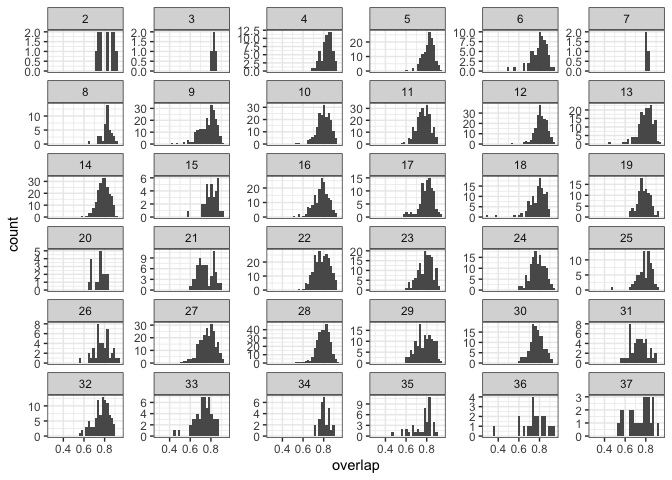

5 sites
================

  - [Overlaps](#overlaps)
  - [Smooths](#smooths)

## Overlaps

``` r
ggplot(all_overlaps, aes(overlap)) + geom_histogram(bins = 100) 
```

<!-- -->

``` r
ggplot(all_overlaps, aes(overlap)) + geom_histogram() + facet_wrap(vars(location.bcr), scales = "free_y")
```

    ## `stat_bin()` using `bins = 30`. Pick better value with `binwidth`.

<!-- -->

``` r
ggplot(all_overlaps, aes(as.factor(location.bcr), overlap)) + geom_boxplot() + geom_jitter(alpha = .1, size = .5, height = 0)
```

<!-- -->

``` r
all_overlaps %>%
  summarize(mean_overlap = mean(overlap),
            sd_overlap = sd(overlap))
```

    ##   mean_overlap sd_overlap
    ## 1    0.7838851 0.07344344

``` r
all_overlaps %>%
  group_by(location.bcr) %>%
  summarize(mean_overlap = mean(overlap),
            sd_overlap = sd(overlap))
```

    ## # A tibble: 36 x 3
    ##    location.bcr mean_overlap sd_overlap
    ##           <int>        <dbl>      <dbl>
    ##  1            2        0.817     0.0713
    ##  2            3        0.828     0.0131
    ##  3            4        0.830     0.0511
    ##  4            5        0.816     0.0551
    ##  5            6        0.796     0.0791
    ##  6            7        0.809     0.0123
    ##  7            8        0.822     0.0505
    ##  8            9        0.771     0.0823
    ##  9           10        0.800     0.0642
    ## 10           11        0.767     0.0658
    ## # … with 26 more rows

Overlap is in general very high, and I don’t see this varying in a
really pronounced way across BCRs. For comparison, the overlap between
Portal 1980-85 and 2010-2014 is .51 (calculated hackily just now so
possibly slightly wrong, but ballpark)

That is, like 80% of the ISD is remaining the same across the start and
end of the TS.

## Smooths

``` r
smooth_summary <- all_smooths %>% 
  group_by(mass) %>%
  mutate(overall_mean = mean(density_diff)) %>%
  ungroup() %>%
  group_by(location.bcr, mass) %>%
  mutate(bcr_mean = mean(density_diff)) %>%
  ungroup() %>%
  group_by(location.bcr) %>%
  mutate(nroutes = length(unique(route))) %>%
  ungroup()

rg14 <- filter(smooth_summary, location.bcr == 14)

ggplot(rg14, aes(mass, density_diff, group = location.routename, color = density_diff > 0)) + geom_col(position = "stack") + geom_line(aes(mass, bcr_mean * length(unique(rg14$`location.routename`))), color = "black")+ geom_line(aes(mass, overall_mean * length(unique(rg14$`location.routename`))), color = "black", linetype= 3)
```

    ## Warning: Use of `rg14$location.routename` is discouraged. Use
    ## `location.routename` instead.
    
    ## Warning: Use of `rg14$location.routename` is discouraged. Use
    ## `location.routename` instead.

<!-- -->

``` r
bcrs <- unique(smooth_summary$location.bcr)

ggplot(filter(smooth_summary, location.bcr %in% sample(bcrs, size = 4)), aes(mass, density_diff, group = location.routename, color = density_diff >0)) + geom_col(position = "stack") + geom_line(aes(y = bcr_mean * nroutes), color = "black") + theme(legend.position = "none") + scale_color_viridis_d(option = "turbo", begin = .1, end = .9, direction = -1) + facet_wrap(vars(location.bcr), scales = "free_y")
```

<!-- -->
