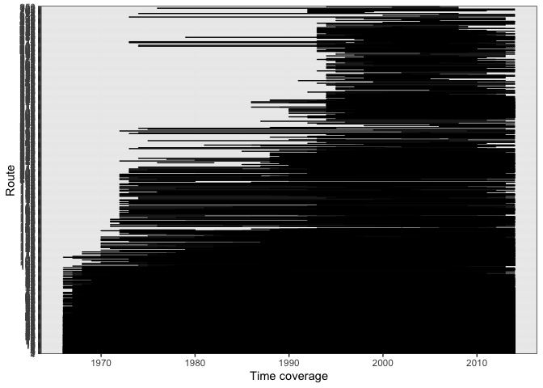

5 sites
================

  - [Time periods](#time-periods)
  - [Overlaps](#overlaps)
  - [State variables](#state-variables)

## Time periods

``` r
route_years <- select(all_overlaps, route, region, location.bcr, location.routename, startyears, endyears) %>%
  distinct() %>%
  mutate(start = as.integer(substr(startyears, 0, 4)),
         end = as.integer(substr(endyears, 0, 4)))


ggplot(route_years, aes(x = start, y = as.factor(route))) + 
  geom_errorbar(aes(xmin = start, xmax = end)) + xlab("Time coverage") + ylab("Route")
```

<!-- -->

Note that 2, 5, and 16 are weirdos in that they start and end quite
early and are shorter than the others.

## Overlaps

``` r
all_overlaps <- left_join(all_overlaps, all_composition)
```

    ## Joining, by = c("route", "region", "location.bcr", "sim_seed")

``` r
ggplot(filter(all_overlaps, !is.na(sim_seed)), aes(overlap)) + geom_histogram() + facet_wrap(vars(route), scales = "free_y", ncol = 3) + geom_histogram(data = filter(all_overlaps, is.na(sim_seed)), fill = "orange") + geom_histogram(data = filter(all_overlaps, is.na(sim_seed)), aes(x = composition_overlap), fill = "green")
```

    ## `stat_bin()` using `bins = 30`. Pick better value with `binwidth`.

    ## `stat_bin()` using `bins = 30`. Pick better value with `binwidth`.
    ## `stat_bin()` using `bins = 30`. Pick better value with `binwidth`.

<!-- --> So…
given some amount of *species* turnover, there’s going to be some
constraint on how much the ISD can change. The ISD can’t change a lot
more than the species composition, but it can change a lot less.

If it changes a lot less, that could be because similarly sized species
are replacing each other.

There is however an additional constraint on how *little* it can change
given some amount of species turnover. Depending on the starting state
of the ISD and the species pool.

## State variables

``` r
all_sv_wide <- all_svs %>%
  select(timechunk, energy, biomass, abundance,route, region, sim_seed) %>%
  tidyr::pivot_wider(id_cols = c("route", "region", "sim_seed"), names_from = timechunk, values_from = c("energy", "biomass", "abundance"))

all_sv_change <- all_sv_wide %>%
  mutate(energy_lr = log(energy_end / energy_start),
         biomass_lr = log(biomass_end / biomass_start),
         abundance_lr = log(abundance_end/ abundance_start))

ggplot(filter(all_sv_change, is.na(sim_seed)), aes(energy_lr)) + 
  geom_histogram() +
  ggtitle("Real energy change (log ratio")
```

    ## `stat_bin()` using `bins = 30`. Pick better value with `binwidth`.

<!-- -->

``` r
ggplot(filter(all_sv_change, is.na(sim_seed)), aes((abundance_lr))) + 
  geom_histogram() +
  ggtitle("Real abundance change (log ratio")
```

    ## `stat_bin()` using `bins = 30`. Pick better value with `binwidth`.

<!-- -->

``` r
ggplot(filter(all_sv_change, is.na(sim_seed)), aes(biomass_lr)) + 
  geom_histogram() +
  ggtitle("Real biomass change (log ratio")
```

    ## `stat_bin()` using `bins = 30`. Pick better value with `binwidth`.

<!-- -->

``` r
ggplot(all_sv_change, aes(abs(energy_lr), fill = is.na(sim_seed))) +
  geom_histogram() +
  facet_wrap(vars(route), scales= 'free')
```

    ## `stat_bin()` using `bins = 30`. Pick better value with `binwidth`.

<!-- -->

``` r
only_real_change <- filter(all_sv_change, is.na(sim_seed))

ggplot(only_real_change, aes(abundance_lr, energy_lr)) + geom_point() + geom_abline(slope = 1, intercept= 0) #+ geom_point(data = filter(sv_change, is.na(sim_seed)), aes(abundance_change, energy_change), color = "pink")
```

<!-- -->

``` r
only_real_smooths <- filter(all_smooths, is.na(sim_seed))


ggplot(only_real_smooths, aes(mass, start, group= route)) + geom_line()
```

<!-- -->

<!-- ```{r} -->

<!-- start_overlaps <- list() -->

<!-- pairs <- expand.grid(a = unique(only_real_smooths$route), b = unique(only_real_smooths$route)) %>% -->

<!--   group_by_all() %>% -->

<!--   mutate(one = min(a, b), -->

<!--          two = max(a, b)) %>% -->

<!--   ungroup() %>% -->

<!--   filter(one != two) %>% -->

<!--   select(one, two) %>% -->

<!--   distinct() -->

<!-- for(i in 1:nrow(pairs)) { -->

<!--   comparison <- filter(only_real_smooths, route %in% pairs[i,]) %>% -->

<!--     select(route, mass, start, end) %>% -->

<!--     group_by_all() %>% -->

<!--     mutate(route = ifelse(route == pairs[i, 1], "one", "two")) %>% -->

<!--     ungroup() %>% -->

<!--     tidyr::pivot_wider(id_cols = mass, names_from = route, values_from = c("start", "end")) %>% -->

<!--     group_by_all() %>% -->

<!--     mutate(startmin = min(start_one, start_two), -->

<!--            endmin = min(end_one, end_two)) %>% -->

<!--     ungroup() -->

<!--   start_overlaps[[i]] <- data.frame( -->

<!--     one = pairs[i,1], -->

<!--     two = pairs[i, 2], -->

<!--     start_overlap = sum(comparison$startmin), -->

<!--     end_overlap = sum(comparison$endmin) -->

<!--   ) -->

<!-- } -->

<!-- ``` -->

<!-- ```{r} -->

<!-- simultaneous_overlaps <- bind_rows(start_overlaps) -->

<!-- ggplot(simultaneous_overlaps, aes(start_overlap)) + geom_histogram() -->

<!-- ggplot(simultaneous_overlaps, aes(end_overlap)) + geom_histogram() -->

<!-- ``` -->

``` r
only_real_smooths <- only_real_smooths %>%
  group_by(mass) %>%
  mutate(mean_diff = mean(end - start)) %>%
  ungroup()

ggplot(only_real_smooths, aes(mass, end - start, group = route)) + geom_segment(aes(x = mass, y = 0, xend = mass, yend = end - start), alpha = .1) + xlim(1, 8) + geom_line(aes(mass, mean_diff), color = "green")
```

    ## Warning: Removed 4896 rows containing missing values (geom_segment).

    ## Warning: Removed 4896 row(s) containing missing values (geom_path).

<!-- -->
