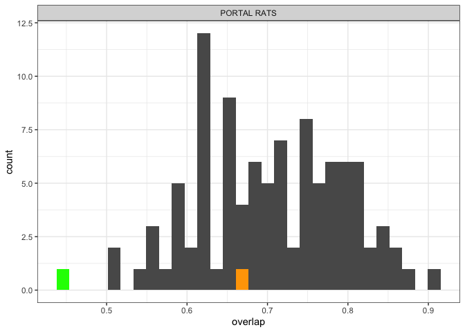
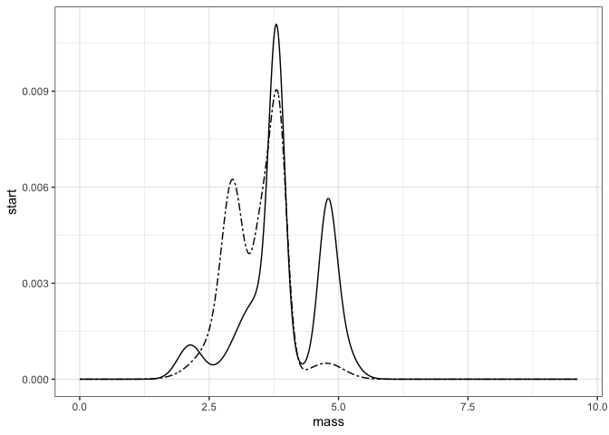
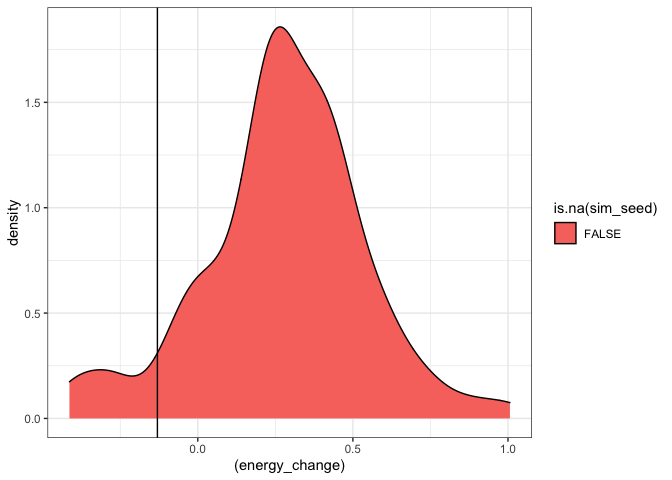
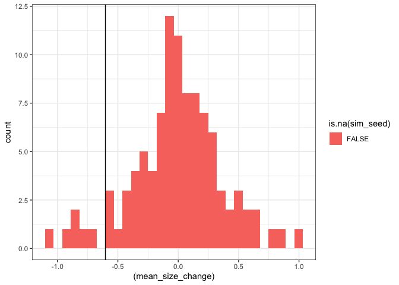

5 sites
================

``` r
all_overlaps <- left_join(all_overlaps, all_composition)
```

    ## Joining, by = c("route", "region", "sim_seed")

``` r
ggplot(filter(all_overlaps, !is.na(sim_seed)), aes(overlap)) + 
  geom_histogram() +
  facet_wrap(vars(location.routename)) +
  geom_histogram(data = filter(all_overlaps, is.na(sim_seed)), fill = "orange") +
  geom_histogram(data = filter(all_overlaps, is.na(sim_seed)), aes(x = composition_overlap), fill = "green")
```

    ## `stat_bin()` using `bins = 30`. Pick better value with `binwidth`.

    ## `stat_bin()` using `bins = 30`. Pick better value with `binwidth`.
    ## `stat_bin()` using `bins = 30`. Pick better value with `binwidth`.

<!-- -->

So I suspect overlap is maybe not the most sensitive metric for catching
either sizestructured replacement or nonrandom size shifts?

I.e. the absence of a signal does not mean it didn’t happen.

Or, both types of dynamic can be happening within a single size
spectrum. In this case,

``` r
real <- all_smooths %>%
  filter(is.na(sim_seed))

ggplot(real, aes(mass, start)) + geom_line() + geom_line(aes(mass, end), linetype = 6)
```

<!-- -->

``` r
sv_change <- all_svs %>%
  select(timechunk, mean_energy, energy, mean_biomass, abundance, sim_seed) %>%
  tidyr::pivot_wider(id_cols = sim_seed, names_from = timechunk, values_from= c("energy", "mean_biomass", "abundance")) %>%
  mutate(energy_change = (log(energy_end / energy_start)),
         mean_size_change = (log(mean_biomass_end / mean_biomass_start)),
         abundance_change = (log(abundance_end / abundance_start)))


ggplot(sv_change, aes((energy_change), fill = is.na(sim_seed))) + geom_density(data = filter(sv_change, !is.na(sim_seed))) + geom_vline(xintercept = (filter(sv_change, is.na(sim_seed))$energy_change[1]))
```

<!-- -->

``` r
ggplot(sv_change, aes((mean_size_change), fill = is.na(sim_seed))) + geom_histogram(data = filter(sv_change, !is.na(sim_seed))) + geom_vline(xintercept = (filter(sv_change, is.na(sim_seed))$mean_size_change[1]))
```

    ## `stat_bin()` using `bins = 30`. Pick better value with `binwidth`.

<!-- -->

It just looks like a lot of this is not extraordinary given the species
pool.
