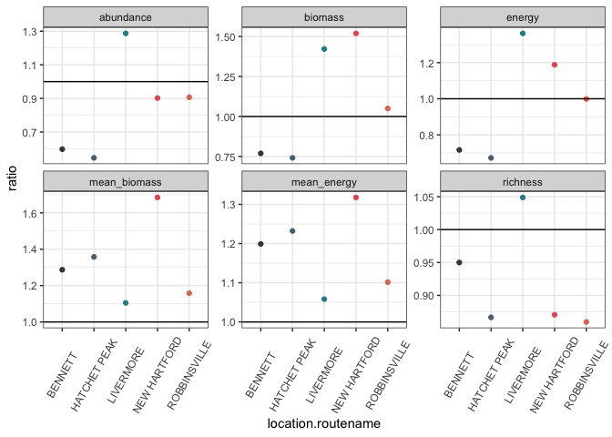
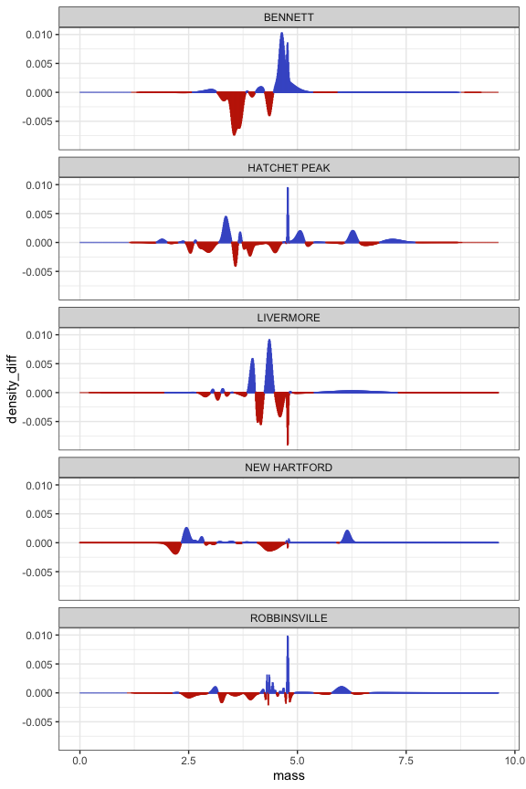

5 sites
================

``` r
all_overlaps <- left_join(all_overlaps, all_composition)
```

    ## Joining, by = c("route", "region", "location.bcr", "sim_seed")

``` r
ggplot(filter(all_overlaps, !is.na(sim_seed)), aes(overlap)) + 
  geom_histogram() +
  facet_wrap(vars(location.routename)) +
  geom_histogram(data = filter(all_overlaps, is.na(sim_seed)), fill = "orange") +
  geom_histogram(data = filter(all_overlaps, is.na(sim_seed)), aes(x = composition_overlap), fill = "green")
```

    ## `stat_bin()` using `bins = 30`. Pick better value with `binwidth`.

    ## `stat_bin()` using `bins = 30`. Pick better value with `binwidth`.
    ## `stat_bin()` using `bins = 30`. Pick better value with `binwidth`.

<!-- -->

So a few things here.

1.  Observed overlap (orange smidges) isn’t generally extraordinary
    compared to the overlap you get by reassigning species randomly
    (i.e. without respect to body size).
2.  For 3 of these, observed ISD is pretty much on the nose of the
    overlap in species composition (green smidges). Only for New
    Hartford and Livermore is there appreciably higher overlap in the
    ISD than in species composition (indicating any degree of
    like-for-like substitutions).
3.  My intuition gets creeped out when the overlap in the ISD is *less*
    than the overlap in species composition. I *think* this can occur
    because the ISD involves intraspecific variation in size, so the ISD
    can change a little - even if the species composition stays 100% the
    same - because of size sampling.

<!-- end list -->

``` r
h_smooths <- filter(all_smooths, region == 18)


ggplot(filter(h_smooths, is.na(sim_seed)), aes(mass, start)) + 
  geom_line() +
  geom_line(aes(y = end), linetype = 2)
```

<!-- -->

``` r
ggplot(filter(h_smooths, sim_seed == (16065368)), aes(mass, start)) + 
  geom_line() +
  geom_line(aes(y = end), linetype = 2)
```

<!-- -->
