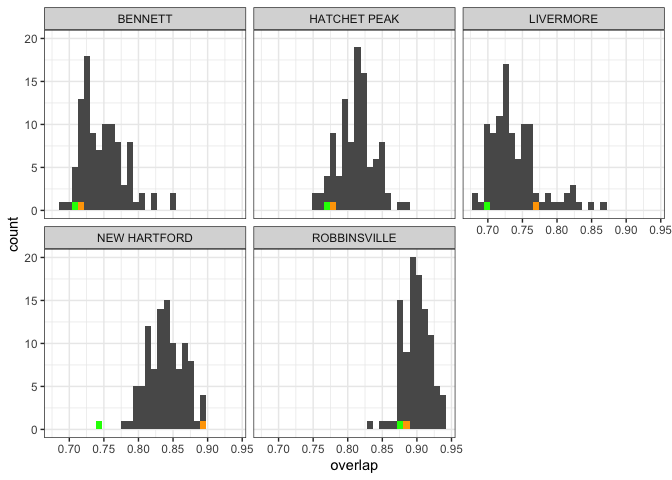
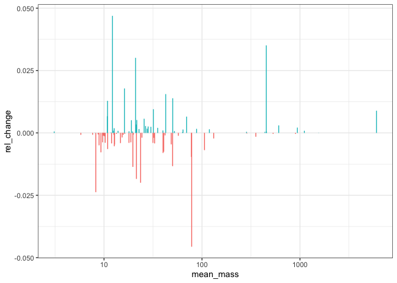

5 sites
================

## State variables

``` r
sv_change <- all_svs %>%
  select(-years) %>%
  tidyr::pivot_longer(-c("route", "region", "timechunk"), names_to = "variable", values_to = "value") %>%
  tidyr::pivot_wider(id_cols = c("route", "region", "variable"), names_from = timechunk, values_from = value) %>%
  mutate(difference = end - start,
         ratio = end / start,
         rtrg = paste0(route, "_", region)) 

ggplot(sv_change, aes(rtrg, ratio, color = rtrg)) + geom_point() + facet_wrap(vars(variable), scales = "free_y") + geom_hline(yintercept = 1)
```

<!-- --> \#\#
Smooths

``` r
ggplot(all_smooths, aes(mass, start, color = location.routename)) + geom_line() + geom_line(aes(y = end), linetype = 2) + facet_wrap(vars(location.routename), scales = "free_y", ncol = 1) + theme(legend.position = "none")
```

<!-- -->

``` r
ggplot(all_smooths, aes(mass, density_diff, color = density_diff > 0)) + geom_col() +  facet_wrap(vars(location.routename), scales = "free_y", ncol = 1) + theme(legend.position = "none")
```

<!-- -->

``` r
h <- filter(all_smooths, route == 102) %>%
  group_by(mass) %>%
  mutate(mindensity = min(start, end)) %>%
  ungroup()

ggplot(h, aes(mass, mindensity)) + geom_line() + geom_line(aes(y = density_diff), color= "green")
```

<!-- -->
