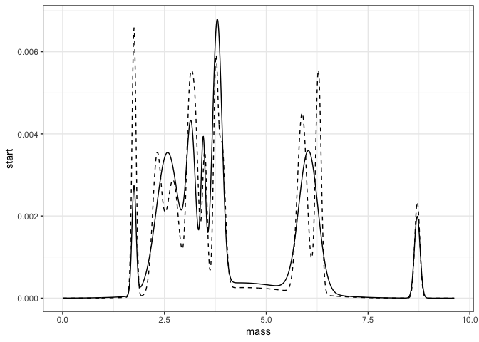

5 sites
================

  - [State variables](#state-variables)
  - [Smooths](#smooths)
      - [Aggregated smooths](#aggregated-smooths)
  - [Overlap](#overlap)

## State variables

``` r
all_svs <- all_svs %>%
  left_join(select(all_overlaps, route, region, location.routename))
```

    ## Joining, by = c("route", "region")

``` r
sv_change <- all_svs %>%
  select(-years) %>%
  tidyr::pivot_longer(-c("route", "region", "timechunk", "location.routename"), names_to = "variable", values_to = "value") %>%
  tidyr::pivot_wider(id_cols = c("route", "region", "location.routename", "variable"), names_from = timechunk, values_from = value) %>%
  mutate(difference = end - start,
         ratio = end / start,
         rtrg = paste0(route, "_", region))  

ggplot(sv_change, aes(location.routename, ratio, color = location.routename)) + geom_point() + facet_wrap(vars(variable), scales = "free_y") + geom_hline(yintercept = 1) + scale_color_ghibli_d("PonyoMedium") + theme(legend.position = "none") + theme(axis.text.x = element_text(angle = 60, vjust = .5))
```

<!-- -->

``` r
ggplot(sv_change, aes(location.routename, start, color = location.routename)) + geom_point() + facet_wrap(vars(variable), scales = "free_y") + geom_hline(yintercept = 1) + scale_color_ghibli_d("PonyoMedium") + theme(legend.position = "none") + geom_point(aes(y = end)) + theme(axis.text.x = element_text(angle = 60, vjust = .5))
```

<!-- -->

## Smooths

``` r
ggplot(all_smooths, aes(mass, start, color = location.routename)) + geom_line() + geom_line(aes(y = end), linetype = 2) + facet_wrap(vars(location.routename), scales = "free_y", ncol = 1) + theme(legend.position = "none") + scale_color_ghibli_d("PonyoMedium")
```

<!-- -->

``` r
ggplot(all_smooths, aes(mass, density_diff, color = density_diff > 0)) + geom_col() +  facet_wrap(vars(location.routename),  ncol = 1) + theme(legend.position = "none") + scale_color_viridis_d(option = "turbo", begin = .1, end = .9, direction = -1)
```

<!-- -->

``` r
h <- filter(all_smooths, route == 102) %>%
  group_by(mass) %>%
  mutate(mindensity = min(start, end)) %>%
  ungroup()
```

### Aggregated smooths

Wants some kind of null model.

``` r
all_smooths_summary <- all_smooths %>%
  group_by(mass) %>%
  summarize(mean_difference = mean(density_diff),
            ups = sum(density_diff[ which(density_diff > 0)]),
            downs = sum(density_diff[which(density_diff < 0)])) %>%
  ungroup()  %>%
  mutate(net = ups + downs)

ggplot(all_smooths, aes(mass, density_diff, group = location.routename)) + geom_line(alpha = .2) + geom_line(data = all_smooths_summary, aes(mass, mean_difference), inherit.aes =F)
```

<!-- -->

``` r
ggplot(all_smooths_summary, aes(mass, ups / 5)) + geom_col(color = "green") + geom_col(aes(mass, downs/5), color = "blue") + geom_line(aes(mass, net / 5)) 
```

<!-- -->

``` r
sum(abs(all_smooths_summary$mean_difference)) / 2
```

    ## [1] 0.1003287

``` r
all_smooths %>%
  group_by(location.routename) %>%
  summarize(change = sum(abs(density_diff)) / 2)
```

    ## # A tibble: 5 x 2
    ##   location.routename change
    ##   <chr>               <dbl>
    ## 1 BENNETT             0.281
    ## 2 HATCHET PEAK        0.223
    ## 3 LIVERMORE           0.231
    ## 4 NEW HARTFORD        0.111
    ## 5 ROBBINSVILLE        0.112

## Overlap

``` r
ggplot(all_overlaps, aes(location.routename, overlap, color = location.routename)) + geom_point()  + theme(legend.position = "none") + scale_color_ghibli_d("PonyoMedium")
```

<!-- -->
