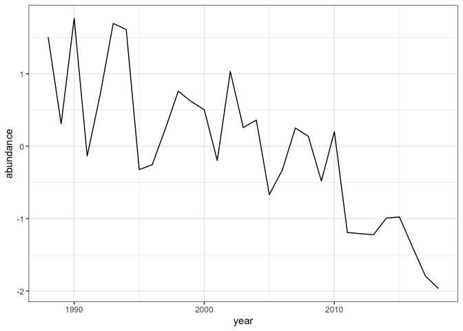
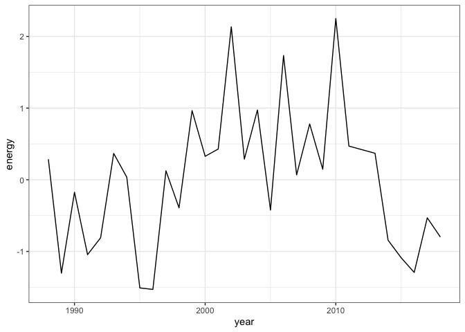
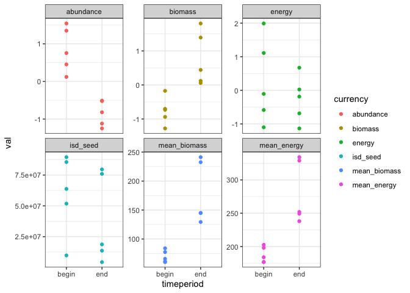
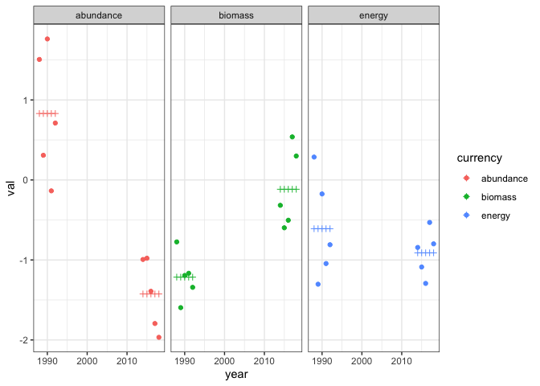
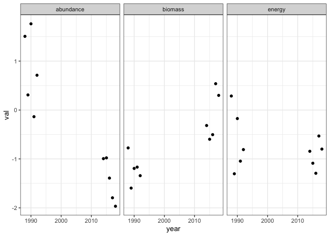
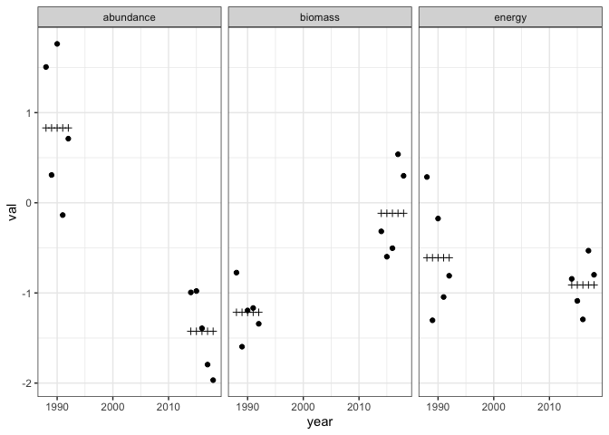

Currency x time interactions
================
Renata Diaz
2021-09-06

I **think** this may be a more valid way to get at the thing that bugs
me.

So we are basically asking if the slope of energy change is
proportionate to abundance, if the different currencies matter or not.

I’ve been trying to get at this via a roundabout way of individual lms
on the different currencies.

I think a more succinct and probably correct - given the way I interpret
this stuff - way is to fit a lm() (or whatever, glm, nlme) of the
structure `abundance ~ timeperiod * currency`. This asks whether:

  - abundance is different in different time periods
  - the currencies have different intercepts
  - and if the currencies differ in how different they are across
    different time periods.

The currencies are on vastly different scales, right; abundance is going
to be in the hundreds while energy is in the hundreds of thousands. I
tried it using them notscaled and it didn’t work at all; any trend in
abundance (or absence) would be swamped by the variable on the larger
scale.

So here I am rescaling the variables and then putting them all in a lm
of the above form, and then looking at the different trends for each
currency and whether the currencies get different slopes.

I **believe** this gets at “decoupling” more succinctly than a million
lms and then histograms.

And then in aggregate, looking at:

  - how often biomass\!=abundance, how often energy \!= abundance
  - what’s going on with the isd in these scenarios

<!-- end list -->

``` r
weird <- filter(all_results, abs(1 - fitted_ratio_caps_energy) < .1, abs(1 - fitted_ratio_caps_abundance) > .3)

## Set up the cache and config
db <- DBI::dbConnect(RSQLite::SQLite(), here::here("drake-cache-actual.sqlite"))
cache <- storr::storr_dbi("datatable", "keystable", db)
cache$del(key = "lock", namespace = "session")

loadd(bbs_rtrg_153_14, cache = cache)

gh <- bbs_rtrg_153_14

library(BBSsize)

gh_isd <- simulate_isd_ts(gh)
```

    ## Joining, by = "id"
    ## Joining, by = "id"
    ## Joining, by = "id"
    ## Joining, by = "id"
    ## Joining, by = "id"
    ## Joining, by = "id"
    ## Joining, by = "id"
    ## Joining, by = "id"
    ## Joining, by = "id"
    ## Joining, by = "id"
    ## Joining, by = "id"
    ## Joining, by = "id"
    ## Joining, by = "id"
    ## Joining, by = "id"
    ## Joining, by = "id"
    ## Joining, by = "id"
    ## Joining, by = "id"
    ## Joining, by = "id"
    ## Joining, by = "id"
    ## Joining, by = "id"
    ## Joining, by = "id"
    ## Joining, by = "id"
    ## Joining, by = "id"
    ## Joining, by = "id"
    ## Joining, by = "id"
    ## Joining, by = "id"
    ## Joining, by = "id"
    ## Joining, by = "id"
    ## Joining, by = "id"
    ## Joining, by = "id"
    ## Joining, by = "id"
    ## Joining, by = "id"
    ## Joining, by = "id"
    ## Joining, by = "id"
    ## Joining, by = "id"
    ## Joining, by = "id"
    ## Joining, by = "id"
    ## Joining, by = "id"
    ## Joining, by = "id"
    ## Joining, by = "id"
    ## Joining, by = "id"
    ## Joining, by = "id"
    ## Joining, by = "id"
    ## Joining, by = "id"
    ## Joining, by = "id"

``` r
library(rwar)

gh_sv <- get_annual_svs(gh_isd$isd) %>%
  filter(year %in% c(1988:2018))  %>%
  mutate(energy = scale((energy)),
        abundance = scale((abundance)),
        biomass = scale(biomass))

ggplot(gh_sv, aes(year, abundance)) + geom_line() 
```

<!-- -->

``` r
ggplot(gh_sv, aes(year, energy)) + geom_line() 
```

<!-- -->

``` r
gh_caps <- pull_caps(gh_sv, c(1988:1992), c(2014:2018))

gh_caps_long <- gh_caps %>%
  tidyr::pivot_longer(c(-year, -timeperiod), names_to = "currency", values_to = "val")

gh_caps_forlm <- gh_caps_long %>%
  filter(currency %in% c("energy", "abundance", "biomass"))

ggplot(gh_caps_long, aes(timeperiod, val, color = currency)) + geom_point()+ facet_wrap(vars(currency), scales = "free_y")
```

<!-- -->

``` r
gh_lm <- lm(val ~ timeperiod * currency, data = gh_caps_forlm)

summary(gh_lm)
```

    ## 
    ## Call:
    ## lm(formula = val ~ timeperiod * currency, data = gh_caps_forlm)
    ## 
    ## Residuals:
    ##      Min       1Q   Median       3Q      Max 
    ## -0.96675 -0.38207 -0.04925  0.42716  0.93222 
    ## 
    ## Coefficients:
    ##                               Estimate Std. Error t value Pr(>|t|)    
    ## (Intercept)                     0.8306     0.2378   3.492 0.001877 ** 
    ## timeperiodend                  -2.2557     0.3363  -6.707 6.15e-07 ***
    ## currencybiomass                -2.0454     0.3363  -6.082 2.79e-06 ***
    ## currencyenergy                 -1.4398     0.3363  -4.281 0.000258 ***
    ## timeperiodend:currencybiomass   3.3543     0.4756   7.052 2.73e-07 ***
    ## timeperiodend:currencyenergy    1.9540     0.4756   4.108 0.000401 ***
    ## ---
    ## Signif. codes:  0 '***' 0.001 '**' 0.01 '*' 0.05 '.' 0.1 ' ' 1
    ## 
    ## Residual standard error: 0.5318 on 24 degrees of freedom
    ## Multiple R-squared:  0.7166, Adjusted R-squared:  0.6576 
    ## F-statistic: 12.14 on 5 and 24 DF,  p-value: 6.176e-06

``` r
gh_lm_fit <- gh_caps_forlm %>%
  mutate(lm_fit = gh_lm$fitted.values)

ggplot(gh_lm_fit, aes(year, val, color = currency)) + geom_point() + geom_point(aes(y = lm_fit), shape = 3) + facet_wrap(vars(currency))
```

<!-- -->

At least for caps, `nlme::gls` gives identical results to the lm, even
with `corCAR1(form = ~ year | currency)`.

``` r
library(nlme)
```

    ## 
    ## Attaching package: 'nlme'

    ## The following object is masked from 'package:dplyr':
    ## 
    ##     collapse

``` r
ggplot(gh_caps_forlm, aes(year, val)) + geom_point() + facet_wrap(vars(currency))
```

<!-- -->

``` r
gh_gls <- gls(val ~ timeperiod*currency,  correlation = corCAR1(form = ~ year | currency), data = gh_caps_forlm)

summary(gh_gls)
```

    ## Generalized least squares fit by REML
    ##   Model: val ~ timeperiod * currency 
    ##   Data: gh_caps_forlm 
    ##        AIC    BIC    logLik
    ##   63.45157 72.876 -23.72578
    ## 
    ## Correlation Structure: Continuous AR(1)
    ##  Formula: ~year | currency 
    ##  Parameter estimate(s):
    ##          Phi 
    ## 7.642784e-10 
    ## 
    ## Coefficients:
    ##                                   Value Std.Error   t-value p-value
    ## (Intercept)                    0.830557 0.2378148  3.492453  0.0019
    ## timeperiodend                 -2.255740 0.3363210 -6.707103  0.0000
    ## currencybiomass               -2.045355 0.3363210 -6.081557  0.0000
    ## currencyenergy                -1.439824 0.3363210 -4.281099  0.0003
    ## timeperiodend:currencybiomass  3.354309 0.4756297  7.052354  0.0000
    ## timeperiodend:currencyenergy   1.953994 0.4756297  4.108225  0.0004
    ## 
    ##  Correlation: 
    ##                               (Intr) tmprdn crrncyb crrncyn tmprdnd:crrncyb
    ## timeperiodend                 -0.707                                       
    ## currencybiomass               -0.707  0.500                                
    ## currencyenergy                -0.707  0.500  0.500                         
    ## timeperiodend:currencybiomass  0.500 -0.707 -0.707  -0.354                 
    ## timeperiodend:currencyenergy   0.500 -0.707 -0.354  -0.707   0.500         
    ## 
    ## Standardized residuals:
    ##         Min          Q1         Med          Q3         Max 
    ## -1.81797624 -0.71848537 -0.09262208  0.80328151  1.75304852 
    ## 
    ## Residual standard error: 0.5317702 
    ## Degrees of freedom: 30 total; 24 residual

``` r
library(emmeans)

gh_emmeans <- emmeans(gh_gls, specs = ~ timeperiod * currency)

gh_emmeans
```

    ##  timeperiod currency  emmean    SE df lower.CL upper.CL
    ##  begin      abundance  0.831 0.238 24    0.340    1.321
    ##  end        abundance -1.425 0.238 24   -1.916   -0.934
    ##  begin      biomass   -1.215 0.238 24   -1.706   -0.724
    ##  end        biomass   -0.116 0.238 24   -0.607    0.375
    ##  begin      energy    -0.609 0.238 24   -1.100   -0.118
    ##  end        energy    -0.911 0.238 24   -1.402   -0.420
    ## 
    ## Degrees-of-freedom method: satterthwaite 
    ## Confidence level used: 0.95

``` r
gls_fitted <- gh_caps_forlm %>%
  mutate(fitted = gh_gls$fitted)

ggplot(gls_fitted, aes(year, val)) + geom_point() + geom_point(aes(y = fitted), shape = 3) + facet_wrap(vars(currency))
```

<!-- -->

So not going further down the nlme cul-de-sac at the moment.

``` r
gh_lm
```

    ## 
    ## Call:
    ## lm(formula = val ~ timeperiod * currency, data = gh_caps_forlm)
    ## 
    ## Coefficients:
    ##                   (Intercept)                  timeperiodend  
    ##                        0.8306                        -2.2557  
    ##               currencybiomass                 currencyenergy  
    ##                       -2.0454                        -1.4398  
    ## timeperiodend:currencybiomass   timeperiodend:currencyenergy  
    ##                        3.3543                         1.9540

``` r
gh_lm_results <- summary(gh_lm)

pf(5.200219, 5, 24, lower.tail = F)
```

    ## [1] 0.002257269

``` r
gh_lm_ps <- gh_lm_results$coefficients


gh_p <- pf(gh_lm_results$fstatistic[1], gh_lm_results$fstatistic[2], gh_lm_results$fstatistic[3], lower.tail = F)
gh_lm_results_wide <- gh_lm_ps %>%
  as.data.frame() %>%
  mutate(coef_name = row.names(.)) %>%
  tidyr::pivot_wider(names_from = coef_name, values_from = c("Estimate", "Std. Error", "t value", "Pr(>|t|)")) %>%
  mutate(overall_p = gh_p,
         overall_r2 = gh_lm_results$r.squared)
```
