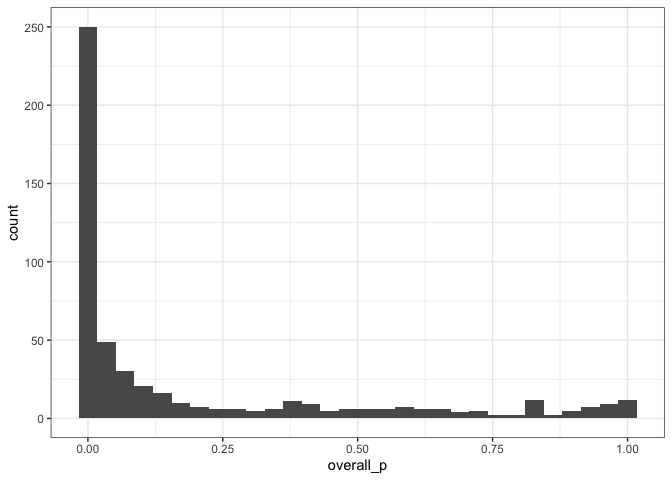
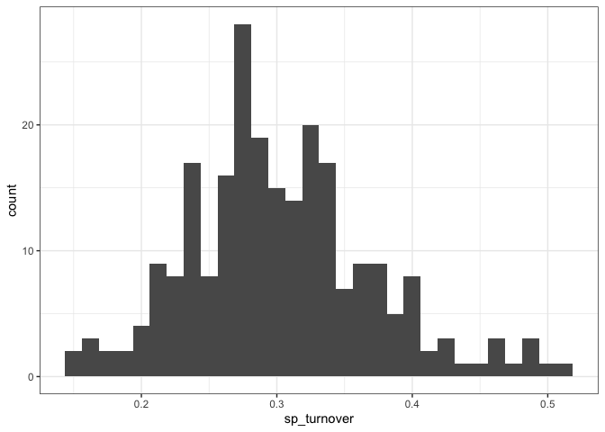

Actual results
================
Renata Diaz
2021-09-06

  - [State variable change](#state-variable-change)

# State variable change

``` r
ggplot(all_results, aes(overall_p)) +geom_histogram()
```

    ## `stat_bin()` using `bins = 30`. Pick better value with `binwidth`.

<!-- -->

``` r
all_results <- all_results %>%
  group_by_all() %>%
  mutate(any_terms_sig = all(overall_p < .05, any(
    `Pr(>|t|)_timeperiodend:currencybiomass` < .05,
    `Pr(>|t|)_timeperiodend:currencyenergy` < .05,
    `Pr(>|t|)_timeperiodend` < .05
  ))) %>%
  ungroup()

mean(all_results$any_terms_sig)
```

    ## [1] 0.5714286

``` r
sig_model <- all_results %>% 
  filter(any_terms_sig)%>%
  group_by_all() %>%
  mutate(all_together = all(
    `Pr(>|t|)_timeperiodend:currencybiomass` > .05,
    `Pr(>|t|)_timeperiodend:currencyenergy` > .05,
    `Pr(>|t|)_timeperiodend` < .05
  )) %>%
  ungroup()


all_together <- filter(sig_model, all_together)

ggplot(all_together, aes(fitted_ratio_caps_abundance)) + geom_histogram()
```

    ## `stat_bin()` using `bins = 30`. Pick better value with `binwidth`.

<!-- -->

``` r
ggplot(all_together, aes(fitted_ratio_caps_energy)) + geom_histogram()
```

    ## `stat_bin()` using `bins = 30`. Pick better value with `binwidth`.

<!-- -->

``` r
ggplot(all_together, aes(fitted_ratio_caps_biomass)) + geom_histogram()
```

    ## `stat_bin()` using `bins = 30`. Pick better value with `binwidth`.

<!-- -->

``` r
summary(all_together$fitted_ratio_caps_abundance)
```

    ##    Min. 1st Qu.  Median    Mean 3rd Qu.    Max. 
    ##  0.2191  0.5741  0.7183  0.9106  1.3163  2.1330

``` r
summary(all_together$fitted_ratio_caps_energy)
```

    ##    Min. 1st Qu.  Median    Mean 3rd Qu.    Max. 
    ##  0.2374  0.5791  0.7179  0.9609  1.3891  2.1513

``` r
summary(all_together$fitted_ratio_caps_biomass)
```

    ##    Min. 1st Qu.  Median    Mean 3rd Qu.    Max. 
    ##  0.2412  0.6377  0.7573  1.0606  1.4955  2.9050

``` r
ggplot(sig_model, aes(fitted_ratio_caps_energy / fitted_ratio_caps_abundance)) + geom_histogram() + facet_wrap(vars(`Pr(>|t|)_timeperiodend:currencyenergy` < .05))
```

    ## `stat_bin()` using `bins = 30`. Pick better value with `binwidth`.

<!-- -->

``` r
ggplot(all_results, aes(fitted_ratio_caps_abundance, fitted_ratio_caps_energy, color =`Pr(>|t|)_timeperiodend:currencyenergy` < .05)) + geom_point() + onetoone + theme(legend.position = "bottom")
```

<!-- -->

``` r
ggplot(sig_model, aes(fitted_ratio_caps_biomass / fitted_ratio_caps_abundance)) + geom_histogram() + facet_wrap(vars(`Pr(>|t|)_timeperiodend:currencybiomass` < .05))
```

    ## `stat_bin()` using `bins = 30`. Pick better value with `binwidth`.

<!-- -->

``` r
ggplot(all_results, aes(fitted_ratio_caps_abundance, fitted_ratio_caps_biomass, color =`Pr(>|t|)_timeperiodend:currencybiomass` < .05)) + geom_point() + onetoone + theme(legend.position = "bottom")
```

<!-- -->

``` r
ggplot(all_results, aes(isd_turnover)) + geom_histogram()
```

    ## `stat_bin()` using `bins = 30`. Pick better value with `binwidth`.

<!-- -->

``` r
ggplot(sig_model, aes(isd_turnover)) + geom_histogram() + facet_wrap(vars(`Pr(>|t|)_timeperiodend:currencybiomass` < .05))
```

    ## `stat_bin()` using `bins = 30`. Pick better value with `binwidth`.

<!-- -->

``` r
ggplot(all_results, aes(sp_turnover)) + geom_histogram()
```

    ## `stat_bin()` using `bins = 30`. Pick better value with `binwidth`.

<!-- -->

``` r
ggplot(all_results, aes(sp_turnover, isd_turnover)) + geom_point() + onetoone
```

<!-- -->
