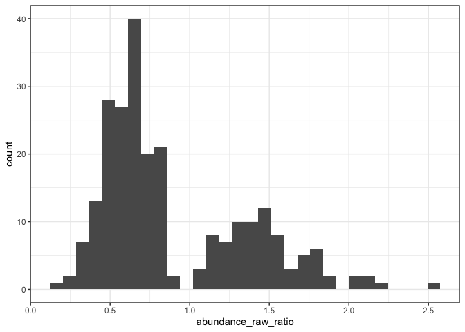
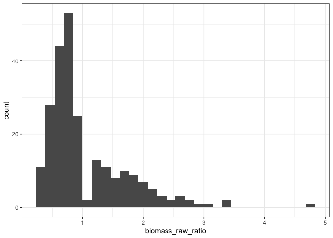
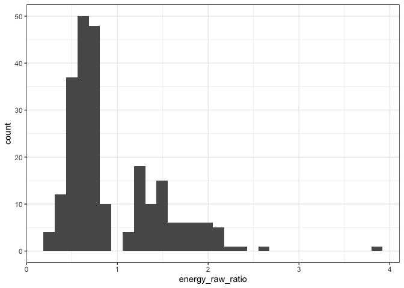
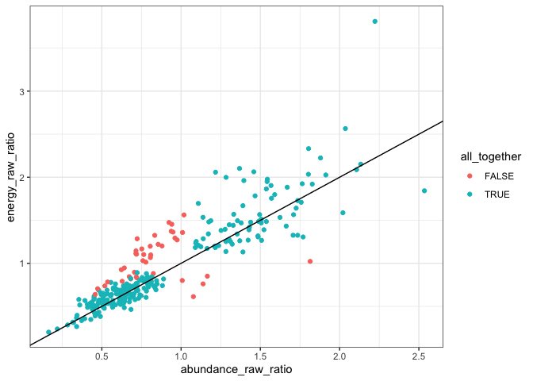
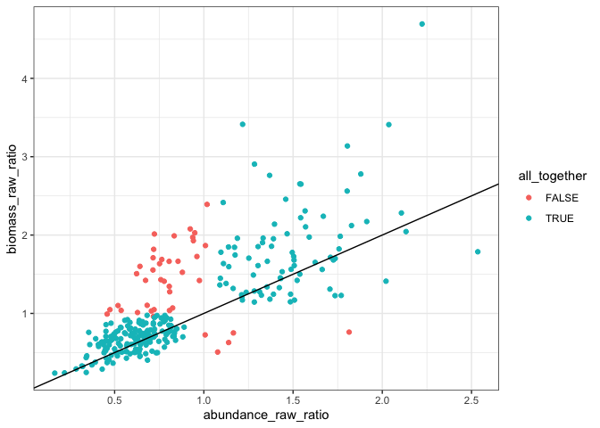
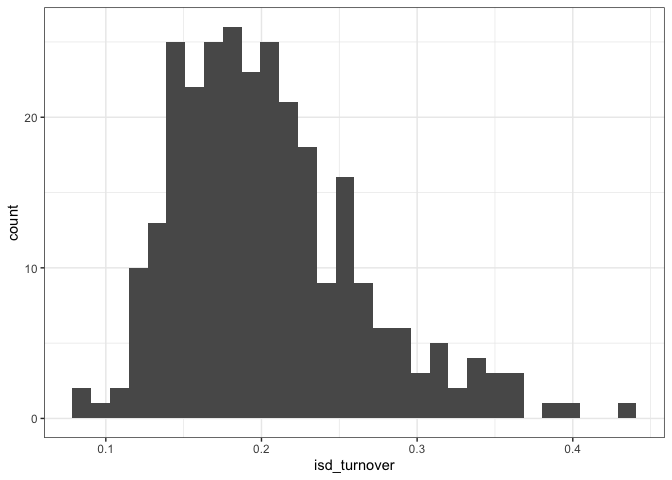
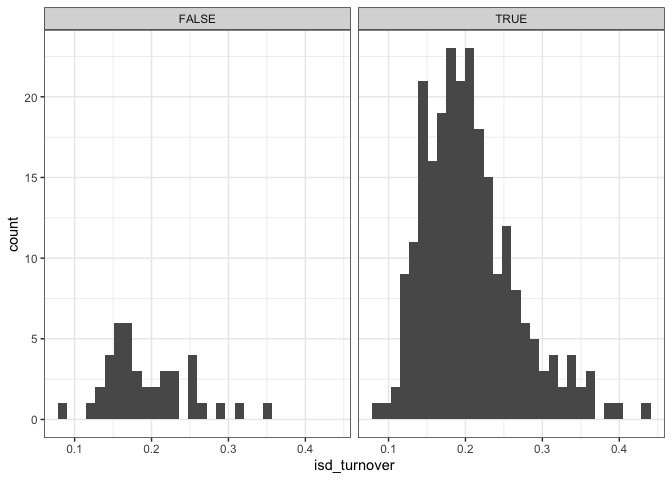

Actual results
================
Renata Diaz
2021-09-07

This whole approach bugs me because of the sheer number of comparisons
being made and the .05 threshold. So, don’t overinterpret in any single
instance.

``` r
ggplot(all_results, aes(overall_p)) +geom_histogram()
```

    ## `stat_bin()` using `bins = 30`. Pick better value with `binwidth`.

<!-- -->

``` r
all_results <- all_results %>%
  group_by_all() %>%
  mutate(any_terms_sig = all(overall_p < .05, any(
    `Pr(>|t|)_timeperiodend:currencybiomass` < .05,
    `Pr(>|t|)_timeperiodend:currencyenergy` < .05,
    `Pr(>|t|)_timeperiodend` < .05
  )),
  any_contrasts_sig = any(
    abundance_contrastp.value < .05,
    energy_contrastp.value < .05,
    biomass_contrastp.value < .05
  ),
  abundance_up = abundance_raw_ratio >=1,
         biomass_up = biomass_raw_ratio >=1,
         energy_up = energy_raw_ratio >=1) %>%
  ungroup()
```

``` r
mean(all_results$any_terms_sig)
```

    ## [1] 0.5757576

So 0.5757576 percent of the time we have both the overall lm significant
and at least one **slope** term is significant. (There are 25 (in the
full dataset/16 in the max-10 subset) routes where the overall model is
significant but it’s either the intercept or one of the currency
intercepts).

``` r
sig_model <- all_results %>% 
  filter(any_terms_sig)%>%
  group_by_all() %>%
  mutate(all_together = all(
    `Pr(>|t|)_timeperiodend:currencybiomass` > .05,
    `Pr(>|t|)_timeperiodend:currencyenergy` > .05,
    `Pr(>|t|)_timeperiodend` < .05
  )) %>%
  ungroup()
```

``` r
mean(sig_model$all_together)
```

    ## [1] 0.7631579

Of the models that are significant overall and have a significant slope,
0.7631579 of them have a significant time slope but not a significant
interaction of time x currency. Meaning that biomass, energy use, and
abundance have all *changed* but have not changed *differently from each
other*.

When they **are** all changing, but changing together:

``` r
all_together <- filter(sig_model, all_together)

ggplot(all_together, aes(abundance_raw_ratio)) + geom_histogram()
```

    ## `stat_bin()` using `bins = 30`. Pick better value with `binwidth`.

<!-- -->

``` r
ggplot(all_together, aes(biomass_raw_ratio)) + geom_histogram()
```

    ## `stat_bin()` using `bins = 30`. Pick better value with `binwidth`.

<!-- -->

``` r
ggplot(all_together, aes(energy_raw_ratio)) + geom_histogram()
```

    ## `stat_bin()` using `bins = 30`. Pick better value with `binwidth`.

<!-- -->

``` r
summary(all_together$abundance_raw_ratio)
```

    ##    Min. 1st Qu.  Median    Mean 3rd Qu.    Max. 
    ##  0.1645  0.5697  0.7171  0.9125  1.3059  2.5352

``` r
summary(all_together$energy_raw_ratio)
```

    ##    Min. 1st Qu.  Median    Mean 3rd Qu.    Max. 
    ##  0.2004  0.5725  0.7225  0.9540  1.3202  3.8107

``` r
summary(all_together$biomass_raw_ratio)
```

    ##    Min. 1st Qu.  Median    Mean 3rd Qu.    Max. 
    ##  0.2383  0.6115  0.7772  1.0629  1.3951  4.6937

``` r
mean(all_together$abundance_up)
```

    ## [1] 0.3491379

It’s usually a decrease - 65/35 decrease/increase. The median is for end
to be 75% of begin.

When they **aren’t** changing all together…

``` r
not_together <- filter(sig_model, !all_together)

not_together %>%
  group_by(abundance_up) %>%
  summarize(e_up = sum(energy_up),
            b_up = sum(biomass_up),
            totaln = dplyr::n()) %>%
  ungroup()
```

<div class="kable-table">

| abundance\_up | e\_up | b\_up | totaln |
| :------------ | ----: | ----: | -----: |
| FALSE         |    25 |    44 |     59 |
| TRUE          |     7 |     5 |     13 |

</div>

When abundance increases, energy decreases 6/13 times. When abundance
decreases, energy increases 25/59 times. So that 31/72 incidences of a
change in direction for *energy*.

When abundance increases, biomass decreases 8/13 times. When abundance
decreases, biomass increases 44/59 times. So that 52/72 incidences of a
change in direction for *biomass*.

If it’s not a change in direction, it’s an intensification/dampening of
the *slope* of change.

``` r
ggplot(sig_model, aes(abundance_raw_ratio, energy_raw_ratio, color = all_together)) + geom_point() + onetoone
```

<!-- -->

``` r
ggplot(sig_model, aes(abundance_raw_ratio, biomass_raw_ratio, color = all_together)) + geom_point() + onetoone
```

<!-- -->

``` r
ggplot(sig_model, aes(isd_turnover)) + geom_histogram()
```

    ## `stat_bin()` using `bins = 30`. Pick better value with `binwidth`.

<!-- -->

``` r
ggplot(sig_model, aes(isd_turnover)) + geom_histogram() + facet_wrap(vars(all_together))
```

    ## `stat_bin()` using `bins = 30`. Pick better value with `binwidth`.

<!-- -->
