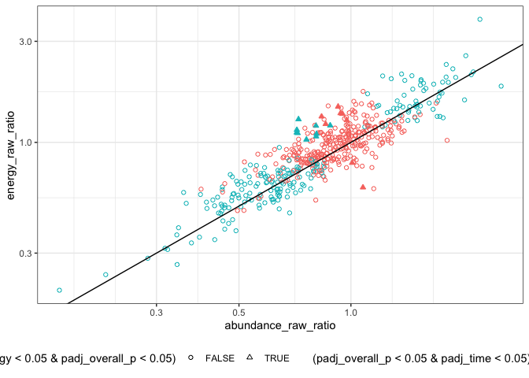
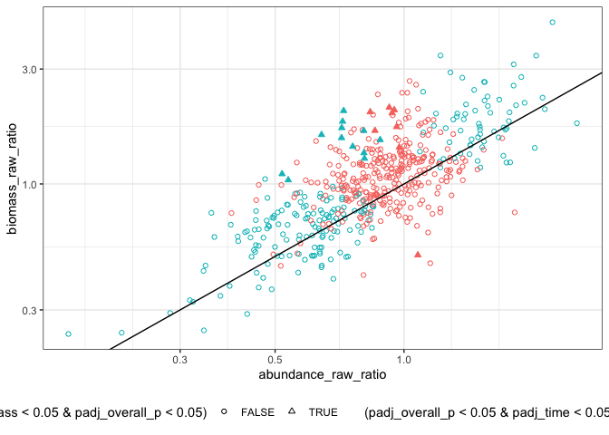
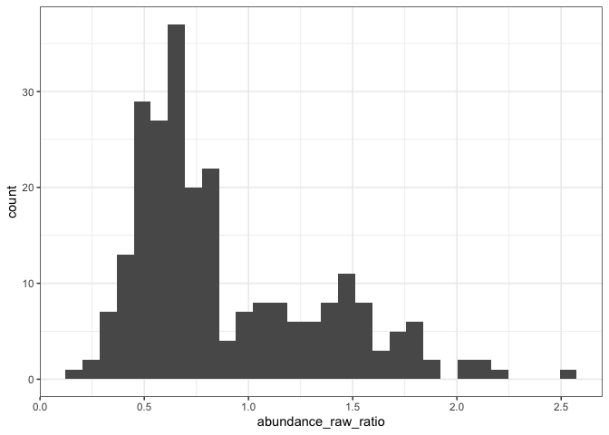

Actual results
================
Renata Diaz
2021-10-05

This whole approach bugs me because of the sheer number of comparisons
being made and the .05 threshold. So, don’t overinterpret in any single
instance.

``` r
all_results_adj <- all_results %>%
  select(overall_p, `Pr(>|t|)_timeperiodend:currencybiomass`, `Pr(>|t|)_timeperiodend:currencyenergy`, `Pr(>|t|)_timeperiodend`, matssname) %>%
  rename(time_biomass = `Pr(>|t|)_timeperiodend:currencybiomass`,
         time_energy = `Pr(>|t|)_timeperiodend:currencyenergy`,
         time = `Pr(>|t|)_timeperiodend`) %>%
  tidyr::pivot_longer(-matssname, names_to = "comparison", values_to = "p") %>%
  mutate(padj = p.adjust(p, "fdr")) %>%
  tidyr::pivot_wider(id_cols = matssname, names_from = comparison, values_from = c(p, padj))


mean(all_results_adj$padj_overall_p < .05)
```

    ## [1] 0.4659091

``` r
all_results_adj_sig <- filter(all_results_adj, padj_overall_p < .05)

sum(all_results_adj_sig$padj_time < .05)
```

    ## [1] 217

``` r
sum(all_results_adj_sig$padj_time_biomass < .05)
```

    ## [1] 20

``` r
sum(((all_results_adj_sig$padj_time_biomass < .05) & !((all_results_adj_sig$padj_time < .05))))
```

    ## [1] 8

``` r
sum(((all_results_adj_sig$padj_time_energy < .05) & !((all_results_adj_sig$padj_time < .05))))
```

    ## [1] 8

``` r
sum(all_results_adj_sig$padj_time_energy < .05)
```

    ## [1] 17

``` r
all_results <- left_join(all_results, all_results_adj)
```

    ## Joining, by = "matssname"

``` r
ggplot(all_results, aes(abundance_raw_ratio, energy_raw_ratio, shape = (padj_time_energy < .05 & padj_overall_p < .05), color =  (padj_overall_p < .05 & padj_time < .05))) + geom_point() + onetoone + scale_x_log10() + scale_y_log10() + scale_shape(solid = F) + theme(legend.position = "bottom") +
  geom_point(data = filter(all_results, padj_overall_p < .05, padj_time_energy < .05), shape = 17)
```

<!-- -->

``` r
ggplot(all_results, aes(abundance_raw_ratio, biomass_raw_ratio, shape = (padj_time_biomass < .05 & padj_overall_p < .05), color =  (padj_overall_p < .05 & padj_time < .05))) + geom_point() + onetoone + scale_x_log10() + scale_y_log10() + scale_shape(solid = F) + theme(legend.position = "bottom") +
  geom_point(data = filter(all_results, padj_overall_p < .05, padj_time_biomass < .05), shape = 17)
```

<!-- -->

``` r
ggplot(filter(all_results, padj_overall_p < .05), aes(abundance_raw_ratio)) + geom_histogram()
```

    ## `stat_bin()` using `bins = 30`. Pick better value with `binwidth`.

<!-- -->

``` r
filter(all_results, padj_overall_p < .05, padj_time < .05) %>%
  group_by(abundance_raw_ratio > 1) %>%
  summarize(prop = dplyr::n())
```

<div class="kable-table">

| abundance\_raw\_ratio \> 1 | prop |
| :------------------------- | ---: |
| FALSE                      |  152 |
| TRUE                       |   65 |

</div>
