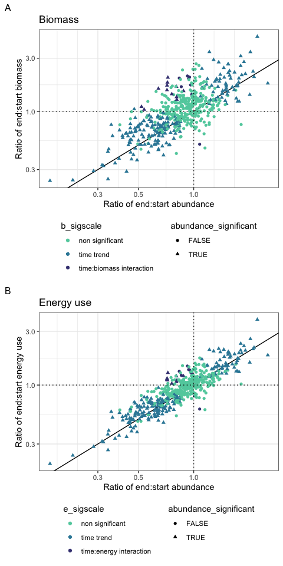
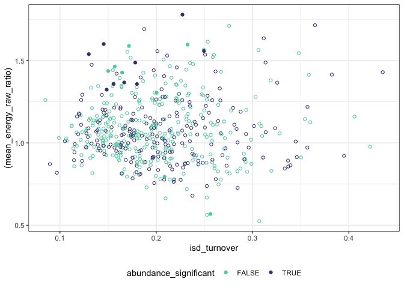

Actual results
================
Renata Diaz
2021-10-05

  - [False discovery rate](#false-discovery-rate)
  - [Prevalence of significant changes &
    interactions](#prevalence-of-significant-changes-interactions)
  - [Direction of change](#direction-of-change)
      - [Abundance](#abundance)
      - [Other currencies](#other-currencies)
          - [Energy](#energy)
          - [Biomass](#biomass)
  - [Relationship between currencies](#relationship-between-currencies)
      - [linear model dump](#linear-model-dump)

# False discovery rate

Here, working with the results of route-level linear models of the form
`value ~ timeperiod * currency`.

We are interested in the p-values from 4 tests: 1) is the overall model
significant; 2) is there a significant trend (effect of time), 3) and 4)
are there significant interactions between time and currency=biomass or
currency=energy. Because this is a *lot* of comparisons, using the false
discovery rate (`p.adjust(method = "fdr")`) to adjust the p-values,
pooling all of the p-values for these 4 tests. All following analyses
use adjusted, rather than raw, p-values.

    ## Joining, by = "matssname"

# Prevalence of significant changes & interactions

``` r
mean(all_results_use$wholemod_significant)
```

    ## [1] 0.4659091

``` r
mean(all_results_sig_only$abundance_significant)
```

    ## [1] 0.8821138

``` r
mean(all_results_sig_only$energy_interaction_significant)
```

    ## [1] 0.06910569

``` r
mean(all_results_sig_only$biomass_interaction_significant)
```

    ## [1] 0.08130081

  - Just under half of models come out as significant. So, **more than
    half the time** there’s no significant difference detected from
    beginning to end in any currency.
  - **Of significant models**, 88% of the time there’s a significant
    effect of time on abundance. Rarely, there’s an interaction with
    currency - 7% for energy and 8% for biomass.
      - (About 8% of the time the model is significant but the only
        significant term is an intercept.)

# Direction of change

## Abundance

    ## `stat_bin()` using `bins = 30`. Pick better value with `binwidth`.

<!-- -->

    ## `stat_bin()` using `bins = 30`. Pick better value with `binwidth`.

<!-- -->

``` r
summary(all_results_use$abundance_raw_ratio)
```

    ##    Min. 1st Qu.  Median    Mean 3rd Qu.    Max. 
    ##  0.1645  0.6764  0.8496  0.9096  1.0727  2.5352

``` r
summary(filter(all_results_use, abundance_significant)$abundance_raw_ratio)
```

    ##    Min. 1st Qu.  Median    Mean 3rd Qu.    Max. 
    ##  0.1645  0.5358  0.6820  0.8793  1.2775  2.5352

``` r
all_results_use %>%
  group_by(abundance_significant) %>%
  summarize(proportion_increasing = mean(abundance_increase))
```

<div class="kable-table">

| abundance\_significant | proportion\_increasing |
| :--------------------- | ---------------------: |
| FALSE                  |              0.3344051 |
| TRUE                   |              0.2995392 |

</div>

Both over all routes, and restricted to routes with significant trends
in abundance, \~70% of routes are showing a decrease in abundance.

## Other currencies

We rarely see significantly different trends in the different
currencies.

So, in the aggregate, it’s not too surprising that energy and biomass
look similar to abundance:

### Energy

    ## `stat_bin()` using `bins = 30`. Pick better value with `binwidth`.

<!-- -->

### Biomass

    ## `stat_bin()` using `bins = 30`. Pick better value with `binwidth`.

<!-- -->

In the aggregate, though, energy and biomass are *less* overwhelmingly
decreasing than abundance.

(Note that a lot of this difference doesn’t come out as significant in
terms of an interaction).

``` r
summary(all_results_use$energy_raw_ratio)
```

    ##    Min. 1st Qu.  Median    Mean 3rd Qu.    Max. 
    ##  0.2004  0.7136  0.9029  0.9724  1.1401  3.8107

``` r
summary(all_results_use$biomass_raw_ratio)
```

    ##    Min. 1st Qu.  Median    Mean 3rd Qu.    Max. 
    ##  0.2383  0.7566  1.0073  1.1116  1.3145  4.6937

``` r
summary(all_results_sig_only$energy_raw_ratio)
```

    ##    Min. 1st Qu.  Median    Mean 3rd Qu.    Max. 
    ##  0.2004  0.5760  0.7341  0.9685  1.3540  3.8107

``` r
summary(all_results_sig_only$biomass_raw_ratio)
```

    ##    Min. 1st Qu.  Median    Mean 3rd Qu.    Max. 
    ##  0.2383  0.6214  0.7863  1.1257  1.6299  4.6937

# Relationship between currencies

<!-- -->

    ##    Min. 1st Qu.  Median    Mean 3rd Qu.    Max. 
    ##  0.4070  0.9662  1.1689  1.2441  1.4402  2.8040

<!-- -->

    ##    Min. 1st Qu.  Median    Mean 3rd Qu.    Max. 
    ##  0.5250  0.9435  1.0532  1.0827  1.1925  1.7780

  - Energy and biomass generally track abundance
  - There is a lot of scatter.
  - There is more scatter for biomass than energy.
  - The scatter is disproportionately in the direction of increasing
    body size resulting in a less negative slope.
  - However, rarely does that shift come out as a statistically
    significant decoupling of energy/biomass from abundance.

##### linear model dump

    ## Joining, by = "matssname"

<!-- -->

    ## 
    ## Call:
    ## lm(formula = rr ~ abundance_raw_ratio * currency, data = long_ratios)
    ## 
    ## Residuals:
    ##      Min       1Q   Median       3Q      Max 
    ## -1.29151 -0.16198 -0.03476  0.10233  2.21494 
    ## 
    ## Coefficients:
    ##                                              Estimate Std. Error t value
    ## (Intercept)                                   0.16464    0.03769   4.368
    ## abundance_raw_ratio                           1.04099    0.03874  26.869
    ## currencyenergy_raw_ratio                     -0.07030    0.05330  -1.319
    ## abundance_raw_ratio:currencyenergy_raw_ratio -0.07570    0.05479  -1.382
    ##                                              Pr(>|t|)    
    ## (Intercept)                                  1.38e-05 ***
    ## abundance_raw_ratio                           < 2e-16 ***
    ## currencyenergy_raw_ratio                        0.187    
    ## abundance_raw_ratio:currencyenergy_raw_ratio    0.167    
    ## ---
    ## Signif. codes:  0 '***' 0.001 '**' 0.01 '*' 0.05 '.' 0.1 ' ' 1
    ## 
    ## Residual standard error: 0.307 on 1052 degrees of freedom
    ## Multiple R-squared:  0.5704, Adjusted R-squared:  0.5692 
    ## F-statistic: 465.6 on 3 and 1052 DF,  p-value: < 2.2e-16

    ## 
    ## Call:
    ## lm(formula = rr ~ abundance_raw_ratio * currency, data = filter(long_ratios, 
    ##     rr < 3.5))
    ## 
    ## Residuals:
    ##      Min       1Q   Median       3Q      Max 
    ## -1.24401 -0.16232 -0.03224  0.10505  2.00047 
    ## 
    ## Coefficients:
    ##                                              Estimate Std. Error t value
    ## (Intercept)                                   0.20373    0.03661   5.564
    ## abundance_raw_ratio                           0.99326    0.03779  26.284
    ## currencyenergy_raw_ratio                     -0.08168    0.05178  -1.577
    ## abundance_raw_ratio:currencyenergy_raw_ratio -0.06181    0.05344  -1.157
    ##                                              Pr(>|t|)    
    ## (Intercept)                                  3.34e-08 ***
    ## abundance_raw_ratio                           < 2e-16 ***
    ## currencyenergy_raw_ratio                        0.115    
    ## abundance_raw_ratio:currencyenergy_raw_ratio    0.248    
    ## ---
    ## Signif. codes:  0 '***' 0.001 '**' 0.01 '*' 0.05 '.' 0.1 ' ' 1
    ## 
    ## Residual standard error: 0.2953 on 1050 degrees of freedom
    ## Multiple R-squared:  0.5635, Adjusted R-squared:  0.5623 
    ## F-statistic: 451.9 on 3 and 1050 DF,  p-value: < 2.2e-16

    ## Loading required package: Matrix

    ## 
    ## Attaching package: 'Matrix'

    ## The following object is masked from 'package:drake':
    ## 
    ##     expand

    ## refitting model(s) with ML (instead of REML)

<div class="kable-table">

|                    | npar |        AIC |        BIC |  logLik |   deviance |    Chisq | Df | Pr(\>Chisq) |
| :----------------- | ---: | ---------: | ---------: | ------: | ---------: | -------: | -: | ----------: |
| long\_ratios\_lme1 |    5 | \-32.90520 | \-8.103459 | 21.4526 | \-42.90520 |       NA | NA |          NA |
| long\_ratios\_lme  |    6 | \-36.59781 | \-6.835719 | 24.2989 | \-48.59781 | 5.692608 |  1 |   0.0170365 |

</div>

    ## refitting model(s) with ML (instead of REML)

<div class="kable-table">

|                    | npar |        AIC |        BIC |     logLik |   deviance |    Chisq | Df | Pr(\>Chisq) |
| :----------------- | ---: | ---------: | ---------: | ---------: | ---------: | -------: | -: | ----------: |
| long\_ratios\_lme2 |    4 |  164.69310 | 184.534492 | \-78.34655 |  156.69310 |       NA | NA |          NA |
| long\_ratios\_lme  |    6 | \-36.59781 | \-6.835719 |   24.29890 | \-48.59781 | 205.2909 |  2 |           0 |

</div>

<!-- -->

    ## $model
    ## [1] 0.8972984
    ## 
    ## $fixed
    ## [1] 0.5635416
    ## 
    ## $random
    ## [1] 0.3337568

    ## Linear mixed model fit by REML ['lmerMod']
    ## Formula: rr ~ abundance_raw_ratio * currency + (1 | matssname)
    ##    Data: filter(long_ratios, rr < 3.5)
    ## 
    ## REML criterion at convergence: -23.7
    ## 
    ## Scaled residuals: 
    ##     Min      1Q  Median      3Q     Max 
    ## -2.8860 -0.4244  0.0350  0.2929  5.4901 
    ## 
    ## Random effects:
    ##  Groups    Name        Variance Std.Dev.
    ##  matssname (Intercept) 0.06675  0.2584  
    ##  Residual              0.02046  0.1430  
    ## Number of obs: 1054, groups:  matssname, 527
    ## 
    ## Fixed effects:
    ##                                              Estimate Std. Error t value
    ## (Intercept)                                   0.20373    0.03661   5.564
    ## abundance_raw_ratio                           0.99326    0.03779  26.284
    ## currencyenergy_raw_ratio                     -0.08168    0.02508  -3.256
    ## abundance_raw_ratio:currencyenergy_raw_ratio -0.06181    0.02589  -2.388
    ## 
    ## Correlation of Fixed Effects:
    ##             (Intr) abnd__ crrn__
    ## abndnc_rw_r -0.936              
    ## crrncynrg__ -0.343  0.321       
    ## abndnc__:__  0.321 -0.343 -0.936
