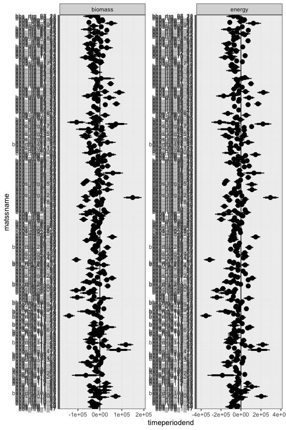
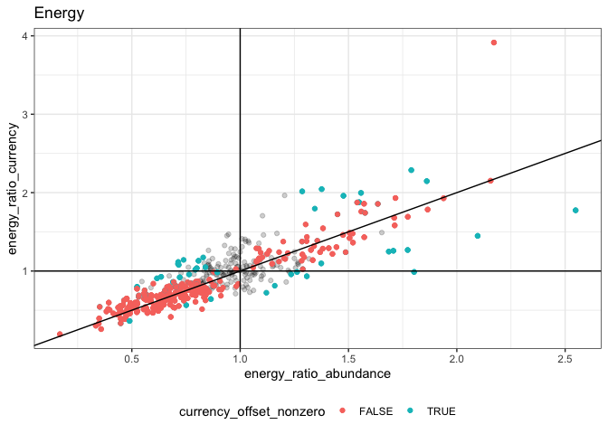
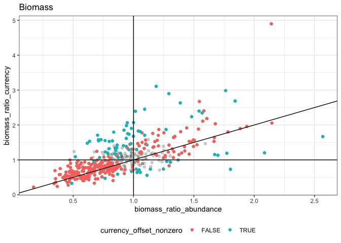
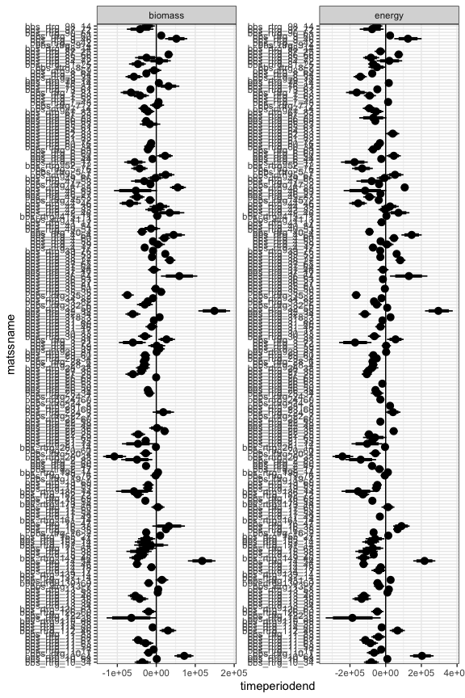
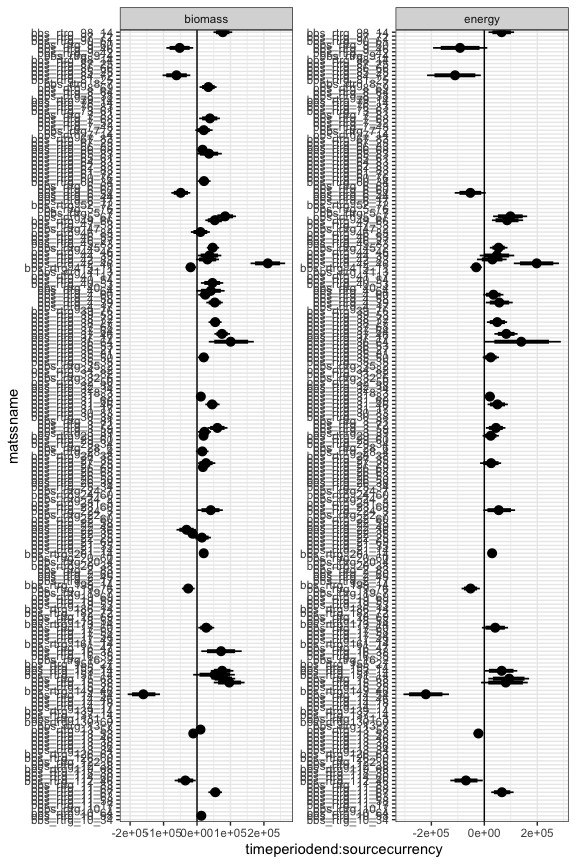

How many models come out which way
================

``` r
all_winners %>%
  group_by(simtype, currency, model) %>%
  summarize(count = dplyr::n()) 
```

    ## `summarise()` has grouped output by 'simtype', 'currency'. You can override using the `.groups` argument.

<div class="kable-table">

| simtype | currency | model                | count |
| :------ | :------- | :------------------- | ----: |
| actual  | biomass  | tb\_stanlm\_full     |   119 |
| actual  | biomass  | tb\_stanlm\_nosource |   185 |
| actual  | biomass  | tb\_stanlm\_notime   |   146 |
| actual  | energy   | te\_stanlm\_full     |    65 |
| actual  | energy   | te\_stanlm\_nosource |   247 |
| actual  | energy   | te\_stanlm\_notime   |   138 |

</div>

``` r
actual_qis <- all_qis %>% 
  filter(simtype == "actual") 
actual_qis_95 <- filter(actual_qis, .width == .95)

ggplot(actual_qis, aes(timeperiodend, matssname)) + geom_pointinterval(aes(xmin = timeperiodend.lower, xmax = timeperiodend.upper, width = .width)) + geom_vline(xintercept = 0) + facet_wrap(vars(currency), scales = "free")
```

    ## Warning: Removed 292 rows containing missing values (geom_segment).

    ## Warning: Removed 276 rows containing missing values (geom_segment).

<!-- -->

Of models of actual,

``` r
actual_qis_95 %>%
  group_by(currency) %>%
  summarize(percent_with_slope = mean(!is.na(timeperiodend)))
```

<div class="kable-table">

| currency | percent\_with\_slope |
| :------- | -------------------: |
| biomass  |            0.6755556 |
| energy   |            0.6933333 |

</div>

Of models with a slope…

``` r
actual_qis_95 %>%
  group_by(currency) %>%
  summarize(percent_decreasing = mean(timeperiodend.upper < 0, na.rm = T),
            percent_increasing = mean(timeperiodend.lower > 0, na.rm = T),
            n_with_slope = sum(!is.na(timeperiodend)))
```

<div class="kable-table">

| currency | percent\_decreasing | percent\_increasing | n\_with\_slope |
| :------- | ------------------: | ------------------: | -------------: |
| biomass  |           0.6019737 |           0.2072368 |            304 |
| energy   |           0.6826923 |           0.2403846 |            312 |

</div>

using a 95% CI above or below 0. This can sum to less than 1 if there is
a model with an interaction in which the abundance-slope is over 0, but
the currency offset is nonzero.

Of all models, here’s the proportion with an interaction:

``` r
actual_qis_95 %>%
  group_by(currency) %>%
  summarize(percent_interaction = mean(!is.na(`timeperiodend:sourcecurrency`), na.rm = T))
```

<div class="kable-table">

| currency | percent\_interaction |
| :------- | -------------------: |
| biomass  |            0.2644444 |
| energy   |            0.1444444 |

</div>

Of models with an interaction…

``` r
actual_qis_95 %>%
  group_by(currency) %>%
  summarize(percent_currency_above_abund = mean((`timeperiodend:sourcecurrency.lower` >0), na.rm = T),
            percent_currency_below_abund = mean((`timeperiodend:sourcecurrency.upper` <0), na.rm = T),
            n_with_interaction = sum(!is.na(`timeperiodend:sourcecurrency`)))
```

<div class="kable-table">

| currency | percent\_currency\_above\_abund | percent\_currency\_below\_abund | n\_with\_interaction |
| :------- | ------------------------------: | ------------------------------: | -------------------: |
| biomass  |                       0.7478992 |                       0.2268908 |                  119 |
| energy   |                       0.6153846 |                       0.2923077 |                   65 |

</div>

``` r
ggplot(actual_qis, aes(`timeperiodend:sourcecurrency`, matssname)) + geom_pointinterval(aes(xmin = `timeperiodend:sourcecurrency.lower`, xmax = `timeperiodend:sourcecurrency.upper`, width = .width)) + geom_vline(xintercept = 0) + facet_wrap(vars(currency), scales = "free")
```

    ## Warning: Removed 662 rows containing missing values (geom_segment).

    ## Warning: Removed 770 rows containing missing values (geom_segment).

<!-- -->

``` r
raw_changes <- all_sims %>%
  filter(simtype == "actual") %>%
  group_by(matssname, source, timeperiod) %>%
  summarize(total_energy = mean(total_energy),
            total_biomass = mean(total_biomass)) %>%
  ungroup() %>%
  tidyr::pivot_wider(id_cols = c(matssname, source), names_from = timeperiod, values_from = c(total_energy, total_biomass)) %>%
  mutate(energy_ratio = total_energy_end / total_energy_begin,
         biomass_ratio = total_biomass_end / total_biomass_begin) %>%
  select(matssname, source, energy_ratio, biomass_ratio) %>%
  tidyr::pivot_wider(id_cols = matssname, names_from = source, values_from = c(energy_ratio, biomass_ratio))
```

    ## `summarise()` has grouped output by 'matssname', 'source'. You can override using the `.groups` argument.

``` r
sig_changes <- raw_changes %>%
  left_join(actual_qis_95) %>%
  mutate(abund_slope_nonzero = (timeperiodend.upper < 0 | timeperiodend.lower > 0) & !is.na(timeperiodend),
         currency_offset_nonzero =(`timeperiodend:sourcecurrency.upper` < 0 | `timeperiodend:sourcecurrency.lower` > 0) & !is.na(`timeperiodend:sourcecurrency`))
```

    ## Joining, by = "matssname"

``` r
ggplot(sig_changes, aes(energy_ratio_abundance, energy_ratio_currency)) + geom_point(alpha = .1) + geom_point(data =filter(sig_changes, abund_slope_nonzero), aes(color = currency_offset_nonzero), alpha = 1) + geom_abline(slope= 1, intercept = 0) + geom_vline(xintercept = 1) + geom_hline(yintercept = 1) + theme(legend.position = "bottom") + ggtitle("Energy")
```

<!-- -->

``` r
ggplot(sig_changes, aes(biomass_ratio_abundance, biomass_ratio_currency)) + geom_point(alpha = .1) + geom_point(data =filter(sig_changes, !is.na(timeperiodend)), aes(color = currency_offset_nonzero), alpha = 1) + geom_abline(slope= 1, intercept = 0) + geom_vline(xintercept = 1) + geom_hline(yintercept = 1) + theme(legend.position = "bottom") + ggtitle("Biomass")
```

<!-- -->

## Filtered to max 10

Here is the above, but with a maximum of 10 routes per BCR (n = 238
overall)

``` r
all_winners_f <- filter(all_winners, matssname %in% working_datasets$matssname)
all_qis_f <- filter(all_qis, matssname %in% working_datasets$matssnam)
all_winners_f %>%
  group_by(simtype, currency, model) %>%
  summarize(count = dplyr::n()) 
```

    ## `summarise()` has grouped output by 'simtype', 'currency'. You can override using the `.groups` argument.

<div class="kable-table">

| simtype | currency | model                | count |
| :------ | :------- | :------------------- | ----: |
| actual  | biomass  | tb\_stanlm\_full     |    52 |
| actual  | biomass  | tb\_stanlm\_nosource |    80 |
| actual  | biomass  | tb\_stanlm\_notime   |    70 |
| actual  | energy   | te\_stanlm\_full     |    33 |
| actual  | energy   | te\_stanlm\_nosource |   107 |
| actual  | energy   | te\_stanlm\_notime   |    62 |

</div>

``` r
actual_qis_f <- all_qis_f %>% 
  filter(simtype == "actual") 
actual_qis_95_f <- filter(actual_qis_f, .width == .95)

ggplot(actual_qis_f, aes(timeperiodend, matssname)) + geom_pointinterval(aes(xmin = timeperiodend.lower, xmax = timeperiodend.upper, width = .width)) + geom_vline(xintercept = 0) + facet_wrap(vars(currency), scales = "free")
```

    ## Warning: Removed 140 rows containing missing values (geom_segment).

    ## Warning: Removed 124 rows containing missing values (geom_segment).

<!-- -->

Of models of actual,

``` r
actual_qis_95_f %>%
  group_by(currency) %>%
  summarize(percent_with_slope = mean(!is.na(timeperiodend)))
```

<div class="kable-table">

| currency | percent\_with\_slope |
| :------- | -------------------: |
| biomass  |            0.6534653 |
| energy   |            0.6930693 |

</div>

Of models with a slope…

``` r
actual_qis_95_f %>%
  group_by(currency) %>%
  summarize(percent_decreasing = mean(timeperiodend.upper < 0, na.rm = T),
            percent_increasing = mean(timeperiodend.lower > 0, na.rm = T),
            n_with_slope = sum(!is.na(timeperiodend)))
```

<div class="kable-table">

| currency | percent\_decreasing | percent\_increasing | n\_with\_slope |
| :------- | ------------------: | ------------------: | -------------: |
| biomass  |           0.5984848 |           0.2121212 |            132 |
| energy   |           0.6714286 |           0.2357143 |            140 |

</div>

using a 95% CI above or below 0. This can sum to less than 1 if there is
a model with an interaction in which the abundance-slope is over 0, but
the currency offset is nonzero.

Of all models, here’s the proportion with an interaction:

``` r
actual_qis_95_f %>%
  group_by(currency) %>%
  summarize(percent_interaction = mean(!is.na(`timeperiodend:sourcecurrency`), na.rm = T))
```

<div class="kable-table">

| currency | percent\_interaction |
| :------- | -------------------: |
| biomass  |            0.2574257 |
| energy   |            0.1633663 |

</div>

Of models with an interaction…

``` r
actual_qis_95_f %>%
  group_by(currency) %>%
  summarize(percent_currency_above_abund = mean((`timeperiodend:sourcecurrency.lower` >0), na.rm = T),
            percent_currency_below_abund = mean((`timeperiodend:sourcecurrency.upper` <0), na.rm = T),
            n_with_interaction = sum(!is.na(`timeperiodend:sourcecurrency`)))
```

<div class="kable-table">

| currency | percent\_currency\_above\_abund | percent\_currency\_below\_abund | n\_with\_interaction |
| :------- | ------------------------------: | ------------------------------: | -------------------: |
| biomass  |                       0.7692308 |                       0.1923077 |                   52 |
| energy   |                       0.6666667 |                       0.2424242 |                   33 |

</div>

``` r
ggplot(actual_qis_f, aes(`timeperiodend:sourcecurrency`, matssname)) + geom_pointinterval(aes(xmin = `timeperiodend:sourcecurrency.lower`, xmax = `timeperiodend:sourcecurrency.upper`, width = .width)) + geom_vline(xintercept = 0) + facet_wrap(vars(currency), scales = "free")
```

    ## Warning: Removed 300 rows containing missing values (geom_segment).

    ## Warning: Removed 338 rows containing missing values (geom_segment).

<!-- -->
